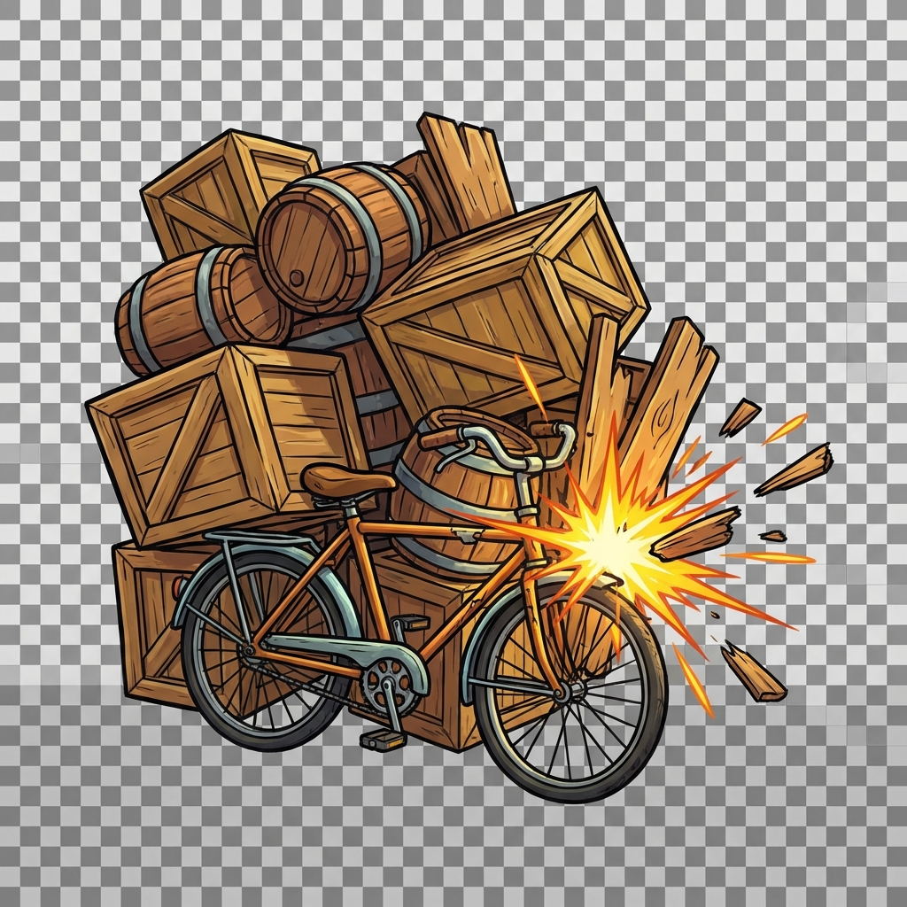
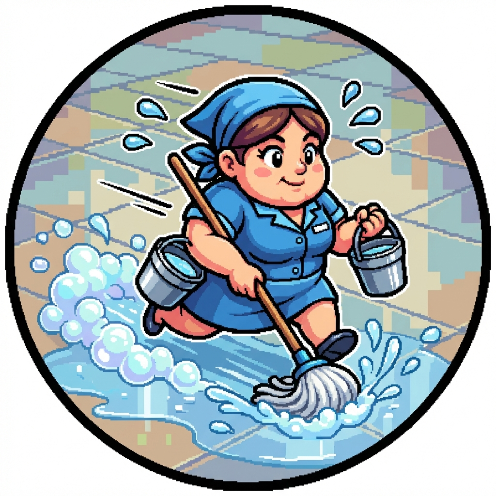

# Thiết kế kỹ năng đồng đội

Tài liệu quy định chi tiết về hiệu ứng hình ảnh (VFX) và âm thanh (SFX) cho bộ kỹ năng của 30 nhân vật đồng đội.

---

## 1. Nhóm Bình dân (Common)

| Nhân vật            | Kỹ năng               | VFX Mô tả                                                                                                            | SFX Mô tả                                              | Hình ảnh minh họa                               | Ghi chú            |
| :------------------ | :-------------------- | :------------------------------------------------------------------------------------------------------------------- | :----------------------------------------------------- | :---------------------------------------------- | :----------------- |
| **Bé Tí bắn bi**    | **Active: Bắn bi**    | Viên bi ve đa sắc (trong suốt) bay nhanh theo đường thẳng, có vệt sáng nhỏ. Trúng đích vỡ ra các mảnh thủy tinh nhỏ. | Tiếng búng tay "Póc". Tiếng bi va chạm "Cạch".         |       | Làm trước bản demo |
|                     | **Passive: Ham chơi** | Dưới chân có hiệu ứng bụi cuốn (dust trail) khi chạy.                                                                | Tiếng cười khúc khích "Hihi".                          |                                                 | Làm trước bản demo |
| **Chú Tư xe thồ**   | **Active: Chặn đầu**  | Xe đạp thồ xuất hiện rào chắn gỗ phía trước. Có hiệu ứng va chạm "Sparks" khi đỡ đòn.                                | Tiếng phanh xe "Kít...". Tiếng va chạm kim loại "Rầm". |  | Làm trước bản demo |
|                     | **Passive: Thồ hàng** | Không có VFX đặc biệt (stat passive).                                                                                | -                                                      |                                                 | Làm trước bản demo |
| **Cô Bảy quét rác** | **Active: Quét sạch** | Một làn gió xoáy nhỏ mang theo lá cây khô bay qua người đồng đội được buff.                                          | Tiếng chổi quét "Sroạt sroạt".                         |                                                 |                    |
|                     | **Passive: Cần lao**  | Khi quái chết, có hiệu ứng đồng xu vàng nhỏ bay về phía Cô Bảy.                                                      | Tiếng tiền xu rơi "Keng".                              |                                                 |                    |
| **Cậu Vàng**        | **Active: Cắn trộm**  | Hàm răng chó khổng lồ (hoạt hình) cắn phập vào đối thủ. Hiệu ứng chảy dãi.                                           | Tiếng chó sủa "Gâu gâu". Tiếng cắn "Grừ... Phập".      |                                                 |                    |
|                     | **Passive: Đánh hơi** | Mũi Cậu Vàng co giật, có icon kính lúp hiện trên đầu khi tìm thấy đồ.                                                | Tiếng hít ngửi "Khịt khịt".                            |                                                 |                    |
| **Bác bảo vệ**      | **Active: Đèn pin**   | Luồng ánh sáng hình nón từ đèn pin chiếu thẳng vào mặt địch. Địch lấy tay che mắt.                                   | Tiếng bật công tắc "Cạch". Âm thanh chói tai "Reeee".  |                                                 |                    |
|                     | **Passive: Gác đêm**  | Mắt bác bảo vệ phát sáng trong đêm (như đèn pha ô tô).                                                               | -                                                      |                                                 |                    |

---

## 2. Nhóm Tập sự (Uncommon)

| Nhân vật           | Kỹ năng                   | VFX Mô tả                                                                                                                              | SFX Mô tả                                                | Hình ảnh minh họa                                       | Ghi chú            |
| :----------------- | :------------------------ | :------------------------------------------------------------------------------------------------------------------------------------- | :------------------------------------------------------- | :------------------------------------------------------ | :----------------- |
| **Chị tạp vụ**     | **Active: Lau sàn**       | Lướt tới (Dash) để lại vệt nước xà phòng đầy bọt. Địch trúng chiêu có hiệu ứng "ngôi sao xoay tròn" trên đầu (Stun).                   | Tiếng trượt ngã "Oạch!". Tiếng nước lau sàn "Chèm chẹp". |        | Làm trước bản demo |
|                    | **Passive: Sàn trơn**     | Vũng nước nhỏ dưới chân địch khi chúng tấn công chị.                                                                                   | Tiếng trượt chân "Vút... Ầm".                            |                                                         | Làm trước bản demo |
| **Anh Grab Food**  | **Active: Giao tốc hành** | Ném một hộp xốp trắng/hộp giấy. Khi chạm đất nổ ra cơm, canh, đùi gà tung toé.                                                         | Tiếng xe máy rồ ga "Vù vù". Tiếng hộp rơi "Bộp".         |  | Làm trước bản demo |
|                    | **Passive: Đúng giờ**     | Hiệu ứng gió (Wind lines) speed line sau lưng khi chạy.                                                                                | Tiếng đồng hồ bấm giờ "Tít tít".                         |                                                         | Làm trước bản demo |
| **Thằng Tèo net**  | **Active: Rớt mạng**      | Biểu tượng "Mất kết nối" (Dây cáp bị đứt hoặc Icon Wifi gạch chéo) hiện to tướng trên đầu địch. Địch bị đóng băng màu xám (Grayscale). | Âm thanh báo lỗi Windows XP "Tèn ten".                   |                                                         |
|                    | **Passive: Lag**          | Xác Tèo Net nhấp nháy (glitch effect) như bị lỗi hiển thị.                                                                             | Tiếng nhiễu sóng "Zzzzt".                                |                                                         |
| **Cô hàng xóm**    | **Active: Buôn dưa lê**   | Các ký tự chữ cái (bla bla bla) bay ra từ miệng cô, bám vào người địch làm giảm giáp (giáp bị nứt vỡ).                                 | Tiếng xì xào bàn tán (đám đông) volume lớn dần.          |                                                         |
|                    | **Passive: Hóng hớt**     | Tai cô to ra một chút hoặc rung rinh khi hồi máu.                                                                                      | -                                                        |                                                         |
| **Ông chú câu cá** | **Active: Quăng cần**     | Dây cước câu cá bay ra dính vào địch, kéo giật mạnh địch văng về phía mình.                                                            | Tiếng dây cước vung "Vút". Tiếng tời dây "Rè rè".        |                                                         |
|                    | **Passive: Kiên nhẫn**    | Ngồi thiền, có hào quang tĩnh tâm màu xanh nhạt.                                                                                       | -                                                        |                                                         |
| **Bà bán xôi**     | **Active: Xôi gà**        | Một gói xôi lá chuối bay tới đồng đội, mở ra tỏa khói thơm (trái tim xanh bay lên).                                                    | Tiếng rao "Xôi lạc bánh khúc đây".                       |                                                         |
|                    | **Passive: Sáng sớm**     | Hào quang mặt trời mọc nhẹ nhàng tỏa ra xung quanh.                                                                                    | Tiếng gà gáy "Ó ó o".                                    |                                                         |

---

## 3. Nhóm Chuyên nghiệp (Rare)

| Nhân vật             | Kỹ năng                      | VFX Mô tả                                                                                                  | SFX Mô tả                                                  | Hình ảnh minh họa                                 | Ghi chú            |
| :------------------- | :--------------------------- | :--------------------------------------------------------------------------------------------------------- | :--------------------------------------------------------- | :------------------------------------------------ | :----------------- |
| **Chú Ba xe ôm**     | **Active: Đón khách**        | Triệu hồi chiếc Dream chiến lao tới húc tung địch. Khói bô xe xả mù mịt đen sì.                            | Tiếng còi xe "Bíp bíp". Tiếng động cơ xe cũ "Phạch phạch". |  | Làm trước bản demo |
|                      | **Passive: Vượt đèn đỏ**     | Khi bị slow, có icon biển báo cấm hiện ra và bị gạch chéo (phá luật).                                      | Tiếng ruy ga vượt chốt.                                    |                                                   | Làm trước bản demo |
| **Cô Tư bán nước**   | **Active: Trà đá**           | Cô Tư tạt một ca nước chè lớn vào cả team. Đồng đội ướt sũng nhưng phát sáng (Hồi Energy).                 | Tiếng nước tạt "Ào". Tiếng đá lanh canh trong cốc.         |         | Làm trước bản demo |
|                      | **Passive: Chém gió**        | Gió nhẹ thổi bay tóc đồng đội đứng cạnh.                                                                   | Tiếng gió hiu hiu.                                         |                                                   | Làm trước bản demo |
| **Anh Bảy thợ điện** | **Active: Đấu tắt**          | Tia sét màu vàng (zigzag) bắn từ kìm điện, nảy qua 3 địch. Địch bị giật rung người, lộ xương (hoạt hình).  | Tiếng điện chập "Zẹt zẹt". Tiếng nổ lách tách.             |                                                   |
|                      | **Passive: Tích điện**       | Kìm điện tích tụ năng lượng tĩnh điện (xẹt xẹt nhỏ) sau mỗi đòn đánh.                                      | -                                                          |                                                   |
| **Chị Mười bán cá**  | **Active: Cá đông lạnh**     | Lôi ra con cá Ngừ đại dương đóng băng cứng ngắc (to bằng người) quật mạnh xuống đất. Băng vỡ vụn.          | Tiếng va chạm vật cứng "Bốp!". Tiếng cá quẫy (ảo giác).    |                                                   |
|                      | **Passive: Mồm mép**         | Các ký tự chửi bới màu đỏ bay ngược lại kẻ địch khi bị đánh.                                               | Tiếng chửi lầm bầm (không rõ lời).                         |                                                   |
| **Ninja Lead**       | **Active: Xi nhan trái**     | Bật đèn xi nhan bên trái nhấp nháy liên tục, nhưng nhân vật lướt sang bên phải (để né).                    | Tiếng xi nhan "Tách tách".                                 |                                                   |
|                      | **Passive: Áo chống nắng**   | Lớp vải hoa bao bọc lấy nhân vật khi chịu sát thương phép.                                                 | Tiếng vải sột soạt.                                        |                                                   |
| **Thầy bói mù**      | **Active: Phán xét**         | Gieo quẻ xăm. Mẻ xăm rơi xuống đất. Hiện chữ "ĐẠI CÁT" (Hồi máu cho địch) hoặc "ĐẠI HUNG" (Sát thương to). | Tiếng lắc ống xăm "Lộc cộc". Tiếng quẻ rơi.                |                                                   |
|                      | **Passive: Thiên cơ**        | Mắt kính đen lóe sáng bí hiểm.                                                                             | Âm thanh huyền bí "U u u".                                 |                                                   |
| **Anh shipper**      | **Active: Mưa đơn hàng**     | Hàng chục hộp các tông rơi từ trên trời xuống vùng chỉ định. Bụi bay mù mịt.                               | Tiếng rơi liên tục "Bộp bộp bộp".                          |                                                   |
|                      | **Passive: Freeship**        | Icon đồng hồ giảm thời gian (time hourglass) trên đầu đồng đội.                                            | -                                                          |                                                   |
| **Chị đại gym**      | **Active: Squat thần thánh** | Nhảy lên dậm mạnh xuống đất (Squat jump). Mặt đất nứt ra, sóng xung kích (shockwave) tỏa ra.               | Tiếng dậm đất "Rầm!".                                      |                                                   |
|                      | **Passive: Protein**         | Cơ bắp chị to lên một chút rồi xẹp lại (như đang thở) mỗi khi hồi máu.                                     | Tiếng uống nước ừng ực.                                    |                                                   |

---

## 4. Nhóm Tinh anh (Epic)

| Nhân vật                | Kỹ năng                | VFX Mô tả                                                                                                              | SFX Mô tả                                                     | Hình ảnh minh họa                                      | Ghi chú            |
| :---------------------- | :--------------------- | :--------------------------------------------------------------------------------------------------------------------- | :------------------------------------------------------------ | :----------------------------------------------------- | :----------------- |
| **Tổ trưởng dân phố**   | **Active: Loa phường** | Cầm loa hét, sóng âm cực mạnh (sound wave distortion) làm rung chuyển không gian xung quanh.                           | Tiếng loa rè rè đặc trưng + Tiếng thông báo dõng dạc.         |  | Làm trước bản demo |
|                         | **Passive: Uy tín**    | Hào quang ngôi sao vàng 5 cánh tỏa ra dưới chân.                                                                       | -                                                             |                                                        | Làm trước bản demo |
| **Thợ cắt tóc**         | **Active: Múa kéo**    | Di chuyển siêu nhanh (tàn ảnh), để lại các vết cắt chéo (X-slash) màu bạc trên người địch. Máu phun ra (pixel art).    | Tiếng kéo cắt cực nhanh "Xoẹt xoẹt xoẹt".                     |                                                        | Làm trước bản demo |
|                         | **Passive: Tút tát**   | Sau khi giết địch, vuốt tóc, có hiệu ứng "Bling chling" (lấp lánh).                                                    | Tiếng vuốt tóc.                                               |                                                        | Làm trước bản demo |
| **Bà chủ trọ**          | **Active: Đòi tiền**   | Hút các đồng xu vàng và tờ tiền polymer từ người địch bay về phía mình, tạo thành lớp giáp tiền bao quanh người.       | Tiếng máy đếm tiền "Xoạch xoạch". Tiếng tiền rơi.             |                                                        |
|                         | **Passive: Luật rừng** | Khi thấp máu, bà hóa thành màu đỏ đậm (Enrage).                                                                        | Tiếng quát tháo giận dữ.                                      |                                                        |
| **Youtuber ẩm thực**    | **Active: Mukbang**    | Ngồi bệt xuống, một bàn tiệc hiện ra, ăn ngấu nghiến trong 1s. Máu hồi phục hiển thị số xanh lá cực lớn.               | Tiếng nhai "Nhoàm nhoàm". Tiếng ợ "Ợợợ...".                   |                                                        |
|                         | **Passive: Mỡ thừa**   | Kích thước nhân vật to dần lên theo số stack (Max to gấp đôi bình thường).                                             | Tiếng bước chân nặng nề "Uỳnh uỳnh".                          |                                                        |
| **Rapper xóm**          | **Active: Diss track** | Cầm mic bắn ra các từ ngữ graffiti (Yo, Diss, Fire) đập vào mặt địch. Địch bị bịt miệng (băng dính dán mồm - Silence). | Beat nhạc Rap ngẫu hứng nổi lên. Tiếng mic feedback "Réo...". |                                                        |
|                         | **Passive: Vần điệu**  | Có nốt nhạc bay quanh người khi skill được cường hóa.                                                                  | Tiếng Scratch đĩa than "Dj-dj-dj".                            |                                                        |
| **Hot girl livestream** | **Active: Thả tim**    | Làm động tác bắn tim bằng tay. Một trái tim pixel hồng khổng lồ bay đến bao bọc đồng đội (Bất tử).                     | Tiếng hôn gió "Chụt". Tiếng tim đập.                          |                                                        |
|                         | **Passive: Donate**    | Hộp quà (Gift box) rơi từ trên trời xuống sàn.                                                                         | Tiếng cảm ơn "Thank you".                                     |                                                        |
| **Thầy giáo thể dục**   | **Active: Hít đất**    | Nằm xuống hít đất cực nhanh tạo ra bụi đất bay mù mịt gây sát thương.                                                  | Tiếng đếm "Một! Hai! Ba!". Tiếng còi thể dục "Tuýt tuýt".     |                                                        |
|                         | **Passive: Kỷ luật**   | Đứng nghiêm, ngực ưỡn, tạo cảm giác vững chãi.                                                                         | -                                                             |                                                        |

---

## 5. Nhóm Huyền thoại (Legendary)

| Nhân vật           | Kỹ năng                      | VFX Mô tả                                                                                                                   | SFX Mô tả                                  | Hình ảnh minh họa | Ghi chú            |
| :----------------- | :--------------------------- | :-------------------------------------------------------------------------------------------------------------------------- | :----------------------------------------- | :---------------- | :----------------- |
| **Vua cờ bạc**     | **Active: Thần bài**         | Ném 3 lá bài xoay tít.   - **Xanh:** Hào quang hồi mana.   - **Đỏ:** Nổ lửa.   - **Vàng:** Tia sét giật choáng. | Tiếng xào bài "Xoạt xoạt". Tiếng nổ combo. |                   | Làm trước bản demo |
|                    | **Passive: Gian lận**        | Thi thoảng lén lút rút bài từ ống tay áo (animation nhỏ).                                                                   | Tiếng cười nham hiểm.                      |                   | Làm trước bản demo |
| **Đại ca khu phố** | **Active: Triệu hồi đàn em** | Hú còi, 2 xe máy chở đệ tử phóng ra chiến đấu.                                                                              | Tiếng còi hú. Tiếng "Anh em ơi!".          |                   | Làm trước bản demo |
|                    | **Passive: Bảo kê**          | Có sợi dây liên kết mờ (Link) giữa Đại ca và Đệ tử.                                                                         | -                                          |                   | Làm trước bản demo |
| **Bà trùm đề**     | **Active: Sổ sinh tử**       | Mở quyển sổ, viết tên địch. Sét đen đánh thẳng xuống đầu.                                                                   | Tiếng sấm rền. Giọng dõng dạc "Về...".     |                   |
|                    | **Passive: Nuôi lô**         | Quyển sổ phát sáng rực rỡ hơn qua mỗi màn chơi.                                                                             | -                                          |                   |
| **Tiến sĩ giấy**   | **Active: Hack game**        | Gõ laptop (hologram). Màn hình glitch. Các skill icon đồng đội sẵn sàng.                                                    | Tiếng gõ phím. Tiếng "Access Granted".     |                   |
|                    | **Passive: Lý thuyết**       | Sách vở bay lơ lửng xung quanh bảo vệ tiến sĩ.                                                                              | Tiếng lật sách.                            |                   |
