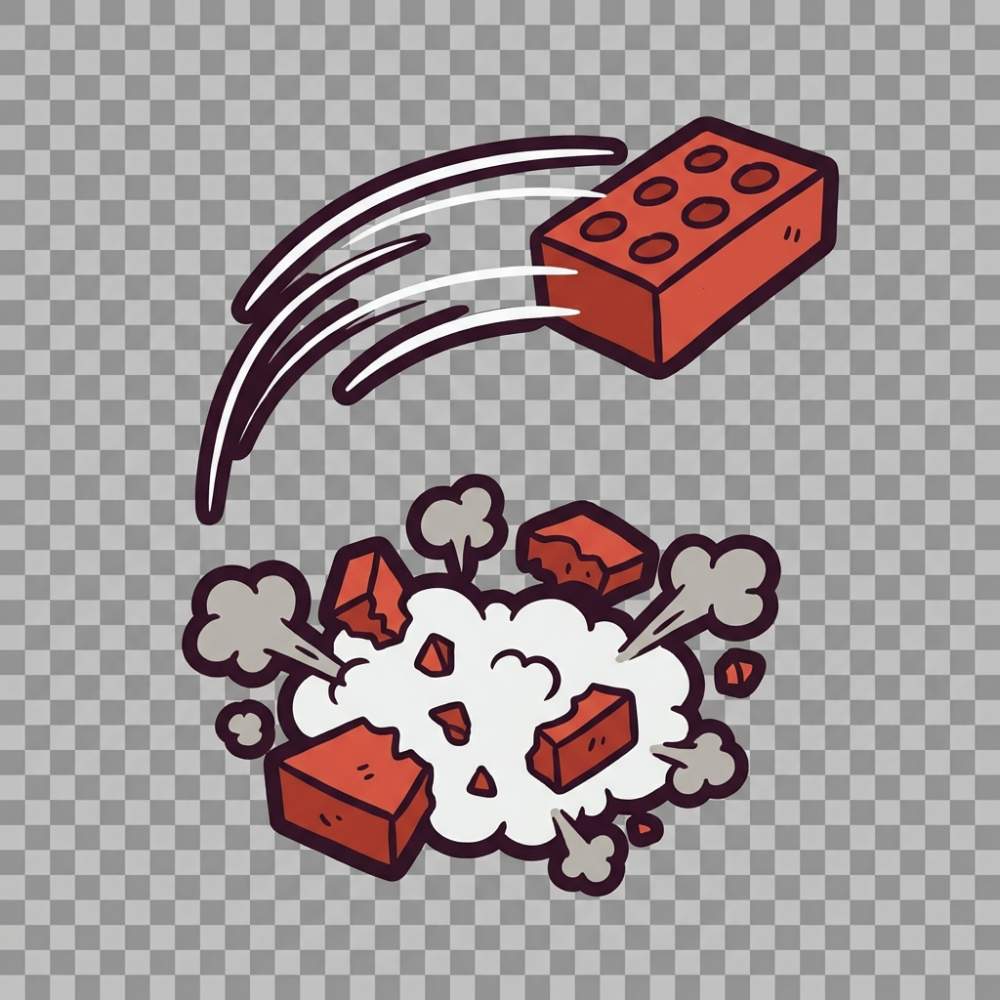
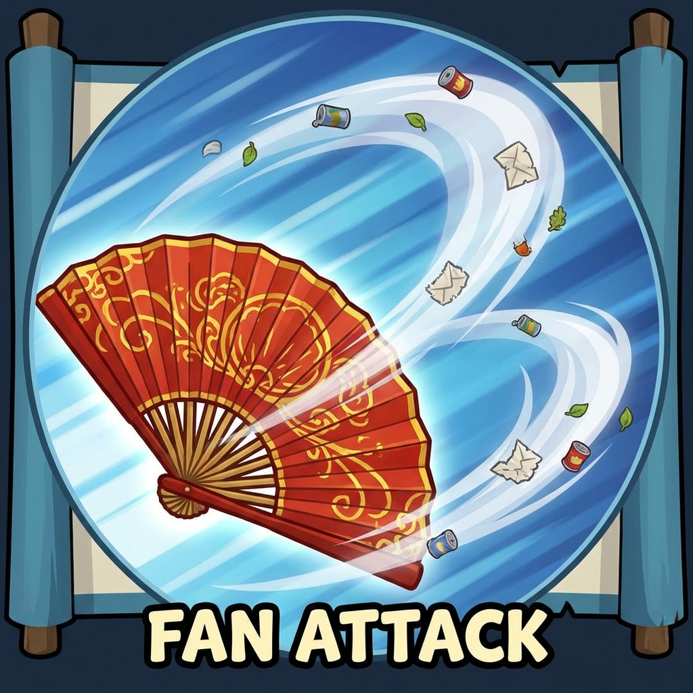

# Thiết kế kỹ năng chính

Tài liệu quy định chi tiết về hiệu ứng hình ảnh (VFX) và âm thanh (SFX) cho hệ thống kỹ năng của nhân vật chính.

> **Tham khảo thêm:** Xem danh sách đầy đủ kỹ năng, cooldown, sát thương, và công thức tính toán tại [Hệ thống kỹ năng](../he-thong-ky-nang.md).

---

## 1. Quy chuẩn chung

### 1.1. Visual Effects (VFX)

| Spec            | Yêu cầu                                                                                                                             |
| :-------------- | :---------------------------------------------------------------------------------------------------------------------------------- |
| **Phong cách**  | Cartoon, 2D Particle, Flashy (lòe loẹt), Chibi style.                                                                               |
| **Màu sắc**     | Phân biệt rõ ràng giữa skill gây sát thương (Màu nóng: Đỏ, Cam) và skill khống chế/buff (Màu lạnh/Xanh: Xanh dương, Xanh lá, Vàng). |
| **Performance** | Hạn chế số lượng particle quá lớn gây lag. Tối đa 50 particles/effect.                                                              |

### 1.2. Sound Effects (SFX)

| Spec           | Yêu cầu                                                                                |
| :------------- | :------------------------------------------------------------------------------------- |
| **Phong cách** | Comical (Hài hước), Cartoon (giống âm thanh Tom & Jerry), Rõ ràng, có lực (Impactful). |
| **Định dạng**  | .WAV (Source), .OGG (Ingame).                                                          |
| **Naming**     | `SFX_[SkillName].wav`.                                                                 |

---

## 2. Chi tiết kỹ năng (Player Skills)

Danh sách 20 kỹ năng nhân vật chính.

### 2.1. Nhóm Tấn công (Damage Dealer)

| Tên kỹ năng             | Mô tả VFX (Visual)                                                                                                                               | Mô tả SFX (Audio)                                                          | Hình ảnh minh họa                        | Ghi chú            |
| :---------------------- | :----------------------------------------------------------------------------------------------------------------------------------------------- | :------------------------------------------------------------------------- | :--------------------------------------- | :----------------- |
| **Ném gạch**            | Nhân vật cầm viên gạch ống (màu cam) ném theo đường parabol. Khi trúng đích, gạch vỡ vụn kèm hiệu ứng bụi + sao.                                 | Tiếng "Vút" (ném) -> Tiếng "Cốp!" (trúng) -> Tiếng gạch vỡ rào rạo.        |  | Làm trước bản demo |
| **Quạt chả**            | Nhân vật rút ra cái quạt nan to, quạt một cái tạo ra 3 luồng gió trắng (như phi tiêu gió) bay tới trước.                                         | Tiếng quạt gió mạnh "Phập phập".                                           |  |                    |
| **Dép lào thần chưởng** | Ném chiếc dép tổ ong xoay tít (như Boomerang). Có vệt gió (trail) màu vàng nhạt phía sau. Khi quay lại tay nhân vật có hiệu ứng bắt lấy (catch). | Tiếng vật thể bay xoay tròn "Viu viu viu...". Tiếng "Bốp" khi trúng địch.  |                                          | Làm trước bản demo |
| **Chém gió**            | Một cơn lốc xoáy nhỏ màu xám trắng, bên trong lốc có các ký tự chữ cái (A, B, C, @, #) bay lộn xộn (ẩn dụ cho việc "chém gió" nói phét).         | Tiếng gió rít "Uuu uuu" + Tiếng người xì xào lầm bầm (như tiếng đám đông). |                                          |                    |
| **Phun mưa**            | Nhân vật ngậm ngụm nước rồi phun toả ra hình nón (cone). Nước màu xanh dương nhạt, có bong bóng.                                                 | Tiếng phun nước "Phùuuu..." + Tiếng nước chảy róc rách.                    |                                          |                    |
| **Mưa thiên thạch**     | 5 cục đá tảng cháy rực rơi từ trên trời xuống ngẫu nhiên. Khi chạm đất tạo vụ nổ lửa hình tròn và nứt đất.                                       | Tiếng rít của vật thể rơi "Vuuu..." -> Tiếng nổ lớn "Bùm! Bùm! Bùm!".      |                                          |                    |
| **Đấm trâu**            | Găng tay Boxing khổng lồ (từ hư không hoặc lò xo) xuất hiện đấm thẳng vào mặt địch. Hiệu ứng chấn động (screen shake nhẹ).                       | Tiếng chuông boxing "Keng" -> Tiếng đấm "Bịch!".                           |                                          |                    |
| **Xả súng nước**        | Nhân vật rút khẩu súng nước nhựa đồ chơi, bắn liên thanh ra các tia nước nhỏ.                                                                    | Tiếng súng nước "Chiu chiu chiu".                                          |                                          |                    |
| **Bom hẹn giờ**         | Một quả bom tròn màu đỏ dính trên đầu địch, đếm ngược số 3, 2, 1 rồi nổ tung thành khói đen.                                                     | Tiếng đồng hồ tích tắc "Tíc tắc tíc tắc" -> Tiếng nổ "Bùm".                |                                          |                    |
| **Tia laser**           | Nhân vật đeo kính râm, mắt bắn ra tia laser màu đỏ rực rỡ xuyên thấu màn hình.                                                                   | Tiếng tia laser "Ziuuuuuuu" (âm thanh sci-fi retro).                       |                                          |                    |

### 2.2. Nhóm Khống chế & Suy yếu (CC & Debuff)

| Tên kỹ năng        | Mô tả VFX (Visual)                                                                                                                                                   | Mô tả SFX (Audio)                                                                    | Ghi chú            |
| :----------------- | :------------------------------------------------------------------------------------------------------------------------------------------------------------------- | :----------------------------------------------------------------------------------- | :----------------- |
| **Tiếng thét**     | Nhân vật mở to miệng, sóng âm (sound wave) tỏa ra xung quanh dạng vòng tròn. Có hình cái loa comic hiện lên. Kẻ địch có biểu tượng "choáng váng" (xoắn ốc) trên đầu. | Tiếng hét lớn "Aaaaa!" (nghe hài hước, không chói tai) hoặc tiếng gầm sư tử hà đông. | Làm trước bản demo |
| **Đặt bẫy chuột**  | Một cái bẫy chuột lo xo kiểu cổ điển nằm trên mặt đất. Khi kích hoạt: Bẫy kẹp lại, hiệu ứng "Răng cưa" hiện ra.                                                      | Tiếng kim loại gài lẫy "Cạch". Tiếng kẹp mạnh "Phập!".                               | Làm trước bản demo |
| **Mắt lé**         | Hai mắt nhân vật quay tròn (googly eyes). Bắn ra 2 tia sáng xoắn vào nhau. Kẻ địch bị trúng có ngôi sao bay quanh đầu.                                               | Tiếng hiệu ứng thôi miên "Woa woa woa..." (âm thanh synth).                          |                    |
| **Ném mắm tôm**    | Ném một cái chai/hũ sành. Khi vỡ tạo ra vũng nước màu tím sẫm bốc khí xanh lục (biểu thị mùi hôi/độc).                                                               | Tiếng chai vỡ "Xoảng". Tiếng ruồi nhặng bay "Vo ve vo ve".                           |                    |
| **Keo dính chuột** | Đổ ra một vãi chất lỏng màu vàng nhớt trên mặt đất. Kẻ địch đi vào có hiệu ứng dính chân (bước đi nặng nề).                                                          | Tiếng chất lỏng dính "Bẹp bẹp".                                                      |                    |

### 2.3. Nhóm Hỗ trợ & Sinh tồn (Buff & Survival)

| Tên kỹ năng            | Mô tả VFX (Visual)                                                                                                                               | Mô tả SFX (Audio)                                                        | Ghi chú            |
| :--------------------- | :----------------------------------------------------------------------------------------------------------------------------------------------- | :----------------------------------------------------------------------- | :----------------- |
| **Uống nước tăng lực** | Nhân vật cầm lon nước (giống Redbull/Monster) uống ực một cái. Toàn thân phát sáng màu vàng, có tia điện nhỏ chạy quanh.                         | Tiếng bật nắp lon "Tách" -> Tiếng uống "Glug glug" -> Tiếng "Khàaa!".    | Làm trước bản demo |
| **Băng bó**            | Nhân vật tự cuốn băng trắng quanh người (như xác ướt). Tim màu xanh lá bay lên (+HP).                                                            | Tiếng cuốn băng vải "Soạt soạt". Tiếng hiệu ứng hồi máu (Magical chime). | Làm trước bản demo |
| **Gồng mình**          | Nhân vật gồng cơ bắp, người to ra một chút, da chuyển màu đồng/sắt. Có khiên chắn mờ (aura) hình cầu bao quanh.                                  | Tiếng gồng sức "Hự!". Tiếng kim loại va chạm "Keng" khi bật khiên.       |                    |
| **Nổi giận**           | Đầu nhân vật bốc khói, mặt đỏ gay (biểu tượng icon giận dữ 💢). Hào quang lửa cháy dưới chân.                                                    | Tiếng nước sôi (sôi máu) "Sục sục" -> Tiếng gầm gừ.                      |                    |
| **Trốn tìm**           | Nhân vật biến mất (hoặc mờ đi thành bán trong suốt - alpha 50%). Có thể thay thế bằng hình ảnh "Cái thùng giấy" úp lên người (kiểu Solid Snake). | Tiếng "Puff" (biến mất). Tiếng cười khúc khích "Hihi".                   |                    |

---

## 3. Yêu cầu bàn giao (Deliverables)

### 3.1. VFX

| Hạng mục   | Yêu cầu                                                      |
| :--------- | :----------------------------------------------------------- |
| **Format** | Sprite Sheet (PNG) hoặc Spine Project.                       |
| **Naming** | `VFX_[SkillName]_[State].png` (e.g., `VFX_NemGach_Hit.png`). |

### 3.2. SFX

| Hạng mục     | Yêu cầu                                                                |
| :----------- | :--------------------------------------------------------------------- |
| **Format**   | Mono, 44.1kHz, 16-bit WAV.                                             |
| **Duration** | < 2s (cho các âm thanh impact), < 5s (cho các âm thanh skill kéo dài). |
