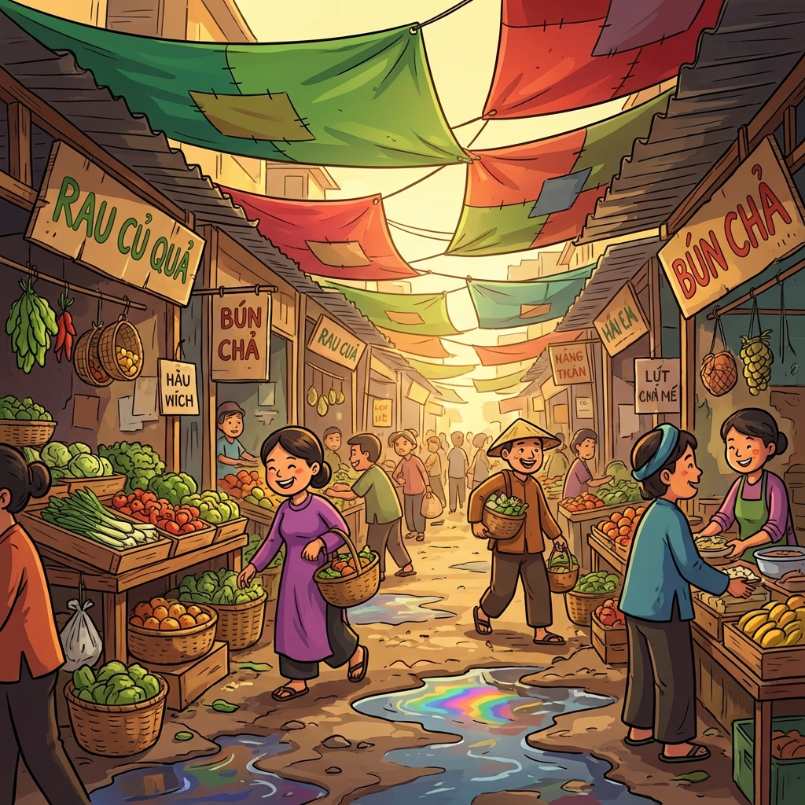

# Thiết kế môi trường

Tài liệu này quy định chi tiết về bối cảnh, các lớp nền (Background Layers) và không gian nghệ thuật cho từng khu vực trong game.

---

## 1. Quy chuẩn kỹ thuật

### 1.1. Hệ thống Parallax 5 lớp

Để tạo chiều sâu tối đa trên màn hình dọc, mỗi môi trường cần được chia tối thiểu thành 5 lớp:

1.  **Lớp Sky (Bầu trời):** Di chuyển chậm nhất (coeff: 0.05). Gồm mây, mặt trời/mặt trăng.
2.  **Lớp Far (Xa):** Di chuyển chậm (coeff: 0.1). Các tòa nhà chọc trời mờ ảo, núi.
3.  **Lớp Mid (Giữa):** Di chuyển trung bình (coeff: 0.3). Dãy nhà ống, cây cối lớn.
4.  **Lớp Near (Gần):** Di chuyển nhanh (coeff: 0.6). Cột điện, biển hiệu, sạp hàng.
5.  **Lớp Ground (Sàn):** Di chuyển nhanh nhất (coeff: 1.0). Mặt đường, vỉa hè, vết nứt.

### 1.2. Thông số hình ảnh

- **Tỷ lệ:** 9:16 (Mặc định).
- **Resolution:** 1080x1920 (Source).
- **Chiều ngang:** Thiết kế loop ngang (Seamless loop) với chiều ngang từ 2500px - 3000px để cuộn liên tục.
- **Lighting:** Mỗi chương có 3 biến thể màu: Sáng - Chiều - Tối.

---

## 2. Danh sách chương & Bối cảnh chi tiết

### Bảng tóm tắt môi trường

| Chương       | Chủ đề chính      | Đặc điểm nhận dạng                                                   | Animation môi trường                                | Hình ảnh minh họa                  | Ghi chú            |
| :----------- | :---------------- | :------------------------------------------------------------------- | :-------------------------------------------------- | :--------------------------------- | :----------------- |
| **Chương 1** | Ngõ nhỏ & vỉa hè  | Dây điện chằng chịt, tường vàng rêu, cột điện quảng cáo hút bể phốt. | Lá xà cừ rơi, quạt trần quay chậm, bồ câu cất cánh. |  | Làm trước bản demo |
| **Chương 2** | Khu chợ & bến xe  | Bạt che xanh đỏ, sạp rau củ, bảng hiệu vẽ tay, vũng nước loang dầu.  | Bạt rung theo gió, khói nồi nước lèo, ruồi bay nhỏ. |  |                    |
| **Chương 3** | Khu "sống ảo"     | Cafe neon "Good vibes only", cổng checkin trái tim, ring light.      | Đèn neon nhấp nháy, confetti bay, flash chụp ảnh.   |  |                    |
| **Chương 4** | Văn phòng công sở | Bàn làm việc đầy giấy tờ, máy photocopy, bảng deadline, cây héo rũ.  | Máy photocopy nhả giấy, đèn nhấp nháy, giấy bay.    |  |                    |

---

### Chương 1: Ngõ nhỏ & vỉa hè

- **Chủ đề:** Sự giao thoa giữa Hà Nội cũ và nhịp sống hiện đại.
- **Bảng màu:** Vàng thư (tường cũ), Xanh rêu, Đỏ gạch.

| Hạng mục                 | Chi tiết                                                                                                                                                                                    |
| :----------------------- | :------------------------------------------------------------------------------------------------------------------------------------------------------------------------------------------ |
| **Chi tiết đặc trưng**   | - Dây điện chằng chịt như mạng nhện. - Cột điện dán kín quảng cáo "Khoan cắt bê tông", "Hút bể phốt". - Quán trà đá vỉa hè với ghế nhựa xanh đỏ. - Cục nóng điều hòa chảy nước. |
| **Animation môi trường** | - Quạt trần trong quán cũ quay chậm. - Chim bồ câu bay lên từ nóc nhà. - Lá cây xà cừ rơi lưa thưa.                                                                                 |

### Chương 2: Khu chợ & bến xe

- **Chủ đề:** Sự xô bồ, náo nhiệt của chợ Việt Nam.
- **Bảng màu:** Xanh bạt, Đỏ tươi (thịt), Cam/Vàng (trái cây).

| Hạng mục                 | Chi tiết                                                                                                                                                                            |
| :----------------------- | :---------------------------------------------------------------------------------------------------------------------------------------------------------------------------------- |
| **Chi tiết đặc trưng**   | - Dãy bạt che mưa nhấp nhô đủ màu. - Xe đẩy tự chế, mẹt hoa quả, thúng xôi. - Vũng nước đọng loang lổ vết dầu. - Bảng hiệu vẽ tay: "Tạp hóa Cô Lan", "Bún đậu mắm tôm". |
| **Animation môi trường** | - Bạt che rung nhẹ theo gió. - Ruồi bay quanh sạp hàng (nhỏ). - Khói bốc lên từ nồi nước lèo của hàng bún.                                                                  |

### Chương 3: Khu "sống ảo"

- **Chủ đề:** Không gian sống ảo, checkin, quán cafe aesthetic và studio.
- **Bảng màu:** Hồng pastel, Xanh mint, Vàng neon, Tím lavender.

| Hạng mục                 | Chi tiết                                                                                                                                                                 |
| :----------------------- | :----------------------------------------------------------------------------------------------------------------------------------------------------------------------- |
| **Chi tiết đặc trưng**   | - Quán cafe với bảng hiệu neon chữ "Good vibes only". - Cổng checkin hình trái tim khổng lồ. - Ring light và tripod chụp ảnh dựng sẵn. - Graffiti chữ trend. |
| **Animation môi trường** | - Đèn neon nhấp nháy lung linh. - Confetti bay lả tả. - Flash chụp ảnh lóe sáng ngẫu nhiên.                                                                      |

### Chương 4: Văn phòng công sở

- **Chủ đề:** Môi trường công sở, tòa nhà văn phòng và áp lực công việc.
- **Bảng màu:** Xám bê tông, Xanh dương doanh nghiệp, Trắng đèn huỳnh quang.

| Hạng mục                 | Chi tiết                                                                                                                                                         |
| :----------------------- | :--------------------------------------------------------------------------------------------------------------------------------------------------------------- |
| **Chi tiết đặc trưng**   | - Bàn làm việc chất đầy giấy tờ. - Máy photocopy và bình nước nóng lạnh. - Cây xanh văn phòng héo rũ. - Bảng thông báo dán đầy giấy họp và deadline. |
| **Animation môi trường** | - Đèn huỳnh quang nhấp nháy. - Máy photocopy nhả giấy liên tục. - Giấy tờ bay từ bàn làm việc. - Thang máy đóng mở cửa.                              |

---

## 3. Hiệu ứng môi trường (Environment VFX)

Để tăng tính sống động, mỗi màn chơi sẽ có các "Particle Layer" phủ lên:

| Loại hiệu ứng            | Mô tả                                                |
| :----------------------- | :--------------------------------------------------- |
| **Bụi mịn (Dust)**       | Các hạt bụi nhỏ bay lơ lửng trong nắng.              |
| **Vết nứt (Decals)**     | Các vết nứt, vết ố trên tường xuất hiện ngẫu nhiên.  |
| **Thời tiết (Mưa phùn)** | Vệt mưa mỏng, trắng mờ.                              |
| **Thời tiết (Nắng gắt)** | Hiệu ứng Bloom mạnh ở các vùng sáng, Lens flare nhẹ. |
