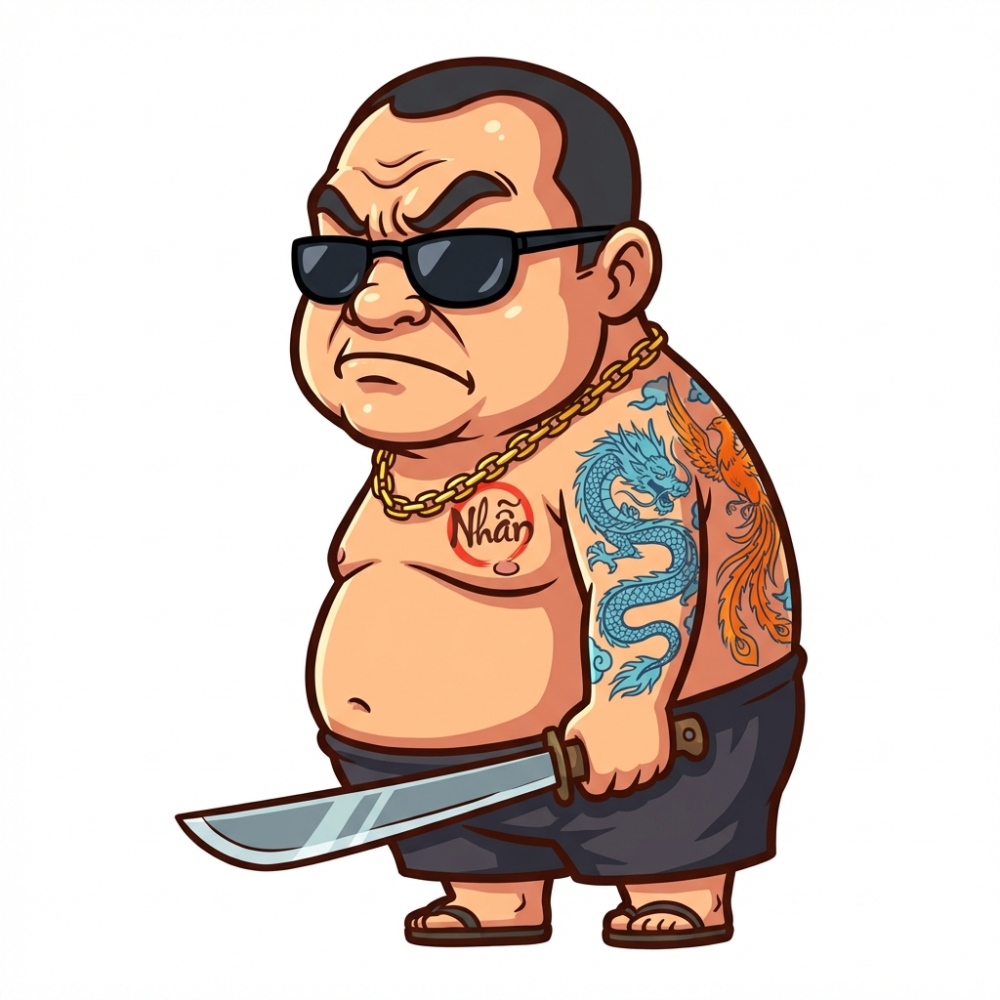
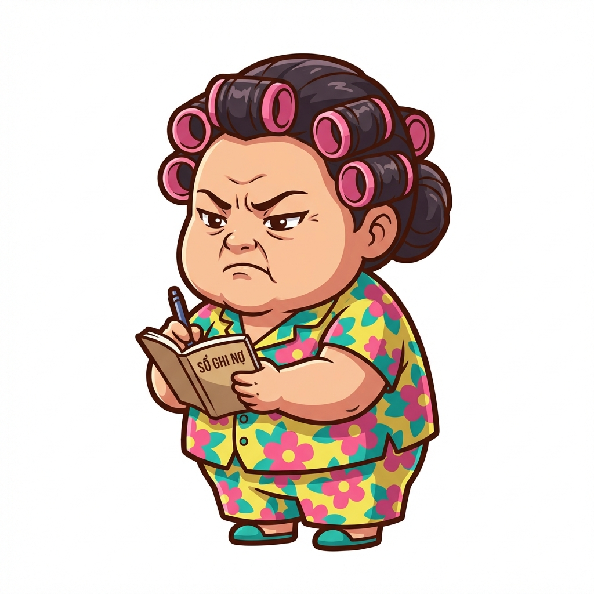
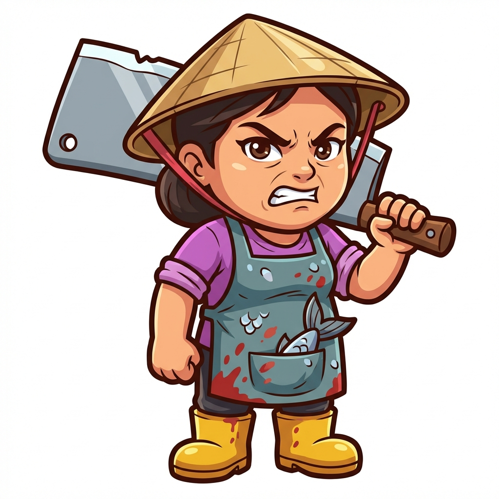

# Thiết kế nhân vật

Tài liệu quy định chi tiết về visual art (ngoại hình, animation) và audio (voice, SFX) cho toàn bộ nhân vật trong game.

---

## 1. Quy chuẩn chung (General specs)

### 1.1. Art style

| Tiêu chí       | Đặc tả phong cách                                                 |
| :------------- | :---------------------------------------------------------------- |
| **Phong cách** | Cartoon 2D, tỷ lệ cơ thể 1:2.5 (đầu to thân nhỏ, cute nhưng bựa). |
| **Line**       | Nét viền đậm, màu nâu đen (#2E2E2E).                              |
| **Màu sắc**    | Tươi sáng (high saturation), đổ bóng cel-shading đơn giản.        |
| **Góc nhìn**   | 3/4 side-view.                                                    |

### 1.2. Kỹ thuật (Technical)

| Thông số              | Yêu cầu kỹ thuật                                   |
| :-------------------- | :------------------------------------------------- |
| **Kích thước sprite** | Ingame: ~150px chiều cao.   Source: 512x512px. |
| **Animation FPS**     | 30fps.                                             |
| **Các trạng thái**    | Idle, Move, Attack, Skill, Hit, Die, Win.          |

---

## 2. Nhân vật chính (Player)

| Tên                       | Visual concept                                                                               | Animation                                                            | Audio specs                                                                              | Hình ảnh mô phỏng                                            |
| :------------------------ | :------------------------------------------------------------------------------------------- | :------------------------------------------------------------------- | :--------------------------------------------------------------------------------------- | :----------------------------------------------------------- |
| **Thanh niên nghiêm túc** | Nam thanh niên 20 tuổi, mặc quần đùi hoa, áo ba lỗ trắng cháo lòng, đi dép tổ ong. Mặt ngáo. | Dáng đi lả lướt, tay vung vẩy. Đánh bằng cách ném dép hoặc quật gậy. | **Atk:** "Hây a!", "Đỡ này"   **Hit:** "Á đù!", "Đau!"   **Die:** "Thôi xong..." |  |

---

## 3. Danh sách đồng đội (Teammates)

### 3.1. Nhóm huyền thoại (Legendary)

| Tên nhân vật       | Visual concept                                                                                                               | Animation                                                                    | Audio specs                                                                       | Hình ảnh mô phỏng                              |
| :----------------- | :--------------------------------------------------------------------------------------------------------------------------- | :--------------------------------------------------------------------------- | :-------------------------------------------------------------------------------- | :--------------------------------------------- |
| **Đại ca khu phố** | Đàn ông 40 tuổi, to béo, bụng phệ, cởi trần khoe hình xăm "Nhẫn", đeo dây chuyền vàng, kính râm đen. Cầm phóng lợn.          | Dáng đi khệnh khạng ưỡn ngực. Skill: Giơ tay gọi đệ chạy ra từ 2 bên.        | **Call:** "Anh em đâu!", "Xử nó!"   **Skill:** Tiếng huýt sáo chói tai.       |  |
| **Vua cờ bạc**     | Nam, mặc vest trắng nhàu nát, tóc vuốt keo bóng lộn, mắt thâm quầng. Tay cầm bộ bài xòe ra.                                  | Phi lá bài như ninja. Skill: Tung bộ bài lên trời rơi xuống như mưa.         | **Atk:** Tiếng bài bay "Vút vút"   **Skill:** "Tất tay nhé!", "Khô máu luôn!" |          |
| **Bà trùm đề**     | Phụ nữ trung niên sang trọng, đeo đầy vàng ngọc, cầm quyển sổ to và bút bi thiên long. Ngồi trên ghế sofa nhung đỏ biết bay. | Viết vào sổ, chữ số bay ra tấn công. Skill: Sấm sét đánh xuống khi chốt số.  | **Skill:** "Hôm nay về con gì?", "Ghi nợ nhé!"   **SFX:** Tiếng sấm sét.      |          |
| **Tiến sĩ giấy**   | Ông già gầy gò, áo cử nhân thùng thình, mũ tốt nghiệp, kính cận dày. Ôm chồng sách cao quá đầu.                              | Đi loạng choạng sắp ngã. Skill: Vấp ngã làm rơi sách tỏa sáng buff đồng đội. | **Skill:** "Học, học nữa, học mãi!"   **Die:** "Rớt môn rồi..."               |      |

### 3.2. Nhóm tinh anh (Epic)

| Tên nhân vật            | Visual concept                                                                                    | Animation                                                                         | Audio specs                                                      | Hình ảnh mô phỏng                                        |
| :---------------------- | :------------------------------------------------------------------------------------------------ | :-------------------------------------------------------------------------------- | :--------------------------------------------------------------- | :------------------------------------------------------- |
| **Tổ trưởng dân phố**   | Ông già nghiêm túc, đeo băng đỏ "Tổ trưởng" tay trái, cầm loa phường mini. Áo sơ mi trắng sơ vin. | Hét vào loa tạo sóng âm đẩy lùi địch.                                             | **Skill:** "Đề nghị giữ trật tự!", "Alo 1 2 3 4"                 |      |
| **Thợ cắt tóc**         | Thanh niên tóc nhuộm màu mè, mặc áo gile đen, cầm kéo và lược, hông đeo bao da đựng đồ nghề.      | Múa kéo xoay vòng vòng. Skill: Lao tới cắt liên tục tạo vệt sáng.                 | **Atk:** Tiếng kéo "Cắt cắt"   **Skill:** "Tóc này mốt lắm!" |                  |
| **Bà chủ trọ**          | Phụ nữ béo mặc đồ bộ hoa, cuốn lô trên đầu, tay cầm quyển sổ nợ. Mặt dữ dằn.                      | Chỉ tay mắng chửi (tấn công từ xa bằng chữ). Skill: Hút máu địch bay về túi mình. | **Skill:** "Tháng này chưa đóng tiền!", "Dọn đi ngay!"           |                    |
| **Youtuber ẩm thực**    | Béo tròn, áo thun in hình đồ ăn. Tay cầm đùi gà rán to đùng (vừa là vũ khí vừa là đồ ăn).         | Đánh bằng đùi gà. Skill: Ngồi bệt xuống ăn nhồm nhoàm hồi máu.                    | **Skill:** "Rộp rộp", "Mời các bạn ăn cùng mình"                 |        |
| **Rapper xóm**          | Mặc hoodie rộng, quần tụt, mũ snapback đội ngược, đeo dây chuyền $. Cầm micro.                    | Vừa đi vừa nhún nhảy. Skill: Bắn rap tạo ra chữ bay vào mặt địch.                 | **Skill:** "Yo yo check it out", "Khu phố này là của tao"        |                    |
| **Hot girl livestream** | Nữ trẻ đẹp, váy ngắn, tai mèo RGB. Trước mặt luôn có điện thoại kẹp trên ring light di động.      | Vừa đánh vừa tạo dáng chụp ảnh. Skill: Bắn tim bay tung toé.                      | **Skill:** "Mọi người thả tim đi!", "Cảm ơn anh giai donate"     |  |
| **Thầy giáo thể dục**   | Mặc đồ thể thao, đeo còi, cơ bắp cuồn cuộn. Tay cầm bảng chấm điểm.                               | Chạy tại chỗ constant. Skill: Hít đất liên tục tạo chấn động.                     | **Skill:** "Một hai một hai!", "Cố lên các em!"                  |      |

### 3.3. Nhóm chuyên nghiệp (Rare)

| Tên nhân vật         | Visual concept                                                                               | Animation                                                    | Audio specs                                                            | Hình ảnh mô phỏng                                  |
| :------------------- | :------------------------------------------------------------------------------------------- | :----------------------------------------------------------- | :--------------------------------------------------------------------- | :------------------------------------------------- |
| **Chú Ba xe ôm**     | Đội mũ cối, mặc áo sờn vai, đi dép lào. Ngồi trên xe Dream (kể cả khi không di chuyển).      | Lao xe húc vào địch. Idle: Lấy khăn lau xe.                  | **Atk:** Tiếng pô xe "Bạch bạch"   **Idle:** "Đi đâu em ơi?"       |          |
| **Cô Tư bán nước**   | Mặc đồ bộ hoa, ngồi ghế nhựa đỏ, cầm quạt nan phe phẩy. Bàn nước di động bên cạnh.           | Ném cốc trà đá. Skill: Rót trà mời cả team uống.             | **Skill:** "Uống gì con ơi?", "Trà đá miễn phí"                        |      |
| **Anh Bảy thợ điện** | Mặc áo cam bảo hộ, đeo đai đồ nghề lỉnh kỉnh, cầm kìm và tuốc nơ vít.                        | Phóng tia điện từ kìm. Skill: Giơ kìm lên trời gọi sét.      | **Atk:** Tiếng điện "Zẹt zẹt"   **Skill:** "Tránh ra anh làm việc" |  |
| **Chị Mười bán cá**  | Mặc tạp dề cao su, đi ủng, cầm dao phay to bản. Người dính vảy cá lấp lánh.                  | Chém dao phay. Skill: Quất nguyên con cá đông lạnh vào địch. | **Atk:** "Cá tươi đây!"   **Skill:** "Chém cho bây giờ!"           |    |
| **Ninja Lead**       | Kín mít từ đầu đến chân, áo chống nắng hoa, kính râm, khẩu trang. Đi xe Lead vàng gương zin. | Tạt đầu xe (dash). Skill: Bật đèn pha làm chói mắt địch.     | **Skill:** "Xi nhan trái rẽ phải", "Đường của chị"                     |              |
| **Thầy bói mù**      | Đeo kính đen tròn, mặc áo dài khăn đóng cũ, cầm gậy dò đường và mai rùa.                     | Gõ gậy xuống đất tạo phép. Skill: Tung đồng xu gieo quẻ.     | **Skill:** "Gia chủ năm nay xui", "Quẻ này đẹp"                        |            |
| **Anh shipper**      | Mặc đồng phục cam/xanh, đeo thùng hàng to hình vuông sau lưng.                               | Ném gói hàng. Skill: Mở thùng hàng thả ra bưu kiện nổ.       | **Atk:** "Hàng tới rồi"   **Skill:** "Alo xuống nhận em ơi"        |            |
| **Chị đại gym**      | Mặc đồ tập bó sát, tóc buộc đuôi ngựa, tay cầm tạ đơn màu hồng.                              | Đấm bốc hoặc ném tạ. Skill: Squat tạo sóng xung kích.        | **Voice:** "No pain no gain!", "Lên cơ nào!"                           |           |

### 3.4. Nhóm tập sự (Uncommon)

| Tên nhân vật       | Visual concept                                                       | Animation                      | Audio specs                        | Hình ảnh mô phỏng   |
| :----------------- | :------------------------------------------------------------------- | :----------------------------- | :--------------------------------- | :------------------ |
| **Chị tạp vụ**     | Quấn khăn trùm đầu, xách xô nước và cầm cây lau nhà.                 | Lau sàn đẩy địch lùi lại.      | **Voice:** "Dơ quá đi mất"         |  |
| **Anh Grab Food**  | Mặc áo xanh lá cây, đội mũ bảo hiểm 3/4. Cầm túi đồ ăn.              | Ném túi đồ ăn.                 | **Voice:** "Đơn hàng tới rồi"      |  |
| **Thằng Tèo net**  | Gầy còm, mắt cận lồi, đầu bù tóc rối. Cầm bàn phím hỏng.             | Đập bàn phím vào địch (Melee). | **Voice:** "Lag quá!", "Đập phím"  |  |
| **Cô hàng xóm**    | Đứng núp sau một đoạn tường gạch (mang theo tường di động). Chỉ tay. | Chỉ trỏ ném đá giấu tay.       | **SFX:** Tiếng xì xầm bàn tán.     |  |
| **Ông chú câu cá** | Đội mũ tai bèo, mặc đồ rằn ri, cầm cần câu tre.                      | Quăng cần câu móc địch.        | **Voice:** "Suỵt! Cá đang cắn"     |  |
| **Bà bán xôi**     | Đội thúng xôi trên đầu, tay cầm gói xôi lá chuối.                    | Ném gói xôi cho đồng đội ăn.   | **Voice:** "Xôi lạc bánh khúc đây" |  |

### 3.5. Nhóm bình dân (Common)

| Tên nhân vật        | Visual concept                                        | Animation                        | Audio specs                             | Hình ảnh mô phỏng   |
| :------------------ | :---------------------------------------------------- | :------------------------------- | :-------------------------------------- | :------------------ |
| **Bé Tí bắn bi**    | Trẻ con, đeo khăn quàng đỏ, quần đùi xanh, cầm bi ve. | Búng bi (tay làm động tác búng). | **SFX:** Tiếng bi "Cạch cạch"           |  |
| **Chú Tư xe thồ**   | Đi xe đạp thồ cũ kỹ, thồ bao tải to phía sau.         | Húc xe đạp chậm chạp.            | **SFX:** "Kính coong"                   |  |
| **Cô Bảy quét rác** | Mặc áo bảo hộ lao động phản quang, cầm chổi tre dài.  | Quét chổi tạo bụi mù.            | **SFX:** Tiếng chổi "Soạt soạt"         |  |
| **Cậu Vàng**        | Chó cỏ màu vàng, đeo xích cổ, đuôi vẫy tít mù.        | Cắn và sủa.                      | **SFX:** "Gâu gâu!", "Ẳng ẳng"          |  |
| **Bác bảo vệ**      | Mặc đồng phục bảo vệ xanh dương, cầm dùi cui cao su.  | Vung dùi cui.                    | **Voice:** "Đứng lại!", còi "Tuýt tuýt" |  |

---

## 4. Yêu cầu bàn giao (Deliverables)

| Hạng mục             | Quy định                                                 |
| :------------------- | :------------------------------------------------------- |
| **Định dạng**        | Spine 2D (.json, .atlas, .png) hoặc Sprite Sheet (.png). |
| **Cấu trúc thư mục** | `Assets/Characters/[Rarity]/[Name]/`.                    |
| **Tên file**         | Viết liền không dấu, ví dụ `DaiCaKhuPho_Idle.png`.       |
