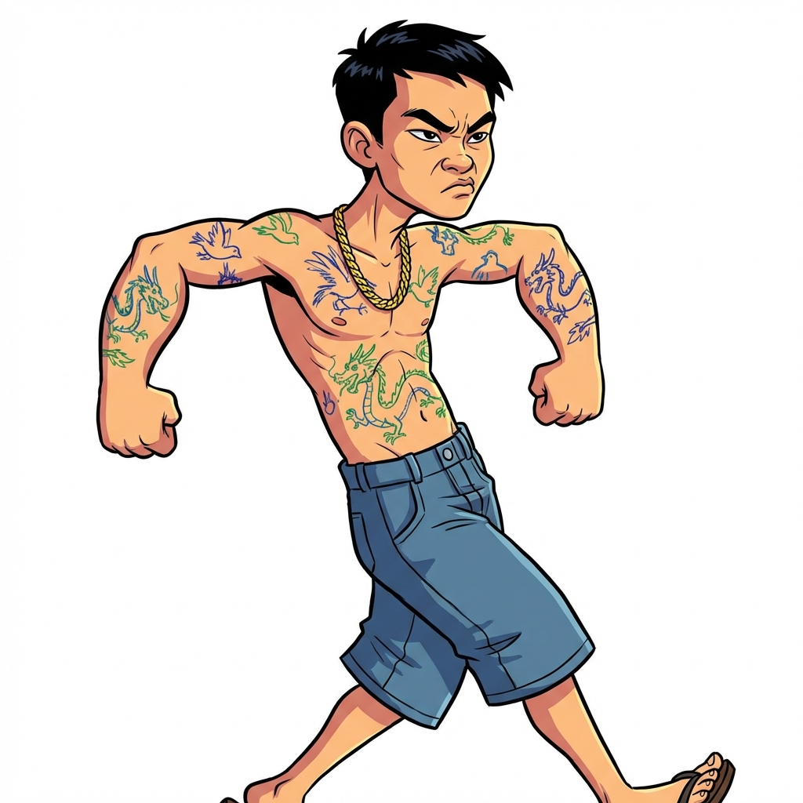

# Thiết kế quái vật

Tài liệu này đặc tả chi tiết về ngoại hình, animation và phong cách nghệ thuật cho **48 loại quái thường** và **4 Boss** trong game.

---

## 1. Định hướng nghệ thuật (Art Direction)

| Tiêu chí     | Đặc tả nghệ thuật                                                                  |
| :----------- | :--------------------------------------------------------------------------------- |
| **Style**    | Cartoon hài hước, châm biếm (Caricature).                                          |
| **Tỷ lệ**    | Đầu to, chân tay ngắn (chibi-like) hoặc cường điệu hóa đặc điểm hình thể.          |
| **Line art** | Nét viền đậm (Bold Outline).                                                       |
| **Màu sắc**  | Tông màu trầm hơn nhân vật chính một chút để làm nền, nhưng vẫn giữ nét tươi sáng. |

---

## 2. Chi tiết theo Chương (Asset List)

### Chương 1: Ngõ nhỏ & vỉa hè

_Assets ID: ENM_C1_xx_

| Tên quái vật                | Visual Concept                                                          | Animation                                              | Hình ảnh mô phỏng                                      | Ghi chú            |
| :-------------------------- | :---------------------------------------------------------------------- | :----------------------------------------------------- | :----------------------------------------------------- | :----------------- |
| **Bà hàng xóm đa chuyện**   | Đồ bộ hoa sặc sỡ, tóc cuốn lô, tay cầm quạt nan phe phẩy.               | Miệng nhép liên tục (tám chuyện), tay chỉ trỏ.         |      | Làm trước bản demo |
| **Thanh niên xăm trổ**      | Cởi trần, quần đùi bò, xăm rồng phượng nguệch ngoạc.                    | Dáng đi khệnh khạng, gồng mình dọa nạt.                |  | Làm trước bản demo |
| **Bác xe ôm ngủ gật**       | Mũ cối, áo sơ mi cũ bung cúc, chân đi dép rọ.                           | Vừa đi vừa gật gù, thỉnh thoảng giật mình tỉnh dậy.    |            | Làm trước bản demo |
| **Chị bán rau "chặt chém"** | Đội nón lá sùm sụp, đeo tạp dề, cầm hai bó rau.                         | Ném bó rau như ném phi tiêu.                           |                                     | Làm trước bản demo |
| **Anh thợ điện**            | Áo cam bảo hộ lấm lem, người quấn cuộn dây điện rối mù.                 | Bước đi nặng nề, tia điện nổ lách tách quanh người.    |                                     | Làm trước bản demo |
| **Cô gái bán hoa (rong)**   | Dắt xe đạp thồ đầy hoa sau lưng (xe đạp là một phần của body).          | Vừa đi vừa rao hàng (tay đưa lên miệng).               |                                     | Làm trước bản demo |
| **Thằng bé bán vé số**      | Nhỏ thó, đội mũ lưỡi trai ngược, cầm xấp vé số trên tay.                | Chạy lon ton, chìa vé số ra mời.                       |                                     | Làm trước bản demo |
| **Ông chú say rượu**        | Mặt đỏ gay, bụng phệ lộ rốn, tay cầm chai rượu.                         | Đi bước thấp bước cao, thỉnh thoảng nấc cụt.           |                                     | Làm trước bản demo |
| **Bà ghi lô đề**            | Ngồi trên ghế nhựa (ghế dính liền người), tay cầm sổ bút, đeo kính râm. | Cắm cúi ghi chép, ngẩng lên nhìn láo liên.             |                                     | Làm trước bản demo |
| **Thanh niên đa cấp**       | Vest rẻ tiền hơi rộng, tóc vuốt keo bóng lộn, kẹp tài liệu nách.        | Cười công nghiệp (răng sáng lóa), tay chìa ra bắt tay. |                                     | Làm trước bản demo |
| **Shipper vội vã**          | Áo khoác đồng phục (xanh/cam), đội mũ bảo hiểm, tay ôm gói hàng.        | Chạy cúi người về phía trước, nhìn đồng hồ liên tục.   |                                     | Làm trước bản demo |
| **Bảo vệ ngủ gật**          | Đồng phục xanh dương chật ních, bụng phệ, cầm dùi cui nhưng mắt nhắm.   | Đi chậm chạp, ngáp dài.                                |                                     | Làm trước bản demo |

**BOSS C1: Tổ trưởng dân phố**

| Hạng mục      | Đặc tả Boss C1                                                                               | Ghi chú            |
| :------------ | :------------------------------------------------------------------------------------------- | :----------------- |
| **Visual**    | Bác già nghiêm nghị, đeo kính lão trễ mũi, băng đỏ "Tổ Trưởng" to trên tay, cầm loa cầm tay. | Làm trước bản demo |
| **Animation** | Hét vào loa (loa rung bần bật), chỉ ngón tay quyền lực.                                      | Làm trước bản demo |

---

### Chương 2: Khu chợ & bến xe

_Assets ID: ENM_C2_xx_

| Tên quái vật              | Visual Concept                                                              | Animation                                                               | Hình ảnh mô phỏng   |
| :------------------------ | :-------------------------------------------------------------------------- | :---------------------------------------------------------------------- | :------------------ |
| **Móc túi chuyên nghiệp** | Áo hoodie trùm kín, khẩu trang y tế.                                        | Dáng đi lén lút (Sneak), mắt đảo liên tục.                              |  |
| **Phe vé chợ đen**        | Cầm xấp vé quạt quạt trên tay, mắt nhìn ngang liếc dọc.                     | Tay vẫy vé mời chào, thỉnh thoảng giấu vé đi.                           |  |
| **Bà bán thịt heo**       | Người to béo, tạp dề dính vết đỏ thực phẩm, cầm dao phay to bản.            | Chặt thịt "băm băm" xuống bàn, tay lau mồ hôi.                          |  |
| **Cửu vạn (bốc vác)**     | Cơ bắp lực lưỡng, vác bao tải gạo to che mất đầu, chỉ hở chân.              | Bước đi nặng nề, lưng còng xuống, thở dốc.                              |  |
| **Chị bán cá chua ngoa**  | Găng tay cao su màu hồng dài đến khuỷu, tay cầm con cá đang giãy.           | Vừa mắng khách vừa vung vẩy con cá nước bắn tung tóe.                   |  |
| **Lơ xe hách dịch**       | Đeo túi chéo trước ngực, dáng đứng xiêu vẹo, tay vẫy khách liên tục.        | Hét "Về đâu em ơi", tay đập đập vào hông xe.                            |  |
| **Thầy bói dạo**          | Kính đen tròn thầy bói, áo dài the cũ kỹ, đi gậy dò đường (giả mù).         | Gõ gậy xuống đường, tay kia bấm độn.                                    |  |
| **Ăn xin giả dạng**       | Ngồi trên ván trượt (ván gỗ có bánh xe), quần áo rách nhưng túi phồng tiền. | Đẩy ván trượt đi, tay chìa nón rách ra xin nhưng mắt soi ví người khác. |  |
| **Tiểu thương gian lận**  | Một tay cầm cân đĩa, một tay lén ấn ngón tay xuống đĩa cân.                 | Cân điêu, mắt nhìn khách, tay ấn cân thoăn thoắt.                       |  |
| **Giang hồ bến xe**       | Ngồi xổm trên ghế đẩu, tay cầm điếu cày dài ngoằng, xăm trổ kín tay.        | Rít thuốc lào kêu "róc róc", nhả khói mù mịt.                           |  |
| **Cò mồi bệnh viện**      | Đeo khẩu trang, tay cầm tập hồ sơ bệnh án, lôi kéo người khác.              | Chạy theo níu áo, dúi card visit vào tay.                               |  |
| **Bà bán nước mía**       | Tay quay vô hình (động tác quay máy nước mía), người dính đầy bã mía.       | Quay tay đều đều, lâu lâu lấy khăn lau máy.                             |  |

**BOSS C2: Trùm bảo kê chợ**

| Hạng mục   | Đặc tả Boss C2                                                                                               |
| :--------- | :----------------------------------------------------------------------------------------------------------- |
| **Visual** | Khổng lồ (chiếm 1/3 màn hình), đầu trọc lóc, đeo sợi xích vàng to như xích chó, bụng bia, cầm mã tấu rỉ sét. |

---

### Chương 3: Khu "sống ảo"

_Assets ID: ENM_C3_xx_

| Tên quái vật             | Visual Concept                                                                     | Animation                                                         | Hình ảnh mô phỏng   |
| :----------------------- | :--------------------------------------------------------------------------------- | :---------------------------------------------------------------- | :------------------ |
| **Hot girl kem trộn**    | Da trắng bệch mất tự nhiên, môi đỏ chót, tay cầm hũ kem khổng lồ.                  | Vừa đi vừa bôi kem, giơ hũ kem lên mời chào.                      |  |
| **Thánh livestream**     | Điện thoại gắn trên gậy selfie trước mặt, đèn ring light đeo cổ sáng lóa.          | Đi lùi (để quay mặt), miệng nói liên thoắng vào điện thoại.       |  |
| **Anh hùng bàn phím**    | Ôm bàn phím PC to đùng trước ngực như tấm khiên, đầu đeo băng đô "Quyết Thắng".    | Ngón tay múa trên bàn phím tóe lửa, mặt hầm hầm sát khí.          |  |
| **Ninja Lead**           | Trùm kín mít áo hoa chống nắng, kính râm choán hết mặt, không thấy tay chân đâu.   | Lái xe máy tàng hình (chỉ thấy dáng ngồi lái), tạt đầu đánh võng. |  |
| **Trẻ trâu nẹt pô**      | Tóc nhuộm xanh đỏ dựng ngược, cầm cái ống xả xe máy (Pô) đang bốc khói.            | Vừa quật ống xả vừa rú ga miệng "Én én".                          |  |
| **Streamer toxic**       | Đeo tai nghe gaming hầm hố, mặt đỏ gay gắt, mồm há to.                             | Đập bàn phím, gào thét vào micro nước bọt bắn tứ tung.            |  |
| **Rich kid rởm**         | Cầm ví tiền dày cộp but tiền rơi ra là tiền âm phủ, mặc đồ hiệu logo sai chính tả. | Vung tiền (giấy) tứ tung, điệu bộ sang chảnh kệch cỡm.            |  |
| **Thợ chụp ảnh dạo**     | Đeo máy ảnh DSLR ống kính dài ngoằng như súng bazooka.                             | Ngắm bắn (chụp) liên thanh, đèn flash nháy liên tục mù mắt.       |  |
| **Gymer khoe cơ**        | Mặc áo ba lỗ rách nách, gồng tay khoe chuột, người bôi dầu bóng loáng.             | Đi kiểu cua, thỉnh thoảng đứng lại pose dáng khoe cơ bắp.         |  |
| **Tiktoker nhảy nhót**   | Mặc đồ trend, tay cầm điện thoại quay tiktok.                                      | Vừa đi vừa thực hiện các động tác múa tay trend TikTok kỳ quặc.   |  |
| **Phượt thủ ý thức kém** | Balo to quá khổ cao quá đầu, treo lủng lẳng chai lọ.                               | Vừa đi vừa rải rác (vỏ chai, túi nilon) rơi ra từ balo.           |  |
| **Hacker mũ đen**        | Mặc hoodie đen trùm kín mặt, chỉ thấy 2 mắt sáng trong bóng tối, tay gõ không khí. | Lướt đi như bóng ma, xung quanh có các dòng code 010101 bay.      |  |

**BOSS C3: Idol giới trẻ**

| Hạng mục   | Đặc tả Boss C3                                                                                                          |
| :--------- | :---------------------------------------------------------------------------------------------------------------------- |
| **Visual** | Ăn mặc thời trang quái dị (quần ống loe, áo kim sa), cầm micro gắn đá quý, xung quanh có hào quang lấp lánh và tim bay. |

---

### Chương 4: Văn phòng công sở

_Assets ID: ENM_C4_xx_

| Tên quái vật               | Visual Concept                                                               | Animation                                                   | Hình ảnh mô phỏng   |
| :------------------------- | :--------------------------------------------------------------------------- | :---------------------------------------------------------- | :------------------ |
| **Sếp hách dịch**          | Bụng bia, hói đầu, tay luôn trong tư thế chỉ ngón trỏ quát tháo.             | Mặt đỏ tía tai, tay chỉ trỏ, miệng sùi bọt mép.             |  |
| **Thực tập sinh ngáo ngơ** | Đeo thẻ nhân viên ngược, tóc tai rối bời, cầm chồng giấy tờ sắp rơi.         | Đi loạng choạng, giấy tờ bay lả tả theo sau.                |  |
| **Kế toán khó tính**       | Đeo kính trễ mũi, tay cầm máy tính cầm tay (Casio) bấm liên tục "tạch tạch". | Vừa đi vừa soi hóa đơn, mắt lườm nguýt.                     |  |
| **HR thảo mai**            | Cười công nghiệp, tay cầm tập hồ sơ có chữ "Đuổi Việc" (Fired).              | Cười giả trân, tay giấu cái búa sau lưng (nụ cười ẩn dao).  |  |
| **IT support cáu kỉnh**    | Mắt thâm quầng như gấu trúc, bê cái case máy tính bốc khói.                  | Vừa đi vừa gõ vào cái case máy tính để sửa.                 |  |
| **Sale chèo kéo**          | Mặc vest chỉnh tề, tay cầm 2 cái điện thoại kề 2 bên tai.                    | Miệng hoạt động hết công suất (đa cấp), tay đưa namecard.   |  |
| **Drama queen**            | Vừa đi vừa buôn chuyện điện thoại, tay kia cầm cốc trà sữa size XL.          | Mắt đảo như rang lạc, miệng thì thầm to nhỏ.                |  |
| **Thánh ngủ trưa**         | Ôm gối ngủ văn phòng hình chữ U, vừa đi vừa mộng du.                         | Nước miếng chảy ròng ròng, đi đâm vào tường rồi bật lại.    |  |
| **Nhân viên OT**           | Mặt hốc hác, râu ria xồm xoàm, tay cầm cốc cà phê đen đặc sánh.              | Đi như zombie, mắt lờ đờ, thỉnh thoảng giật mình uống cafe. |  |
| **Đồng nghiệp đổ lỗi**     | Hai tay luôn chỉ sang hai bên (kiểu "tại nó, không phải tại tôi").           | Đi giật lùi, tay xua xua chối bỏ trách nhiệm.               |  |
| **Bà cô lao công**         | Quấn khăn mỏ quạ, cầm chổi lau nhà ướt sũng nước bẩn.                        | Vung chổi lau nhà như múa côn, nước bẩn văng tung tóe.      |  |
| **Bảo vệ tòa nhà**         | Ngồi trên ghế nhựa (phiên bản cao cấp hơn C1), cầm dùi cui điện.             | Ngủ gật nhưng tay vẫn bấm điện thoại xem Tiktok.            |  |

**BOSS C4: Chủ tịch giả danh**

| Hạng mục   | Đặc tả Boss C4                                                                                                                                  |
| :--------- | :---------------------------------------------------------------------------------------------------------------------------------------------- |
| **Visual** | Mặc vest Tuxedo cực sang trọng nhưng chân đi dép lào (hoặc tổ ong), tay xách vali tiền (tiền giả thòi ra ngoài). Dáng vẻ đạo mạo nhưng lố bịch. |
