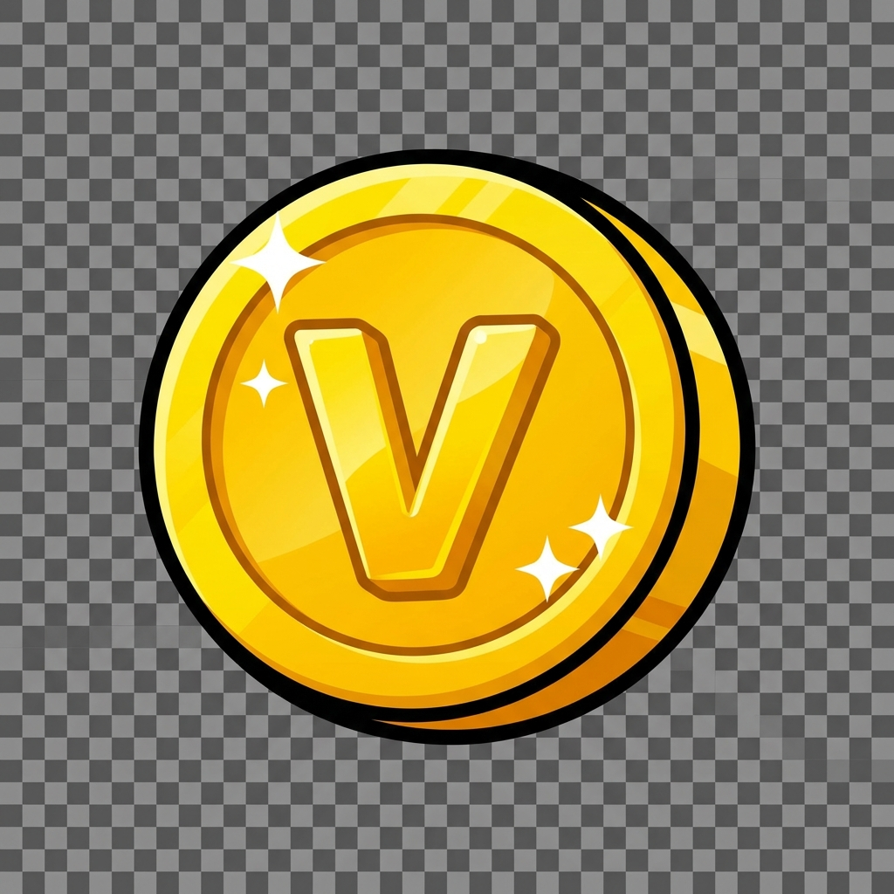
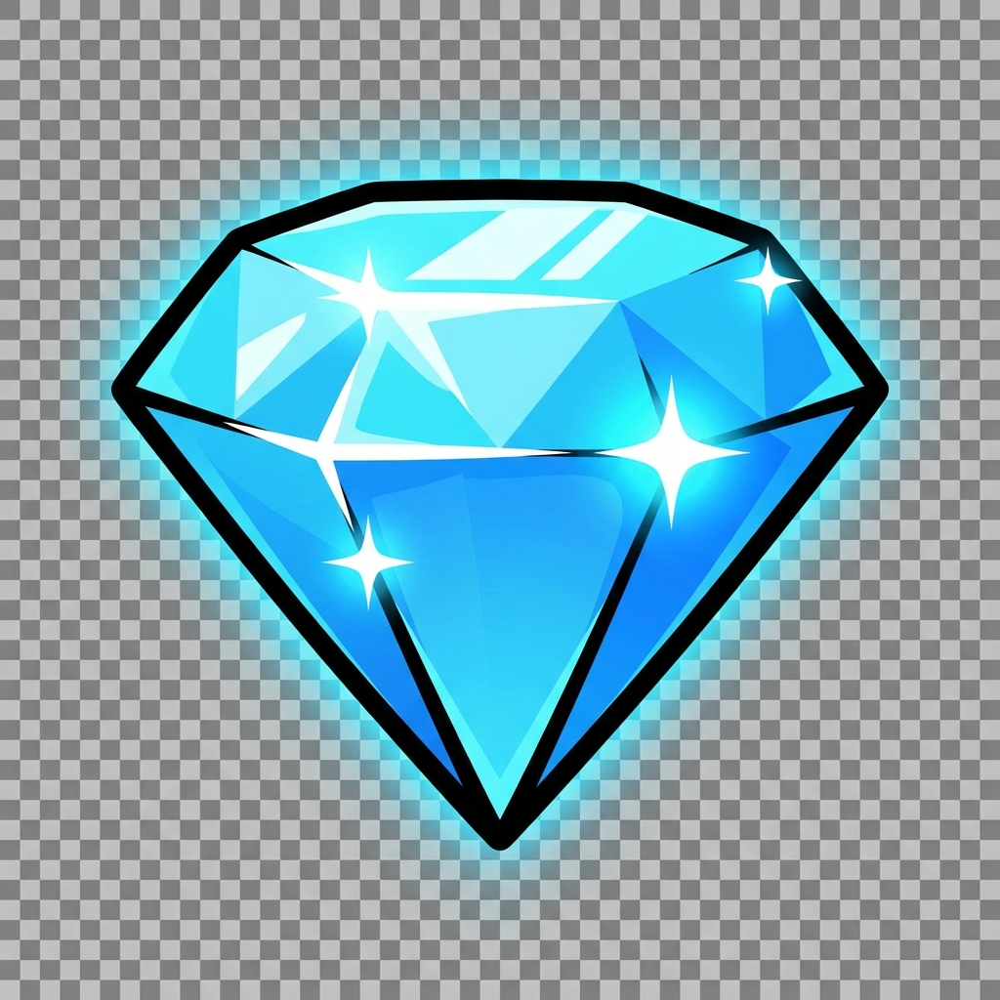

# Thiết kế vật phẩm

Tài liệu này liệt kê các tài nguyên hình ảnh (sprites/icons) cần thiết cho hệ thống tiền tệ, vật phẩm tiêu thụ và giao diện người dùng (GUI).

---

## 1. Tiền tệ & Tài nguyên (Currencies & Resources)

Icon cần thiết kế đơn giản, dễ đọc ở kích thước nhỏ (trên thanh header).

| Tên                     | Mô tả hình ảnh (Visual)                                                    | Kích thước | Ghi chú                                   | Hình ảnh minh họa                   |
| :---------------------- | :------------------------------------------------------------------------- | :--------- | :---------------------------------------- | :---------------------------------- |
| **Vàng (Gold)**         | Đồng xu hình tròn, màu vàng kim loại, có ký hiệu '$' hoặc chữ 'V' dập nổi. | 64x64      | Cần bản stack: 1 xu, 3 xu, đống xu. demo. |      |
| **Kim Cương (Gem)**     | Viên kim cương cắt giác (cut structure), màu xanh dương sáng hoặc ngũ sắc. | 64x64      | Cần bản stack: 1 viên, đống viên. demo.   |  |
| **Cờ lê (Scrap)**       | Cờ lê kim loại màu xám, dính chút dầu mỡ.                                  | 64x64      | Làm trước bản demo                        |                                     |
| **Bí kíp (Skill Book)** | Quyển sách bìa xanh dương, có hào quang tri thức.                          | 64x64      | Làm trước bản demo                        |                                     |
| **Mảnh kỹ năng**        | Một trang giấy rách từ cuốn bí kíp, có ký tự cổ.                           | 64x64      | Làm trước bản demo                        |                                     |
| **Bánh mì (Bread)**     | Ổ bánh mì kẹp thịt (Bánh mì Việt Nam) ngon lành.                           | 64x64      | Làm trước bản demo                        |                                     |
| **Mảnh nhân vật**       | Mảnh ghép hình jigsaw (puzzle piece) có dấu '?' hoặc hình bóng người.      | 64x64      | Làm trước bản demo                        |                                     |
| **Vé Gacha (Ticket)**   | Tấm vé giấy màu vàng/đỏ, phong cách vé số kiến thiết hoặc vé xem phim cũ.  | 64x64      | Làm trước bản demo                        |                                     |
| **Chìa khóa (Key)**     | Chìa khóa vàng cổ điển.                                                    | 64x64      | Làm trước bản demo                        |                                     |
| **Rương AFK**           | Rương gỗ bọc sắt, có vẻ nặng trịch.                                        | 128x128    | Làm trước bản demo                        |                                     |
| **Đá tẩy luyện**        | Viên đá ma thuật hình cầu, xoáy màu tím/hồng bên trong.                    | 64x64      | Làm trước bản demo                        |                                     |

---

## 2. Icon tính năng (Feature Icons)

Dùng cho 5 Tab điều hướng và các nút chức năng trên màn hình chính.
**Style:** Icon dạng Stroke (nét vẽ) hoặc Flat color đơn giản, có 2 trạng thái Active (Sáng) và Inactive (Xám).

### 2.1. Thanh điều hướng đáy (Bottom Bar)

| Tab       | Tên      | Icon mô tả                                            | Ghi chú            |
| :-------- | :------- | :---------------------------------------------------- | :----------------- |
| **Tab 1** | Chỉ số   | Hình người (body) hoặc cơ bắp tay.                    | Làm trước bản demo |
| **Tab 2** | Trang bị | Hình cái túi (inventory bag) hoặc thanh kiếm + khiên. | Làm trước bản demo |
| **Tab 3** | Kỹ năng  | Hình quyển sách phép hoặc tia sét.                    | Làm trước bản demo |
| **Tab 4** | Đồng đội | Hình 3 đầu người (icon group) hoặc cái bắt tay.       | Làm trước bản demo |
| **Tab 5** | Gacha    | Hình vòng quay may mắn hoặc hộp quà bí ẩn.            | Làm trước bản demo |

### 2.2. Nút màn hình chiến đấu (Battle HUD)

| Nút          | Icon mô tả                                          | Ghi chú            |
| :----------- | :-------------------------------------------------- | :----------------- |
| **Avatar**   | Khung tròn bao quanh mặt nhân vật.                  | Làm trước bản demo |
| **Settings** | Bánh răng cưa (Gear).                               | Làm trước bản demo |
| **Tốc độ**   | Nút Play (x1) và Fast Forward (x2).                 | Làm trước bản demo |
| **Auto**     | Vòng tròn tái chế (Recycle symbol) hoặc chữ "AUTO". | Làm trước bản demo |
| **Boss**     | Đầu lâu quỷ hoặc icon Boss cảnh báo nguy hiểm.      | Làm trước bản demo |
| **Nạp đầu**  | Hộp quà có ruy băng đỏ.                             | Làm trước bản demo |
| **Nhiệm vụ** | Cuộn giấy da có dấu tích xanh (Checkmark).          | Làm trước bản demo |
| **Mail**     | Phong bì thư.                                       | Làm trước bản demo |
| **Rank**     | Cái cúp vàng (Trophy).                              | Làm trước bản demo |

---

## 3. Các thành phần UI chung (Common UI Elements)

Cần thiết kế theo bộ (Atlas) để tái sử dụng. Style: Cartoon, nút bấm nổi 3D nhẹ.

### 3.1. Các loại nút bấm (Buttons)

| Loại nút           | Màu sắc/Style | Công dụng                                                   | Ghi chú            |
| :----------------- | :------------ | :---------------------------------------------------------- | :----------------- |
| **Primary**        | Xanh lá       | Hành động xác nhận, nâng cấp, nhận quà (cảm giác tích cực). | Làm trước bản demo |
| **Important**      | Vàng/Cam      | Nút shop, nạp, hoặc hành động tốn tiền (kêu gọi hành động). | Làm trước bản demo |
| **Danger/Close**   | Đỏ            | Nút tắt, xóa, hủy bỏ.                                       | Làm trước bản demo |
| **Info/Secondary** | Xanh dương    | Các nút chức năng phụ.                                      | Làm trước bản demo |
| **Disabled**       | Xám           | Trạng thái không thể bấm.                                   | Làm trước bản demo |

### 3.2. Khung cửa sổ (Panels/Popups)

| Thành phần               | style                                                                                    | Ghi chú            |
| :----------------------- | :--------------------------------------------------------------------------------------- | :----------------- |
| **Khung nền (Popup BG)** | Hình chữ nhật bo góc, màu giấy cũ (beige) hoặc trắng kem, viền nâu gỗ. Texture giấy nhẹ. | Làm trước bản demo |
| **Header (Tiêu đề)**     | Dải băng (Ribbon) vắt ngang phía trên popup để ghi tên tiêu đề.                          | Làm trước bản demo |
| **Nút tắt (Close btn)**  | Dấu X đỏ nằm góc trên phải popup.                                                        | Làm trước bản demo |

### 3.3. Thanh tiến độ (Progress Bars)

| Loại thanh        | Màu sắc                             | Ghi chú            |
| :---------------- | :---------------------------------- | :----------------- |
| **Thanh HP**      | Màu đỏ (Enemy) và Xanh lá (Player). | Làm trước bản demo |
| **Thanh Exp**     | Màu vàng hoặc xanh lơ.              | Làm trước bản demo |
| **Thanh Loading** | Màu xanh dương.                     | Làm trước bản demo |

---

## 4. Item Shop & Gacha Assets

### 4.1. Gói nạp (IAP Bundles)

| Tên gói            | Mô tả hình ảnh                          | Ghi chú            |
| :----------------- | :-------------------------------------- | :----------------- |
| **Gói tay nải**    | Túi vải nhỏ đựng ít kim cương.          | Làm trước bản demo |
| **Gói rương gỗ**   | Rương gỗ chứa vừa vừa kim cương.        | Làm trước bản demo |
| **Gói rương vàng** | Rương vàng tràn ngập kim cương.         | Làm trước bản demo |
| **Gói xe tải**     | Xe tải chở đầy kim cương (gói to nhất). | Làm trước bản demo |

### 4.2. Thùng Gacha (Gacha Box)

- **Style:** Thùng carton dán băng dính (như thùng hàng ship online).

| Trạng thái      | Mô tả animation                                | Ghi chú            |
| :-------------- | :--------------------------------------------- | :----------------- |
| **1. Đóng kín** | Thùng nằm im.                                  | Làm trước bản demo |
| **2. Rung lắc** | Phồng lên, rung mạnh, ánh sáng lọt ra khe nứt. | Làm trước bản demo |
| **3. Bung nắp** | Nắp bật tung, ánh sáng tỏa ra (Vàng/Tím/Xanh). | Làm trước bản demo |

---

## 5. Tổng hợp (Summary)

| Loại Asset          | Số lượng ước tính            |
| :------------------ | :--------------------------- |
| **Icon tài nguyên** | ~12 icons                    |
| **Icon Tab Bar**    | 10 icons (2 states)          |
| **Icon HUD**        | ~10 icons                    |
| **UI Atlas**        | Buttons, Panels, Frame, Bars |
