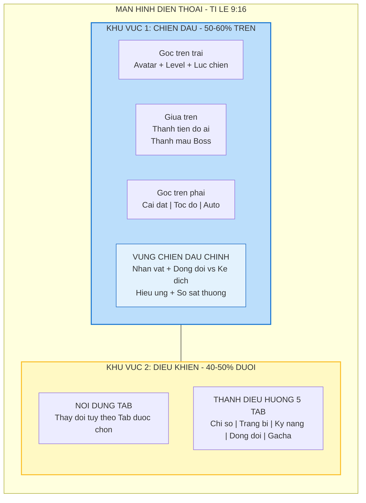
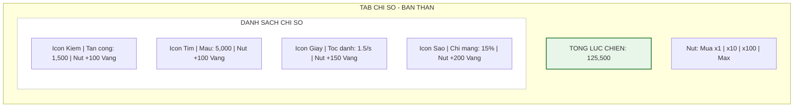
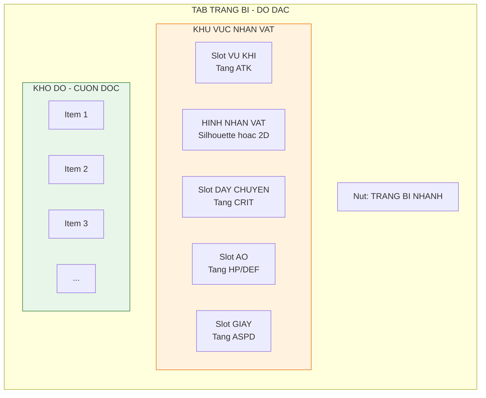
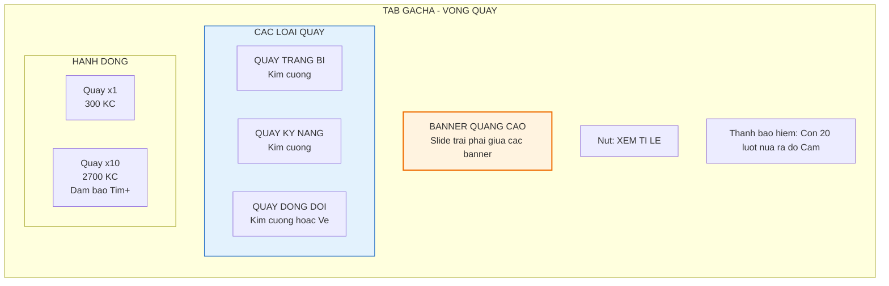
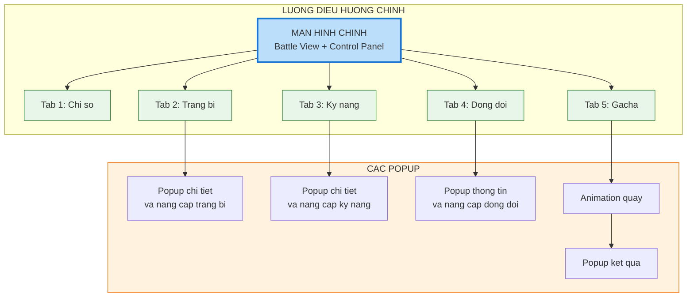
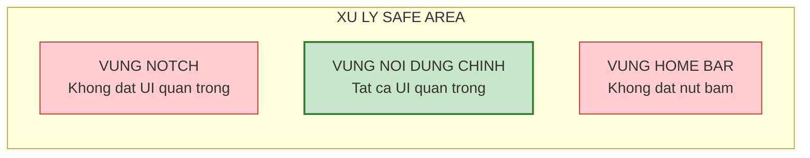

# Các chức năng chính và bố cục (Features and layout)

Tài liệu này mô tả chi tiết giao diện người dùng (UI) và tính năng của từng khu vực trên màn hình điện thoại. Game được thiết kế cho màn hình dọc (portrait mode) với tỉ lệ 9:16.

---

## 1. Tổng quan bố cục (Layout overview)

### 1.1. Nguyên tắc thiết kế

Game chia màn hình thành 2 phần chính để người chơi có thể vừa xem chiến đấu vừa thao tác nâng cấp mà không cần chuyển màn hình.

| Khu vực           | Tỉ lệ  | Chức năng                        |
| :---------------- | :----- | :------------------------------- |
| **Màn hình trên** | 50-60% | Hiển thị chiến đấu (Battle View) |
| **Màn hình dưới** | 40-50% | Bảng điều khiển (Control Panel)  |

### 1.2. Sơ đồ bố cục tổng thể

---

## 2. Chi tiết màn hình trên - khu vực chiến đấu (Battle view)

Đây là nơi diễn ra các hành động chính, thể hiện visual của game. Khu vực này chiếm phần lớn sự chú ý của người chơi.

### 2.1. Các thành phần giao diện (HUD elements)

#### 2.1.1. Góc trên trái - thông tin người chơi

| Thành phần    | Kích thước      | Mô tả                                                   |
| :------------ | :-------------- | :------------------------------------------------------ |
| **Avatar**    | 48x48 px        | Hình đại diện nhân vật chính, có viền màu thể hiện rank |
| **Level**     | Text nhỏ        | Hiển thị cấp độ hiện tại, ví dụ: "Lv. 50"               |
| **Lực chiến** | Text trung bình | Tổng chỉ số sức mạnh, hiển thị rút gọn: "10.5K", "1.2M" |

#### 2.1.2. Phần giữa trên - thanh tiến độ và boss

| Thành phần           | Khi nào hiện      | Mô tả                                                               |
| :------------------- | :---------------- | :------------------------------------------------------------------ |
| **Thanh tiến độ ải** | Luôn hiện         | Dạng thanh ngang, hiển thị số quái còn lại: "45/50" hoặc "Wave 2/3" |
| **Thanh máu boss**   | Chỉ khi đánh boss | Nằm nổi bật, to hơn thanh tiến độ, có thể nhiều lớp (x2, x3...)     |

#### 2.1.3. Góc trên phải - nút chức năng nhanh

| Nút           | Icon      | Chức năng                                         |
| :------------ | :-------- | :------------------------------------------------ |
| **Cài đặt**   | Bánh răng | Mở menu cài đặt và tạm dừng game                  |
| **Tốc độ**    | x1 / x2   | Chuyển đổi tốc độ chiến đấu (x2 là tính năng VIP) |
| **Auto boss** | Checkbox  | Bật/tắt tự động khiêu chiến boss khi đủ điều kiện |

#### 2.1.4. Khu vực chiến đấu trung tâm

| Thành phần          | Layer         | Mô tả thiết kế                                                     |
| :------------------ | :------------ | :----------------------------------------------------------------- |
| **Background**      | Lớp đáy       | Hình nền thay đổi theo chương: ngõ phố, chợ cóc, công viên, bến xe |
| **Nhân vật phe ta** | Lớp giữa      | Nhân vật chính và 4 đồng đội đứng bên trái hoặc phía dưới          |
| **Kẻ địch**         | Lớp giữa      | Quái vật xuất hiện từ bên phải hoặc phía trên, di chuyển vào       |
| **Hiệu ứng VFX**    | Lớp trên      | Đạn đạo, ánh sáng kỹ năng, vụ nổ                                   |
| **Damage text**     | Lớp trên cùng | Số sát thương nhảy lên khi đánh trúng, màu khác nhau theo loại     |

### 2.2. Bảng mô tả damage text

| Loại damage           | Màu sắc  | Kích thước    | Animation                        |
| :-------------------- | :------- | :------------ | :------------------------------- |
| **Sát thương thường** | Trắng    | Nhỏ           | Bay lên, mờ dần trong 0.5s       |
| **Chí mạng**          | Vàng cam | Lớn gấp 1.5x  | Bay lên có hiệu ứng nổ, rung nhẹ |
| **Hồi máu**           | Xanh lá  | Nhỏ, có dấu + | Bay lên chậm                     |
| **Né tránh**          | Xám      | Nhỏ           | Text "HUT" bay ngang             |

---

## 3. Chi tiết màn hình dưới - bảng điều khiển (Control panel)

Khu vực này chứa 5 tab điều hướng chính nằm cố định ở đáy màn hình. Nội dung phía trên các tab sẽ thay đổi tùy theo tab được chọn.

### 3.1. Thanh điều hướng đáy (Bottom navigation bar)

| Thuộc tính       | Giá trị              | Ghi chú                         |
| :--------------- | :------------------- | :------------------------------ |
| **Vị trí**       | Cố định đáy màn hình | Z-index cao nhất, luôn hiện     |
| **Chiều cao**    | 60-80 px             | Tùy thuộc độ phân giải màn hình |
| **Số lượng tab** | 5                    | Đánh số từ trái sang phải       |

#### Trạng thái nút tab

| Trạng thái       | Hiển thị                                            |
| :--------------- | :-------------------------------------------------- |
| **Active**       | Icon sáng màu, có glow effect, phóng to nhẹ 1.1x    |
| **Inactive**     | Icon màu xám, kích thước bình thường                |
| **Có thông báo** | Chấm đỏ nhỏ góc trên phải icon (notification badge) |

### 3.2. Tab 1: Chỉ số - "Bản thân"

Giao diện mặc định khi vào game. Đây là nơi người chơi tiêu vàng nhanh chóng để tăng sức mạnh cơ bản.

#### Bố cục tab

#### Tương tác người dùng

| Thao tác                 | Kết quả                                                     |
| :----------------------- | :---------------------------------------------------------- |
| **Tap nhanh**            | Nâng 1 cấp, trừ vàng, tăng chỉ số ngay lập tức              |
| **Giữ lâu (long press)** | Tự động nâng cấp liên tục cho đến khi hết vàng hoặc thả tay |
| **Chuyển chế độ mua**    | Thay đổi số lượng mua mỗi lần: x1, x10, x100 hoặc Max       |

### 3.3. Tab 2: Trang bị - "Đồ đạc"

Quản lý túi đồ và sức mạnh từ vật phẩm trang bị.

#### Bố cục tab

#### Chi tiết 4 slot trang bị

| Slot           | Vị trí             | Chỉ số chính                  | Ví dụ item                         |
| :------------- | :----------------- | :---------------------------- | :--------------------------------- |
| **Vũ khí**     | Bên trái nhân vật  | Tấn công (ATK)                | Điếu cày, gậy bóng chày, dép lào   |
| **Áo**         | Phía dưới nhân vật | Máu (HP) hoặc phòng thủ (DEF) | Áo ba lỗ, áo mưa giấy, giáp carton |
| **Giày**       | Phía dưới nhân vật | Tốc độ đánh (ASPD)            | Dép tổ ong, giày bata              |
| **Dây chuyền** | Bên phải nhân vật  | Chí mạng (CRIT)               | Dây xích, huy chương               |

#### Các tính năng trang bị

| Tính năng          | Mô tả                                                              |
| :----------------- | :----------------------------------------------------------------- |
| **Trang bị nhanh** | Tự động lọc và mặc các món đồ có lực chiến cao nhất trong túi      |
| **Nâng cấp**       | Chọn trang bị, tiêu tốn vàng và cờ lê để tăng cấp                  |
| **Ghép (merge)**   | Gộp 3 món cùng loại, cùng phẩm chất để tạo 1 món phẩm chất cao hơn |
| **Phân giải**      | Bán trang bị rác lấy lại một phần vàng và cờ lê                    |

### 3.4. Tab 3: Kỹ năng - "Tuyệt chiêu"

Hệ thống thẻ bài kỹ năng cho phép người chơi tùy biến chiến thuật.

#### Bố cục tab

| Khu vực                   | Nội dung                                                                 |
| :------------------------ | :----------------------------------------------------------------------- |
| **Slots kỹ năng (3-4 ô)** | Ô để lắp kỹ năng active sẽ dùng trong trận, kéo thả hoặc tap để thay đổi |
| **Danh sách kỹ năng**     | Hiển thị dạng card, list các kỹ năng đã sở hữu và chưa sở hữu (locked)   |
| **Nút nâng cấp tất cả**   | Tiện ích nâng cấp nhanh mọi kỹ năng đủ điều kiện                         |

#### Chi tiết thông tin kỹ năng

| Thông tin         | Mô tả                                     |
| :---------------- | :---------------------------------------- |
| **Icon**          | Hình ảnh đại diện kỹ năng                 |
| **Tên**           | Tên kỹ năng bằng tiếng Việt               |
| **Cấp độ**        | Level hiện tại của kỹ năng                |
| **Mô tả**         | Sát thương, hiệu ứng, thời gian hồi chiêu |
| **Thanh tiến độ** | Số mảnh hiện có / yêu cầu để nâng cấp     |

### 3.5. Tab 4: Đồng đội - "Anh em"

Quản lý đội hình hỗ trợ gồm 4 nhân vật.

#### Bố cục tab

| Khu vực                | Nội dung                                                                  |
| :--------------------- | :------------------------------------------------------------------------ |
| **Đội hình ra trận**   | 4 ô slots mô phỏng vị trí đứng (hàng trước/hàng sau), hỗ trợ kéo thả      |
| **Danh sách đồng đội** | Cuộn ngang hoặc dọc, hiển thị avatar, cấp độ, số sao, màu khung phẩm chất |
| **Nút quản lý**        | Nâng cấp level, tăng sao, xem kỹ năng                                     |

#### Thông tin hiển thị đồng đội

| Thông tin     | Hiển thị                                                                 |
| :------------ | :----------------------------------------------------------------------- |
| **Avatar**    | Hình nhỏ 64x64 px                                                        |
| **Cấp độ**    | "Lv. 30" góc dưới                                                        |
| **Số sao**    | 1-5 sao màu vàng                                                         |
| **Phẩm chất** | Màu khung: xanh lá (tốt), xanh dương (hiếm), tím (epic), cam (legendary) |

#### Hành động nâng cấp đồng đội

| Hành động              | Nguyên liệu             | Kết quả                                  |
| :--------------------- | :---------------------- | :--------------------------------------- |
| **Level up**           | Vàng + bánh mì          | Tăng chỉ số cơ bản (ATK, HP, DEF)        |
| **Rank up (tăng sao)** | Mảnh nhân vật tương ứng | Tăng mạnh hệ số kỹ năng, mở khóa passive |

### 3.6. Tab 5: Gacha - "Vòng quay"

Nơi tiêu kim cương để nhận vật phẩm cao cấp (monetization hub).

#### Bố cục tab

#### Chi tiết các loại quay

| Loại quay         | Phần thưởng                                | Tài nguyên sử dụng         |
| :---------------- | :----------------------------------------- | :------------------------- |
| **Quay trang bị** | Vũ khí, áo, giày, dây chuyền các phẩm chất | Kim cương                  |
| **Quay kỹ năng**  | Mảnh kỹ năng hoặc sách kỹ năng nguyên vẹn  | Kim cương                  |
| **Quay đồng đội** | Mảnh nhân vật hoặc nhân vật hoàn chỉnh     | Kim cương hoặc vé tuyển mộ |

---

## 4. Sơ đồ điều hướng (Navigation flow)

Mô tả cách người chơi di chuyển giữa các màn hình và popup.

---

## 5. Hướng dẫn cho đội thiết kế UI (UI design guidelines)

### 5.1. Nguyên tắc thiết kế

| Nguyên tắc     | Mô tả                                               |
| :------------- | :-------------------------------------------------- |
| **Đơn giản**   | Tối thiểu số lượng button và text trên mỗi màn hình |
| **Rõ ràng**    | Người chơi biết ngay cần làm gì, nút nào bấm được   |
| **Nhất quán**  | Icon và màu sắc thống nhất xuyên suốt game          |
| **Responsive** | Hoạt động tốt trên nhiều độ phân giải và notch      |

### 5.2. Safe area và notch

### 5.3. Bảng màu gợi ý

| Mục đích           | Mã màu  | Sử dụng                        |
| :----------------- | :------ | :----------------------------- |
| **Primary**        | #1976D2 | Button chính, highlight        |
| **Success**        | #388E3C | Nâng cấp thành công, số dương  |
| **Warning**        | #FFA000 | Cảnh báo, thông báo            |
| **Error**          | #D32F2F | Không đủ tài nguyên, thua trận |
| **Background**     | #FAFAFA | Nền sáng                       |
| **Text primary**   | #212121 | Text chính                     |
| **Text secondary** | #757575 | Text phụ                       |

### 5.4. Typography

| Loại text    | Font size | Weight  | Sử dụng           |
| :----------- | :-------- | :------ | :---------------- |
| **Headline** | 24-32 sp  | Bold    | Tiêu đề màn hình  |
| **Title**    | 18-20 sp  | Medium  | Tiêu đề section   |
| **Body**     | 14-16 sp  | Regular | Nội dung chính    |
| **Caption**  | 12 sp     | Regular | Text phụ, ghi chú |
| **Button**   | 14-16 sp  | Medium  | Text trong button |
