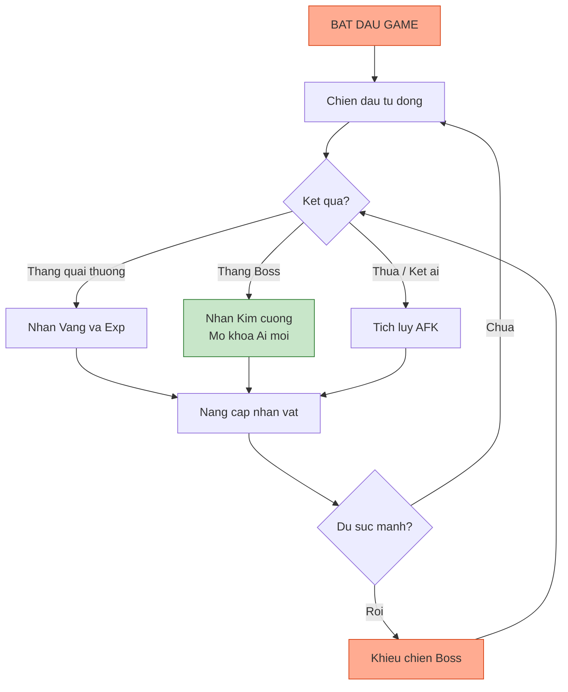
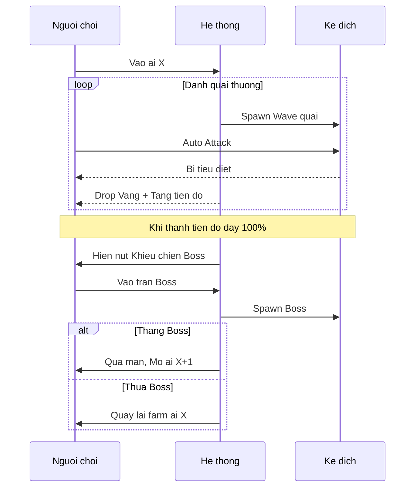

# Chi tiết cơ chế gameplay (Gameplay mechanics)

Tài liệu này mô tả chi tiết các cơ chế vận hành cốt lõi của game, bao gồm vòng lặp game, hệ thống chiến đấu, cấu trúc màn chơi và cơ chế tính toán tài nguyên khi AFK.

---

## 1. Vòng lặp cốt lõi (Core loop)

Vòng lặp chính của game xoay quanh việc chiến đấu tự động để thu thập tài nguyên, sau đó sử dụng tài nguyên để nâng cấp sức mạnh nhằm vượt qua các thử thách khó hơn.

### 1.1. Sơ đồ vòng lặp



### 1.2. Mô tả chi tiết

| Giai đoạn             | Mô tả                             | Tài nguyên nhận                     |
| :-------------------- | :-------------------------------- | :---------------------------------- |
| **Chiến đấu tự động** | Nhân vật tự động tấn công kẻ địch | -                                   |
| **Thắng quái thường** | Tiêu diệt quái trong wave         | Vàng, Exp, Trang bị (tỉ lệ thấp)    |
| **Thắng Boss**        | Tiêu diệt boss cuối ải            | Kim cương, Trang bị hiếm, Chìa khóa |
| **Thua/Kẹt ải**       | Không đủ sức mạnh                 | Tích lũy tài nguyên AFK             |
| **Nâng cấp**          | Sử dụng tài nguyên                | Chỉ số tăng                         |

---

## 2. Hệ thống chiến đấu (Combat system)

Game sử dụng cơ chế chiến đấu thời gian thực (real-time auto-battler) trên màn hình dọc.

### 2.1. Logic tấn công

| Thành phần                 | Mô tả                                                                              |
| :------------------------- | :--------------------------------------------------------------------------------- |
| **Thanh hành động**        | Mỗi nhân vật có thanh ẩn, nạp đầy dựa trên tốc độ đánh. Khi đầy thực hiện đòn đánh |
| **Mục tiêu mặc định**      | Tấn công kẻ địch gần nhất                                                          |
| **Mục tiêu ưu tiên**       | Một số kỹ năng ưu tiên: kẻ ít máu nhất, kẻ có sát thương cao nhất, hoặc Boss       |
| **Kỹ năng nhân vật chính** | Người chơi chọn bộ kỹ năng, có thời gian hồi chiêu                                 |
| **Kỹ năng đồng đội**       | Tự động dùng khi thanh năng lượng đầy hoặc hết cooldown                            |

### 2.2. Bảng chỉ số chiến đấu

| Tên chỉ số              | Ký hiệu | Mô tả                                     | Công thức                 |
| :---------------------- | :------ | :---------------------------------------- | :------------------------ |
| **Sức tấn công**        | ATK     | Sát thương cơ bản mỗi đòn đánh            | Base_ATK \* (1 + %Buff)   |
| **Máu tối đa**          | HP      | Lượng sát thương chịu được trước khi chết | Base_HP + Gear_HP         |
| **Phòng thủ**           | DEF     | Giảm sát thương nhận vào                  | DEF / (DEF + 500)         |
| **Tốc độ đánh**         | ASPD    | Số lần đánh trong một giây                | Base_ASPD \* (1 + %Bonus) |
| **Chí mạng**            | CRIT    | Tỉ lệ gây sát thương đột biến             | Max 100%                  |
| **Sát thương chí mạng** | CDMG    | Lượng sát thương khi chí mạng             | Mặc định 150%             |
| **Hồi phục**            | REGEN   | Lượng máu hồi mỗi giây                    | HP \* %Regen + Flat       |

### 2.3. Công thức tính sát thương

```
FinalDamage = BaseDamage * (1 - DamageReduction) * CritMultiplier

Trong đó:
- BaseDamage = ATK * SkillMultiplier
- DamageReduction = DEF / (DEF + 500)
- CritMultiplier = 1 (thường) hoặc CDMG (chí mạng)
```

---

## 3. Cấu trúc màn chơi (Stage structure)

Hành trình của người chơi được chia thành các chương (chapter), mỗi chương gồm nhiều ải (stage).

### 3.1. Quy trình một ải



### 3.2. Phân loại kẻ địch

| Loại              | Đặc điểm                       | Chiến thuật        | Drop                           |
| :---------------- | :----------------------------- | :----------------- | :----------------------------- |
| **Quái thường**   | Số lượng đông, chỉ số thấp     | Dùng AOE dọn nhanh | Vàng thấp, Exp                 |
| **Quái tinh anh** | Trâu hơn, có chỉ số nổi trội   | Cần burst damage   | Vàng trung bình, Mảnh trang bị |
| **Boss ải**       | Máu nhiều, có kỹ năng đặc biệt | Cần đội hình chuẩn | Kim cương, Trang bị hiếm       |

### 3.3. Cấu trúc chapter

| Chapter | Bối cảnh         | Số ải | Boss cuối         |
| :------ | :--------------- | :---- | :---------------- |
| 1       | Ngõ phố nhỏ      | 10    | Đại ca khu phố    |
| 2       | Khu chợ cóc      | 10    | Tổ trưởng dân phố |
| 3       | Công viên ghế đá | 10    | Chủ nợ hung dữ    |
| 4       | Bến xe           | 10    | Trùm đa cấp       |

---

## 4. Cơ chế AFK (Idle mechanics)

Tính năng quan trọng nhất để giữ chân người chơi bận rộn.

### 4.1. Nguyên tắc tính toán

| Thuộc tính         | Mô tả                                                    |
| :----------------- | :------------------------------------------------------- |
| **Mốc tham chiếu** | Dựa trên hiệu suất diệt quái tại ải cao nhất đã vượt qua |
| **Công thức**      | Tài nguyên = (Sản lượng mỗi phút) \* (Số phút offline)   |
| **Giới hạn**       | 8 tiếng (cơ bản), 12 tiếng (VIP)                         |

### 4.2. Bảng tài nguyên AFK

| Tài nguyên       | Nguồn gốc          | Tác dụng                      |
| :--------------- | :----------------- | :---------------------------- |
| **Vàng AFK**     | Rớt từ quái        | Nâng cấp chỉ số cơ bản        |
| **Exp nhân vật** | Rớt theo thời gian | Tăng level, mở khóa tính năng |
| **Rương AFK**    | Tỉ lệ ngẫu nhiên   | Trang bị hoặc vật phẩm        |

### 4.3. Công thức chi tiết (cho developer)

```
// Tính tài nguyên AFK
function calculateAFKReward(lastOnlineTime, currentTime, stageLevel):
    minutesOffline = (currentTime - lastOnlineTime) / 60
    minutesOffline = min(minutesOffline, MAX_AFK_MINUTES)

    goldPerMinute = getGoldPerMinute(stageLevel)
    expPerMinute = getExpPerMinute(stageLevel)
    chestChance = 0.1  // 10% mỗi phút

    totalGold = goldPerMinute * minutesOffline
    totalExp = expPerMinute * minutesOffline
    totalChest = floor(minutesOffline * chestChance)

    return {gold: totalGold, exp: totalExp, chest: totalChest}
```

---

## 5. Cơ chế nhân vật và đồng đội

### 5.1. Vai trò

| Nhân vật           | Vai trò            | Đặc điểm                                                     |
| :----------------- | :----------------- | :----------------------------------------------------------- |
| **Nhân vật chính** | Trung tâm đội hình | Tùy biến toàn bộ trang bị và kỹ năng. Chết là thua.          |
| **Đồng đội**       | Hỗ trợ             | Cố định kỹ năng, chỉ nâng level và sao. Đóng vai trò bổ trợ. |

### 5.2. Tương tác đội hình

| Hệ thống                   | Mô tả                                                      |
| :------------------------- | :--------------------------------------------------------- |
| **Cộng hưởng (Resonance)** | Thu thập đủ bộ đồng đội cùng chủ đề sẽ kích hoạt chỉ số ẩn |
| **Vị trí hàng trước**      | Nhân vật chính hoặc Tanker, chịu đòn trước                 |
| **Vị trí hàng sau**        | Xạ thủ, Pháp sư, Hồi máu, máu giấy cần bảo vệ              |

---

## 6. Hướng dẫn cho đội phát triển

### 6.1. Cho lập trình viên

- Combat loop chạy ở fixed timestep (50ms) để đảm bảo tính nhất quán
- Sử dụng object pooling cho quái và damage text
- AFK calculation phải chạy server-side nếu game online
- Log mọi combat event để debug balancing

### 6.2. Cho game designer

- Điều chỉnh ASPD cap để tránh animation chạy quá nhanh (max 5 đòn/giây)
- Crit rate cap 100%, crit damage không cap
- DEF scaling theo công thức logarithmic để tránh god mode
- Boss HP scaling theo cấp số nhân, gold drop scaling tuyến tính

### 6.3. Cho họa sĩ

- Mỗi loại quái cần 4 animation: idle, walk, attack, die
- Boss cần thêm animation skill đặc biệt
- Damage text font cần rõ ràng, dễ đọc khi bay nhanh
- Background parallax 2-3 layer để tạo chiều sâu
