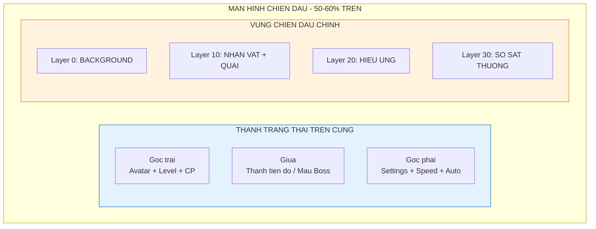
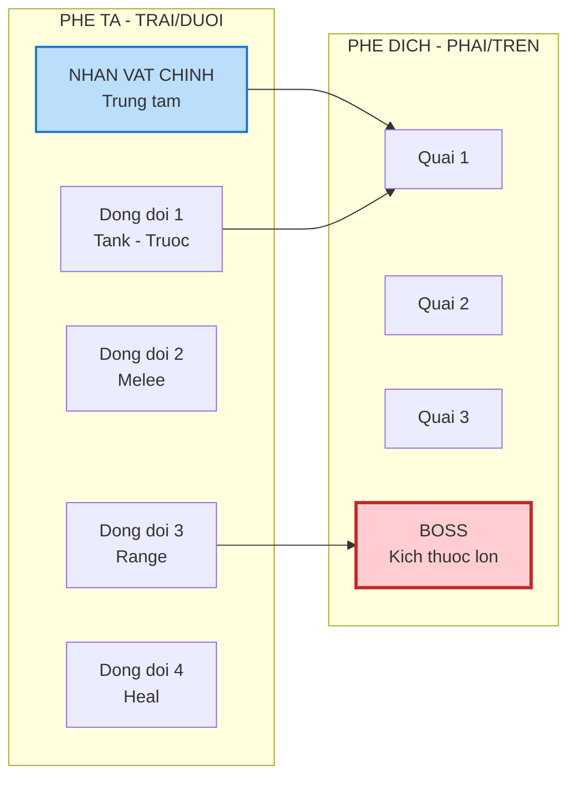

# Chi tiết thiết kế màn hình chiến đấu (Battle screen design)

Tài liệu này đi sâu vào thiết kế visual, bố cục và UX của khu vực màn hình trên (top screen), nơi diễn ra 90% các hoạt động visual của game.

---

## 1. Phân vùng hiển thị (Display zones)

Màn hình chiến đấu chiếm 50-60% diện tích thiết bị phía trên. Bố cục được chia layer từ sau ra trước để tạo chiều sâu.

### 1.1. Bảng phân lớp (Layer system)

| Layer             | Z-Index | Thành phần       | Mô tả                                         |
| :---------------- | :------ | :--------------- | :-------------------------------------------- |
| **Background**    | 0       | Hình nền         | Ảnh tĩnh hoặc loop nhẹ, thay đổi theo chapter |
| **Unit layer**    | 10      | Nhân vật và quái | Sprite animation của đơn vị chiến đấu         |
| **VFX layer**     | 20      | Hiệu ứng         | Đạn đạo, nổ, chém, buff/debuff                |
| **Floating text** | 30      | Text sát thương  | Số damage bay lên                             |
| **HUD layer**     | 40      | Giao diện tĩnh   | Thanh máu, tiến độ, nút bấm                   |

### 1.2. Sơ đồ phân vùng

---

## 2. Mô tả thành phần HUD

Giao diện người dùng trên màn chiến đấu cần gọn gàng để không che khuất hành động.

### 2.1. Thanh trạng thái trên cùng

#### Góc trái - thông tin người chơi

| Thành phần       | Kích thước     | Mô tả                                            |
| :--------------- | :------------- | :----------------------------------------------- |
| **Avatar**       | 48x48 px       | Hình đại diện nhân vật chính, viền màu theo rank |
| **Level**        | Text 12sp      | Số level hiện tại                                |
| **Combat power** | Text 14sp bold | Hiển thị rút gọn: 10.5K, 1.2M                    |

#### Giữa - thanh tiến độ và boss

| Thành phần           | Khi nào hiện                  | Kích thước              |
| :------------------- | :---------------------------- | :---------------------- |
| **Thanh tiến độ ải** | Luôn hiện (trừ khi đánh boss) | Width 60%, height 8px   |
| **Text wave**        | Luôn hiện                     | "Wave 2/3" hoặc "45/50" |
| **Thanh máu boss**   | Chỉ khi đánh boss             | Width 80%, height 16px  |
| **Tên boss**         | Chỉ khi đánh boss             | Text 16sp bold          |

#### Góc phải - nút chức năng

| Nút           | Icon     | Chức năng                | Kích thước |
| :------------ | :------- | :----------------------- | :--------- |
| **Cài đặt**   | Gear     | Mở menu pause/settings   | 36x36 px   |
| **Tốc độ**    | x1/x2    | Toggle tốc độ game       | 36x36 px   |
| **Auto boss** | Checkbox | Tự động khiêu chiến boss | 36x36 px   |

### 2.2. Khu vực hiển thị sát thương

| Loại                  | Màu sắc          | Font size | Animation              |
| :-------------------- | :--------------- | :-------- | :--------------------- |
| **Sát thương thường** | Trắng #FFFFFF    | 16sp      | Bay lên, mờ dần 0.5s   |
| **Chí mạng**          | Vàng cam #FF9800 | 24sp      | Bay lên, nổ, rung nhẹ  |
| **Hồi máu**           | Xanh lá #4CAF50  | 16sp      | Bay lên chậm, có dấu + |
| **Né tránh**          | Xám #9E9E9E      | 14sp      | Text "HUT" bay ngang   |

---

## 3. Bố trí đơn vị chiến đấu

Dù là game 2D màn hình dọc, cần tạo cảm giác phối cảnh giả 3D (2.5D) bằng cách sắp xếp vị trí trên dưới.

### 3.1. Sơ đồ vị trí

### 3.2. Nguyên tắc Z-order

| Quy tắc        | Mô tả                                                         |
| :------------- | :------------------------------------------------------------ |
| **Y position** | Nhân vật đứng thấp hơn (Y lớn hơn) sẽ đè lên nhân vật cao hơn |
| **Phe ta**     | Xuất phát từ bên trái hoặc phía dưới màn hình                 |
| **Phe địch**   | Xuất hiện từ bên phải hoặc phía trên màn hình                 |
| **Boss**       | Kích thước lớn gấp 2-3 lần quái thường, đứng giữa phải        |

---

## 4. Visual art style và bối cảnh

Phong cách nghệ thuật là yếu tố quan trọng để game nổi bật.

### 4.1. Định hướng art style

| Thuộc tính    | Mô tả                                                  |
| :------------ | :----------------------------------------------------- |
| **Style**     | Cartoon vui nhộn (funny/chibi) hoặc pixel art hiện đại |
| **Tông màu**  | Tươi sáng, độ bão hòa cao (high saturation)            |
| **Outline**   | Viền đậm 2-3px màu tối                                 |
| **Animation** | Smooth, 24-30 FPS                                      |

### 4.2. Danh sách bối cảnh theo chapter

| Chapter | Tên              | Yếu tố hình ảnh                                       |
| :------ | :--------------- | :---------------------------------------------------- |
| 1       | Ngõ phố nhỏ      | Tường vàng, cột điện rối dây, loa phường, quán trà đá |
| 2       | Khu chợ cóc      | Sạp rau, xe hủ tiếu gõ, dù che nắng nhiều màu         |
| 3       | Công viên ghế đá | Cây xanh, ghế đá, NPC tập dưỡng sinh trong background |
| 4       | Bến xe           | Xe khách, biển hiệu lộn xộn, xe ôm công nghệ          |

### 4.3. Yêu cầu asset background

| Chapter     | Số layer parallax | Kích thước          | Animation                  |
| :---------- | :---------------- | :------------------ | :------------------------- |
| Mỗi chapter | 3 layer           | 1920x1080 mỗi layer | Layer gần scroll nhanh hơn |

---

## 5. Các trạng thái màn hình

Màn hình chiến đấu có các trạng thái hiển thị khác nhau tùy theo flow game.

### 5.1. Trạng thái "Farm quái thường"

| Thuộc tính   | Mô tả                               |
| :----------- | :---------------------------------- |
| **Camera**   | Góc nhìn rộng, cố định              |
| **Nhịp độ**  | Quái xuất hiện liên tục từ bên phải |
| **UI**       | Thanh tiến độ hiện, thanh boss ẩn   |
| **Nút boss** | Sáng lên khi tiến độ đạt 100%       |

### 5.2. Trạng thái "Đánh boss"

| Giai đoạn      | Mô tả                                            | Thời gian        |
| :------------- | :----------------------------------------------- | :--------------- |
| **Transition** | Camera zoom in nhẹ vào nhân vật chính            | 0.5s             |
| **Warning**    | Dòng chữ "BOSS XUAT HIEN" + hiệu ứng còi hú      | 1s               |
| **Entrance**   | Boss nhảy từ trên xuống hoặc bước ra từ bóng tối | 1s               |
| **Combat**     | Thanh máu boss xuất hiện, nhạc thay đổi          | Cho đến kết thúc |

### 5.3. Trạng thái "Chiến thắng"

| Giai đoạn        | Mô tả                                             | Thời gian |
| :--------------- | :------------------------------------------------ | :-------- |
| **Freeze frame** | Dừng hình khoảnh khắc boss chết                   | 1-2s      |
| **Slow motion**  | Hiệu ứng chậm, tăng dramatic                      | 0.5s      |
| **Loot drop**    | Rương rơi giữa màn hình, bung vật phẩm bay về túi | 2s        |
| **Transition**   | Fade out/in sang màn tiếp theo                    | 0.5s      |

---

## 6. Hướng dẫn cho đội phát triển

### 6.1. Cho lập trình viên

- Implement object pooling cho quái và projectile
- Camera shake: amplitude 5-10px, duration 0.1-0.3s cho crit
- Damage text pooling: tối thiểu 20 instances
- State machine cho các trạng thái màn hình

### 6.2. Cho họa sĩ

**Asset nhân vật:**

| Animation | Số frame | FPS | Ghi chú                          |
| :-------- | :------- | :-- | :------------------------------- |
| Idle      | 4-8      | 8   | Loop nhẹ nhàng                   |
| Walk      | 6-8      | 12  | Có thể dùng cho run với 2x speed |
| Attack    | 4-6      | 24  | Có impact frame rõ ràng          |
| Skill     | 8-12     | 24  | Có windup và recovery            |
| Hit       | 2-4      | 12  | Flash trắng + recoil             |
| Die       | 6-8      | 12  | Không loop                       |

**Asset background:**

| Layer | Tốc độ parallax | Nội dung               |
| :---- | :-------------- | :--------------------- |
| Back  | 0.1x            | Trời, tòa nhà xa       |
| Mid   | 0.5x            | Nhà cửa, cây cối       |
| Front | 1.0x            | Vật thể gần, đường phố |

### 6.3. Cho sound designer

| Âm thanh             | Mô tả                        | Thời lượng   |
| :------------------- | :--------------------------- | :----------- |
| **BGM normal**       | Nhạc nền vui nhộn, tempo vừa | Loop 60-120s |
| **BGM boss**         | Nhạc intense, tempo nhanh    | Loop 60-120s |
| **SFX hit normal**   | Tiếng đấm/chém nhẹ           | 0.1-0.2s     |
| **SFX hit crit**     | Tiếng impact mạnh + bass     | 0.2-0.3s     |
| **SFX boss warning** | Tiếng còi hú hoặc trống      | 1s           |
| **SFX victory**      | Fanfare ngắn                 | 2-3s         |
