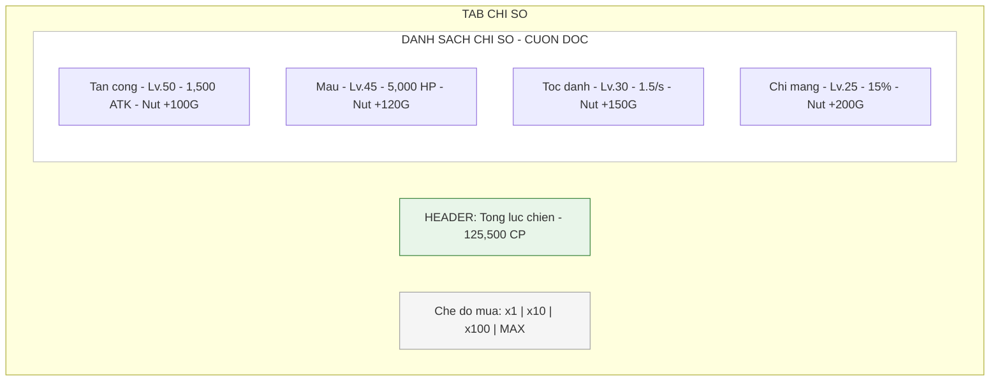
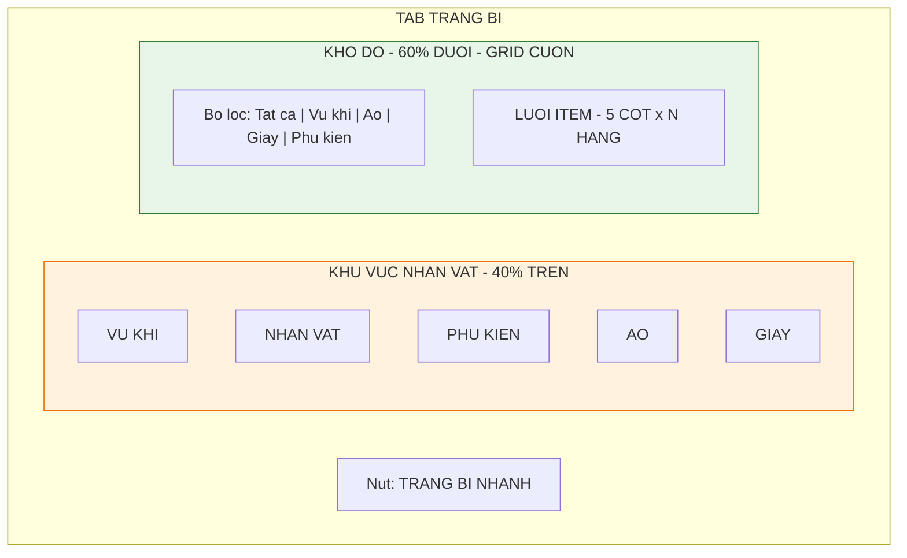
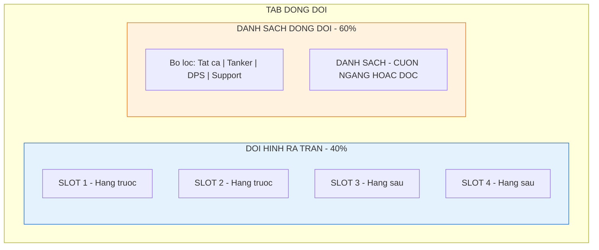

# Màn hình điều khiển

Tài liệu này mô tả chi tiết 5 tab chức năng nằm ở nửa dưới màn hình. Đây là nơi người chơi thực hiện các thao tác quản lý, nâng cấp và tối ưu hóa chiến thuật.

---

## 1. Thanh điều hướng đáy (Bottom navigation bar)

### 1.1. Thông số kỹ thuật

| Thuộc tính       | Giá trị                                  |
| :--------------- | :--------------------------------------- |
| **Vị trí**       | Cố định ở đáy màn hình, z-index cao nhất |
| **Chiều cao**    | 60-80 px tùy độ phân giải                |
| **Số lượng tab** | 5                                        |
| **Safe area**    | Cần tránh home bar trên các thiết bị mới |

### 1.2. Trạng thái nút tab

| Trạng thái           | Hiển thị                                    |
| :------------------- | :------------------------------------------ |
| **Active**           | Icon sáng màu, glow effect, phóng to 1.1x   |
| **Inactive**         | Icon màu xám, kích thước bình thường        |
| **Has notification** | Chấm đỏ nhỏ góc trên phải icon              |
| **Disabled**         | Màu xám mờ, không thể tap (khi chưa unlock) |

### 1.3. Điều kiện hiện notification badge

| Tab             | Điều kiện hiện chấm đỏ                        |
| :-------------- | :-------------------------------------------- |
| Tab 1: Chỉ số   | Đủ vàng nâng cấp bất kỳ chỉ số nào            |
| Tab 2: Trang bị | Có trang bị mới, có thể ghép, có thể nâng cấp |
| Tab 3: Kỹ năng  | Có mảnh mới, có thể nâng cấp                  |
| Tab 4: Đồng đội | Có thể nâng cấp level hoặc sao                |
| Tab 5: Gacha    | Có lượt quay miễn phí                         |

---

## 2. Tab 1: Chỉ số - "Bản thân"

Giao diện tập trung vào việc tiêu vàng nhanh (clicker style).

### 2.1. Bố cục

### 2.2. Chi tiết mỗi dòng chỉ số

| Thành phần       | Vị trí   | Kích thước | Mô tả                                         |
| :--------------- | :------- | :--------- | :-------------------------------------------- |
| **Icon**         | Bên trái | 48x48 px   | Kiếm (ATK), Tim (HP), Giày (ASPD), Sao (CRIT) |
| **Tên chỉ số**   | Sau icon | Text 16sp  | Tên và level hiện tại                         |
| **Giá trị**      | Giữa     | Text 14sp  | Giá trị số của chỉ số                         |
| **Nút nâng cấp** | Bên phải | 80x40 px   | Hiển thị giá vàng                             |

### 2.3. Tương tác

| Thao tác                   | Kết quả                                                          |
| :------------------------- | :--------------------------------------------------------------- |
| **Tap**                    | Nâng 1 cấp, trừ vàng, text "Success" bay lên                     |
| **Long press**             | Tự động nâng liên tục (5 lần/giây) cho đến khi hết vàng hoặc thả |
| **Toggle x1/x10/x100/Max** | Thay đổi số lượng mua mỗi lần tap                                |

---

## 3. Tab 2: Trang bị - "Đồ đạc"

Giao diện quản lý inventory và trang bị.

### 3.1. Bố cục

### 3.2. Khu vực nhân vật

| Thành phần           | Mô tả                                                           |
| :------------------- | :-------------------------------------------------------------- |
| **Hình nhân vật**    | Silhouette hoặc model 2D, ở giữa                                |
| **4 Slots**          | Xếp xung quanh: trái (vũ khí), phải (phụ kiện), dưới (áo, giày) |
| **Trạng thái rỗng**  | Icon mờ + dấu "+"                                               |
| **Trạng thái có đồ** | Icon item + khung màu theo phẩm chất                            |

### 3.3. Túi đồ (Inventory grid)

| Thuộc tính       | Giá trị                                  |
| :--------------- | :--------------------------------------- |
| **Số cột**       | 5                                        |
| **Số hàng**      | Không giới hạn, cuộn dọc                 |
| **Kích thước ô** | 64x64 px                                 |
| **Item mới**     | Có nhãn "New" góc trên                   |
| **Bộ lọc**       | Tất cả, Vũ khí, Áo, Giày, Phụ kiện       |
| **Sắp xếp**      | Theo phẩm chất (cao -> thấp), theo level |

### 3.4. Popup chi tiết trang bị

Khi tap vào một món đồ:

| Thành phần        | Mô tả                                     |
| :---------------- | :---------------------------------------- |
| **Header**        | Tên item, phẩm chất, level                |
| **Chỉ số chính**  | Số lớn, màu đỏ                            |
| **Chỉ số phụ**    | List các dòng, màu xanh                   |
| **Nút hành động** | Nâng cấp, Ghép (nếu đủ 3), Tháo/Mặc, Khóa |

---

## 4. Tab 3: Kỹ năng - "Tuyệt chiêu"

Giao diện deck building (xây dựng bộ bài kỹ năng).

### 4.1. Bố cục

| Khu vực          | Vị trí    | Mô tả                                    |
| :--------------- | :-------- | :--------------------------------------- |
| **Skill slots**  | Phía trên | 3-4 ô trống để lắp kỹ năng mang vào trận |
| **Skill pool**   | Phía dưới | Danh sách tất cả kỹ năng dạng card       |
| **Nút tiện ích** | Góc       | "Nâng cấp tất cả"                        |

### 4.2. Khe kỹ năng (Active slots)

| Thuộc tính          | Mô tả                                       |
| :------------------ | :------------------------------------------ |
| **Số lượng**        | 3 ô (mở khóa thêm ô 4 ở level 50)           |
| **Thao tác**        | Kéo thả từ pool vào slot, hoặc tap để equip |
| **Trạng thái rỗng** | Icon + với text "Chon ky nang"              |
| **Trạng thái có**   | Icon skill + level + cooldown               |

### 4.3. Card kỹ năng

| Thành phần            | Mô tả                                                  |
| :-------------------- | :----------------------------------------------------- |
| **Icon**              | 64x64 px, có viền màu theo loại (đỏ/xanh/vàng/xanh lá) |
| **Tên**               | Text dưới icon                                         |
| **Level**             | Góc dưới phải                                          |
| **Progress bar**      | Thanh tiến độ mảnh (5/10 để lên cấp)                   |
| **Trạng thái locked** | Xám mờ, có icon khóa                                   |

---

## 5. Tab 4: Đồng đội - "Anh em"

Quản lý biệt đội hỗ trợ.

### 5.1. Bố cục

### 5.2. Đội hình ra trận

| Thuộc tính   | Mô tả                                      |
| :----------- | :----------------------------------------- |
| **Số slot**  | 4 (mở khóa dần theo level người chơi)      |
| **Vị trí**   | Mô phỏng front-line và back-line           |
| **Thao tác** | Kéo thả để đổi vị trí, tap để xem chi tiết |

### 5.3. Card đồng đội

| Thành phần     | Mô tả                                         |
| :------------- | :-------------------------------------------- |
| **Avatar**     | 64x64 px                                      |
| **Khung màu**  | Theo phẩm chất: xanh lá, xanh dương, tím, cam |
| **Level**      | Góc dưới trái                                 |
| **Số sao**     | 1-5 sao vàng phía dưới                        |
| **Class icon** | Góc trên phải (shield, sword, bow...)         |

### 5.4. Popup chi tiết đồng đội

| Thành phần        | Mô tả                                               |
| :---------------- | :-------------------------------------------------- |
| **Thông tin**     | Tên, class, level, sao, chỉ số                      |
| **Skill active**  | Tên và mô tả kỹ năng chủ động                       |
| **Skill passive** | Tên và mô tả kỹ năng nội tại                        |
| **Duyên phận**    | Hiển thị các đồng đội khác cần có để kích hoạt buff |
| **Nút Level up**  | Dùng vàng + bánh mì                                 |
| **Nút Star up**   | Dùng mảnh nhân vật                                  |

---

## 6. Tab 5: Gacha - "Vòng quay"

Nơi thử vận may.

### 6.1. Giao diện banner

| Thành phần          | Mô tả                                |
| :------------------ | :----------------------------------- |
| **Banner carousel** | Slide trượt ngang giữa các banner    |
| **Banner image**    | Full width, tỉ lệ 16:9               |
| **Nút quay x1**     | Giá thấp, có thể free mỗi ngày 1 lần |
| **Nút quay x10**    | Giá ưu đãi, cam kết ra đồ xịn        |
| **Thanh pity**      | "Còn 20 lượt nữa chắc chắn ra cam"   |
| **Nút xem tỉ lệ**   | Mở popup hiển thị % từng phẩm chất   |

### 6.2. Các loại banner

| Banner      | Phần thưởng                 | Tài nguyên           |
| :---------- | :-------------------------- | :------------------- |
| **Tân thủ** | Trang bị + Đồng đội starter | Kim cương (giới hạn) |
| **Vũ khí**  | Chỉ có vũ khí các loại      | Kim cương            |
| **Tướng**   | Đồng đội mới hoặc limited   | Kim cương            |

### 6.3. Yêu cầu animation

| Yêu cầu                 | Mô tả                                                      |
| :---------------------- | :--------------------------------------------------------- |
| **Không sơ sài**        | Animation mở rương/quay lồng cầu phải hoành tráng          |
| **Phân biệt phẩm chất** | Màu sắc ánh sáng khác nhau (vàng cho legend, tím cho epic) |
| **Nút Skip**            | Cho phép bỏ qua animation sau 0.5s                         |

---

## 7. Các popup chức năng phụ

Một số tính năng không nằm trong tab chính mà là nút trôi nổi hoặc trong menu.

| Popup               | Vị trí truy cập             | Chức năng                         |
| :------------------ | :-------------------------- | :-------------------------------- |
| **Túi đồ tiêu thụ** | Nút nhỏ góc màn hình        | Chứa rương, chìa khóa, vé         |
| **Shop hàng ngày**  | Menu hoặc nút nổi           | Mua bán nhanh bằng vàng/kim cương |
| **Hòm thư**         | Icon thư góc trên           | Nhận quà từ NPH, quà đền bù       |
| **Nhiệm vụ**        | Icon quest                  | Nhiệm vụ ngày/tuần/thành tựu      |
| **Cài đặt**         | Icon gear trong battle view | Âm thanh, ngôn ngữ, tài khoản     |

---

## 8. Hướng dẫn cho đội phát triển

### 8.1. Cho lập trình viên

- Tất cả tab dùng chung popup system
- Implement tab switching không reload data (cache)
- Long press handler cần debounce để tránh spam server
- Notification badge update real-time khi có thay đổi

### 8.2. Cho UI designer

- Mỗi tab giữ consistent layout: header + content + footer
- Button states: normal, pressed, disabled phải rõ ràng
- Scroll indicator cho list dài
- Animation tab switch: fade hoặc slide nhẹ (200-300ms)

### 8.3. Cho họa sĩ

- Icon set cho 5 tab: outline style, 2 states (active/inactive)
- Notification badge: chấm đỏ 12x12 px với số trắng
- Background cho mỗi tab có thể khác nhau (màu accent)
- Asset character silhouette cho tab trang bị
