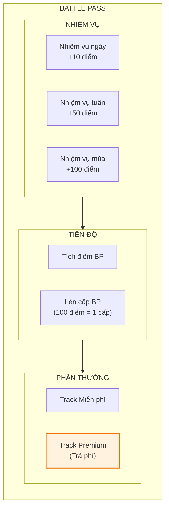
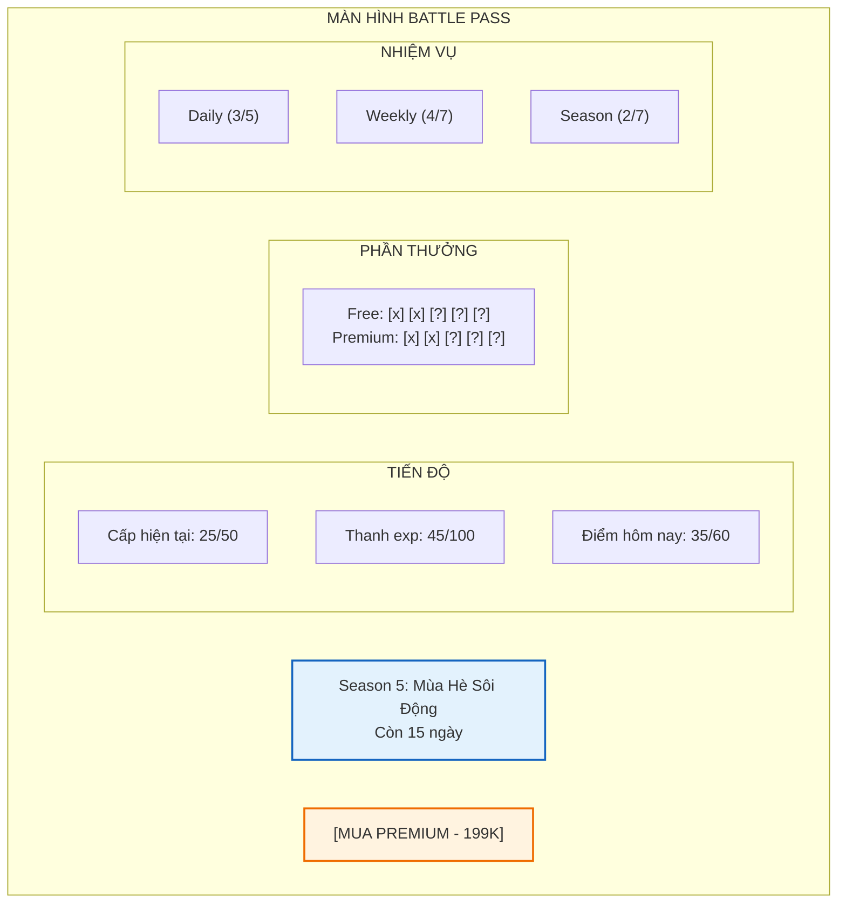

# Hệ thống Battle Pass

Tài liệu này mô tả chi tiết về hệ thống Battle Pass (Thẻ chiến đấu) - một trong những cơ chế monetization hiệu quả nhất trong game mobile hiện đại.

---

## 1. Tổng quan hệ thống

### 1.1. Khái niệm

| Thuộc tính     | Mô tả                                                       |
| :------------- | :---------------------------------------------------------- |
| **Tên gọi**    | Thẻ Chiến Đấu / Battle Pass                                 |
| **Mục đích**   | Tạo mục tiêu hàng ngày, tăng retention và monetization      |
| **Cơ chế**     | Hoàn thành nhiệm vụ để tích điểm, mở thưởng theo mốc        |
| **Đặc điểm**   | Có 2 track: Miễn phí và Premium (trả phí)                   |

### 1.2. Thời gian mùa (Season)

| Thuộc tính     | Mô tả                    |
| :------------- | :----------------------- |
| **Thời lượng** | 30 ngày/mùa              |
| **Reset**      | Tiến độ về 0 mỗi mùa mới |
| **Overlap**    | 3 ngày để mua bổ sung    |

---

## 2. Cấu trúc Battle Pass

### 2.1. Sơ đồ hệ thống

### 2.2. Hai loại track

| Track          | Giá       | Đặc điểm                              |
| :------------- | :-------- | :------------------------------------ |
| **Miễn phí**   | 0         | Thưởng cơ bản, ai cũng có thể nhận    |
| **Premium**    | 199,000 VND | Thưởng gấp 3-5 lần, có exclusive items |
| **Premium+**   | 399,000 VND | Như Premium + bỏ qua 15 cấp đầu       |

---

## 3. Nhiệm vụ Battle Pass

### 3.1. Nhiệm vụ hàng ngày (Daily)

*Reset mỗi ngày lúc 00:00*

| Nhiệm vụ              | Điểm BP | Yêu cầu              |
| :-------------------- | :------ | :------------------- |
| Đăng nhập             | 10      | Vào game             |
| Tiêu diệt 200 quái    | 15      | Farm hoặc AFK        |
| Nâng cấp 5 lần        | 10      | Bất kỳ nâng cấp      |
| Hoàn thành 1 phó bản  | 15      | Bất kỳ phó bản       |
| Quay gacha 1 lần      | 10      | Có thể dùng vé free  |
| **Tổng/ngày**         | **60**  |                      |

### 3.2. Nhiệm vụ hàng tuần (Weekly)

*Reset mỗi thứ 2 lúc 00:00*

| Nhiệm vụ                | Điểm BP | Yêu cầu                |
| :---------------------- | :------ | :--------------------- |
| Tiêu diệt 2,000 quái    | 50      | Tích lũy trong tuần    |
| Vượt 5 ải mới           | 60      | Ải chưa từng vượt      |
| Nâng cấp trang bị 20 lần | 40     | Bất kỳ trang bị        |
| Nâng đồng đội 10 lần    | 40      | Level hoặc sao         |
| Quay gacha 20 lần       | 50      | Bất kỳ banner          |
| Đánh Arena 10 trận      | 50      | Thắng hoặc thua        |
| Hoàn thành 15 phó bản   | 40      | Bất kỳ loại            |
| **Tổng/tuần**           | **330** |                        |

### 3.3. Nhiệm vụ mùa (Seasonal)

*Chỉ hoàn thành 1 lần trong mùa*

| Nhiệm vụ               | Điểm BP | Yêu cầu                   |
| :--------------------- | :------ | :------------------------ |
| Đạt Level 50           | 100     | Level nhân vật            |
| Có đồng đội Legendary  | 150     | Sở hữu trong kho          |
| Có trang bị Cam        | 100     | Sở hữu trong kho          |
| Vượt Chương 3          | 120     | Đánh bại Boss Ch.3        |
| Prestige 1 lần         | 150     | Tái sinh                  |
| Đạt hạng Vàng Arena    | 100     | Xếp hạng PvP              |
| Gia nhập Guild         | 50      | Tham gia bang hội         |
| **Tổng mùa**           | **770** |                           |

---

## 4. Phần thưởng theo cấp

### 4.1. Tổng quan 50 cấp

*100 điểm BP = 1 cấp*

| Cấp   | Thưởng Miễn phí             | Thưởng Premium                      |
| :---- | :-------------------------- | :---------------------------------- |
| 1     | 5,000 Vàng                  | + 10,000 Vàng                       |
| 2     | 5 Chìa khóa                 | + 10 Chìa khóa                      |
| 3     | 10 Kim cương                | + 20 Kim cương                      |
| 4     | 10 Bánh mì                  | + 20 Bánh mì                        |
| 5     | 3 Vé Gacha                  | + **Trang bị Xanh dương**           |
| 6     | 10,000 Vàng                 | + 20,000 Vàng                       |
| 7     | 10 Cờ lê                    | + 30 Cờ lê                          |
| 8     | 15 Kim cương                | + 30 Kim cương                      |
| 9     | 15 Bánh mì                  | + 30 Bánh mì                        |
| 10    | **Trang bị Xanh lá**        | + **Trang bị Tím**                  |
| ...   | ...                         | ...                                 |
| 15    | 5 Vé Gacha                  | + **Mảnh đồng đội Epic x20**        |
| 20    | **Trang bị Xanh dương**     | + **Trang bị Cam**                  |
| 25    | 50 Kim cương                | + 100 Kim cương                     |
| 30    | **Mảnh đồng đội Rare x30**  | + **Mảnh đồng đội Legendary x10**   |
| 35    | 10 Vé Gacha                 | + 20 Vé Gacha                       |
| 40    | **Trang bị Tím**            | + **Trang bị Cam** (chọn loại)      |
| 45    | 100 Kim cương               | + 200 Kim cương                     |
| 50    | **Khung Avatar Season**     | + **Skin nhân vật Exclusive**       |

### 4.2. Bonus cấp (sau cấp 50)

Sau khi đạt cấp 50, mỗi cấp thêm cho:
- **Miễn phí:** 5,000 Vàng + 5 Kim cương
- **Premium:** 10,000 Vàng + 15 Kim cương + 1 Vé Gacha

*Không giới hạn cấp sau 50*

---

## 5. Kinh tế Battle Pass

### 5.1. Tính toán điểm tối đa/mùa

| Nguồn                | Điểm/mùa    |
| :------------------- | :---------- |
| Daily x 30 ngày      | 1,800       |
| Weekly x 4 tuần      | 1,320       |
| Seasonal             | 770         |
| **Tổng tối đa**      | **3,890**   |

*3,890 điểm = 38.9 cấp*

### 5.2. Đạt cấp 50 với casual play

| Chế độ chơi      | Điểm/ngày | Tổng 30 ngày | Cấp đạt được |
| :--------------- | :-------- | :----------- | :----------- |
| **Hardcore**     | 100+      | 3,000+       | 50+ (max)    |
| **Regular**      | 70-80     | 2,100-2,400  | 40-48        |
| **Casual**       | 40-50     | 1,200-1,500  | 30-35        |
| **Very Casual**  | 20-30     | 600-900      | 15-20        |

### 5.3. Mua cấp bổ sung

| Gói mua        | Giá         | Số cấp     |
| :------------- | :---------- | :--------- |
| 1 cấp          | 100 KC      | 1          |
| 5 cấp          | 450 KC      | 5 (giảm 10%) |
| 10 cấp         | 800 KC      | 10 (giảm 20%) |

---

## 6. Giao diện Battle Pass

### 6.1. Màn hình chính

### 6.2. Trạng thái phần thưởng

| Trạng thái        | Hiển thị                          |
| :---------------- | :-------------------------------- |
| **Đã nhận**       | Dấu tích xanh, icon mờ            |
| **Có thể nhận**   | Nhấp nháy, highlight vàng         |
| **Chưa đạt**      | Khóa, icon xám                    |
| **Premium lock**  | Khóa vàng, cần mua Premium        |

---

## 7. Chiến lược Monetization

### 7.1. Giá trị Premium Pass

| Hạng mục                    | Giá trị quy đổi    |
| :-------------------------- | :----------------- |
| Kim cương từ Premium        | ~1,500 KC          |
| Vé Gacha x50+               | ~500 KC            |
| Trang bị Cam x3+            | ~900 KC            |
| Đồng đội Legendary mảnh     | ~600 KC            |
| Exclusive Skin              | Vô giá             |
| **Tổng giá trị**            | **~3,500+ KC**     |
| **Giá bán**                 | 199K (~600 KC)     |
| **Giá trị gấp**             | **~6 lần**         |

### 7.2. Thời điểm push mua

| Thời điểm              | Notification                              |
| :--------------------- | :---------------------------------------- |
| Cấp 10                 | "Bạn đang bỏ lỡ 10 phần thưởng Premium!" |
| Cấp 25                 | "Đã nửa mùa! Mua ngay kẻo muộn!"          |
| Còn 7 ngày             | "Chỉ còn 7 ngày! Mua ngay nhận full!"     |
| Còn 3 ngày             | "SỐT SALE: Giảm 20% Premium Pass!"        |

---

## 8. Hướng dẫn cho đội phát triển

### 8.1. Cho lập trình viên

- BP progress lưu server-side
- Retroactive rewards khi mua Premium giữa chừng
- Countdown timer chính xác theo timezone
- Deep link từ notification đến BP screen

### 8.2. Cho game designer

- Balance điểm để casual player đạt ~35-40 cấp
- Premium value phải gấp 5-6x giá bán
- Exclusive items không ảnh hưởng gameplay (cosmetic only)
- Đừng đặt P2W items trong Premium track

### 8.3. Cho UI designer

- Horizontal scroll cho reward track
- Clear distinction giữa Free và Premium
- Animation mở thưởng hoành tráng
- Season theme phản ánh trong UI colors

### 8.4. Cho họa sĩ

- Season banner artwork
- Exclusive skin asset (nếu có)
- Season avatar frame
- UI theme elements
