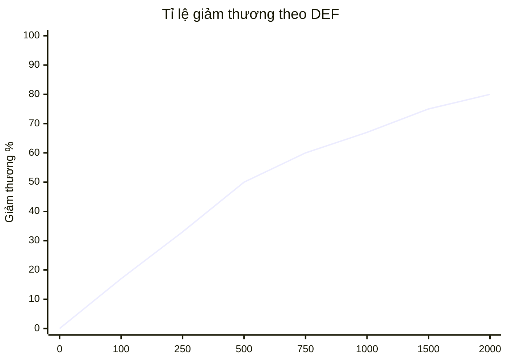

# Hệ thống chỉ số

Tài liệu này cung cấp công thức toán học, logic tăng trưởng và các giới hạn của hệ thống chỉ số nhân vật. Đây là "xương sống" để cân bằng game (balancing).

---

## 1. Phân loại chỉ số

Chỉ số được chia làm 3 nhóm chính dựa trên nguồn gốc và cách tác động.

### 1.1. Nhóm chỉ số chính (Primary stats)

Người chơi có thể dùng vàng để nâng cấp trực tiếp không giới hạn (soft cap cực cao).

| Chỉ số        | Ký hiệu | Mô tả                                        |
| :------------ | :------ | :------------------------------------------- |
| **Tấn công**  | ATK     | Sát thương đầu ra mỗi đòn đánh               |
| **Máu**       | HP      | Sức chống chịu, lượng sát thương có thể nhận |
| **Hồi máu**   | REGEN   | Khả năng sống sót bền bỉ                     |
| **Phòng thủ** | DEF     | Giảm sát thương nhận vào                     |

### 1.2. Nhóm chỉ số phụ (Secondary stats)

Chủ yếu đến từ trang bị, kỹ năng, đồng đội. Có giới hạn (hard cap) để tránh lỗi game.

| Chỉ số                             | Tác dụng                         | Hard cap       |
| :--------------------------------- | :------------------------------- | :------------- |
| **Tốc độ đánh (ASPD)**             | Số đòn đánh mỗi giây             | 5.0 đòn/giây   |
| **Tỉ lệ chí mạng (CRIT Rate)**     | Xác suất gây sát thương bạo kích | 100%           |
| **Sát thương chí mạng (CRIT Dmg)** | Hệ số nhân khi chí mạng          | Không giới hạn |
| **Xuyên giáp (Penetration)**       | Bỏ qua phòng thủ địch            | 100%           |
| **Hút máu (Lifesteal)**            | Hồi máu dựa trên sát thương      | 100%           |

### 1.3. Nhóm chỉ số ẩn (Hidden stats)

Thường không hiển thị ở màn hình nâng cấp chính.

| Chỉ số                   | Mô tả                                 |
| :----------------------- | :------------------------------------ |
| **Né tránh (Evasion)**   | Tỉ lệ né hoàn toàn sát thương         |
| **Chính xác (Accuracy)** | Đối nghịch với né tránh               |
| **Tốc độ di chuyển**     | Ít quan trọng trong game đứng im đánh |

---

## 2. Logic nâng cấp bằng vàng

Đây là cơ chế "sink" (hố chôn tiền) lớn nhất game.

### 2.1. Công thức chi phí

Giá nâng cấp tăng theo hàm mũ để đảm bảo người chơi phải farm nhiều hơn ở level cao.

```
Cost(Level) = BaseCost * (CostGrowth ^ Level)
```

Trong đó:

- **BaseCost:** Giá khởi điểm (ví dụ: 10 vàng)
- **CostGrowth:** Hệ số tăng giá (ví dụ: 1.07 = tăng 7% mỗi cấp)
- **Level:** Cấp độ hiện tại của chỉ số

### 2.2. Bảng chi phí mẫu

| Level | Chi phí (growth 1.07) | Ghi chú       |
| :---- | :-------------------- | :------------ |
| 1     | 10                    | -             |
| 10    | 18                    | -             |
| 50    | 294                   | -             |
| 100   | 8,676                 | Hiển thị 8.6K |
| 200   | 7,524,684             | Hiển thị 7.5M |
| 500   | 4,600,000,000,000     | Hiển thị 4.6T |

### 2.3. Công thức sức mạnh nhận được

Chỉ số cộng thêm thường là tuyến tính hoặc tuyến tính lũy tiến nhẹ.

```
Value(Level) = BaseValue + (Level * GrowthValue)
```

**Lý do thiết kế:** Điều này đảm bảo càng về sau, hiệu quả trên mỗi đồng vàng bỏ ra càng giảm (diminishing return), ép người chơi phải tìm các nguồn sức mạnh khác (gacha trang bị, skill).

---

## 3. Hệ thống lực chiến (Combat power)

Lực chiến là con số ảo đại diện cho sức mạnh tổng hợp, dùng để so sánh và làm điều kiện vào ải.

### 3.1. Công thức tính lực chiến

```
CP_Total = (ATK * 1.0)
         + (HP / 5)
         + (DEF * 2)
         + (CRIT_Rate * 100)
         + (ASPD * 500)
         + (CRIT_Dmg * 50)
```

### 3.2. Bảng trọng số

| Chỉ số    | Trọng số | Lý do                                 |
| :-------- | :------- | :------------------------------------ |
| ATK       | 1.0      | Baseline                              |
| HP        | 0.2      | HP nhiều nhưng ít quan trọng bằng ATK |
| DEF       | 2.0      | DEF khó tăng                          |
| CRIT Rate | 100      | 1% crit = 100 CP                      |
| ASPD      | 500      | 0.1 ASPD = 50 CP                      |
| CRIT Dmg  | 50       | 1% crit dmg = 50 CP                   |

---

## 4. Chi tiết 4 chỉ số chính

### 4.1. Tấn công (Attack)

| Thuộc tính  | Mô tả                                               |
| :---------- | :-------------------------------------------------- |
| **Icon**    | Hình kiếm                                           |
| **Màu sắc** | Đỏ                                                  |
| **Vai trò** | Chỉ số quan trọng nhất, quyết định tốc độ diệt quái |
| **Quy đổi** | 1 ATK = 1 sát thương (trước giảm trừ)               |
| **Nguồn**   | Nâng cấp vàng, trang bị vũ khí, buff đồng đội       |

### 4.2. Máu (HP)

| Thuộc tính      | Mô tả                                                                             |
| :-------------- | :-------------------------------------------------------------------------------- |
| **Icon**        | Hình trái tim                                                                     |
| **Màu sắc**     | Xanh lá                                                                           |
| **Vai trò**     | Quyết định sống chết trước boss                                                   |
| **Cơ chế chết** | Khi HP = 0, nhân vật "ngất" 5s rồi hồi sinh. Nếu đánh boss mà chết thì thua ngay. |
| **Nguồn**       | Nâng cấp vàng, trang bị áo, buff đồng đội                                         |

### 4.3. Hồi phục (HP Regen)

| Thuộc tính      | Mô tả                                      |
| :-------------- | :----------------------------------------- |
| **Icon**        | Dấu cộng xanh                              |
| **Màu sắc**     | Xanh lá nhạt                               |
| **Vai trò**     | Tự hồi máu mỗi giây                        |
| **Tick rate**   | Mỗi 0.5s hoặc 1s                           |
| **Chiến thuật** | Nếu Regen > DPS của quái thì player bất tử |

### 4.4. Phòng thủ (Defense)

| Thuộc tính    | Mô tả                                          |
| :------------ | :--------------------------------------------- |
| **Icon**      | Hình khiên                                     |
| **Màu sắc**   | Xanh dương                                     |
| **Vai trò**   | Giảm sát thương nhận vào theo %                |
| **Công thức** | DamageReduction = DEF / (DEF + 500)            |
| **Ví dụ**     | DEF 500 = giảm 50% damage; DEF 1000 = giảm 67% |

### 4.5. Biểu đồ giảm thương của DEF



---

## 5. Buff và debuff (Hiệu ứng trạng thái)

Các chỉ số có thể bị thay đổi tạm thời trong trận đấu.

### 5.1. Buff (Có lợi)

| Tên                        | Hiệu ứng                        | Thời gian    |
| :------------------------- | :------------------------------ | :----------- |
| **Tăng tốc (Haste)**       | +30% tốc độ đánh                | 5s           |
| **Cuồng nộ (Enrage)**      | +50% ATK, -20% DEF              | 5s           |
| **Khiên (Shield)**         | Tạo lớp máu ảo chịu damage thay | 10s hoặc hết |
| **Hồi máu (Regeneration)** | +5% HP hồi mỗi giây             | 5s           |

### 5.2. Debuff (Bất lợi)

| Tên                         | Hiệu ứng                     | Thời gian |
| :-------------------------- | :--------------------------- | :-------- |
| **Choáng (Stun)**           | Đứng yên không thể hành động | 1-3s      |
| **Thiêu đốt (Burn)**        | Mất 2% HP mỗi giây           | 5s        |
| **Làm chậm (Slow)**         | -30% tốc độ đánh             | 5s        |
| **Giảm giáp (Armor Break)** | -50% DEF                     | 5s        |

---

## 6. Hướng dẫn cho đội phát triển

### 6.1. Cho lập trình viên

- Tất cả calculation phải dùng float/double, round khi hiển thị
- Implement stat modifier system cho buff/debuff
- Cache calculated stats, chỉ recalculate khi có thay đổi
- Big number display: K (nghìn), M (triệu), B (tỷ), T (nghìn tỷ)

### 6.2. Cho game designer

- Điều chỉnh CostGrowth (1.05 - 1.10) để kiểm soát progression speed
- DEF constant (500) có thể điều chỉnh theo meta
- ASPD cap cần test animation để tránh visual glitch
- Soft cap cho CRIT Rate ở ~70% để Crit Dmg có giá trị

### 6.3. Balancing guidelines

| Giai đoạn         | ATK target     | HP target       | Ghi chú          |
| :---------------- | :------------- | :-------------- | :--------------- |
| Early (Lv 1-50)   | 100 - 1,000    | 500 - 5,000     | Player học game  |
| Mid (Lv 51-150)   | 1,000 - 50,000 | 5,000 - 100,000 | Main progression |
| Late (Lv 151-300) | 50,000 - 1M    | 100,000 - 10M   | Gacha dependent  |
| Endgame (300+)    | 1M+            | 10M+            | Whale territory  |
