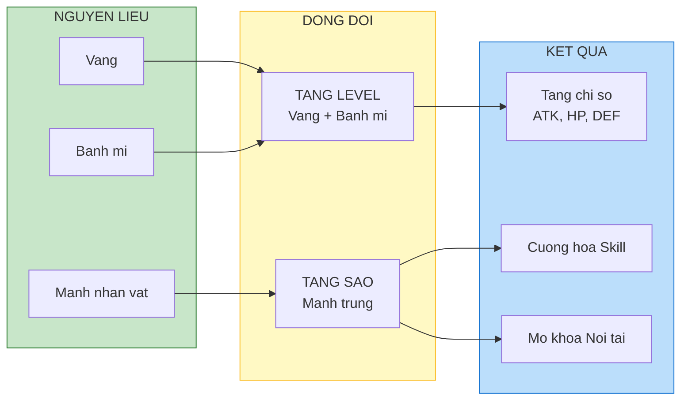

# Hệ thống đồng đội

Tài liệu này mô tả chi tiết về hệ thống nhân vật hỗ trợ (heroes/sidekicks), yếu tố "gacha" chính của game.

---

## 1. Tổng quan hệ thống

### 1.1. Thông tin cơ bản

| Thuộc tính        | Mô tả                                                         |
| :---------------- | :------------------------------------------------------------ |
| **Vai trò**       | Đồng đội là các NPC tự động chiến đấu bên cạnh nhân vật chính |
| **Số lượng slot** | Tối đa 4, mở khóa dần theo level người chơi                   |
| **Điều khiển**    | Người chơi không điều khiển trực tiếp, chỉ chọn đội hình      |

### 1.2. Mở khóa slot theo level

| Level người chơi | Slot mở khóa |
| :--------------- | :----------- |
| 1                | Slot 1       |
| 10               | Slot 2       |
| 25               | Slot 3       |
| 50               | Slot 4       |

### 1.3. Cơ chế AI đồng đội

| Hành vi           | Mô tả                                                     |
| :---------------- | :-------------------------------------------------------- |
| **Tìm mục tiêu**  | Tự động tấn công kẻ địch gần nhất trong tầm đánh          |
| **Sử dụng skill** | Tự động dùng kỹ năng khi đầy năng lượng hoặc hết cooldown |
| **Vị trí**        | Đứng theo formation đã được set, không di chuyển tự do    |

---

## 2. Phân lớp nhân vật (Classes and roles)

Dù là game casual, vẫn cần chia class để người chơi xếp đội hình chiến thuật.

| Class                | Vai trò                                             | Vị trí khuyến nghị | Icon     |
| :------------------- | :-------------------------------------------------- | :----------------- | :------- |
| **Đỡ đòn (Tanker)**  | Máu trâu, giáp cao. Thu hút sát thương, bảo kê team | Hàng trước         | Khiên    |
| **Đấu sĩ (Warrior)** | Cân bằng công thủ. Đánh cận chiến                   | Hàng trước/giữa    | Kiếm     |
| **Xạ thủ (Ranger)**  | Sát thương tầm xa. Máu giấy                         | Hàng sau           | Cung     |
| **Pháp sư (Mage)**   | Sát thương phép AOE. Máu giấy                       | Hàng sau           | Gậy phép |
| **Hỗ trợ (Support)** | Hồi máu, buff team, debuff địch                     | Hàng sau           | Tim      |

---

## 3. Hệ thống nâng cấp

### 3.1. Tăng cấp độ (Level up)

| Thuộc tính      | Mô tả                                              |
| :-------------- | :------------------------------------------------- |
| **Nguyên liệu** | Vàng + Bánh mì (Hero Exp)                          |
| **Tác dụng**    | Tăng chỉ số cơ bản (ATK, HP, DEF)                  |
| **Giới hạn**    | Level đồng đội không vượt quá level nhân vật chính |

**Bảng chi phí mẫu:**

| Level    | Vàng   | Bánh mì | Stat boost |
| :------- | :----- | :------ | :--------- |
| 1 -> 10  | 1,000  | 10      | +5% base   |
| 10 -> 20 | 5,000  | 30      | +5% base   |
| 20 -> 30 | 15,000 | 60      | +5% base   |
| 30 -> 40 | 40,000 | 100     | +5% base   |

### 3.2. Tăng sao (Star up / Evolution)

| Thuộc tính   | Mô tả                                                   |
| :----------- | :------------------------------------------------------ |
| **Cơ chế**   | Gộp (merge) các bản sao hoặc mảnh của chính nhân vật đó |
| **Tác dụng** | Tăng mạnh hệ số kỹ năng, mở khóa passive                |
| **Max sao**  | 5 sao                                                   |

**Yêu cầu mảnh:**

| Từ sao | Đến sao | Số mảnh cần |
| :----- | :------ | :---------- |
| 1      | 2       | 20 mảnh     |
| 2      | 3       | 50 mảnh     |
| 3      | 4       | 100 mảnh    |
| 4      | 5       | 200 mảnh    |

### 3.3. Sơ đồ nâng cấp

---

## 4. Danh sách nhân vật mẫu

Dàn nhân vật mang đậm bản sắc "Góc phố Việt Nam".

### 4.1. Nhóm "Lao động đường phố"

| Tên                  | Class   | Ngoại hình                              | Skill Active                                            |
| :------------------- | :------ | :-------------------------------------- | :------------------------------------------------------ |
| **Chú Ba xe ôm**     | Tanker  | Đội mũ cối, áo xanh sẫm, xe Dream cũ    | "Đón khách" - Lao xe vào giữa địch, gây choáng và taunt |
| **Cô Tư bán nước**   | Support | Đội nón lá, ngồi ghế nhựa, tay cầm quạt | "Trà chanh chém gió" - Hồi HP team, tăng hồi năng lượng |
| **Anh Bảy thợ điện** | Mage    | Đeo đai đồ nghề, cầm kìm và cuộn dây    | "Đấu nối tắt" - Chain lightning giật 3-5 địch           |

### 4.2. Nhóm "Chợ búa"

| Tên                 | Class   | Ngoại hình                         | Skill Active                                                    |
| :------------------ | :------ | :--------------------------------- | :-------------------------------------------------------------- |
| **Chị Mười bán cá** | Warrior | Đeo tạp dề cao su, cầm cá ngừ to   | "Quạt chả" - Quất cá vào mặt địch, single target damage cực lớn |
| **Thím hàng xóm**   | Ranger  | Mặc đồ bộ hoa, đeo loa phóng thanh | "Tiếng vang vô tận" - Sát thương âm thanh AOE, slow địch        |

### 4.3. Nhóm "Giang hồ xóm"

| Tên                    | Class   | Ngoại hình                             | Skill Active                                                 |
| :--------------------- | :------ | :------------------------------------- | :----------------------------------------------------------- |
| **Thanh niên xăm trổ** | Warrior | Áo ba lỗ, xăm hình rồng, cầm phóng lợn | "Phóng lợn thần tốc" - Triple strike nhanh như chớp          |
| **Ninja Lead**         | Tanker  | Áo chống nắng kín mít, xe Lead         | "Xi nhan phản diện" - Xi nhan trái rẽ phải, né tránh cực cao |

---

## 5. Thông tin kỹ năng đồng đội

### 5.1. Cấu trúc kỹ năng

Mỗi đồng đội có 2 kỹ năng:

| Loại              | Kích hoạt                          | Mô tả                             |
| :---------------- | :--------------------------------- | :-------------------------------- |
| **Skill Active**  | Tự động khi đầy năng lượng/hết CD  | Kỹ năng chủ động, hiệu ứng mạnh   |
| **Skill Passive** | Luôn kích hoạt hoặc theo điều kiện | Kỹ năng nội tại, buff thường trực |

### 5.2. Ví dụ chi tiết: Chú Ba xe ôm

| Kỹ năng             | Tên             | Mô tả                                                                                               |
| :------------------ | :-------------- | :-------------------------------------------------------------------------------------------------- |
| **Active**          | Đón khách       | Lao xe vào giữa đội hình địch, gây 150% ATK damage và choáng 2s. Taunt địch trong 3s. Cooldown 10s. |
| **Passive (3 sao)** | Mũ bảo hiểm xịn | Giảm 15% dame nhận vào. Khi HP dưới 30% tự động hồi 10% HP tối đa.                                  |

---

## 6. Hệ thống duyên phận (Resonance / Bond)

Khuyến khích người chơi sưu tập đủ bộ (gacha incentive).

### 6.1. Danh sách bộ duyên phận

| Tên bộ                    | Yêu cầu                            | Buff kích hoạt                    |
| :------------------------ | :--------------------------------- | :-------------------------------- |
| **Bộ "Hội bà tám"**       | Cô Tư bán nước + Thím hàng xóm     | +20% tốc độ đánh toàn team        |
| **Bộ "Giao thông"**       | Chú Ba xe ôm + Ninja Lead          | +15% né tránh và tốc độ di chuyển |
| **Bộ "Điện nước đầy đủ"** | Anh Bảy thợ điện + Chị Mười bán cá | +30% sát thương kỹ năng           |
| **Bộ "Chợ búa"**          | Chị Mười bán cá + Thím hàng xóm    | +15% ATK, +10% HP                 |

### 6.2. Cách kích hoạt

- Các đồng đội trong bộ cần được **sở hữu** (không nhất thiết phải deploy)
- Buff áp dụng cho **toàn bộ team** khi đã sở hữu đủ
- Có thể kích hoạt **nhiều bộ** cùng lúc nếu sở hữu đủ

---

## 7. Hướng dẫn cho đội phát triển

### 7.1. Cho lập trình viên

- Implement teammate AI với state machine (Idle, Move, Attack, Skill)
- Skill cooldown/energy system riêng cho mỗi teammate
- Formation system: lưu position trong save file
- Bond system: check on hero collection change, cache result

### 7.2. Cho họa sĩ

**Asset per character:**

| Asset     | Kích thước | Số frame    |
| :-------- | :--------- | :---------- |
| Idle      | 128x128 px | 4-6 frames  |
| Walk      | 128x128 px | 6-8 frames  |
| Attack    | 128x128 px | 4-6 frames  |
| Skill     | 128x128 px | 6-10 frames |
| Portrait  | 256x256 px | 1           |
| Full body | 512x512 px | 1           |

**Màu khung theo phẩm chất:**

| Phẩm chất      | Màu        | Mã màu  |
| :------------- | :--------- | :------ |
| B (Uncommon)   | Xanh lá    | #4CAF50 |
| A (Rare)       | Xanh dương | #2196F3 |
| S (Epic)       | Tím        | #9C27B0 |
| SS (Legendary) | Cam        | #FF9800 |

### 7.3. Cho sound designer

| Nhân vật         | Voice line (có thể) | SFX skill          |
| :--------------- | :------------------ | :----------------- |
| Chú Ba xe ôm     | "Đi đâu đấy em?"    | Tiếng xe máy rú ga |
| Cô Tư bán nước   | "Nước đi..."        | Tiếng đá lạch cạch |
| Anh Bảy thợ điện | "Đứng yên..."       | Tiếng điện giật    |
| Chị Mười bán cá  | "Này nhé!"          | Tiếng "bộp" cá đập |

### 7.4. Cho game designer

**Balancing template:**

| Class   | HP factor | ATK factor | DEF factor | ASPD factor |
| :------ | :-------- | :--------- | :--------- | :---------- |
| Tanker  | 1.5       | 0.7        | 1.3        | 0.8         |
| Warrior | 1.0       | 1.0        | 1.0        | 1.0         |
| Ranger  | 0.8       | 1.2        | 0.8        | 1.2         |
| Mage    | 0.7       | 1.3        | 0.7        | 1.0         |
| Support | 0.9       | 0.6        | 0.9        | 1.0         |
