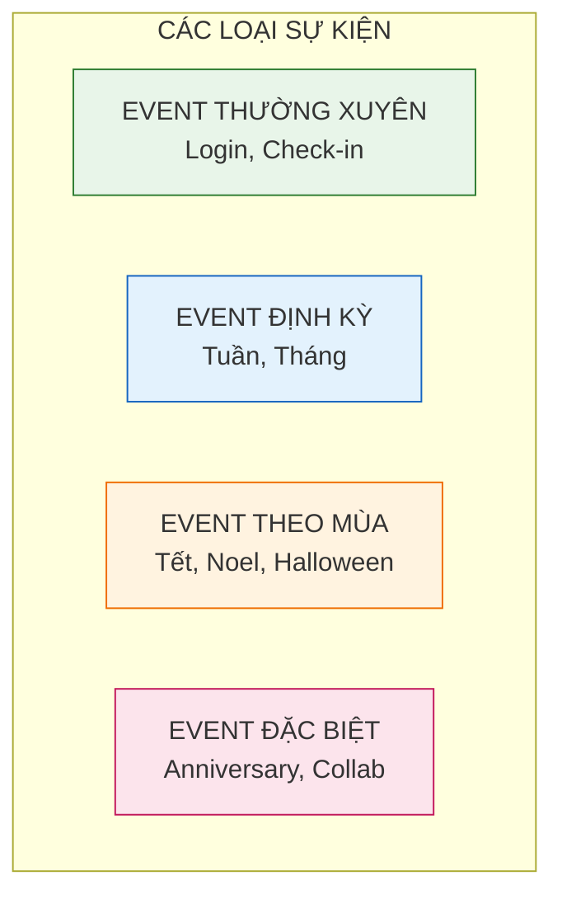

# Hệ thống Event (Sự kiện)

Tài liệu này mô tả chi tiết về hệ thống sự kiện trong game, bao gồm các loại event, cơ chế vận hành và lịch trình tổ chức.

---

## 1. Tổng quan hệ thống

### 1.1. Mục đích

| Mục đích             | Mô tả                                                      |
| :------------------- | :--------------------------------------------------------- |
| **Tăng retention**   | Tạo lý do để người chơi quay lại mỗi ngày/tuần             |
| **FOMO**             | Phần thưởng giới hạn thời gian tạo cảm giác cấp bách       |
| **Monetization**     | Gói nạp event thường có giá trị cao hơn                    |
| **Fresh content**    | Làm mới trải nghiệm mà không cần update lớn                |
| **Seasonal themes**  | Kết nối game với các dịp lễ thực tế                        |

### 1.2. Phân loại event

---

## 2. Event thường xuyên (Recurring Events)

### 2.1. Điểm danh hàng ngày (Daily Check-in)

| Thuộc tính          | Mô tả                                   |
| :------------------ | :-------------------------------------- |
| **Thời gian**       | Mỗi ngày, reset 00:00                   |
| **Cơ chế**          | Đăng nhập và bấm nhận thưởng            |
| **Đặc điểm**        | Ngày càng về sau thưởng càng tốt        |
| **Bù ngày**         | Có thể bù 1 ngày bằng 50 KC (tùy chọn)  |

**Bảng thưởng tháng mẫu:**

| Ngày  | Phần thưởng                  | Ngày  | Phần thưởng                  |
| :---- | :--------------------------- | :---- | :--------------------------- |
| 1     | 5,000 Vàng                   | 16    | 10 Chìa khóa                 |
| 2     | 10 Kim cương                 | 17    | 15 Kim cương                 |
| 3     | 3 Chìa khóa                  | 18    | 20 Bánh mì                   |
| 4     | 5 Vé Gacha                   | 19    | 10 Vé Gacha                  |
| 5     | 20 Kim cương                 | 20    | 30 Kim cương                 |
| 6     | 10,000 Vàng                  | 21    | 50,000 Vàng                  |
| 7     | **Trang bị Tím ngẫu nhiên**  | 22    | 50 Cờ lê                     |
| 8     | 15 Kim cương                 | 23    | 20 Kim cương                 |
| 9     | 10 Bánh mì                   | 24    | 15 Vé Gacha                  |
| 10    | 8 Vé Gacha                   | 25    | 50 Kim cương                 |
| 11    | 25 Kim cương                 | 26    | 100,000 Vàng                 |
| 12    | 20,000 Vàng                  | 27    | 30 Chìa khóa                 |
| 13    | 15 Chìa khóa                 | 28    | **Đồng đội Epic ngẫu nhiên** |
| 14    | **Đồng đội Rare ngẫu nhiên** | 29    | 80 Kim cương                 |
| 15    | 30 Kim cương                 | 30    | **Trang bị Cam ngẫu nhiên**  |

### 2.2. Boss thế giới hàng ngày (Daily World Boss)

| Thuộc tính          | Mô tả                                             |
| :------------------ | :------------------------------------------------ |
| **Thời gian**       | Mở 3 lần/ngày (12:00, 18:00, 21:00)               |
| **Thời lượng**      | 30 phút mỗi lần                                   |
| **Cơ chế**          | Toàn server cùng đánh 1 boss khổng lồ             |
| **Phần thưởng**     | Dựa trên damage đóng góp và ranking               |

**Bảng thưởng theo hạng:**

| Hạng      | Phần thưởng                                |
| :-------- | :----------------------------------------- |
| Top 1     | 200 KC + Rương Cam + Danh hiệu "Đệ nhất"   |
| Top 2-3   | 150 KC + Rương Tím                         |
| Top 4-10  | 100 KC + Rương Xanh dương                  |
| Top 11-50 | 50 KC + 50,000 Vàng                        |
| Top 51+   | 20 KC + 20,000 Vàng                        |
| Tham gia  | 10 KC + 10,000 Vàng (tối thiểu gây damage) |

---

## 3. Event định kỳ (Periodic Events)

### 3.1. Event tuần: Thử thách 7 ngày

| Thuộc tính      | Mô tả                                       |
| :-------------- | :------------------------------------------ |
| **Thời gian**   | Reset mỗi thứ 2                             |
| **Cơ chế**      | Hoàn thành nhiệm vụ để tích điểm           |
| **Mốc thưởng**  | 100, 300, 500, 800, 1000 điểm               |

**Danh sách nhiệm vụ tuần:**

| Nhiệm vụ              | Điểm | Yêu cầu                    |
| :-------------------- | :--- | :------------------------- |
| Đăng nhập 1 ngày      | 20   | x7 = 140 điểm              |
| Tiêu diệt 500 quái    | 30   | Có thể lặp lại             |
| Nâng cấp 50 lần       | 40   | Bất kỳ nâng cấp            |
| Quay gacha 10 lần     | 50   | Có thể lặp lại             |
| Vượt 5 ải mới         | 60   | Chỉ tính ải chưa vượt      |
| Đánh bại 3 Boss       | 50   | Boss ải hoặc World Boss    |
| Hoàn thành phó bản    | 30   | Bất kỳ phó bản             |

**Mốc thưởng:**

| Điểm | Phần thưởng                        |
| :--- | :--------------------------------- |
| 100  | 30 Kim cương + 10,000 Vàng         |
| 300  | 80 Kim cương + 10 Vé Gacha         |
| 500  | 150 Kim cương + Rương Tím          |
| 800  | 250 Kim cương + 50 Cờ lê           |
| 1000 | 500 Kim cương + **Chọn 1 trang bị Cam** |

### 3.2. Event tháng: Bảng xếp hạng (Monthly Leaderboard)

| Thuộc tính      | Mô tả                                  |
| :-------------- | :------------------------------------- |
| **Thời gian**   | Từ ngày 1 đến ngày cuối tháng          |
| **Cơ chế**      | Xếp hạng theo nhiều tiêu chí           |
| **Phần thưởng** | Kết thúc tháng mới phát thưởng         |

**Các bảng xếp hạng:**

| Bảng             | Tiêu chí                  | Top 1 thưởng                    |
| :--------------- | :------------------------ | :------------------------------ |
| **Lực chiến**    | Lực chiến cao nhất        | 1000 KC + Khung avatar vàng     |
| **Ải cao nhất**  | Ải cao nhất đạt được      | 800 KC + Danh hiệu "Chinh phục" |
| **Gacha King**   | Số lần quay gacha         | 500 KC + 20 Vé Gacha            |
| **AFK Master**   | Tổng vàng AFK thu được    | 500 KC + Khung avatar xanh      |

---

## 4. Event theo mùa (Seasonal Events)

### 4.1. Lịch event năm

| Thời gian         | Event                    | Theme                        |
| :---------------- | :----------------------- | :--------------------------- |
| **1-14/1**        | Tết Dương lịch           | Pháo hoa, countdown          |
| **15/1 - 15/2**   | Tết Nguyên Đán           | Lì xì, mai đào               |
| **14/2**          | Valentine                | Trái tim, tình yêu           |
| **8/3**           | Quốc tế Phụ nữ           | Hoa, tặng quà                |
| **30/4 - 1/5**    | Lễ 30/4 & Quốc tế LĐ     | Cờ đỏ, lao động              |
| **1/6**           | Quốc tế Thiếu nhi        | Kẹo, bóng bay                |
| **Tháng 8**       | Vu Lan                   | Hoa hồng, tri ân             |
| **2/9**           | Quốc Khánh               | Cờ Việt Nam                  |
| **Tháng 9**       | Trung Thu                | Lồng đèn, bánh trung thu     |
| **31/10**         | Halloween                | Bí ngô, ma quỷ               |
| **20/11**         | Nhà giáo Việt Nam        | Hoa, phấn trắng              |
| **25/12**         | Giáng Sinh               | Ông già Noel, tuyết          |
| **Ngày kỷ niệm**  | Anniversary              | Sinh nhật game               |

### 4.2. Chi tiết event Tết Nguyên Đán (Mẫu)

**Thời gian:** 15/01 - 15/02 (30 ngày)

**Các hoạt động:**

#### A. Lì xì may mắn
| Thuộc tính    | Mô tả                                        |
| :------------ | :------------------------------------------- |
| **Cơ chế**    | Mỗi ngày nhận 1 bao lì xì miễn phí           |
| **Nội dung**  | Random: Vàng, KC, Vé, Mảnh đồng đội Tết      |
| **Mua thêm**  | 50 KC = 1 bao, 200 KC = 5 bao                |

#### B. Banner giới hạn Tết
| Thuộc tính     | Mô tả                                       |
| :------------- | :------------------------------------------ |
| **Đồng đội**   | "Ông Đồ" (Legendary Support) - Chỉ có trong event |
| **Trang bị**   | Set "Áo dài đỏ" - Bonus HP và Gold          |
| **Tỉ lệ UP**   | Rate up x2 cho item event                   |

#### C. Nhiệm vụ Tết
| Nhiệm vụ               | Phần thưởng                |
| :--------------------- | :------------------------- |
| Đăng nhập 7 ngày Tết   | 100 Pháo hoa (event currency) |
| Quay gacha Tết 30 lần  | 200 Pháo hoa              |
| Vượt 20 ải trong event | 150 Pháo hoa              |
| Tiêu diệt 10,000 quái  | 100 Pháo hoa              |
| Đánh bại Boss Tết      | 300 Pháo hoa              |

#### D. Shop Tết (Event currency)
| Vật phẩm                   | Giá (Pháo hoa) | Giới hạn |
| :------------------------- | :------------- | :------- |
| Mảnh "Ông Đồ" x10          | 100            | 5        |
| Trang bị Cam ngẫu nhiên    | 200            | 3        |
| Skin Tết cho nhân vật      | 500            | 1        |
| Khung avatar Tết           | 300            | 1        |
| 100 Kim cương              | 80             | 10       |
| 10 Vé Gacha                | 50             | 20       |

---

## 5. Event đặc biệt (Special Events)

### 5.1. Anniversary Event (Sinh nhật game)

| Thuộc tính      | Mô tả                                       |
| :-------------- | :------------------------------------------ |
| **Thời gian**   | 14 ngày                                     |
| **Đặc điểm**    | Event lớn nhất năm, thưởng khủng            |

**Các hoạt động:**

1. **Login Bonus x3:** Thưởng check-in nhân 3
2. **Free 10-pull:** 1 lần quay 10 miễn phí/ngày
3. **Anniversary Banner:** Đồng đội Mythic đầu tiên
4. **Minigame:** Quay số trúng thưởng
5. **Community Event:** Milestone toàn server

### 5.2. Collaboration Event

| Thuộc tính      | Mô tả                                       |
| :-------------- | :------------------------------------------ |
| **Đối tác**     | IP nổi tiếng (anime, game khác, KOL...)     |
| **Nội dung**    | Skin, nhân vật, trang bị collab             |
| **Lưu ý**       | Cần license, không thể rerun                |

---

## 6. Hệ thống tiền tệ Event

### 6.1. Nguyên tắc

| Nguyên tắc          | Mô tả                                           |
| :------------------ | :---------------------------------------------- |
| **Riêng biệt**      | Mỗi event có currency riêng, không dùng chung   |
| **Hết hạn**         | Currency hết hạn sau event, đổi thành vàng      |
| **Không mua trực tiếp** | Chỉ kiếm qua hoạt động event               |

### 6.2. Tỉ lệ đổi sau event

Khi event kết thúc, currency dư sẽ tự động đổi:
- 1 Event Currency = 100 Vàng

---

## 7. Hướng dẫn cho đội phát triển

### 7.1. Cho lập trình viên

- Event config nên dạng JSON/ScriptableObject để dễ update
- Implement event timer với timezone handling
- Cache event data, không query server liên tục
- Có fallback nếu event data lỗi
- Log tất cả event transactions

### 7.2. Cho game designer

- Balance event rewards không được vượt quá 30% monthly income
- Event banner rate không được thấp hơn normal banner
- Đảm bảo F2P có thể lấy được main event reward
- Test progression của cả whale và F2P

### 7.3. Cho UI designer

- Mỗi event cần banner image riêng (1920x1080)
- Popup event khi login lần đầu trong ngày
- Timer countdown hiển thị rõ ràng
- Event icon có animation để thu hút
- Màu sắc theo theme event

### 7.4. Cho họa sĩ

- Asset event: Background, Icon, Frame
- Skin event cho nhân vật (nếu có)
- Loading screen event
- Event currency icon

### 7.5. Cho sound designer

- BGM event (1-2 track)
- SFX đặc trưng event
- Voice line event (optional)
