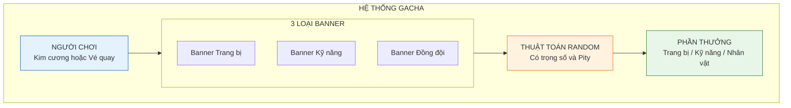
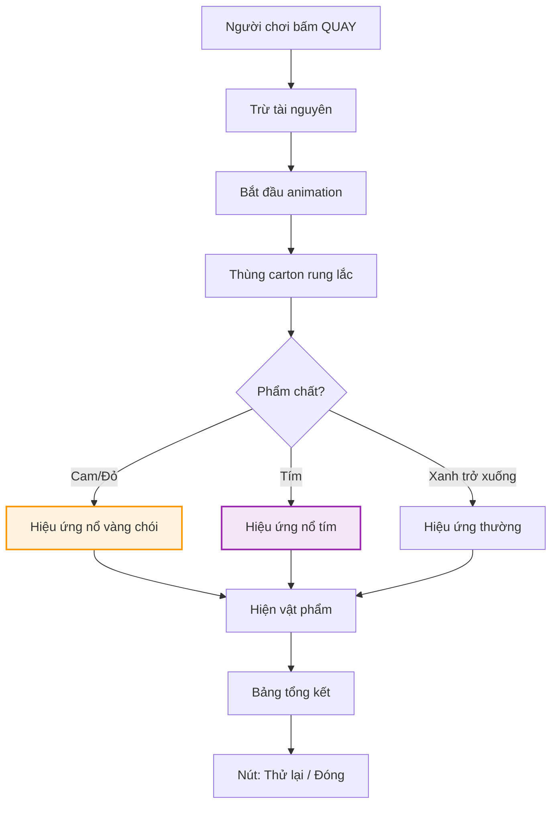

# Hệ thống gacha

Tài liệu này mô tả chi tiết cơ chế quay thưởng ngẫu nhiên (gacha), tính năng kiếm tiền (monetization) quan trọng nhất của game.

---

## 1. Tổng quan và vai trò

### 1.1. Thông tin cơ bản

| Thuộc tính     | Mô tả                                                           |
| :------------- | :-------------------------------------------------------------- |
| **Vị trí**     | Tab thứ 5 trên thanh điều hướng                                 |
| **Mục tiêu**   | Cung cấp vật phẩm cao cấp mà farm thông thường rất khó đạt được |
| **Nguyên tắc** | Tạo cảm giác hồi hộp và thỏa mãn khi ra đồ xịn                  |

### 1.2. Sơ đồ tổng quan



---

## 2. Các loại banner

Hệ thống chia làm 3 bể quay riêng biệt để người chơi tập trung tài nguyên vào thứ mình cần.

### 2.1. Banner trang bị (Equipment gacha)

| Thuộc tính      | Mô tả                                                       |
| :-------------- | :---------------------------------------------------------- |
| **Phần thưởng** | Vũ khí, áo, giày, dây chuyền các phẩm chất                  |
| **Điểm nhấn**   | Cơ hội nhận trang bị huyền thoại (cam) hoặc thần thoại (đỏ) |
| **Tài nguyên**  | Kim cương                                                   |

### 2.2. Banner kỹ năng (Skill gacha)

| Thuộc tính      | Mô tả                                     |
| :-------------- | :---------------------------------------- |
| **Phần thưởng** | Mảnh kỹ năng hoặc sách kỹ năng nguyên vẹn |
| **Điểm nhấn**   | Giúp nâng cấp level kỹ năng nhanh chóng   |
| **Tài nguyên**  | Kim cương hoặc vé kỹ năng                 |

### 2.3. Banner đồng đội (Teammate gacha)

| Thuộc tính      | Mô tả                                            |
| :-------------- | :----------------------------------------------- |
| **Phần thưởng** | Mảnh nhân vật hoặc nhân vật hoàn chỉnh           |
| **Điểm nhấn**   | Banner quan trọng nhất, nơi sưu tập các "anh em" |
| **Tài nguyên**  | Kim cương hoặc vé tuyển mộ                       |

---

## 3. Cơ chế lượt quay và giá cả

### 3.1. Bảng giá

| Loại quay         | Giá             | Ghi chú                             |
| :---------------- | :-------------- | :---------------------------------- |
| **Quay don (x1)** | 300 kim cương   | Miễn phí 1 lần/ngày (xem quảng cáo) |
| **Quay 10 (x10)** | 2,700 kim cương | Giảm 10%, đảm bảo 1 món tím+        |

### 3.2. Logic xử lý (cho developer)

```
function rollGacha(bannerType, count):
    results = []
    for i = 1 to count:
        pityCounter += 1

        if pityCounter >= HARD_PITY:
            result = guaranteedRare()
            pityCounter = 0
        else if pityCounter >= SOFT_PITY:
            result = rollWithBoostedRate()
        else:
            result = normalRoll()

        if result.rarity >= LEGENDARY:
            pityCounter = 0

        results.push(result)

    return results
```

---

## 4. Tỉ lệ rơi và cơ chế bảo hiểm

### 4.1. Bảng tỉ lệ

| Phẩm chất              | Trang bị | Kỹ năng | Đồng đội      |
| :--------------------- | :------- | :------ | :------------ |
| **Trắng (Common)**     | 50%      | 40%     | -             |
| **Xanh lá (Uncommon)** | 30%      | 30%     | 60% (mảnh)    |
| **Xanh dương (Rare)**  | 15%      | 20%     | 30% (hạng B)  |
| **Tím (Epic)**         | 4%       | 8%      | 8.5% (hạng A) |
| **Cam (Legendary)**    | 0.9%     | 1.9%    | 1.5% (hạng S) |
| **Đỏ (Mythic)**        | 0.1%     | 0.1%    | -             |

### 4.2. Cơ chế bảo hiểm (Pity system)

| Loại          | Mô tả                                            |
| :------------ | :----------------------------------------------- |
| **Soft pity** | Từ lượt 50 trở đi, tỉ lệ ra cam tăng 2% mỗi lượt |
| **Hard pity** | Chắc chắn ra cam tại lượt thứ 80                 |
| **Reset**     | Khi ra cam, bộ đếm pity về 0                     |

---

## 5. Quy trình và hiệu ứng visual

### 5.1. Flow animation



### 5.2. Mô tả animation "Thùng carton bí ẩn"

| Giai đoạn    | Mô tả hình ảnh                          | Thời gian |
| :----------- | :-------------------------------------- | :-------- |
| **Chuẩn bị** | Thùng carton dán băng dính xuất hiện    | 0.5s      |
| **Rung lắc** | Thùng rung, ánh sáng tóe ra từ khe      | 1.5s      |
| **Mở nắp**   | Băng dính bung, cột sáng chiếu lên trời | 1s        |
| **Hiện đồ**  | Vật phẩm bay ra, xoay 360 độ            | 1s        |
| **Kết thúc** | Hiện bảng kết quả                       | 0.5s      |

### 5.3. Phân biệt phẩm chất qua hiệu ứng

| Phẩm chất          | Màu ánh sáng | Âm thanh                  | Hiệu ứng thêm           |
| :----------------- | :----------- | :------------------------ | :---------------------- |
| **Đỏ/Cam**         | Vàng chói    | Tiếng fanfare hoành tráng | Rung màn hình, confetti |
| **Tím**            | Tím nhẹ      | Tiếng ding vừa            | Sparkle nhẹ             |
| **Xanh trở xuống** | Xanh/Trắng   | Tiếng pop nhẹ             | Không có                |

---

## 6. Cửa hàng tích lũy (Mileage shop)

Mỗi lần quay (dù ra đồ rác) đều tặng điểm tích lũy.

### 6.1. Quy đổi điểm

| Hành động | Điểm nhận |
| :-------- | :-------- |
| Quay x1   | 1 điểm    |
| Quay x10  | 10 điểm   |

### 6.2. Hàng hóa trong shop

| Vật phẩm              | Giá (điểm) | Ghi chú              |
| :-------------------- | :--------- | :------------------- |
| Mảnh tướng S chọn lọc | 500        | Chọn 1 trong 3 tướng |
| Vũ khí cam ngẫu nhiên | 300        | Random loại          |
| Đá tẩy luyện x5       | 100        | -                    |
| Cờ lê x100            | 50         | -                    |

**Nguyên tắc:** Không có lượt quay nào là lãng phí.

---

## 7. Hướng dẫn cho đội phát triển

### 7.1. Cho lập trình viên

- Implement weighted random với seed có thể reproduce (để debug)
- Lưu pity counter vào save file, đồng bộ với server nếu có
- Animation có thể skip sau 0.5s (nút Skip)
- Log mọi kết quả gacha để phân tích

### 7.2. Cho họa sĩ

- Asset thùng carton: 3 trạng thái (đóng, rung, mở)
- Hiệu ứng ánh sáng: 3 màu (vàng, tím, xanh)
- Particle cho confetti: Nhiều màu, bay random
- Banner image: 1920x1080, có thể crop cho mobile

### 7.3. Cho sound designer

- Nhạc nền gacha: Hồi hộp, tempo nhanh dần
- SFX mở thùng: Tiếng xé băng dính + tiếng bung
- SFX theo phẩm chất: 3 level (epic, normal, common)
- Fanfare cho đồ cam: 3-5 giây, hoành tráng
