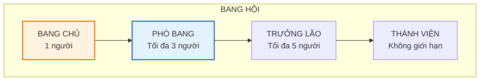
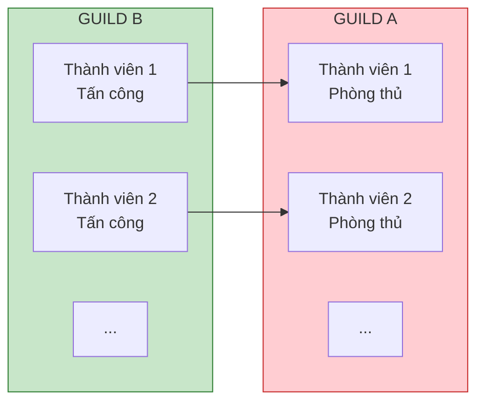

# Hệ thống Guild (Bang hội)

Tài liệu này mô tả chi tiết về hệ thống Guild - nơi người chơi tập hợp thành nhóm để cùng nhau chiến đấu và nhận thưởng.

---

## 1. Tổng quan hệ thống

### 1.1. Thông tin cơ bản

| Thuộc tính     | Mô tả                                    |
| :------------- | :--------------------------------------- |
| **Tên gọi**    | Bang Hội Khu Phố                         |
| **Mở khóa**    | Đạt Level 15                             |
| **Số thành viên** | Tối đa 30 người                       |
| **Phí tạo**    | 500 Kim cương                            |

### 1.2. Cấu trúc Guild

---

## 2. Quản lý Guild

### 2.1. Quyền hạn theo chức vụ

| Chức vụ        | Mời thành viên | Đuổi thành viên | Phân quyền | Giải tán | Cài đặt Guild |
| :------------- | :------------- | :-------------- | :--------- | :------- | :------------ |
| **Bang chủ**   | Co             | Co              | Co         | Co       | Co            |
| **Phó bang**   | Co             | Co (trừ Elder+) | Không      | Không    | Co            |
| **Trưởng lão** | Co             | Không           | Không      | Không    | Không         |
| **Thành viên** | Không          | Không           | Không      | Không    | Không         |

### 2.2. Điều kiện gia nhập

| Loại           | Mô tả                                  |
| :------------- | :------------------------------------- |
| **Mở**         | Ai cũng có thể vào                     |
| **Xét duyệt**  | Cần được Elder+ phê duyệt              |
| **Đóng**       | Chỉ mời mới vào được                   |
| **Level yêu cầu** | Tùy chỉnh: Level tối thiểu để xin vào |

---

## 3. Hoạt động Guild

### 3.1. Check-in hàng ngày

| Thuộc tính     | Mô tả                                |
| :------------- | :----------------------------------- |
| **Hành động**  | Bấm nút check-in mỗi ngày            |
| **Cá nhân**    | Nhận 50 Guild Coin + 5 Exp Guild     |
| **Tập thể**    | Mỗi người check-in tăng quỹ Guild    |

### 3.2. Quyên góp (Donation)

Thành viên có thể quyên góp tài nguyên để nhận Guild Coin:

| Quyên góp           | Guild Coin nhận | Exp Guild |
| :------------------ | :-------------- | :-------- |
| 10,000 Vàng         | 10              | 5         |
| 50,000 Vàng         | 55              | 25        |
| 100,000 Vàng        | 120             | 50        |
| 10 Kim cương        | 50              | 30        |
| 50 Kim cương        | 280             | 150       |

*Giới hạn: 3 lần quyên góp/ngày*

### 3.3. Guild Boss

| Thuộc tính     | Mô tả                                           |
| :------------- | :---------------------------------------------- |
| **Mở khóa**    | Guild Level 2                                   |
| **Thời gian**  | Mở mỗi ngày, reset 05:00                        |
| **Cơ chế**     | Cả guild cùng đánh 1 boss khổng lồ              |
| **Lượt đánh**  | Mỗi người 3 lượt/ngày                           |

**Danh sách Guild Boss:**

| Boss               | HP Base    | Mở khóa     | Phần thưởng đặc biệt     |
| :----------------- | :--------- | :---------- | :----------------------- |
| **Trùm bảo kê**    | 10 triệu   | Guild Lv 2  | Mảnh đồng đội Rare       |
| **Đại gia ngầm**   | 50 triệu   | Guild Lv 5  | Mảnh đồng đội Epic       |
| **Ông trùm casino** | 200 triệu | Guild Lv 10 | Mảnh đồng đội Legendary  |
| **Chủ tịch tập đoàn** | 1 tỷ    | Guild Lv 15 | Trang bị Mythic          |

**Thưởng theo damage đóng góp:**

| Hạng trong Guild | Guild Coin | Vàng      | Bonus                |
| :--------------- | :--------- | :-------- | :------------------- |
| Top 1            | 200        | 100,000   | Mảnh tướng x10       |
| Top 2-3          | 150        | 75,000    | Mảnh tướng x7        |
| Top 4-10         | 100        | 50,000    | Mảnh tướng x5        |
| Còn lại          | 50         | 25,000    | Mảnh tướng x3        |

---

## 4. Guild War (Chiến tranh Bang hội)

### 4.1. Thời gian

| Giai đoạn        | Thời gian              | Mô tả                    |
| :--------------- | :--------------------- | :----------------------- |
| **Đăng ký**      | Thứ 2 - Thứ 3          | Guild đăng ký tham chiến |
| **Chuẩn bị**     | Thứ 4                  | Set đội hình phòng thủ   |
| **Chiến đấu**    | Thứ 5 - Thứ 6          | Giai đoạn chính          |
| **Kết thúc**     | Thứ 7                  | Tính điểm, phát thưởng   |

### 4.2. Cơ chế chiến đấu

| Quy tắc           | Mô tả                                          |
| :---------------- | :--------------------------------------------- |
| **Lượt tấn công** | Mỗi người 3 lượt/ngày chiến đấu                |
| **Mục tiêu**      | Đánh vào đội phòng thủ của đối phương          |
| **Điểm**          | +3 điểm/thắng, -1 điểm/thua                    |
| **Chiến thắng**   | Guild có tổng điểm cao hơn thắng               |

### 4.3. Phần thưởng Guild War

| Kết quả  | Phần thưởng cá nhân     | Phần thưởng Guild       |
| :------- | :---------------------- | :---------------------- |
| **Thắng** | 200 Guild Coin + 100 KC | +500 Guild Exp          |
| **Hòa** | 100 Guild Coin + 50 KC  | +200 Guild Exp          |
| **Thua** | 50 Guild Coin + 20 KC   | +100 Guild Exp          |

---

## 5. Guild Level và Perks

### 5.1. Bảng cấp độ Guild

| Level | Exp cần     | Số thành viên | Perks mở khóa                    |
| :---- | :---------- | :------------ | :------------------------------- |
| 1     | 0           | 20            | Cơ bản                           |
| 2     | 1,000       | 22            | Guild Boss                       |
| 3     | 3,000       | 24            | +5% Gold toàn guild              |
| 4     | 6,000       | 26            | +5% Exp toàn guild               |
| 5     | 10,000      | 28            | Guild War                        |
| 6     | 15,000      | 30            | +10% Gold                        |
| 7     | 22,000      | 30            | +10% Exp                         |
| 8     | 30,000      | 30            | +5% ATK toàn guild               |
| 9     | 40,000      | 30            | +5% HP toàn guild                |
| 10    | 55,000      | 30            | Guild Boss tier 2                |
| 15    | 150,000     | 30            | +15% Gold, +15% Exp, Guild Boss tier 3 |
| 20    | 400,000     | 30            | Max perks + Exclusive skin       |

### 5.2. Guild Perks (Buff cố định)

| Perk              | Hiệu ứng          | Mở khóa   |
| :---------------- | :---------------- | :-------- |
| **Tài lộc**       | +Gold%            | Level 3   |
| **Học vấn**       | +Exp%             | Level 4   |
| **Sức mạnh**      | +ATK%             | Level 8   |
| **Thể lực**       | +HP%              | Level 9   |
| **May mắn**       | +Drop Rate%       | Level 12  |
| **Chiến đấu**     | +Crit Rate%       | Level 15  |

---

## 6. Guild Shop

| Vật phẩm                  | Giá (Guild Coin) | Giới hạn    |
| :------------------------ | :--------------- | :---------- |
| Mảnh đồng đội Rare (chọn) | 50               | 10/tuần     |
| Mảnh đồng đội Epic (chọn) | 150              | 5/tuần      |
| Trang bị Tím ngẫu nhiên   | 200              | 5/tuần      |
| Trang bị Cam ngẫu nhiên   | 500              | 2/tuần      |
| 50 Kim cương              | 300              | 3/tuần      |
| 10 Vé Gacha               | 200              | 5/tuần      |
| Bánh mì x50               | 100              | Không giới hạn |
| Cờ lê x50                 | 100              | Không giới hạn |
| Guild Exclusive Skin      | 5000             | 1           |

---

## 7. Hướng dẫn cho đội phát triển

### 7.1. Cho lập trình viên

- Guild data lưu trên server
- Real-time update cho Guild Boss damage
- Notification system cho Guild events
- Audit log cho các hành động quản trị

### 7.2. Cho game designer

- Balance Guild perks không được quá mạnh so với solo
- Guild War matchmaking dựa trên Guild Level
- Đảm bảo small guild vẫn có thể tham gia Guild Boss

### 7.3. Cho UI designer

- Guild chat interface
- Member list với filter/sort
- Guild Boss HP bar real-time
- War map visualization
