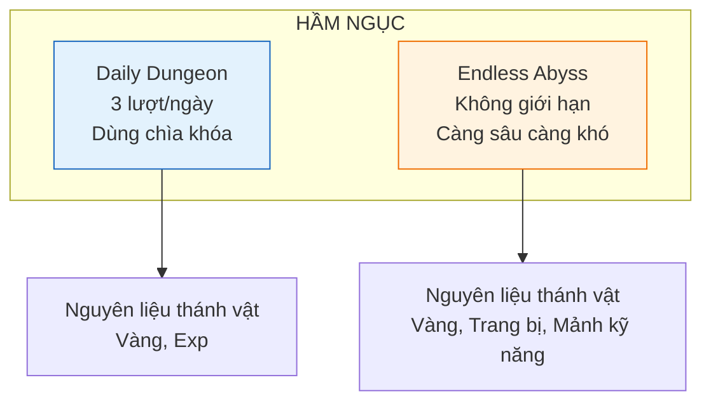

# Hệ thống hầm ngục

Tài liệu này mô tả hệ thống hầm ngục (dungeon) bao gồm daily dungeon và endless dungeon, nơi người chơi farm nguyên liệu đặc biệt để mở khóa thánh vật.

---

## 1. Tổng quan

### 1.1. Mục đích

| Mục đích | Mô tả |
| :------- | :---- |
| **Farm nguyên liệu** | Cung cấp tài nguyên đặc biệt để mở khóa và nâng cấp thánh vật |
| **Thử thách bổ sung** | Nội dung PvE ngoài luồng campaign chính |
| **Đa dạng hóa loot** | Tạo thêm mục tiêu daily cho người chơi |

### 1.2. Phân loại

---

## 2. Daily Dungeon

Hầm ngục hàng ngày có giới hạn lượt, drop nguyên liệu chính để mở khóa thánh vật.

### 2.1. Thông tin cơ bản

| Thuộc tính | Giá trị |
| :--------- | :------ |
| **Số lượt/ngày** | 3 lượt (có thể mua thêm bằng kim cương) |
| **Reset** | 00:00 hàng ngày |
| **Chìa khóa** | Cần 1 chìa khóa hầm ngục / lượt |
| **Độ khó** | Cố định theo cấp độ người chơi |

### 2.2. Các loại daily dungeon

| Dungeon | Nguyên liệu drop | Phụ |
| :------ | :-------------- | :-- |
| **Thánh điện** | Mảnh thánh vật (chính) | Vàng, kim cương (tỉ lệ thấp) |
| **Tháp cổ** | Búa tàn tích | Exp, trang bị |
| **Rương phong ấn** | Nguyên liệu thánh vật tổng hợp | Cờ lê, vé gacha |

### 2.3. Phần thưởng theo độ khó

| Cấp độ người chơi | Số lượng mảnh thánh vật | Vàng nhận được |
| :---------------- | :---------------------- | :------------- |
| 1-50 | 1-3 | 5,000 - 20,000 |
| 51-150 | 3-8 | 20,000 - 100,000 |
| 151-300 | 8-15 | 100,000 - 500,000 |
| 300+ | 15-30 | 500,000 - 2,000,000 |

---

## 3. Endless Abyss (Vực thẳm vô tận)

Hầm ngục không giới hạn lượt, càng xuống sâu càng khó và phần thưởng càng lớn.

### 3.1. Cơ chế

| Thuộc tính | Mô tả |
| :--------- | :---- |
| **Lối chơi** | Tự động chiến đấu qua từng tầng, mỗi tầng là một wave quái + boss nhỏ |
| **Số lượt** | Không giới hạn, tốn thể lực (nếu có hệ thống thể lực) hoặc vào tự do |
| **Độ khó** | Tăng dần theo số tầng: chỉ số quái x1.1 mỗi tầng |
| **Checkpoint** | Cứ 10 tầng có checkpoint, boss lớn |
| **Reset** | Không reset — tiến trình vĩnh viễn |

### 3.2. Phần thưởng theo tầng

| Tầng | Nguyên liệu thánh vật | Drop đặc biệt |
| :--- | :-------------------- | :------------ |
| 1-10 | 1-2 | Trang bị xanh dương+ |
| 11-30 | 2-5 | Trang bị tím+ |
| 31-60 | 5-10 | Trang bị cam+ |
| 61-100 | 10-20 | Mảnh thánh vật cam+ |
| 100+ | 20+ | Nguyên liệu mythic |

### 3.3. Tính năng đặc biệt

| Tính năng | Mô tả |
| :-------- | :---- |
| **Auto-sweep** | Sau khi vượt qua tầng, có thể auto-sweep các tầng đã qua |
| **Cường hóa tầng** | Mỗi checkpoint (10 tầng) cho buff chọn 1 trong 3 (tăng ATK/HP/ASPD cho trận đó) |
| **Bảng xếp hạng** | Top người chơi xuống sâu nhất, nhận thưởng cuối kỳ |

---

## 4. Tài nguyên liên quan

### 4.1. Nguyên liệu thánh vật

| Vật phẩm | Mô tả | Nguồn |
| :------- | :---- | :---- |
| **Mảnh thánh vật** | Nguyên liệu cơ bản để mở khóa thánh vật | Daily dungeon, Endless abyss |
| **Búa tàn tích** | Dùng trong mini-game Tàn tích (đập bình) | Daily dungeon, shop |
| **Tinh hoa thánh vật** | Nguyên liệu cao cấp, dùng để nâng phẩm chất thánh vật | Endless abyss (tầng sâu), phân giải thánh vật |

### 4.2. Chìa khóa hầm ngục

| Thuộc tính | Mô tả |
| :--------- | :---- |
| **Cách nhận** | Hồi phục 1 cái mỗi 6 tiếng (tối đa 3), nhiệm vụ, event, shop |
| **Công dụng** | Vào daily dungeon |
| **Tối đa** | 10 cái (có thể tích trữ) |

---

## 5. Giao diện

### 5.1. Màn hình chọn dungeon

| Khu vực | Nội dung |
| :------ | :------- |
| **Header** | Tiêu đề "Hầm ngục" + số lượt daily còn lại |
| **Daily dungeon card** | Icon, tên, mô tả phần thưởng, nút "Vào" (xám nếu hết lượt) |
| **Endless card** | Icon abyss, tầng cao nhất đã đạt, nút "Tiếp tục" |
| **Footer** | Nút mua thêm lượt (kim cương) |

### 5.2. Popup kết quả

| Thành phần | Mô tả |
| :--------- | :---- |
| **Phần thưởng nhận được** | Danh sách vật phẩm, hiệu ứng glow cho item hiếm |
| **Nút "Lặp lại"** | Vào lại dungeon (nếu còn lượt) |
| **Nút "Rời đi"** | Quay lại màn hình chính |

---

## 6. Hướng dẫn cho đội phát triển

### 6.1. Cho lập trình viên

- Daily dungeon: reset theo server time, lưu số lượt đã dùng vào save
- Endless abyss: lưu tầng cao nhất đã đạt, cho phép auto-sweep các tầng đã qua
- Endless enemy scaling: `stat_multiplier = 1 + (floor * 0.1)`
- Checkpoint buff: chọn 1 trong 3 buff ngẫu nhiên, kéo dài cho đến khi thoát

### 6.2. Cho game designer

- Daily dungeon drop rate: đảm bảo sau 7 ngày farm có thể mở khóa 1 thánh vật Common
- Endless difficulty: người chơi trung bình nên đạt tầng 30-50 sau 1 tuần chơi
- Auto-sweep không cần chiến đấu, tính toán loot dựa trên tile đã đạt
