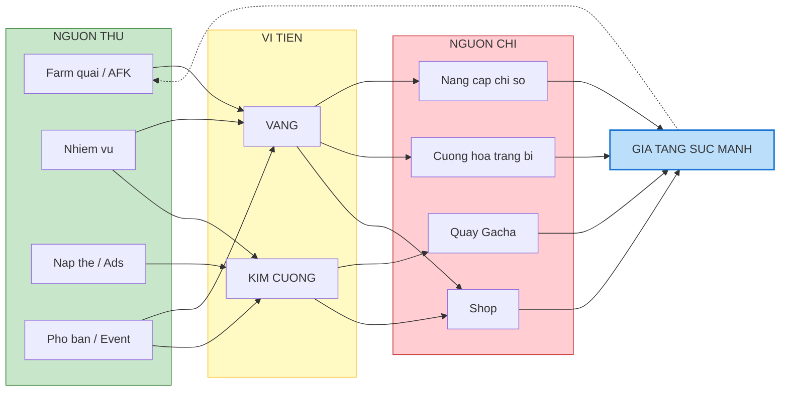

# Hệ thống kinh tế và tài nguyên

Tài liệu này mô tả chi tiết dòng chảy của tài nguyên trong game, bao gồm cách người chơi kiếm được và tiêu xài chúng. Một hệ thống kinh tế cân bằng là chìa khóa để giữ chân người chơi lâu dài.

---

## 1. Tiền tệ chính (Primary currencies)

Game sử dụng mô hình "Dual Currency" (hai loại tiền tệ): vàng (soft currency) và kim cương (hard currency).

### 1.1. Vàng (Gold)

| Thuộc tính     | Mô tả                                                    |
| :------------- | :------------------------------------------------------- |
| **Vai trò**    | Đơn vị tiêu dùng cốt lõi để nâng cấp sức mạnh nền tảng   |
| **Đặc điểm**   | Dễ kiếm nhưng nhu cầu sử dụng tăng rất nhanh theo cấp độ |
| **Icon**       | Đồng xu vàng                                             |
| **Màu sắc UI** | Vàng #FFC107                                             |

**Nguồn kiếm (Inflow):**

| Nguồn            | Lượng                | Giới hạn       |
| :--------------- | :------------------- | :------------- |
| Farm quái thường | 10-1000/con (tùy ải) | Không giới hạn |
| AFK tích lũy     | Theo công thức       | 8-12 tiếng     |
| Bán trang bị     | 10-50% giá trị       | Không giới hạn |
| Phó bản vàng     | 10,000-100,000/lượt  | 3 lượt/ngày    |
| Heo đất (Daily)  | 5,000-50,000         | Mỗi 4 tiếng    |

**Nguồn tiêu (Outflow):**

| Nguồn tiêu        | Chi phí            |
| :---------------- | :----------------- |
| Nâng cấp chỉ số   | Scaling theo level |
| Nâng cấp trang bị | 100-10,000/level   |
| Shop tạp hóa      | Giá cố định        |
| Nâng cấp đồng đội | 500-50,000/level   |

### 1.2. Kim cương (Diamond)

| Thuộc tính     | Mô tả                                                           |
| :------------- | :-------------------------------------------------------------- |
| **Vai trò**    | Đơn vị kích cầu, tạo doanh thu (monetization)                   |
| **Đặc điểm**   | Có giá trị cao, dùng để mua sự may mắn hoặc tiết kiệm thời gian |
| **Icon**       | Viên kim cương xanh                                             |
| **Màu sắc UI** | Xanh dương #2196F3                                              |

**Nguồn kiếm (Inflow):**

| Nguồn           | Lượng              | Giới hạn       |
| :-------------- | :----------------- | :------------- |
| Vượt ải lần đầu | 10-50/ải           | 1 lần/ải       |
| Nhiệm vụ ngày   | 50-100/ngày        | Reset 00:00    |
| Nhiệm vụ tuần   | 200-500/tuần       | Reset thứ 2    |
| Thành tựu       | 10-500/achievement | 1 lần          |
| Xem quảng cáo   | 10-30              | 5 lần/ngày     |
| Nạp thẻ (IAP)   | Theo gói           | Không giới hạn |

**Nguồn tiêu (Outflow):**

| Nguồn tiêu       | Chi phí         |
| :--------------- | :-------------- |
| Gacha x1         | 300 kim cương   |
| Gacha x10        | 2,700 kim cương |
| Mua lượt phó bản | 50/lượt         |
| Tăng tốc AFK     | 100 = 2 tiếng   |
| Làm mới shop     | 50              |

---

## 2. Bản đồ dòng chảy kinh tế

---

## 3. Các tài nguyên phụ trợ (Secondary resources)

Ngoài tiền tệ, game sử dụng hệ thống vật phẩm để đa dạng hóa gameplay và tránh lạm phát.

| Tên           | Icon mô tả       | Công dụng                               | Cách sở hữu                   |
| :------------ | :--------------- | :-------------------------------------- | :---------------------------- |
| **Cờ lê**     | Dụng cụ sửa chữa | Đột phá trang bị khi đạt level giới hạn | Phân giải trang bị, phó bản   |
| **Bí kíp**    | Cuốn sách        | Nâng cấp cấp độ kỹ năng                 | Gacha kỹ năng, shop           |
| **Bánh mì**   | Ổ bánh mì        | Tăng level cho đồng đội                 | Phó bản đồng đội, AFK         |
| **Vé quay**   | Tấm vé           | Thay thế kim cương khi quay gacha       | Nhiệm vụ, điểm danh, event    |
| **Chìa khóa** | Chìa khóa        | Vào các phó bản tài nguyên              | Hồi phục theo giờ (3/6 tiếng) |

---

## 4. Phó bản tài nguyên (Resource dungeons)

Các màn chơi đặc biệt giới hạn lượt/ngày nhưng cho phần thưởng cao.

| Phó bản               | Phần thưởng chính            | Lượt/ngày | Chìa khóa      |
| :-------------------- | :--------------------------- | :-------- | :------------- |
| **Mỏ vàng**           | Vàng x10 so với farm thường  | 3         | Chìa khóa vàng |
| **Kho trang bị**      | Trang bị xanh dương+ đảm bảo | 3         | Chìa khóa bạc  |
| **Trường huấn luyện** | Bánh mì cho đồng đội         | 3         | Chìa khóa xanh |
| **Thư viện bí kíp**   | Mảnh kỹ năng                 | 3         | Chìa khóa tím  |

---

## 5. Chiến lược monetization

Cách game tạo doanh thu mà không gây ức chế cho người chơi.

### 5.1. Quảng cáo tự nguyện (Rewarded video ads)

| Vị trí                 | Lợi ích              | Giới hạn        |
| :--------------------- | :------------------- | :-------------- |
| Nhận quà AFK           | x2 tài nguyên        | 1 lần/lần nhận  |
| Quay gacha miễn phí    | 1 lượt quay miễn phí | 1 lần/ngày      |
| Nhận kim cương         | 30 kim cương         | 5 lần/ngày      |
| Hồi sinh khi thua boss | Hồi sinh 100% HP     | 1 lần/trận      |
| Thêm lượt phó bản      | +1 lượt              | 2 lần/ngày/loại |

### 5.2. Gói nạp đầu (First purchase bonus)

| Thuộc tính      | Chi tiết                                         |
| :-------------- | :----------------------------------------------- |
| **Giá**         | 22,000 - 49,000 VND                              |
| **Phần thưởng** | 1 đồng đội hạng A + 1 vũ khí cam + 500 kim cương |
| **Mục đích**    | Phá vỡ rào cản tâm lý "nạp tiền thật"            |

### 5.3. Thẻ tháng (Monthly pass)

| Thuộc tính              | Chi tiết                                                   |
| :---------------------- | :--------------------------------------------------------- |
| **Giá**                 | 99,000 - 199,000 VND/tháng                                 |
| **Lợi ích hàng ngày**   | 100 kim cương (đăng nhập nhận)                             |
| **Lợi ích thường trực** | Tăng giới hạn AFK (12h -> 24h), tắt ads (nhận thưởng ngay) |
| **Tổng giá trị**        | 3,000+ kim cương + tiện ích                                |

### 5.4. Gói kim cương (Diamond bundles)

| Gói   | Giá (VND) | Kim cương | Bonus lần đầu |
| :---- | :-------- | :-------- | :------------ |
| Nhỏ   | 22,000    | 60        | +60 (x2)      |
| Vừa   | 109,000   | 330       | +330 (x2)     |
| Lớn   | 499,000   | 1,800     | +1,800 (x2)   |
| Khủng | 1,099,000 | 4,200     | +4,200 (x2)   |

---

## 6. Cân bằng kinh tế (Economy balancing)

### 6.1. Nguyên tắc thiết kế

| Nguyên tắc            | Mô tả                                                            |
| :-------------------- | :--------------------------------------------------------------- |
| **Inflation control** | Chi phí nâng cấp tăng nhanh hơn thu nhập để tránh lạm phát       |
| **Multiple sinks**    | Nhiều nơi tiêu tiền để không bao giờ "dư"                        |
| **Pay to progress**   | Nạp tiền giúp nhanh hơn, không phải mạnh hơn (không P2W quá mức) |
| **Rewarded patience** | Người chơi F2P vẫn có thể đạt được mọi thứ nếu đủ kiên nhẫn      |

### 6.2. Tỉ lệ thu/chi mục tiêu

| Giai đoạn            | Tỉ lệ chi/thu vàng | Mô tả                                           |
| :------------------- | :----------------- | :---------------------------------------------- |
| Early game (Lv 1-30) | 0.8                | Người chơi có dư vàng, cảm thấy mạnh lên nhanh  |
| Mid game (Lv 31-100) | 1.0                | Cân bằng, bắt đầu phải lựa chọn nâng gì         |
| Late game (Lv 100+)  | 1.2                | Thiếu vàng, cần AFK lâu hơn hoặc gacha trang bị |

---

## 7. Hướng dẫn cho đội phát triển

### 7.1. Cho lập trình viên

- Implement currency event system để track mọi transaction
- Server-side validation cho kim cương (chống hack)
- Offline AFK calculation phải reproducible (cùng seed = cùng kết quả)
- Big number formatting: K, M, B, T với 1 decimal (1.5M)

### 7.2. Cho game designer

- Tạo spreadsheet economy model với tất cả sources và sinks
- Simulate 7-day, 30-day, 90-day player journey
- Tune drop rates dựa trên target playtime (30 phút/ngày)
- A/B test giá IAP theo market

### 7.3. Cho product manager

- Track metrics: DAU, ARPU, Conversion rate, D1/D7/D30 retention
- Set up analytics events cho mọi monetization touchpoint
- Monitor health metrics: median level, gold balance, gacha spend
