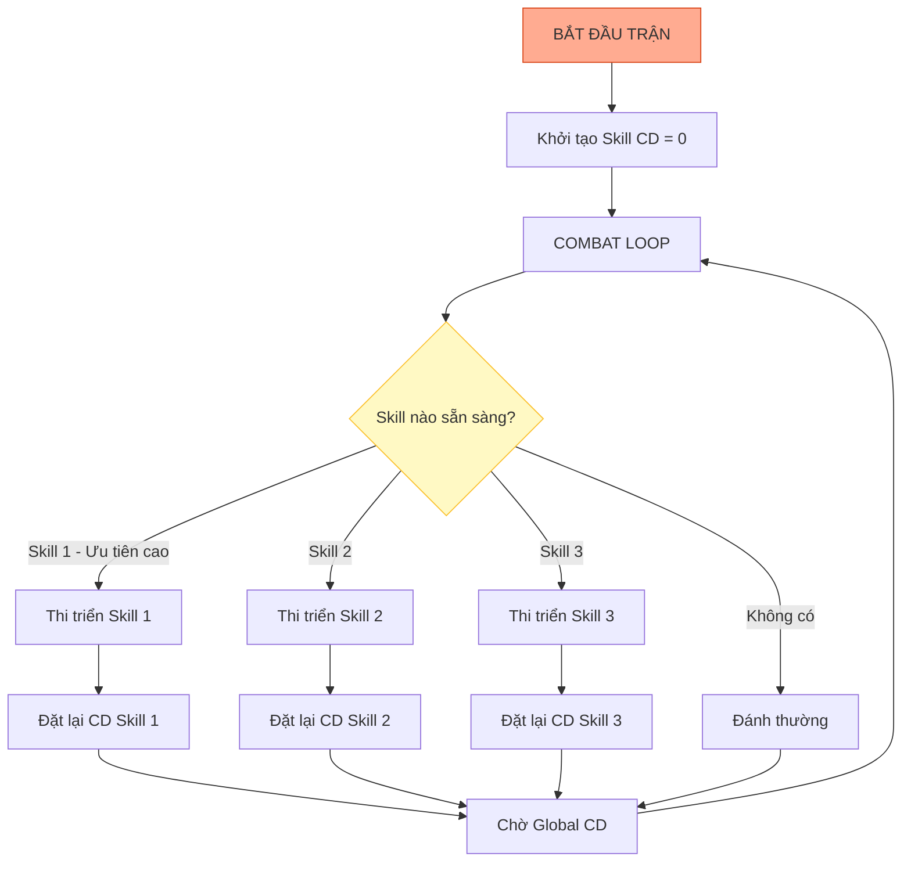

# Hệ thống kỹ năng

Tài liệu này mô tả chi tiết về hệ thống kỹ năng của nhân vật chính (player skills). Đây là yếu tố quyết định chiến thuật và tạo sự hào hứng thị giác (visual effects).

---

## 1. Tổng quan hệ thống

### 1.1. Thông tin cơ bản

| Thuộc tính            | Mô tả                                                                                         |
| :-------------------- | :-------------------------------------------------------------------------------------------- |
| **Loại kỹ năng**      | Active (chủ động, tự kích hoạt theo cooldown) và Passive (bị động, tăng chỉ số ngầm)          |
| **Số lượng trang bị** | 3 slots (mở khóa slot 4 ở level 50)                                                           |
| **Cơ chế kích hoạt**  | Game Idle nên "chủ động" nghĩa là nhân vật tự dùng khi hết cooldown, không cần người chơi bấm |

### 1.2. Cơ chế thi triển

| Quy tắc            | Mô tả                                          |
| :----------------- | :--------------------------------------------- |
| **Thứ tự ưu tiên** | Skill 1 > Skill 2 > Skill 3 > Skill 4          |
| **Điều kiện**      | Skill chỉ cast khi hết cooldown và có mục tiêu |
| **Fallback**       | Nếu tất cả đang hồi chiêu thì đánh thường      |

---

## 2. Phân loại kỹ năng

Để đa dạng hóa chiến thuật, kỹ năng được chia thành 4 nhóm màu sắc riêng biệt.

### 2.1. Nhóm tấn công (Attack - Đỏ)

| Thuộc tính      | Mô tả                                                 |
| :-------------- | :---------------------------------------------------- |
| **Mục tiêu**    | Gây sát thương lớn, dọn quái nhanh                    |
| **Đặc điểm**    | Sát thương diện rộng (AOE) hoặc đơn mục tiêu cực mạnh |
| **Icon border** | Đỏ #F44336                                            |

### 2.2. Nhóm phòng thủ/khống chế (Control - Xanh dương)

| Thuộc tính      | Mô tả                                   |
| :-------------- | :-------------------------------------- |
| **Mục tiêu**    | Giảm sát thương nhận vào hoặc chặn quái |
| **Đặc điểm**    | Tạo khiên, đẩy lùi, choáng, làm chậm    |
| **Icon border** | Xanh dương #2196F3                      |

### 2.3. Nhóm hỗ trợ (Support - Xanh lá)

| Thuộc tính      | Mô tả                                               |
| :-------------- | :-------------------------------------------------- |
| **Mục tiêu**    | Duy trì sự sống cho đội hình                        |
| **Đặc điểm**    | Hồi máu tức thì, hồi máu theo thời gian, xóa debuff |
| **Icon border** | Xanh lá #4CAF50                                     |

### 2.4. Nhóm tăng cường (Buff - Vàng)

| Thuộc tính      | Mô tả                                              |
| :-------------- | :------------------------------------------------- |
| **Mục tiêu**    | Tối ưu hóa sát thương trong thời gian ngắn (burst) |
| **Đặc điểm**    | Tăng tốc đánh, tăng chí mạng, tăng công kích       |
| **Icon border** | Vàng #FFC107                                       |

---

## 3. Danh sách kỹ năng mẫu

Tên kỹ năng đậm chất "đường phố" và hài hước.

### 3.1. Kỹ năng tấn công

| Tên                     | Loại   | Hiệu ứng                                                  | Visual                                |
| :---------------------- | :----- | :-------------------------------------------------------- | :------------------------------------ |
| **Dép lào thần chưởng** | AOE    | Ném ra chiếc dép khổng lồ gây sát thương lan và choáng 1s | Dép bay vòng cung, rơi xuống nổ "bộp" |
| **Cơn mưa gạch ống**    | AOE    | Triệu hồi mưa gạch từ trên trời rơi xuống ngẫu nhiên      | Gạch rơi vỡ tung tóe, particle dust   |
| **Tổ ong ngàn lỗ**      | Single | Phóng liên tục kim tiêm/ong vào mục tiêu                  | Đạn bay như mưa (rapid fire effect)   |

### 3.2. Kỹ năng khống chế

| Tên                    | Loại   | Hiệu ứng                                             | Visual                            |
| :--------------------- | :----- | :--------------------------------------------------- | :-------------------------------- |
| **Tiếng rao ve chai**  | AOE    | Hét lên làm quái sợ hãi chạy lùi (fear) và giảm giáp | Sóng âm lan tỏa từ miệng nhân vật |
| **Dây thừng bắt trộm** | Single | Trói chặt mục tiêu, choáng 3s                        | Dây bay ra quấn quanh địch        |

### 3.3. Kỹ năng hỗ trợ

| Tên                    | Loại      | Hiệu ứng                             | Visual                          |
| :--------------------- | :-------- | :----------------------------------- | :------------------------------ |
| **Trà đá vỉa hè**      | Self/Team | Hồi ngay 20% máu tối đa, giải debuff | Ly trà đá bay lên, tim xanh bay |
| **Thuốc nam bà ngoại** | HoT       | Hồi 5% HP mỗi giây trong 5 giây      | Aura xanh lá bao quanh          |

### 3.4. Kỹ năng tăng cường

| Tên                    | Loại | Hiệu ứng                  | Visual                                |
| :--------------------- | :--- | :------------------------ | :------------------------------------ |
| **Múa quạt vinahouse** | Self | +50% tốc độ đánh trong 5s | Hai tay quay vòng tròn, nhạc xập xình |
| **Uống tăng lực**      | Self | +30% ATK trong 10s        | Lon nước đỏ xuất hiện, nhân vật uống  |

---

## 4. Cơ chế nâng cấp

Hệ thống "Thẻ bài và mảnh ghép" (card and fragment system).

### 4.1. Mở khóa và lên cấp

| Hành động             | Yêu cầu              | Kết quả                    |
| :-------------------- | :------------------- | :------------------------- |
| **Mở khóa (Level 1)** | 10 mảnh kỹ năng      | Có thể trang bị và sử dụng |
| **Lv 1 -> Lv 2**      | 10 mảnh + 100 vàng   | Tăng 10% damage/effect     |
| **Lv 2 -> Lv 3**      | 20 mảnh + 500 vàng   | Tăng 10% damage/effect     |
| **Lv 3 -> Lv 4**      | 30 mảnh + 1,500 vàng | Tăng 10% damage/effect     |
| **Max level**         | Level 10             | Cần đột phá để tiếp tục    |

### 4.2. Đột phá (Rank up)

| Hành động     | Yêu cầu                         | Kết quả                                |
| :------------ | :------------------------------ | :------------------------------------- |
| **Đột phá 1** | Max level + 1 sách kỹ năng xanh | Mở khóa max level 20, +1 effect        |
| **Đột phá 2** | Max level + 1 sách kỹ năng tím  | Mở khóa max level 30, +1 effect        |
| **Đột phá 3** | Max level + 1 sách kỹ năng cam  | Mở khóa max level 40, biến đổi kỹ năng |

### 4.3. Hiệu ứng khi đột phá

Ví dụ với kỹ năng "Dép lào thần chưởng":

| Rank          | Hiệu ứng thêm                                      |
| :------------ | :------------------------------------------------- |
| Rank 0 (Base) | 1 chiếc dép, choáng 1s                             |
| Rank 1        | 2 chiếc dép, choáng 1s                             |
| Rank 2        | 2 chiếc dép, choáng 2s                             |
| Rank 3        | 3 chiếc dép bay vòng vòng, choáng 2s, giảm 20% DEF |

---

## 5. Deck building (Xây dựng bộ kỹ năng)

Người chơi cần thay đổi bộ kỹ năng tùy theo hoàn cảnh.

### 5.1. Bộ đi map (Farm quái thường)

| Ưu tiên         | Lý do                    | Ví dụ build                   |
| :-------------- | :----------------------- | :---------------------------- |
| AOE             | Diệt nhiều quái cùng lúc | Dép lào + Mưa gạch + Múa quạt |
| Hồi chiêu nhanh | Liên tục cast            | -                             |
| Buff tốc độ     | Tăng DPS tổng            | -                             |

### 5.2. Bộ săn boss (Single target)

| Ưu tiên           | Lý do              | Ví dụ build                |
| :---------------- | :----------------- | :------------------------- |
| Single target DPS | Boss máu nhiều     | Tổ ong + Múa quạt + Trà đá |
| Buff dame         | Burst trong window | -                          |
| Hồi máu           | Boss đánh đau      | -                          |

---

## 6. Logic xử lý trong code

Sơ đồ logic cho lập trình viên.

---

## 7. Hướng dẫn cho đội phát triển

### 7.1. Cho lập trình viên

- Implement skill system với interface/abstract class để dễ extend
- Cooldown tick ở fixed timestep (không phụ thuộc FPS)
- Skill targeting: có thể override per-skill (AOE không cần target)
- Animation cancel: cho phép skill mới interrupt animation cũ nếu cần

### 7.2. Cho họa sĩ

**Asset per skill:**

| Asset          | Kích thước       | Số lượng                |
| :------------- | :--------------- | :---------------------- |
| Icon           | 128x128 px       | 1                       |
| Projectile     | 64x64 px         | 1-3 frames nếu animated |
| Impact VFX     | 256x256 px       | 4-8 frames              |
| Cast animation | Character sprite | 4-6 frames thêm         |

**Màu sắc theo loại:**

| Loại    | Primary color | Secondary color |
| :------ | :------------ | :-------------- |
| Attack  | #F44336       | #FFCDD2         |
| Control | #2196F3       | #BBDEFB         |
| Support | #4CAF50       | #C8E6C9         |
| Buff    | #FFC107       | #FFF9C4         |

### 7.3. Cho sound designer

| Kỹ năng  | Âm thanh cast            | Âm thanh impact   |
| :------- | :----------------------- | :---------------- |
| Dép lào  | "Vút" (tiếng dép bay)    | "Bộp" + tiếng đau |
| Mưa gạch | Tiếng rít từ trên cao    | "Rầm rầm" gạch vỡ |
| Trà đá   | Tiếng rót nước           | "Slurp" uống xong |
| Múa quạt | Beat nhạc vinahouse ngắn | -                 |
