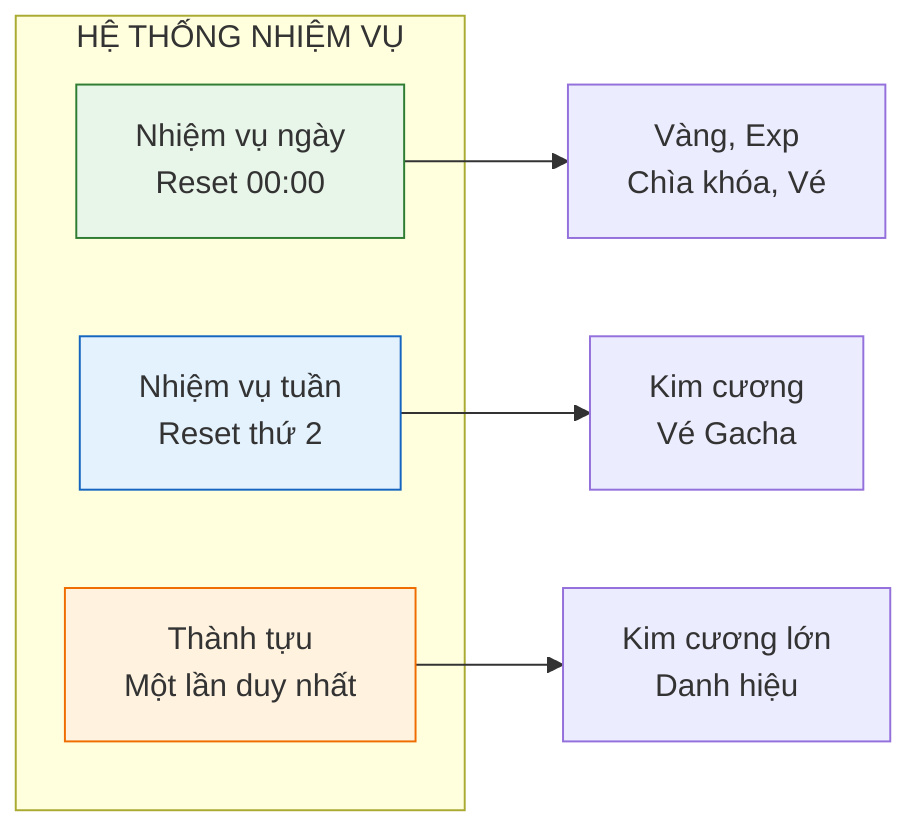
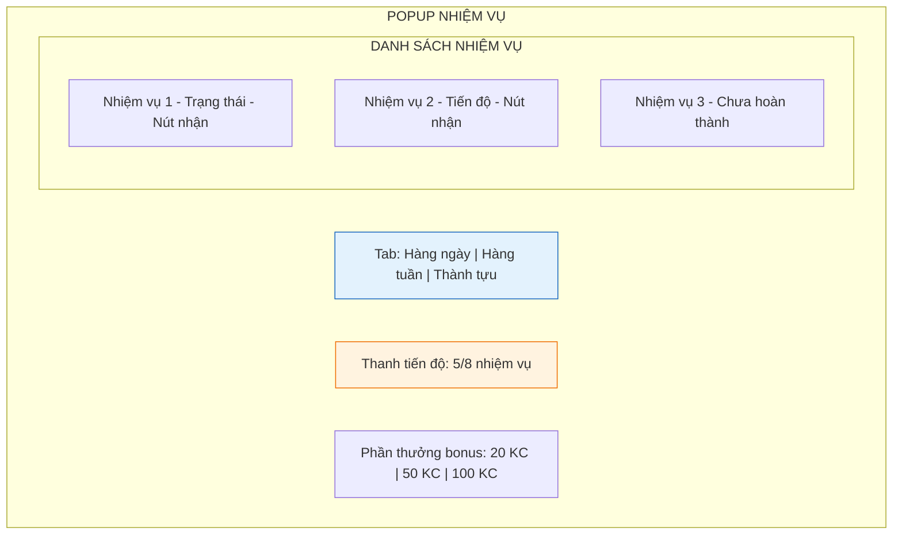

# Hệ thống nhiệm vụ và thành tựu

Tài liệu này mô tả chi tiết về hệ thống nhiệm vụ hàng ngày, hàng tuần và thành tựu dài hạn. Đây là công cụ quan trọng để hướng dẫn người chơi và tạo động lực chơi game mỗi ngày.

---

## 1. Tổng quan hệ thống

### 1.1. Mục đích

| Mục đích                 | Mô tả                                                            |
| :----------------------- | :--------------------------------------------------------------- |
| **Hướng dẫn chơi**       | Gợi ý cho người chơi biết nên làm gì tiếp theo                   |
| **Tạo thói quen**        | Khuyến khích đăng nhập và chơi mỗi ngày                          |
| **Phân phối tài nguyên** | Nguồn kiếm kim cương và vật phẩm ổn định cho người chơi miễn phí |
| **Tạo mục tiêu**         | Cho người chơi có cảm giác tiến bộ và thành tựu                  |

### 1.2. Phân loại

---

## 2. Nhiệm vụ hàng ngày (Daily quests)

Là các nhiệm vụ đơn giản, dễ hoàn thành trong 10-15 phút chơi.

### 2.1. Danh sách nhiệm vụ ngày

| Nhiệm vụ            | Yêu cầu               | Phần thưởng  | Ghi chú                 |
| :------------------ | :-------------------- | :----------- | :---------------------- |
| **Đăng nhập**       | Vào game 1 lần        | 1,000 vàng   | Tự động hoàn thành      |
| **Tiêu diệt quái**  | Đánh bại 100 quái     | 2,000 vàng   | Tính cả AFK             |
| **Nâng cấp chỉ số** | Nâng cấp 10 lần       | 3 chìa khóa  | Bất kỳ chỉ số nào       |
| **Trang bị mới**    | Nhận 5 trang bị       | 1,500 vàng   | Từ farm hoặc gacha      |
| **Thử vận may**     | Quay gacha 1 lần      | 500 vàng     | Có thể dùng vé miễn phí |
| **Vượt ải**         | Vượt qua 1 ải mới     | 10 kim cương | Chỉ tính ải chưa qua    |
| **Phó bản**         | Hoàn thành 1 phó bản  | 5,000 vàng   | Bất kỳ loại nào         |
| **Nhận quà AFK**    | Nhận thưởng AFK 1 lần | 2 chìa khóa  | Click vào popup AFK     |

### 2.2. Thanh tiến độ ngày

Ngoài phần thưởng từng nhiệm vụ, có thêm phần thưởng theo tổng điểm hoàn thành.

| Số nhiệm vụ hoàn thành | Phần thưởng bonus         |
| :--------------------- | :------------------------ |
| 3 nhiệm vụ             | 5,000 vàng                |
| 5 nhiệm vụ             | 20 kim cương + 5 bánh mì  |
| 8 nhiệm vụ (Tất cả)    | 50 kim cương + 1 vé gacha |

---

## 3. Nhiệm vụ hàng tuần (Weekly quests)

Thử thách lớn hơn, thưởng nhiều hơn, reset vào 00:00 thứ 2 hàng tuần.

### 3.1. Danh sách nhiệm vụ tuần

| Nhiệm vụ            | Yêu cầu                  | Phần thưởng                |
| :------------------ | :----------------------- | :------------------------- |
| **Chiến binh**      | Tiêu diệt 3,000 quái     | 100 kim cương              |
| **Vượt khó**        | Vượt qua 10 ải mới       | 150 kim cương              |
| **Nhà sưu tập**     | Thu thập 50 trang bị     | 3 vé gacha                 |
| **Thợ rèn**         | Nâng cấp trang bị 30 lần | 50 cờ lê                   |
| **Luyện công**      | Nâng cấp kỹ năng 10 lần  | 30 mảnh kỹ năng            |
| **Huấn luyện viên** | Nâng cấp đồng đội 20 lần | 50 bánh mì                 |
| **May mắn**         | Quay gacha 30 lần        | 200 kim cương              |
| **Siêng năng**      | Đăng nhập 7 ngày         | 100 kim cương + 1 vé gacha |

### 3.2. Thanh tiến độ tuần

| Số nhiệm vụ hoàn thành | Phần thưởng bonus                       |
| :--------------------- | :-------------------------------------- |
| 3 nhiệm vụ             | 100 kim cương                           |
| 5 nhiệm vụ             | 200 kim cương + 5 vé gacha              |
| 8 nhiệm vụ (Tất cả)    | 500 kim cương + trang bị tím ngẫu nhiên |

---

## 4. Hệ thống thành tựu (Achievements)

Mục tiêu dài hạn, chỉ hoàn thành một lần duy nhất, không reset.

### 4.1. Phân loại thành tựu

| Nhóm          | Mô tả                         | Ví dụ                           |
| :------------ | :---------------------------- | :------------------------------ |
| **Tiến độ**   | Liên quan đến tiến trình game | Vượt qua chương 1, đạt level 50 |
| **Sưu tập**   | Thu thập đủ số lượng          | Có 10 đồng đội, có 100 trang bị |
| **Nâng cấp**  | Tối đa hóa sức mạnh           | Nâng kỹ năng lên max, có đồ cam |
| **Thử thách** | Hoàn thành điều kiện khó      | Đánh bại boss trong 30 giây     |
| **Bí mật**    | Không hiển thị điều kiện      | Easter egg                      |

### 4.2. Danh sách thành tựu mẫu

#### Nhóm tiến độ

| Tên thành tựu     | Điều kiện             | Phần thưởng   |
| :---------------- | :-------------------- | :------------ |
| Khởi đầu mới      | Hoàn thành hướng dẫn  | 50 kim cương  |
| Người bảo vệ      | Vượt qua chương 1     | 100 kim cương |
| Anh hùng khu phố  | Vượt qua chương 2     | 200 kim cương |
| Tay chơi thực thụ | Đạt level 50          | 300 kim cương |
| Cao thủ           | Đạt level 100         | 500 kim cương |
| Bậc thầy          | Đạt lực chiến 100,000 | 500 kim cương |

#### Nhóm sưu tập

| Tên thành tựu    | Điều kiện          | Phần thưởng   |
| :--------------- | :----------------- | :------------ |
| Bạn bè đông vui  | Có 3 đồng đội      | 50 kim cương  |
| Hội anh em       | Có đủ 5 đồng đội   | 200 kim cương |
| Kho báu nhỏ      | Có 50 trang bị     | 100 kim cương |
| Nhà kho đầy ắp   | Có 200 trang bị    | 300 kim cương |
| Học viên kỹ năng | Mở khóa 10 kỹ năng | 150 kim cương |
| Bậc thầy kỹ năng | Mở khóa 20 kỹ năng | 400 kim cương |

#### Nhóm nâng cấp

| Tên thành tựu      | Điều kiện                     | Phần thưởng   |
| :----------------- | :---------------------------- | :------------ |
| Đồ xịn đầu tiên    | Sở hữu trang bị phẩm chất tím | 100 kim cương |
| Huyền thoại        | Sở hữu trang bị phẩm chất cam | 300 kim cương |
| Chiến binh 5 sao   | Có đồng đội đạt 5 sao         | 500 kim cương |
| Kỹ năng tối thượng | Có kỹ năng đạt level 30       | 300 kim cương |

#### Nhóm thử thách

| Tên thành tựu  | Điều kiện                      | Phần thưởng   |
| :------------- | :----------------------------- | :------------ |
| Nhanh như chớp | Hạ boss trong 30 giây          | 200 kim cương |
| Bất bại        | Thắng boss mà không mất máu    | 300 kim cương |
| Siêu tiết kiệm | Đạt level 30 mà không nạp tiền | 100 kim cương |
| Vua may mắn    | Trúng đồ cam từ gacha          | 100 kim cương |

---

## 5. Giao diện nhiệm vụ

### 5.1. Vị trí truy cập

| Thành phần          | Vị trí                      | Mô tả                                  |
| :------------------ | :-------------------------- | :------------------------------------- |
| **Icon nhiệm vụ**   | Góc trái màn hình chiến đấu | Cuộn giấy có dấu chấm đỏ khi có thưởng |
| **Badge thông báo** | Trên icon                   | Số lượng nhiệm vụ hoàn thành chưa nhận |

### 5.2. Bố cục popup nhiệm vụ

### 5.3. Trạng thái nhiệm vụ

| Trạng thái          | Hiển thị             | Màu sắc  |
| :------------------ | :------------------- | :------- |
| **Chưa hoàn thành** | Thanh tiến độ + số % | Xám      |
| **Hoàn thành**      | Nút "Nhận" nhấp nháy | Xanh lá  |
| **Đã nhận**         | Dấu tích xanh        | Xanh đậm |

---

## 6. Hướng dẫn cho đội phát triển

### 6.1. Cho lập trình viên

- Lưu trạng thái nhiệm vụ vào save file, sync với server nếu có
- Implement event system để track tiến độ (OnEnemyKilled, OnUpgrade, ...)
- Reset daily quests lúc 00:00 theo múi giờ server hoặc local
- Cache trạng thái nhiệm vụ, không query mỗi frame

### 6.2. Cho game designer

- Điều chỉnh yêu cầu nhiệm vụ theo playtime mục tiêu (15 phút/ngày)
- Đảm bảo phần thưởng từ nhiệm vụ chiếm 30-40% tổng income của F2P
- Thêm nhiệm vụ mới theo event hoặc update content

### 6.3. Cho UI designer

- Icon nhiệm vụ cần nổi bật khi có thưởng chờ nhận
- Animation confetti khi nhận thưởng bonus
- Hiển thị rõ thời gian reset countdown cho daily và weekly
