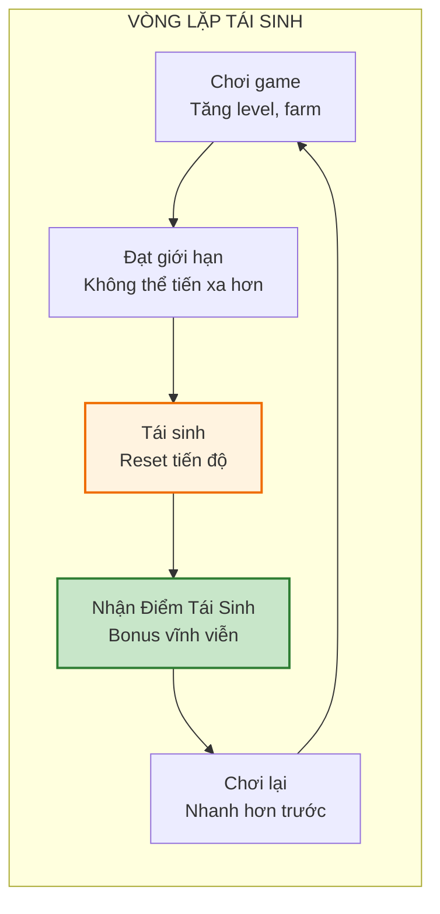
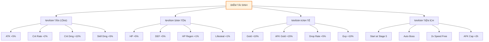
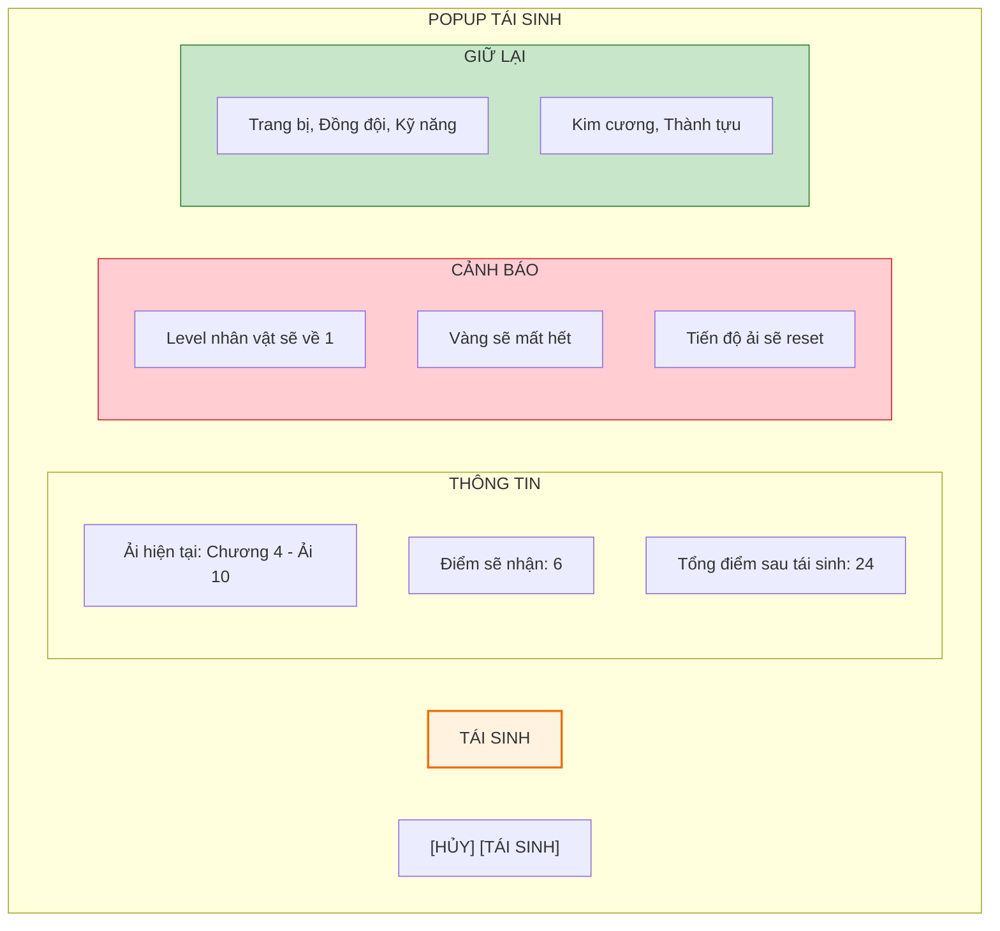

# Hệ thống Prestige (Tái sinh)

Tài liệu này mô tả chi tiết về hệ thống Prestige - cơ chế reset tiến độ để đổi lấy bonus vĩnh viễn, là một trong những core mechanics quan trọng nhất của thể loại Idle game.

---

## 1. Tổng quan hệ thống

### 1.1. Khái niệm

| Thuộc tính     | Mô tả                                                                      |
| :------------- | :------------------------------------------------------------------------- |
| **Tên gọi**    | Tái sinh / Prestige / Rebirth                                              |
| **Mục đích**   | Tạo vòng lặp meta-progression, giữ chân người chơi lâu dài                 |
| **Cơ chế**     | Reset một phần tiến độ để nhận "Điểm Tái Sinh" (Prestige Points)           |
| **Mở khóa**    | Khi đạt Chương 4 - Ải 10 (đánh bại Boss "Chủ tịch giả danh") lần đầu tiên  |

### 1.2. Triết lý thiết kế

---

## 2. Điều kiện và phần thưởng

### 2.1. Điều kiện tái sinh

| Điều kiện           | Yêu cầu                              | Ghi chú                        |
| :------------------ | :----------------------------------- | :----------------------------- |
| **Lần đầu tiên**    | Vượt qua Chương 4 - Ải 10            | Tutorial tái sinh              |
| **Các lần sau**     | Đạt ải cao hơn lần tái sinh trước    | Khuyến khích tiến xa hơn       |
| **Tối thiểu**       | Chương 2 - Ải 10                     | Để tránh spam tái sinh         |

### 2.2. Công thức tính Điểm Tái Sinh

Số điểm nhận được dựa trên ải cao nhất đạt được:

$$PrestigePoints = floor(\frac{HighestStage - 20}{5}) \times (1 + PrestigeMultiplier)$$

**Trong đó:**
- **HighestStage:** Ải cao nhất đạt được (tính từ đầu game, VD: Chương 3 Ải 5 = 25)
- **PrestigeMultiplier:** Bonus từ các nguồn khác (VIP, Event...)

**Bảng điểm mẫu:**

| Ải cao nhất       | Điểm cơ bản | Với VIP +20% |
| :---------------- | :---------- | :----------- |
| Chương 2 - Ải 10  | 2           | 2            |
| Chương 3 - Ải 10  | 4           | 4            |
| Chương 4 - Ải 10  | 6           | 7            |
| Chương 5 - Ải 10  | 8           | 9            |
| Chương 6 - Ải 10  | 10          | 12           |
| Chương 10 - Ải 10 | 18          | 21           |

### 2.3. Những gì bị reset

| Hạng mục                | Reset? | Ghi chú                               |
| :---------------------- | :----- | :------------------------------------ |
| **Level nhân vật**      | Co     | Về level 1                            |
| **Chỉ số nâng bằng vàng** | Co   | ATK, HP, DEF, ASPD về 0               |
| **Tiến độ ải**          | Co     | Về Chương 1 - Ải 1                    |
| **Vàng**                | Co     | Mất hết                               |
| **Trang bị**            | Không  | Giữ nguyên                            |
| **Đồng đội**            | Không  | Giữ nguyên level và sao               |
| **Kỹ năng**             | Không  | Giữ nguyên                            |
| **Kim cương**           | Không  | Giữ nguyên                            |
| **Thành tựu**           | Không  | Giữ nguyên                            |
| **Điểm Tái Sinh cũ**    | Không  | Cộng dồn                              |

---

## 3. Cây kỹ năng tái sinh (Prestige Tree)

Điểm Tái Sinh được dùng để mua các bonus vĩnh viễn trong cây kỹ năng đặc biệt.

### 3.1. Các nhánh chính

### 3.2. Chi tiết các bonus

#### Nhánh Tấn công

| Tên upgrade            | Chi phí (điểm) | Hiệu ứng           | Max level | Tổng chi phí |
| :--------------------- | :------------- | :----------------- | :-------- | :----------- |
| **Sức mạnh cơ bản**    | 1, 2, 3, 4, 5  | +5% ATK / level    | 10        | 55           |
| **Bản năng sát thủ**   | 2, 4, 6, 8, 10 | +2% Crit Rate / lv | 5         | 30           |
| **Đòn chí mạng**       | 3, 6, 9, 12    | +10% Crit Dmg / lv | 5         | 45           |
| **Tinh thông kỹ năng** | 5, 10, 15      | +5% Skill Dmg / lv | 3         | 30           |

#### Nhánh Sinh tồn

| Tên upgrade          | Chi phí (điểm)  | Hiệu ứng            | Max level | Tổng chi phí |
| :------------------- | :-------------- | :------------------ | :-------- | :----------- |
| **Thể chất vượt trội** | 1, 2, 3, 4, 5 | +5% HP / level      | 10        | 55           |
| **Da thép**          | 2, 4, 6, 8, 10  | +5% DEF / level     | 5         | 30           |
| **Hồi phục nhanh**   | 3, 6, 9         | +1% HP Regen / lv   | 3         | 18           |
| **Hút máu**          | 5, 10, 15       | +1% Lifesteal / lv  | 3         | 30           |

#### Nhánh Kinh tế

| Tên upgrade        | Chi phí (điểm) | Hiệu ứng               | Max level | Tổng chi phí |
| :----------------- | :------------- | :--------------------- | :-------- | :----------- |
| **Tài lộc**        | 1, 2, 3, 4, 5  | +10% Gold drop / level | 10        | 55           |
| **Nghỉ ngơi hiệu quả** | 2, 4, 6    | +15% AFK Gold / level  | 5         | 20           |
| **May mắn**        | 3, 6, 9, 12    | +5% Drop Rate / level  | 4         | 30           |
| **Học hỏi nhanh**  | 2, 4, 6, 8     | +10% EXP / level       | 5         | 20           |

#### Nhánh Tiện ích

| Tên upgrade         | Chi phí (điểm) | Hiệu ứng                      | Max level | Tổng chi phí |
| :------------------ | :------------- | :---------------------------- | :-------- | :----------- |
| **Khởi đầu thuận lợi** | 5, 10, 15   | Bắt đầu tại Ải +5 / level     | 3         | 30           |
| **Tự động Boss**    | 10             | Mở khóa Auto Boss từ đầu      | 1         | 10           |
| **Tốc độ x2**       | 20             | x2 Speed miễn phí             | 1         | 20           |
| **AFK mở rộng**     | 5, 10, 15, 20  | +2h AFK cap / level           | 4         | 50           |

---

## 4. Giao diện tái sinh

### 4.1. Màn hình xác nhận tái sinh

### 4.2. Màn hình cây kỹ năng

| Thành phần               | Mô tả                                          |
| :----------------------- | :--------------------------------------------- |
| **Điểm hiện có**         | Hiển thị góc trên phải, số lớn                 |
| **4 tab nhánh**          | Tấn công / Sinh tồn / Kinh tế / Tiện ích       |
| **Grid các upgrade**     | Icon + Tên + Level hiện tại + Chi phí tiếp theo |
| **Nút Reset**            | Reset cây (miễn phí lần đầu, sau đó 100 KC)    |
| **Preview tổng bonus**   | Hiển thị tổng % bonus đang active              |

---

## 5. Chiến lược và meta

### 5.1. Khi nào nên tái sinh?

| Tình huống                        | Nên tái sinh?     | Lý do                                |
| :-------------------------------- | :---------------- | :----------------------------------- |
| **Đạt ải mới cao hơn 10+ ải**     | Co                | Đủ điểm để có giá trị               |
| **Bị kẹt 2-3 ngày không tiến**    | Co                | Bonus sẽ giúp vượt qua              |
| **Mới vượt ải 1-2 ải**            | Không             | Chưa đủ điểm, lãng phí thời gian    |
| **Đang có event limited**         | Không             | Hoàn thành event trước               |

### 5.2. Build path khuyến nghị

**Cho người chơi mới (Lần tái sinh 1-3):**
1. Nhánh Kinh tế: Tài lộc max -> Học hỏi nhanh
2. Nhánh Tiện ích: Khởi đầu thuận lợi

**Cho mid-game (Lần tái sinh 4-10):**
1. Nhánh Tấn công: Sức mạnh cơ bản max
2. Nhánh Sinh tồn: Thể chất vượt trội
3. Nhánh Tiện ích: AFK mở rộng

**Cho late-game (Lần tái sinh 10+):**
1. Max tất cả nhánh Tấn công
2. Nhánh Tiện ích: Tốc độ x2, Tự động Boss

---

## 6. Hướng dẫn cho đội phát triển

### 6.1. Cho lập trình viên

- Lưu Prestige data riêng biệt, không bị ảnh hưởng bởi reset
- Implement confirmation dialog với countdown 3 giây trước khi confirm
- Prestige tree upgrades áp dụng như global multipliers
- Cần có system để rollback nếu crash giữa chừng

### 6.2. Cho game designer

- Tune số điểm sao cho 1 prestige cycle ~ 2-3 ngày chơi casual
- Đảm bảo progression sau prestige nhanh hơn ít nhất 20%
- Balance bonus để không quá OP nhưng đủ feel impactful
- Thêm milestones cho số lần prestige (5, 10, 20, 50...)

### 6.3. Cho UI designer

- Animation "Tái sinh" hoành tráng: màn hình trắng, hiệu ứng ánh sáng
- Cây kỹ năng cần trực quan, dễ hiểu flow
- Highlight upgrade mới mở khóa
- Show before/after stats comparison

### 6.4. Cho sound designer

- SFX tái sinh: Âm thanh epic, ascending tone
- BGM riêng cho màn hình Prestige Tree
- Tiếng "ding" khi mua upgrade
