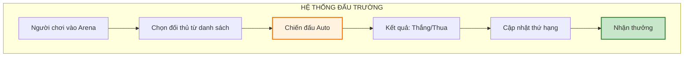

# Hệ thống PvP và Arena

Tài liệu này mô tả chi tiết về hệ thống đấu trường (Arena) - nơi người chơi cạnh tranh với nhau để giành thứ hạng và phần thưởng.

---

## 1. Tổng quan hệ thống

### 1.1. Thông tin cơ bản

| Thuộc tính     | Mô tả                                                    |
| :------------- | :------------------------------------------------------- |
| **Tên gọi**    | Đấu Trường Khu Phố                                       |
| **Mở khóa**    | Đạt Level 20 và vượt qua Chương 2                        |
| **Loại hình** | PvP bất đồng bộ (Async PvP)                              |
| **Cơ chế**     | Đánh với đội hình AI của người chơi khác                 |

### 1.2. Sơ đồ tổng quan

---

## 2. Cơ chế chiến đấu

### 2.1. Quy tắc trận đấu

| Quy tắc              | Mô tả                                                |
| :------------------- | :--------------------------------------------------- |
| **Thời gian**        | Tối đa 60 giây/trận                                  |
| **Điều kiện thắng**  | Tiêu diệt hết đội đối phương                         |
| **Điều kiện thua**   | Bị tiêu diệt hết hoặc hết giờ mà HP thấp hơn         |
| **Đội hình**         | Nhân vật chính + 4 Đồng đội (giống PvE)              |
| **Chế độ**           | Full Auto, không can thiệp                           |

### 2.2. Lượt đấu

| Thuộc tính          | Mô tả                              |
| :------------------ | :--------------------------------- |
| **Lượt miễn phí**   | 5 lượt/ngày, reset 00:00           |
| **Mua thêm**        | 50 KC = 1 lượt (tối đa 10 lượt/ngày) |
| **Thời gian hồi**   | 2 tiếng/lượt nếu dưới 5            |

### 2.3. Chọn đối thủ

Hệ thống hiển thị 3 đối thủ ngẫu nhiên trong phạm vi:
- Hạng cao hơn 1-10 bậc
- Hạng tương đương
- Hạng thấp hơn 1-5 bậc

| Loại đối thủ    | Điểm thắng | Điểm thua | Ghi chú               |
| :-------------- | :--------- | :-------- | :-------------------- |
| **Hạng cao hơn** | +15 - +25 | -5        | Rủi ro cao, thưởng cao |
| **Hạng ngang**  | +10        | -10       | Cân bằng              |
| **Hạng thấp hơn** | +5       | -15       | An toàn nhưng ít điểm  |

---

## 3. Hệ thống xếp hạng

### 3.1. Các bậc hạng

| Bậc            | Điểm yêu cầu | Icon màu     | Phần thưởng cuối mùa           |
| :------------- | :----------- | :----------- | :----------------------------- |
| **Đồng V-I**   | 0 - 999      | Nâu          | 100 KC                         |
| **Bạc V-I**    | 1000 - 1999  | Bạc          | 200 KC + Khung Bạc             |
| **Vàng V-I**   | 2000 - 2999  | Vàng         | 400 KC + Khung Vàng            |
| **Bạch Kim V-I** | 3000 - 3999 | Xanh trắng  | 600 KC + Khung Bạch Kim        |
| **Kim Cương V-I** | 4000 - 4999 | Xanh dương  | 1000 KC + Khung Kim Cương      |
| **Cao Thủ**    | 5000 - 5999  | Tím          | 1500 KC + Khung Cao Thủ        |
| **Đại Cao Thủ** | 6000+       | Cam/Đỏ       | 2500 KC + Khung Đại Cao Thủ + Danh hiệu |

### 3.2. Mùa giải (Season)

| Thuộc tính     | Mô tả                                |
| :------------- | :----------------------------------- |
| **Thời lượng** | 30 ngày/mùa                          |
| **Reset**      | Điểm về 50% của mùa trước            |
| **Thưởng mùa** | Phát vào ngày đầu mùa mới            |

---

## 4. Phần thưởng

### 4.1. Thưởng trận đấu

| Kết quả | Phần thưởng                          |
| :------ | :----------------------------------- |
| **Thắng** | 500-2000 Vàng + Arena Coin         |
| **Thua** | 200-500 Vàng                        |

### 4.2. Thưởng hàng ngày theo hạng

Nhận tự động lúc 00:00 dựa trên hạng hiện tại:

| Hạng          | Vàng/ngày | Kim cương/ngày | Arena Coin |
| :------------ | :-------- | :------------- | :--------- |
| **Đồng**      | 5,000     | 10             | 20         |
| **Bạc**       | 10,000    | 20             | 40         |
| **Vàng**      | 20,000    | 35             | 60         |
| **Bạch Kim**  | 35,000    | 50             | 80         |
| **Kim Cương** | 50,000    | 80             | 100        |
| **Cao Thủ**   | 80,000    | 120            | 150        |
| **Đại Cao Thủ** | 120,000 | 200            | 200        |

### 4.3. Arena Shop

| Vật phẩm                    | Giá (Arena Coin) | Giới hạn   |
| :-------------------------- | :--------------- | :--------- |
| Mảnh đồng đội Epic (chọn)   | 100              | 5/tuần     |
| Mảnh đồng đội Legendary     | 300              | 2/tuần     |
| Trang bị Cam ngẫu nhiên     | 500              | 3/tuần     |
| Đá tẩy luyện x5             | 150              | 10/tuần    |
| 50 Kim cương                | 200              | Không giới hạn |
| Vé Gacha x10                | 250              | 5/tuần     |
| Skin Arena (đặc biệt)       | 2000             | 1          |

---

## 5. Đấu trường đặc biệt

### 5.1. Giải đấu hàng tuần (Weekly Tournament)

| Thuộc tính     | Mô tả                                  |
| :------------- | :------------------------------------- |
| **Thời gian**  | Thứ 6 - Chủ nhật                       |
| **Điều kiện**  | Hạng Vàng trở lên                      |
| **Cơ chế**     | Loại trực tiếp, 32 người/group         |
| **Thưởng**     | Dựa trên thứ hạng cuối cùng            |

### 5.2. Đấu trường Guild (Guild War)

*Xem chi tiết tại: [Hệ thống Guild](./he-thong-guild.md)*

---

## 6. Chiến thuật Arena

### 6.1. Meta đội hình

| Archetype     | Đội hình mẫu                           | Ưu điểm                    |
| :------------ | :------------------------------------- | :------------------------- |
| **Rush**      | 4 Warrior + 1 Support                  | Burst nhanh, kết thúc sớm  |
| **Tank**      | 2 Tanker + 1 Warrior + 2 Support       | Trâu bò, kéo dài trận      |
| **Assassin**  | 2 Ranger + 2 Mage + 1 Support          | Focus target, dame cao     |
| **Balance**   | 1 Tanker + 1 Warrior + 1 Ranger + 1 Mage + 1 Support | Linh hoạt |

### 6.2. Phòng thủ (Defense Team)

Người chơi có thể set đội hình phòng thủ khác với đội tấn công:
- Ưu tiên Tanker để kéo dài thời gian
- Thêm CC (Stun, Freeze) để gián đoạn đối phương

---

## 7. Hướng dẫn cho đội phát triển

### 7.1. Cho lập trình viên

- Snapshot đội hình phòng thủ khi người chơi set
- Matchmaking dựa trên điểm, không phải lực chiến
- Battle replay (optional): lưu seed để recreate
- Anti-cheat: validate kết quả trận đấu

### 7.2. Cho game designer

- Balance thời gian trận: không quá nhanh (RNG) cũng không quá lâu (nhàm)
- Điểm số spread phù hợp để tạo cạnh tranh
- Weekly tournament không nên quá time-consuming

### 7.3. Cho UI designer

- Leaderboard hiển thị top 100
- Battle log với highlights (Crit, Kill)
- Formation preview của đối thủ
- Rank change animation (+5, -10...)
