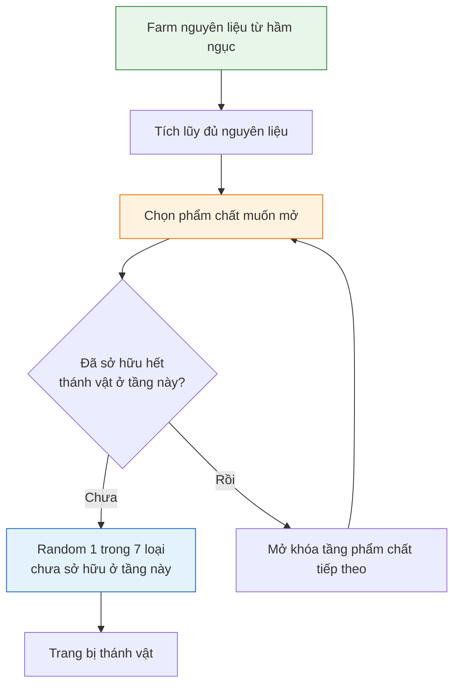
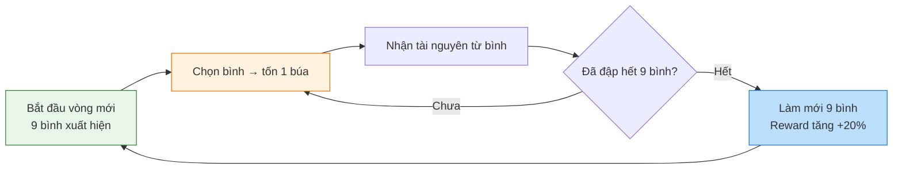

# Hệ thống thánh vật và tàn tích

Tài liệu này mô tả hai hệ thống liên quan: **thánh vật** (sacred relics — trang bị đặc biệt 7 slot) và **tàn tích** (mini-game đập bình để farm tài nguyên).

---

## 1. Hệ thống thánh vật

### 1.1. Tổng quan

Thánh vật là trang bị đặc biệt dành riêng cho nhân vật chính, nằm trong UI Main Hero. Mỗi thánh vật tăng một loại chỉ số riêng, bao gồm chỉ số đặc biệt.

| Thuộc tính | Mô tả |
| :--------- | :---- |
| **Vị trí** | UI Main Hero — 7 ô trang bị thánh vật riêng biệt |
| **Cách mở khóa** | Dùng nguyên liệu farm từ hầm ngục |
| **Số lượng tối đa** | 7 thánh vật (mỗi loại 1 cái) |
| **Phẩm chất** | 6 cấp: Common, Uncommon, Rare, Epic, Legendary, Mythic |

### 1.2. 7 loại thánh vật

| Slot | Tên | Chỉ số chính | Chỉ số phụ (nếu có) |
| :--- | :-- | :----------- | :------------------ |
| 1 | **Bình** | Hồi máu (HP Regen) | Tăng hiệu quả hồi máu từ mọi nguồn |
| 2 | **Sách** | Sát thương kỹ năng (Skill DMG) | Giảm hồi chiêu kỹ năng |
| 3 | **Ngọc** | Phòng thủ (DEF) | Kháng hiệu ứng (Debuff Resist) |
| 4 | **Mặt nạ** | Hút máu (Lifesteal) | Tăng tỉ lệ né tránh |
| 5 | **Dây chuyền** | Tỉ lệ chí mạng (CRIT Rate) | Chí mạng xuyên giáp |
| 6 | **Nhẫn** | Sát thương chí mạng (CRIT DMG) | Tăng sát thương lên boss |
| 7 | **Vật tổ** | Tất cả chỉ số (All Stats %) | Tăng hiệu quả duyên phận đồng đội |

### 1.3. Phẩm chất (Rarity)

Mỗi loại thánh vật có 6 cấp phẩm chất:

| Phẩm chất | Màu sắc | Hệ số chỉ số | Ghi chú |
| :-------- | :------ | :----------- | :------ |
| **Common** | Xám (#9E9E9E) | x1.0 | Cơ bản |
| **Uncommon** | Xanh lá (#4CAF50) | x1.5 | Phổ biến |
| **Rare** | Xanh dương (#2196F3) | x2.5 | Hiếm |
| **Epic** | Tím (#9C27B0) | x4.0 | Anh hùng |
| **Legendary** | Cam (#FF9800) | x6.5 | Huyền thoại |
| **Mythic** | Đỏ (#E91E63) | x10.0 | Thần thoại |

### 1.4. Cơ chế mở khóa

Mở khóa thánh vật theo tầng phẩm chất (tier), từ thấp đến cao:



#### Quy trình chi tiết

| Bước | Mô tả |
| :--- | :---- |
| **1. Chọn phẩm chất** | Người chơi chọn tầng phẩm chất muốn mở (Common → Uncommon → ... → Mythic) |
| **2. Kiểm tra điều kiện** | Phải sở hữu đủ 7 thánh vật ở tầng dưới mới được mở tầng trên |
| **3. Random** | Hệ thống random ra 1 thánh vật trong 7 loại mà người chơi chưa sở hữu ở tầng đã chọn |
| **4. Tiêu hao nguyên liệu** | Trừ nguyên liệu tương ứng với phẩm chất |
| **5. Nhận thánh vật** | Thánh vật được thêm vào bộ sưu tập và tự động trang bị nếu slot trống |

#### Chi phí mở khóa

| Phẩm chất | Mảnh thánh vật yêu cầu | Tinh hoa thánh vật |
| :-------- | :--------------------- | :----------------- |
| Common | 10 | - |
| Uncommon | 30 | 5 |
| Rare | 80 | 15 |
| Epic | 200 | 40 |
| Legendary | 500 | 100 |
| Mythic | 1200 | 250 |

### 1.5. Tính năng bổ sung

| Tính năng | Mô tả |
| :-------- | :---- |
| **Nâng cấp thánh vật** | Sau khi sở hữu, có thể nâng cấp level bằng nguyên liệu để tăng chỉ số |
| **Phân giải** | Phân hủy thánh vật không dùng để lấy lại một phần nguyên liệu |
| **Bộ sưu tập** | Mỗi thánh vật khi mở khóa sẽ ghi vào bộ sưu tập, tặng chỉ số vĩnh viễn |

---

## 2. Hệ thống tàn tích (Mini-game đập bình)

### 2.1. Tổng quan

Tàn tích là mini-game farm tài nguyên, nơi người chơi đập bình để nhận nguyên liệu thánh vật và các tài nguyên khác.

| Thuộc tính | Mô tả |
| :--------- | :---- |
| **Vị trí** | Mở từ UI Main Hero hoặc màn hình chính |
| **Cách chơi** | Đập 9 cái bình, mỗi lần tốn 1 búa |
| **Phần thưởng** | Nguyên liệu thánh vật, vàng, vật phẩm ngẫu nhiên |
| **Làm mới** | Khi đập hết 9 bình, tự động làm mới với reward tăng dần |

### 2.2. Luật chơi



### 2.3. Chi tiết

| Thành phần | Mô tả |
| :--------- | :---- |
| **Bình** | 9 cái bình trên sân, mỗi cái chứa tài nguyên ngẫu nhiên |
| **Búa** | Vật phẩm tiêu hao, tốn 1 cái mỗi lần đập |
| **Hiệu ứng đập** | Bình vỡ, tia sáng, tài nguyên bay ra |
| **Làm mới** | Khi đập hết 9 bình, 9 bình mới xuất hiện với reward cao hơn 20% |

### 2.4. Tỉ lệ rơi từ mỗi bình

| Vật phẩm | Tỉ lệ (vòng 1) | Tỉ lệ (vòng 10+) |
| :------- | :------------- | :--------------- |
| Vàng | 50% | 30% |
| Mảnh thánh vật x1 | 30% | 25% |
| Mảnh thánh vật x3 | 10% | 20% |
| Tinh hoa thánh vật | 7% | 15% |
| Búa (hoàn lại) | 2% | 5% |
| Trang bị | 1% | 5% |

### 2.5. Giới hạn và cân bằng

| Thuộc tính | Giá trị |
| :--------- | :------ |
| **Búa tối đa tích trữ** | 50 cái |
| **Nguồn búa** | Daily dungeon, shop, nhiệm vụ, event |
| **Số vòng tối đa/ngày** | Không giới hạn (giới hạn bởi số búa) |
| **Hệ số tăng reward mỗi vòng** | +20% (cộng dồn) |
| **Vòng tối đa trước khi reward cap** | 50 vòng (reward x10) |

---

## 3. UI Main Hero — Vị trí thánh vật

### 3.1. Layout 7 slot

```
+--------------------------------------+
|           MAIN HERO                   |
|  [Avatar] [Level] [Lực chiến]       |
+--------------------------------------+
|                                       |
|   [Bình]  [Sách]  [Ngọc]             |
|                                       |
|      [Mặt nạ] [Dây chuyền]            |
|                                       |
|   [Nhẫn]  [Vật tổ]                   |
|                                       |
+--------------------------------------+
|  Nút: Mở khóa | Tàn tích | Chi tiết  |
+--------------------------------------+
```

### 3.2. Tương tác

| Thao tác | Kết quả |
| :------- | :------ |
| **Tap thánh vật** | Mở popup chi tiết: chỉ số, phẩm chất, cấp độ |
| **Nút Mở khóa** | Vào màn hình chọn phẩm chất để mở khóa thánh vật mới |
| **Nút Tàn tích** | Vào mini-game đập bình |
| **Nút Chi tiết** | Xem danh sách toàn bộ thánh vật đã sở hữu |

---

## 4. Hướng dẫn cho đội phát triển

### 4.1. Cho lập trình viên

- Lưu trạng thái thánh vật: `{id, slot_type, tier, level, is_unlocked}` vào player save
- Cơ chế mở khóa: kiểm tra điều kiện đủ 7 thánh vật tầng dưới trước khi cho unlock tầng trên
- Mini-game: mỗi bình là 1 object pre-defined reward, random khi đập
- Hệ số tăng reward sau mỗi vòng: `reward_multiplier = 1 + (current_round * 0.2)`, cap tại x10

### 4.2. Cho game designer

- Mục tiêu: sở hữu đủ 7 thánh vật Common trong tuần đầu
- Trung bình cần 50-70 búa để hoàn thành 1 tier (mỗi tier 7 thánh vật)
- Tỉ lệ drop búa từ daily dungeon: 1-3 cái / ngày
- Không cho phép mua búa bằng kim cương — nguồn từ daily + event

### 4.3. Cho họa sĩ

- Mỗi thánh vật cần icon riêng biệt (64x64 px) + frame phẩm chất
- 7 layout slot trên UI Main Hero rõ ràng
- Animation đập bình: bình vỡ, mảnh vỡ bay, tài nguyên pop lên
- Background tàn tích: phong cách cổ xưa, huyền bí
