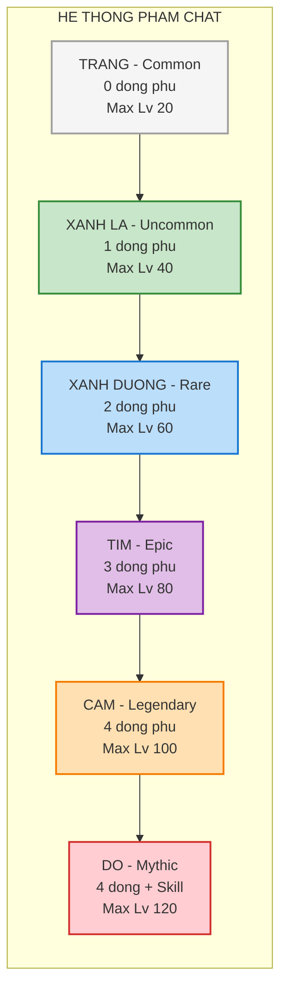
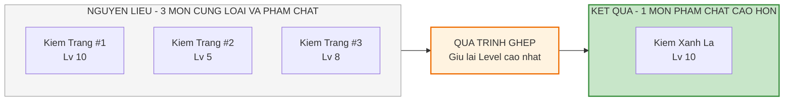
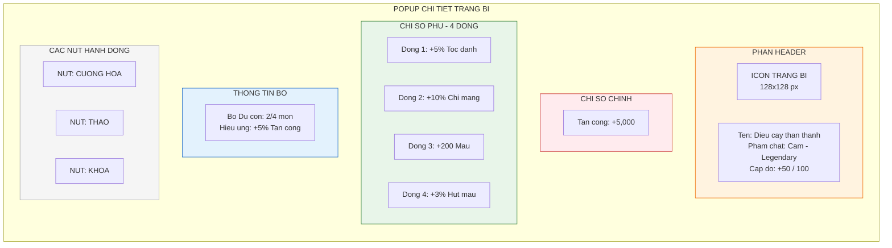

# Hệ thống trang bị

Tài liệu này mô tả chi tiết về các loại trang bị, phẩm chất, thuộc tính và các cơ chế tương tác. Đây là một trong những hệ thống quan trọng nhất ảnh hưởng đến sức mạnh nhân vật.

---

## 1. Tổng quan hệ thống (System overview)

### 1.1. Vai trò của trang bị

Trang bị là nguồn sức mạnh thứ hai sau hệ thống nâng cấp chỉ số bằng vàng. Trang bị cung cấp:

- Chỉ số cơ bản (base stats) dựa trên loại slot
- Chỉ số phụ (sub-stats) ngẫu nhiên dựa trên phẩm chất
- Hiệu ứng bộ (set effects) khi mặc đủ số món

### 1.2. Số lượng slot trang bị

Mỗi nhân vật có 4 slot trang bị thể hiện bằng hình ảnh bao quanh nhân vật trong tab trang bị:

| Slot                       | Vị trí UI      | Chỉ số chính                  | Ghi chú                            |
| :------------------------- | :------------- | :---------------------------- | :--------------------------------- |
| **Vũ khí (Weapon)**        | Bên trái       | Tấn công (ATK)                | Ảnh hưởng trực tiếp đến sát thương |
| **Áo (Armor)**             | Phía dưới trái | Máu (HP) hoặc phòng thủ (DEF) | Tăng khả năng sống sót             |
| **Giày (Boots)**           | Phía dưới phải | Tốc độ đánh (ASPD)            | Slot quan trọng nhất cho DPS       |
| **Dây chuyền (Accessory)** | Bên phải       | Chí mạng (CRIT)               | Khó kiếm nhất, ảnh hưởng lớn       |

---

## 2. Cấu trúc dữ liệu trang bị (Equipment data structure)

### 2.1. Các thuộc tính của một món trang bị

Mỗi món trang bị đều được định nghĩa bởi các thuộc tính sau:

| Thuộc tính        | Tên tiếng Anh | Mô tả                                    | Ví dụ                |
| :---------------- | :------------ | :--------------------------------------- | :------------------- |
| **ID**            | equipment_id  | Mã định danh duy nhất                    | "weapon_001"         |
| **Loại**          | slot_type     | Vị trí mặc: vũ khí, áo, giày, dây chuyền | "weapon"             |
| **Phẩm chất**     | rarity        | Độ quý hiếm thể hiện qua màu sắc         | "legendary"          |
| **Cấp bậc**       | tier          | Giai đoạn game: sắt, thép, vàng...       | "iron"               |
| **Cấp độ**        | level         | Cấp cường hóa hiện tại                   | 25                   |
| **Cấp độ tối đa** | max_level     | Giới hạn theo phẩm chất                  | 100                  |
| **Chỉ số cơ bản** | base_stat     | Chỉ số chính mặc định                    | 500 ATK              |
| **Chỉ số phụ**    | sub_stats     | Các dòng chỉ số ngẫu nhiên               | [+5% CRIT, +3% ASPD] |
| **Set ID**        | set_id        | Thuộc bộ nào (nếu có)                    | "gangster_set"       |
| **Khóa**          | is_locked     | Trạng thái bảo vệ khỏi bán/phân giải     | true/false           |

### 2.2. Cấu trúc JSON mẫu (cho developer)

```json
{
  "equipment_id": "weapon_legendary_001",
  "name": "Điếu cày thần thánh",
  "slot_type": "weapon",
  "rarity": "legendary",
  "tier": "gold",
  "level": 50,
  "max_level": 100,
  "base_stat": {
    "type": "ATK",
    "value": 5000
  },
  "sub_stats": [
    { "type": "ASPD_PERCENT", "value": 5 },
    { "type": "CRIT_RATE", "value": 10 },
    { "type": "HP_FLAT", "value": 200 },
    { "type": "LIFESTEAL", "value": 3 }
  ],
  "set_id": "gangster_set",
  "is_locked": false
}
```

---

## 3. Phân loại phẩm chất (Rarity system)

### 3.1. Hệ thống màu sắc

Phẩm chất được phân định bằng màu sắc theo chuẩn game RPG. Màu sắc càng cao, item càng mạnh và hiếm.

| Mã màu         | Tên tiếng Việt | Tên tiếng Anh | Số dòng chỉ số phụ | Max level | Ghi chú                      |
| :------------- | :------------- | :------------ | :----------------- | :-------- | :--------------------------- |
| **Trắng**      | Thường         | Common        | 0                  | 20        | Chủ yếu làm nguyên liệu      |
| **Xanh lá**    | Tốt            | Uncommon      | 1                  | 40        | Dùng giai đoạn đầu game      |
| **Xanh dương** | Hiếm           | Rare          | 2                  | 60        | Trang bị tiêu chuẩn mid-game |
| **Tím**        | Sử thi         | Epic          | 3                  | 80        | Item chủ lực mid-game        |
| **Cam**        | Huyền thoại    | Legendary     | 4                  | 100       | Có thể có hiệu ứng đặc biệt  |
| **Đỏ**         | Thần thoại     | Mythic        | 4 + 1 skill        | 120       | Endgame, cực hiếm            |

### 3.2. Tỉ lệ rơi từ các nguồn

| Phẩm chất      | Farm quái | Gacha x1 | Gacha x10 (bảo hiểm) |
| :------------- | :-------- | :------- | :------------------- |
| **Trắng**      | 60%       | 50%      | -                    |
| **Xanh lá**    | 30%       | 30%      | -                    |
| **Xanh dương** | 8%        | 15%      | Tối thiểu 1          |
| **Tím**        | 1.5%      | 4%       | -                    |
| **Cam**        | 0.4%      | 0.9%     | -                    |
| **Đỏ**         | 0.1%      | 0.1%     | -                    |

### 3.3. Sơ đồ hiển thị phẩm chất



---

## 4. Chi tiết 4 loại trang bị chính

### 4.1. Vũ khí (Weapon)

| Thuộc tính            | Mô tả                                             |
| :-------------------- | :------------------------------------------------ |
| **Đại diện cho**      | Sức mạnh tấn công vật lý                          |
| **Chỉ số chính**      | + Tấn công cố định (ATK) hoặc + Tấn công % (ATK%) |
| **Tác động gameplay** | Ảnh hưởng trực tiếp đến tốc độ diệt quái          |

**Danh sách asset hình ảnh (cho artist):**

| Tier            | Ví dụ item             | Mô tả hình ảnh                     |
| :-------------- | :--------------------- | :--------------------------------- |
| **Bình dân**    | Cây gậy                | Cây gậy tre đơn giản               |
| **Bình dân**    | Cục gạch               | Viên gạch đỏ vỡ góc                |
| **Bình dân**    | Điếu cày               | Điếu cày tre truyền thống Việt Nam |
| **Bình dân**    | Dép lào                | Chiếc dép tổ ong cao su            |
| **Cao cấp**     | Gậy bóng chày đinh     | Gậy gỗ có đóng đinh                |
| **Cao cấp**     | Kiếm đồ chơi phát sáng | Kiếm nhựa LED 7 màu                |
| **Cao cấp**     | Súng nước áp lực cao   | Súng nước công nghiệp              |
| **Huyền thoại** | Điếu cày thần thánh    | Điếu cày bọc vàng, có aura         |

### 4.2. Áo (Armor)

| Thuộc tính            | Mô tả                                  |
| :-------------------- | :------------------------------------- |
| **Đại diện cho**      | Khả năng sinh tồn (máu và giáp)        |
| **Chỉ số chính**      | + Máu (HP) hoặc + Phòng thủ (DEF)      |
| **Tác động gameplay** | Quyết định khả năng sống khi đánh boss |

**Danh sách asset hình ảnh:**

| Tier            | Ví dụ item          | Mô tả hình ảnh                    |
| :-------------- | :------------------ | :-------------------------------- |
| **Bình dân**    | Áo ba lỗ            | Áo ba lỗ trắng/đen đơn giản       |
| **Bình dân**    | Áo mưa giấy         | Áo mưa nilon trong suốt           |
| **Bình dân**    | Áo thun in hình     | Áo thun có in hình ngộ nghĩnh     |
| **Bình dân**    | Giáp bìa carton     | Hộp carton khoét lỗ đội lên người |
| **Cao cấp**     | Áo giáp chống đạn   | Áo giáp đen chuyên nghiệp         |
| **Cao cấp**     | Bộ đồ phi hành gia  | Bộ đồ trắng có mũ bảo hiểm        |
| **Huyền thoại** | Áo choàng siêu nhân | Áo choàng đỏ có logo              |

### 4.3. Giày (Boots)

| Thuộc tính            | Mô tả                                                     |
| :-------------------- | :-------------------------------------------------------- |
| **Đại diện cho**      | Tốc độ ra đòn                                             |
| **Chỉ số chính**      | + Tốc độ đánh (ASPD) hoặc + Né tránh (EVA)                |
| **Tác động gameplay** | Slot quan trọng nhất để tăng DPS vì ASPD có hard cap thấp |

**Lưu ý cho game designer:** ASPD là chỉ số có diminishing return lớn nhất. Mỗi % tăng thêm ở level cao sẽ có giá trị cao hơn nhiều so với level thấp.

### 4.4. Dây chuyền (Accessory)

| Thuộc tính            | Mô tả                                                              |
| :-------------------- | :----------------------------------------------------------------- |
| **Đại diện cho**      | Sự may mắn và kỹ thuật chiến đấu                                   |
| **Chỉ số chính**      | + Tỉ lệ chí mạng (CRIT Rate) hoặc + Sát thương chí mạng (CRIT Dmg) |
| **Tác động gameplay** | Slot khó kiếm nhất, tỉ lệ rơi thấp hơn 3 slot còn lại              |

---

## 5. Cơ chế tương tác (Upgrade mechanics)

### 5.1. Cường hóa (Level up)

Tăng cấp độ (level) của trang bị để tăng chỉ số cơ bản.

| Thuộc tính            | Chi tiết                                                  |
| :-------------------- | :-------------------------------------------------------- |
| **Nguyên liệu**       | Vàng + Cờ lê                                              |
| **Kết quả**           | Tăng chỉ số cơ bản (base stat). Chỉ số phụ không thay đổi |
| **Giới hạn**          | Level trang bị không được vượt quá level nhân vật         |
| **Công thức chi phí** | `Cost = BaseCost * (1.07 ^ Level)`                        |

**Bảng chi phí mẫu (cho balancing):**

| Level    | Chi phí vàng | Cờ lê cần | Chỉ số tăng thêm |
| :------- | :----------- | :-------- | :--------------- |
| 1 -> 10  | 1,000        | 10        | +100 ATK         |
| 10 -> 20 | 5,000        | 25        | +150 ATK         |
| 20 -> 30 | 15,000       | 50        | +200 ATK         |
| 30 -> 40 | 50,000       | 100       | +250 ATK         |
| 40 -> 50 | 150,000      | 200       | +300 ATK         |

### 5.2. Ghép trang bị (Merge / Fusion)

Cơ chế cốt lõi để "dọn rác" trong kho đồ và tiến lên phẩm chất cao hơn. Lấy cảm hứng từ các game Archero hoặc Survivor.io.

**Quy tắc 3-đổi-1:**



| Ghép từ                    | Thành                      | Ghi chú                    |
| :------------------------- | :------------------------- | :------------------------- |
| 3 mon Trang cung loai      | 1 mon Xanh la cung loai    | -                          |
| 3 mon Xanh la cung loai    | 1 mon Xanh duong cung loai | -                          |
| 3 mon Xanh duong cung loai | 1 mon Tim cung loai        | -                          |
| 3 mon Tim cung loai        | 1 mon Cam cung loai        | Yeu cau them Vang          |
| 3 mon Cam cung loai        | 1 mon Do cung loai         | Yeu cau them Vang + Da quy |

**Quy tắc kế thừa:**

- Món đồ kết quả giữ lại level cường hóa cao nhất của 3 nguyên liệu
- Hoặc: Hoàn trả 50% tài nguyên (vàng, cờ lê) đã dùng cho 2 món bị tiêu hủy

### 5.3. Tẩy luyện (Reforge)

Tính năng dành cho người chơi muốn tối ưu trang bị cao cấp.

| Thuộc tính      | Chi tiết                                   |
| :-------------- | :----------------------------------------- |
| **Áp dụng cho** | Đồ tím (epic) trở lên                      |
| **Chức năng**   | Random lại các dòng chỉ số phụ (sub-stats) |
| **Nguyên liệu** | Đá tẩy luyện (chỉ có từ shop hoặc event)   |
| **Lưu ý**       | Không ảnh hưởng đến chỉ số chính và level  |

---

## 6. Hiệu ứng bộ (Set effects)

Để tăng chiều sâu chiến thuật và khuyến khích người chơi thu thập đủ bộ.

### 6.1. Danh sách bộ trang bị

| Tên bộ                   | Hiệu ứng 2 món          | Hiệu ứng 4 món                             |
| :----------------------- | :---------------------- | :----------------------------------------- |
| **Bộ "Du côn"**          | +5% tấn công            | +10% tỉ lệ chí mạng                        |
| **Bộ "Nồi đồng cối đá"** | +10% máu tối đa         | Hồi 1% máu mỗi giây                        |
| **Bộ "Tốc độ"**          | +5% tốc độ đánh         | Mỗi đòn đánh thứ 3 gây thêm 50% sát thương |
| **Bộ "Hút máu"**         | +3% hút máu             | Khi tiêu diệt địch, hồi 5% máu tối đa      |
| **Bộ "Độc hại"**         | +10% sát thương kỹ năng | Kỹ năng có 20% gây thêm độc 3 giây         |

### 6.2. Cách kích hoạt

- Mặc 2 món cùng bộ: Kích hoạt hiệu ứng 2 món
- Mặc 4 món cùng bộ: Kích hoạt cả hiệu ứng 2 món và 4 món
- Các món không cần cùng loại slot (có thể 2 vũ khí cùng bộ nếu có hệ thống swap)

---

## 7. Thiết kế UI popup thông tin trang bị

### 7.1. Wireframe popup chi tiết



### 7.2. Yêu cầu cho UI designer

| Thành phần        | Yêu cầu                                 |
| :---------------- | :-------------------------------------- |
| **Icon trang bị** | 128x128 px, có viền màu theo phẩm chất  |
| **Tên trang bị**  | Font bold, màu theo phẩm chất           |
| **Chỉ số chính**  | Font lớn, màu đỏ, nổi bật               |
| **Chỉ số phụ**    | Font nhỏ hơn, màu xanh lá               |
| **Nút hành động** | Dạng pill button, có icon đi kèm        |
| **Animation**     | Popup slide từ dưới lên, có backdrop mờ |

---

## 8. Hướng dẫn cho đội phát triển

### 8.1. Cho lập trình viên (Developers)

- Sử dụng ScriptableObject (Unity) hoặc Resource (Godot) để lưu data trang bị
- Implement hệ thống ID để tránh duplicate
- Hệ thống ghép cần kiểm tra đủ điều kiện: cùng loại, cùng phẩm chất, đủ số lượng
- Lưu trạng thái khóa (lock) vào save file để tránh mất đồ xịn

### 8.2. Cho họa sĩ (Artists)

- Mỗi tier cần 4-6 asset cho mỗi loại slot (vũ khí, áo, giày, dây chuyền)
- Sprite size: 128x128 cho icon, 256x256 cho hiển thị trong popup
- Cần có asset cho từng phẩm chất (khung viền màu khác nhau)
- Hiệu ứng glow cho đồ cam và đỏ

### 8.3. Cho sound designer

- Âm thanh cường hóa thành công: Tiếng rèn sắt + tiếng ding
- Âm thanh ghép trang bị: Tiếng hợp nhất + tiếng chói sáng
- Âm thanh mặc đồ: Tiếng xoạch nhẹ
- Âm thanh tháo đồ: Tiếng click nhẹ

### 8.4. Cho game designer (Balancing)

- Chỉ số phụ nên có weight khác nhau khi roll random
- CRIT và ASPD nên có weight thấp hơn HP và ATK
- Đồ cam và đỏ nên có min roll cao hơn để đảm bảo không "rác"
- Cân nhắc thêm "pity" cho hệ thống ghép (ghép X lần không lên cam thì lần tiếp chắc chắn lên)
