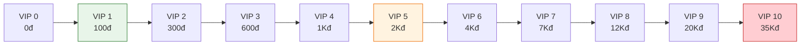

# Hệ thống VIP

Tài liệu này mô tả chi tiết về hệ thống VIP - cơ chế phân loại và ưu đãi người chơi dựa trên mức độ chi tiêu.

---

## 1. Tổng quan hệ thống

### 1.1. Khái niệm

| Thuộc tính     | Mô tả                                                |
| :------------- | :--------------------------------------------------- |
| **Tên gọi**    | VIP / Thành viên Thân thiết                          |
| **Mục đích**   | Tri ân người chơi chi tiêu, tạo động lực nạp tiền    |
| **Cơ chế**     | Tích lũy điểm VIP qua nạp tiền, lên cấp VIP          |
| **Đặc điểm**   | Vĩnh viễn, không reset, chỉ tăng không giảm          |

### 1.2. Công thức tính điểm VIP

$$VIP\_Points = Total\_Spent\_VND / 1000$$

*Ví dụ: Nạp 500,000 VND = 500 điểm VIP*

---

## 2. Các cấp độ VIP

### 2.1. Bảng cấp VIP

| Cấp     | Điểm cần | Tương đương nạp | Tên gọi          |
| :------ | :------- | :-------------- | :--------------- |
| VIP 0   | 0        | 0               | Thường dân       |
| VIP 1   | 100      | 100K VND        | Cư dân           |
| VIP 2   | 300      | 300K VND        | Công dân         |
| VIP 3   | 600      | 600K VND        | Tiểu thương      |
| VIP 4   | 1,000    | 1M VND          | Thương gia       |
| VIP 5   | 2,000    | 2M VND          | Đại gia          |
| VIP 6   | 4,000    | 4M VND          | Phú hộ           |
| VIP 7   | 7,000    | 7M VND          | Tỷ phú           |
| VIP 8   | 12,000   | 12M VND         | Trùm khu phố     |
| VIP 9   | 20,000   | 20M VND         | Ông hoàng        |
| VIP 10  | 35,000   | 35M VND         | Huyền thoại      |

### 2.2. Biểu đồ tiến độ VIP

---

## 3. Đặc quyền VIP

### 3.1. Bảng đặc quyền chi tiết

| Đặc quyền                    | V0 | V1 | V2 | V3 | V4 | V5 | V6 | V7 | V8 | V9 | V10 |
| :--------------------------- | :- | :- | :- | :- | :- | :- | :- | :- | :- | :- | :-- |
| **Bonus Kim cương nạp**      | 0% | 5% | 8% | 12% | 15% | 20% | 25% | 30% | 40% | 50% | 60% |
| **Bonus Vàng từ quái**       | 0% | 2% | 4% | 6% | 8% | 10% | 12% | 15% | 18% | 22% | 25% |
| **Bonus EXP**                | 0% | 2% | 4% | 6% | 8% | 10% | 12% | 15% | 18% | 22% | 25% |
| **AFK Cap (giờ)**            | 8  | 10 | 12 | 14 | 16 | 18 | 20 | 22 | 24 | 24 | 24  |
| **Lượt Arena miễn phí**      | 5  | 6  | 7  | 8  | 9  | 10 | 11 | 12 | 14 | 16 | 20  |
| **Lượt Phó bản miễn phí**    | 3  | 4  | 4  | 5  | 5  | 6  | 6  | 7  | 8  | 9  | 10  |
| **Tốc độ x2**                | No | No | Yes| Yes| Yes| Yes| Yes| Yes| Yes| Yes| Yes |
| **Auto Boss**                | No | No | No | Yes| Yes| Yes| Yes| Yes| Yes| Yes| Yes |
| **Bỏ qua quảng cáo**         | No | No | No | No | Yes| Yes| Yes| Yes| Yes| Yes| Yes |
| **Quick Raid phó bản**       | No | No | No | No | No | Yes| Yes| Yes| Yes| Yes| Yes |
| **Gacha x10 đảm bảo Tím+**   | No | No | No | No | No | No | Yes| Yes| Yes| Yes| Yes |
| **Chat VIP channel**         | No | No | No | No | No | No | No | Yes| Yes| Yes| Yes |
| **Customer Support ưu tiên** | No | No | No | No | No | No | No | No | Yes| Yes| Yes |
| **Early Access features**    | No | No | No | No | No | No | No | No | No | Yes| Yes |

### 3.2. Quà lên cấp VIP

Mỗi khi đạt cấp VIP mới, người chơi nhận quà ngay lập tức:

| Cấp VIP | Quà lên cấp                                              |
| :------ | :------------------------------------------------------- |
| VIP 1   | 50 KC + 5 Vé Gacha                                       |
| VIP 2   | 100 KC + 10 Vé Gacha + Khung avatar VIP2                 |
| VIP 3   | 200 KC + Trang bị Tím ngẫu nhiên                         |
| VIP 4   | 300 KC + Đồng đội Epic ngẫu nhiên                        |
| VIP 5   | 500 KC + Trang bị Cam ngẫu nhiên + Danh hiệu "Đại Gia"   |
| VIP 6   | 800 KC + Đồng đội Epic (chọn 1 trong 3)                  |
| VIP 7   | 1000 KC + Trang bị Cam (chọn loại) + Skin VIP            |
| VIP 8   | 1500 KC + Đồng đội Legendary ngẫu nhiên                  |
| VIP 9   | 2000 KC + Đồng đội Legendary (chọn 1 trong 3)            |
| VIP 10  | 3000 KC + Set trang bị Cam đầy đủ + Skin Exclusive       |

### 3.3. Quà VIP hàng ngày

Mỗi ngày, VIP được nhận quà miễn phí:

| Cấp VIP | Quà hàng ngày                          |
| :------ | :------------------------------------- |
| VIP 1-2 | 500 Vàng + 1 Chìa khóa                 |
| VIP 3-4 | 2,000 Vàng + 3 Chìa khóa + 5 KC        |
| VIP 5-6 | 5,000 Vàng + 5 Chìa khóa + 10 KC       |
| VIP 7-8 | 10,000 Vàng + 10 Chìa khóa + 20 KC     |
| VIP 9-10 | 20,000 Vàng + 15 Chìa khóa + 30 KC + 1 Vé |

---

## 4. VIP Shop

Cửa hàng đặc biệt chỉ dành cho VIP với giá ưu đãi:

### 4.1. Gói nạp VIP Exclusive

| Gói               | Giá (VND)  | Nội dung                          | Yêu cầu VIP |
| :---------------- | :--------- | :-------------------------------- | :---------- |
| Gói VIP Ngày      | 22,000     | 100 KC + 50K Vàng (mua 1 lần/ngày) | VIP 1+      |
| Gói VIP Tuần      | 99,000     | 500 KC + 200K Vàng + 10 Vé        | VIP 3+      |
| Gói VIP Tháng     | 499,000    | 3000 KC + 1M Vàng + Đồng đội Epic | VIP 5+      |
| Gói VIP Ultimate  | 2,199,000  | 15000 KC + Đồng đội Legendary chọn | VIP 8+      |

### 4.2. So sánh giá trị

| Gói thường       | Giá      | KC      | Gói VIP tương đương | Giá      | KC      | Tiết kiệm |
| :--------------- | :------- | :------ | :------------------ | :------- | :------ | :-------- |
| Gói KC Nhỏ       | 22,000   | 60      | Gói VIP Ngày        | 22,000   | 100     | +67%      |
| Gói KC Vừa       | 109,000  | 330     | Gói VIP Tuần        | 99,000   | 500     | +60%      |

---

## 5. Hệ thống phân biệt VIP

### 5.1. Visual elements

| Element             | Mô tả                                    |
| :------------------ | :--------------------------------------- |
| **Khung avatar**    | Khung vàng với số VIP, fancy animation   |
| **Biểu tượng chat** | Icon VIP cạnh tên trong chat             |
| **Màu tên**         | Tên màu vàng/cam trong các bảng xếp hạng |
| **Hiệu ứng login**  | Animation đặc biệt khi vào game          |

### 5.2. Màu sắc theo cấp VIP

| Cấp       | Màu sắc      | Mã màu  |
| :-------- | :----------- | :------ |
| VIP 1-2   | Xanh lá nhạt | #81C784 |
| VIP 3-4   | Xanh dương   | #64B5F6 |
| VIP 5-6   | Tím          | #BA68C8 |
| VIP 7-8   | Cam          | #FFB74D |
| VIP 9-10  | Đỏ vàng      | #FF5722 |

---

## 6. VIP Customer Support

### 6.1. Kênh hỗ trợ riêng

| Cấp VIP   | Kênh hỗ trợ                    | Thời gian phản hồi |
| :-------- | :----------------------------- | :----------------- |
| VIP 0-4   | Email, In-game ticket          | 24-48 giờ          |
| VIP 5-7   | Email ưu tiên, Live chat       | 12-24 giờ          |
| VIP 8-9   | Hotline riêng, Zalo OA         | 6-12 giờ           |
| VIP 10    | Account Manager riêng          | 1-6 giờ            |

### 6.2. Chính sách đặc biệt

| Chính sách               | VIP 0-4 | VIP 5-7 | VIP 8+ |
| :----------------------- | :------ | :------ | :----- |
| Hoàn tiền IAP lỗi        | 7 ngày  | 14 ngày | 30 ngày |
| Khôi phục account        | Email   | Đa kênh | Ưu tiên |
| Bù lỗi server            | Tiêu chuẩn | +50%  | +100%  |
| Early access test server | Không   | Không   | Có     |

---

## 7. Hướng dẫn cho đội phát triển

### 7.1. Cho lập trình viên

- VIP level lưu server-side, không thể hack
- Apply VIP multipliers sau khi tính base values
- VIP perks cache locally, sync mỗi 5 phút
- Implement VIP check cho mỗi feature unlock

### 7.2. Cho game designer

- VIP perks không được quá P2W (cosmetic > power)
- Balance VIP daily rewards không vượt quá 10% F2P income
- Đảm bảo F2P vẫn có thể cạnh tranh
- Review VIP conversion rate monthly

### 7.3. Cho UI designer

- VIP indicator hiển thị khắp nơi nhưng không quá rối
- Thanh tiến độ VIP cần rõ ràng, motivating
- Popup lên cấp VIP cần hoành tráng
- VIP shop riêng biệt, dễ tìm

### 7.4. Cho customer support

- Training riêng cho VIP 8+ handling
- SLA documentation cho từng tier
- Escalation path rõ ràng
- Compensation guidelines theo VIP level
