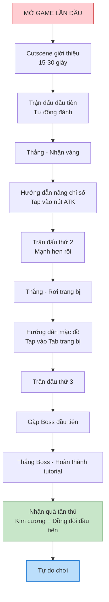

# Hướng dẫn người chơi mới

Tài liệu này mô tả chi tiết luồng hướng dẫn (Tutorial) và trải nghiệm lần đầu (FTUE - First Time User Experience) để giúp người chơi mới hiểu game nhanh nhất.

---

## 1. Nguyên tắc thiết kế hướng dẫn

### 1.1. Triết lý

| Nguyên tắc           | Mô tả                                                                 |
| :------------------- | :-------------------------------------------------------------------- |
| **Học qua chơi**     | Không dùng tường text, hướng dẫn thông qua hành động thực tế          |
| **Không ép buộc**    | Cho phép skip sau khi hiểu cơ bản, người chơi có thể khám phá tự do   |
| **Tiến bộ từ từ**    | Mở khóa tính năng dần dần, không overwhelm người chơi mới             |
| **Khen thưởng ngay** | Mỗi bước hoàn thành đều có phần thưởng nhỏ để tạo cảm giác thành công |

### 1.2. Thời lượng mục tiêu

| Phần                  | Thời lượng   | Mục tiêu                               |
| :-------------------- | :----------- | :------------------------------------- |
| **Tutorial cơ bản**   | 2-3 phút     | Hiểu cách chiến đấu và core loop       |
| **Hướng dẫn mở rộng** | 5-10 phút    | Biết tất cả các tab và tính năng chính |
| **Tự khám phá**       | Sau level 10 | Không còn bàn tay chỉ dẫn              |

---

## 2. Luồng hướng dẫn cơ bản (Core tutorial)

### 2.1. Sơ đồ luồng

### 2.2. Chi tiết từng bước

#### Bước 1: Cutscene mở đầu

| Thành phần         | Mô tả                                                         |
| :----------------- | :------------------------------------------------------------ |
| **Nội dung**       | Khu phố yên bình bị quấy rối bởi lũ chó hoang và giang hồ mõm |
| **Nhân vật chính** | Xuất hiện với dép tổ ong và cây gậy gỗ                        |
| **Thời lượng**     | 15-30 giây                                                    |
| **Có thể skip**    | Có, sau 3 giây                                                |
| **Phong cách**     | Comic panel hoặc animation 2D đơn giản                        |

#### Bước 2: Trận đấu tự động đầu tiên

| Thành phần         | Mô tả                                     |
| :----------------- | :---------------------------------------- |
| **Hướng dẫn hiện** | "Nhân vật sẽ tự động chiến đấu. Hãy xem!" |
| **Kẻ địch**        | 3 con chó cỏ (rất yếu, chết 1-2 hit)      |
| **Mục đích**       | Cho người chơi hiểu game tự động đánh     |
| **Phần thưởng**    | 500 vàng + popup chúc mừng                |

#### Bước 3: Hướng dẫn nâng cấp chỉ số

| Thành phần      | Mô tả                                            |
| :-------------- | :----------------------------------------------- |
| **Bàn tay chỉ** | Chỉ vào Tab "Chỉ số" (Tab 1)                     |
| **Hướng dẫn**   | "Tap để nâng cấp sức tấn công!"                  |
| **Highlight**   | Làm mờ mọi thứ khác, chỉ sáng nút nâng cấp ATK   |
| **Sau khi tap** | Text "+100 ATK" bay lên, hiển thị lực chiến tăng |
| **Phần thưởng** | 200 vàng                                         |

#### Bước 4: Trận đấu thứ 2

| Thành phần      | Mô tả                                           |
| :-------------- | :---------------------------------------------- |
| **Hướng dẫn**   | "Giờ thì bạn mạnh hơn rồi! Tiếp tục chiến đấu!" |
| **Kẻ địch**     | 5 con chó cỏ                                    |
| **Highlight**   | Số sát thương bay lên lớn hơn trước             |
| **Phần thưởng** | 1 trang bị (vũ khí xanh lá) + 500 vàng          |

#### Bước 5: Hướng dẫn trang bị

| Thành phần      | Mô tả                                            |
| :-------------- | :----------------------------------------------- |
| **Bàn tay chỉ** | Chỉ vào Tab "Trang bị" (Tab 2)                   |
| **Hướng dẫn**   | "Bạn có vũ khí mới! Hãy trang bị nó!"            |
| **Thao tác**    | Tap vào item trong túi -> Tap "Mặc"              |
| **Hiệu ứng**    | Nhân vật thay đổi vũ khí trên màn hình chiến đấu |
| **Phần thưởng** | 300 vàng                                         |

#### Bước 6: Đánh Boss đầu tiên

| Thành phần      | Mô tả                                                      |
| :-------------- | :--------------------------------------------------------- |
| **Hướng dẫn**   | "Boss xuất hiện! Hãy tiêu diệt hắn!"                       |
| **Boss**        | Đại ca khu phố (yếu hóa cho tutorial, chỉ có 20% sức mạnh) |
| **Hiệu ứng**    | Warning text "BOSS XUAT HIEN", nhạc đổi                    |
| **Phần thưởng** | 50 kim cương + 1 đồng đội (Chú Ba xe ôm)                   |

---

## 3. Hướng dẫn mở rộng theo level

Sau tutorial cơ bản, các tính năng được mở khóa dần theo level người chơi.

### 3.1. Lộ trình mở khóa tính năng

| Level | Tính năng mở khóa               | Hướng dẫn                |
| :---- | :------------------------------ | :----------------------- |
| 1     | Chiến đấu cơ bản, Tab chỉ số    | Tutorial bắt buộc        |
| 3     | Tab trang bị                    | Bàn tay chỉ + tooltip    |
| 5     | Slot đồng đội 1                 | Popup giới thiệu         |
| 8     | Tab kỹ năng                     | Bàn tay chỉ + tooltip    |
| 10    | Slot đồng đội 2                 | Popup chúc mừng          |
| 12    | Phó bản đầu tiên                | Popup với nút "Thử ngay" |
| 15    | Hệ thống gacha                  | Tour hướng dẫn ngắn      |
| 20    | Shop                            | Popup giới thiệu         |
| 25    | Slot đồng đội 3                 | Popup chúc mừng          |
| 30    | Hệ thống duyên phận             | Tooltip giải thích       |
| 50    | Slot đồng đội 4, Slot kỹ năng 4 | Thông báo mở khóa        |

### 3.2. Tooltip theo ngữ cảnh

Khi người chơi mới chạm vào một tính năng chưa biết:

| Tình huống            | Tooltip hiển thị                               |
| :-------------------- | :--------------------------------------------- |
| **Lần đầu mở Tab**    | Giải thích ngắn gọn mục đích của tab           |
| **Hover vào icon lạ** | Tên và mô tả 1 dòng                            |
| **Đủ vàng nâng cấp**  | Highlight nút + text "Bạn có thể nâng cấp!"    |
| **Có trang bị mới**   | Badge "New" + tooltip "Mặc đồ mới để mạnh hơn" |

---

## 4. Hệ thống nhắc nhở (Reminder system)

### 4.1. Chấm thông báo đỏ

Hiển thị chấm đỏ nhỏ trên icon khi có hành động được khuyến nghị.

| Vị trí       | Điều kiện hiện                | Mục đích           |
| :----------- | :---------------------------- | :----------------- |
| Tab chỉ số   | Đủ vàng nâng cấp bất kỳ stat  | Nhắc tiêu vàng     |
| Tab trang bị | Có đồ mới hoặc có thể ghép    | Nhắc trang bị      |
| Tab kỹ năng  | Có mảnh mới hoặc có thể nâng  | Nhắc nâng skill    |
| Tab đồng đội | Có thể level up hoặc tăng sao | Nhắc nâng đồng đội |
| Tab gacha    | Có lượt quay miễn phí         | Nhắc quay gacha    |

### 4.2. Popup gợi ý

Popup nhẹ nhàng xuất hiện khi người chơi không biết phải làm gì.

| Tình huống                     | Gợi ý                                              |
| :----------------------------- | :------------------------------------------------- |
| **Đứng im 30 giây**            | "Tip: Nâng cấp chỉ số để mạnh hơn!"                |
| **Thua boss 3 lần**            | "Gợi ý: Thử nâng cấp trang bị hoặc thêm đồng đội!" |
| **Không nâng gì trong 5 phút** | "Bạn có vàng chưa dùng. Nâng cấp ngay!"            |

---

## 5. Quà tân thủ (Newbie rewards)

### 5.1. Gói quà đăng nhập 7 ngày

| Ngày   | Phần thưởng                    | Ghi chú               |
| :----- | :----------------------------- | :-------------------- |
| Ngày 1 | 100 kim cương + 10,000 vàng    | Welcome gift          |
| Ngày 2 | 1 trang bị tím ngẫu nhiên      | Khuyến khích quay lại |
| Ngày 3 | 50 kim cương + 5 vé gacha      | Giới thiệu gacha      |
| Ngày 4 | Đồng đội "Cô Tư bán nước"      | Có thêm support       |
| Ngày 5 | 100 kim cương + 20 bánh mì     | Tài nguyên            |
| Ngày 6 | 3 kỹ năng xanh dương           | Mở rộng gameplay      |
| Ngày 7 | 500 kim cương + 1 trang bị cam | Grand finale          |

### 5.2. Nhiệm vụ tân thủ (Thay thế sau khi hết 7 ngày)

| Nhiệm vụ              | Yêu cầu                  | Phần thưởng   |
| :-------------------- | :----------------------- | :------------ |
| Học đi rồi học chạy   | Hoàn thành tutorial      | 100 kim cương |
| Chiến binh cấp 10     | Đạt level 10             | 50 kim cương  |
| Đội hình đầy đủ       | Có 4 đồng đội trong team | 100 kim cương |
| Trang bị tím đầu tiên | Sở hữu 1 item tím        | 50 kim cương  |
| Vượt chương 1         | Đánh bại boss chương 1   | 200 kim cương |

---

## 6. Hướng dẫn cho đội phát triển

### 6.1. Cho lập trình viên

- Implement tutorial flags trong save file để không lặp lại
- Highlight system: làm mờ UI khác, chỉ sáng element cần tap
- Skip button sau 3 giây cho mọi cutscene
- Track funnel: bao nhiêu % người chơi hoàn thành từng bước

### 6.2. Cho UI designer

- Bàn tay chỉ dẫn: Animated, có bounce effect
- Popup tutorial: Nhỏ gọn, không che hết màn hình
- Màu sắc highlight: Vàng/Cam nổi bật
- Progress bar cho tutorial: "Bước 3/6"

### 6.3. Cho game designer

- Đảm bảo tutorial không quá 3 phút
- Phần thưởng tutorial đủ để người chơi có first impression tốt
- Test với người chưa chơi game idle để xem có hiểu không
- A/B test độ dài tutorial

### 6.4. Cho sound designer

- Âm thanh "ding" khi hoàn thành bước
- Nhạc nền tutorial vui tươi, nhẹ nhàng
- Voice-over (optional): Lồng tiếng hướng dẫn bằng tiếng Việt
