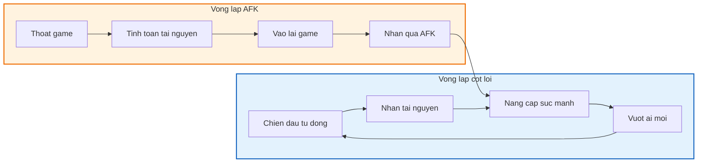
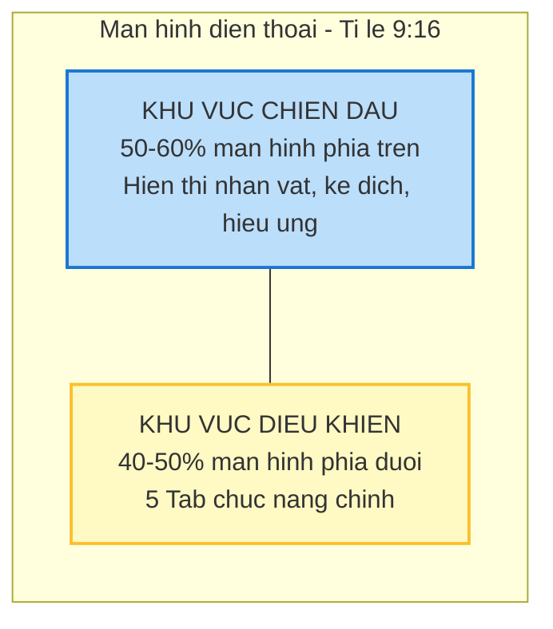

# Kịch bản và kế hoạch tổng thể game IDLE AFK mobile: "Bảo vệ khu phố"

Tài liệu này là bản mô tả tổng quan (Game Design Document Overview) cho dự án game mobile thể loại Idle/AFK. Đây là tài liệu nền tảng, định hướng cho toàn bộ quá trình phát triển.

---

## 1. Tổng quan dự án (Project overview)

### 1.1. Thông tin cơ bản

| Hạng mục                  | Mô tả chi tiết                                         |
| :------------------------ | :----------------------------------------------------- |
| **Tên game**              | Bảo vệ khu phố                                         |
| **Thể loại**              | Idle/AFK RPG (nhàn rỗi, tự động chiến đấu)             |
| **Nền tảng**              | Mobile (Android, iOS)                                  |
| **Định dạng màn hình**    | Dọc (Portrait), tỉ lệ 9:16                             |
| **Đối tượng**             | Casual gamer, người chơi bận rộn, thích game nhẹ nhàng |
| **Phong cách nghệ thuật** | Cartoon 2D, hài hước, tông màu tươi sáng               |
| **Engine đề xuất**        | Unity 2D hoặc Godot                                    |

### 1.2. Tầm nhìn sản phẩm (Product vision)

Xây dựng một tựa game mobile màn hình dọc, thuộc thể loại Idle AFK, lấy bối cảnh Việt Nam gần gũi và hài hước. Người chơi đóng vai một thanh niên bình thường đứng lên bảo vệ khu phố khỏi các tệ nạn và mối đe dọa thường nhật.

### 1.3. Điểm khác biệt (Unique selling points)

- **Bối cảnh Việt Nam:** Hình ảnh quen thuộc như quán trà đá, cột điện, xe hủ tiếu, dép tổ ong.
- **Nhân vật hài hước:** Dàn đồng đội là các nhân vật điển hình như bà bán nước, chú xe ôm, anh thợ điện.
- **Gameplay đơn giản:** Phù hợp người chơi bận rộn, chỉ cần mở game vài phút mỗi ngày.
- **Có chiều sâu:** Hệ thống trang bị, kỹ năng, đồng đội cho người muốn tối ưu.

---

## 2. Bối cảnh và cốt truyện (Setting and storyline)

### 2.1. Bối cảnh thế giới game

Game diễn ra tại một góc phố bình dân điển hình của Việt Nam. Các yếu tố hình ảnh đặc trưng bao gồm:

| Yếu tố                 | Mô tả hình ảnh cụ thể                                          |
| :--------------------- | :------------------------------------------------------------- |
| **Kiến trúc**          | Nhà ống, tường sơn vàng/xanh, ban công phơi đồ, cửa cuốn       |
| **Vật dụng đường phố** | Cột điện rối dây, loa phường, biển quảng cáo dán chồng chéo    |
| **Hoạt động**          | Quán trà đá vỉa hè, xe hủ tiếu gõ, tiệm tạp hóa, sạp hàng rong |
| **Phương tiện**        | Xe máy cũ, xe đạp, xe ba gác                                   |

### 2.2. Nhân vật chính (Player character)

- **Giới tính:** Nam (có thể mở rộng thêm nữ).
- **Ngoại hình mặc định:** Áo ba lỗ, quần đùi, dép tổ ong.
- **Tính cách:** Thanh niên bình thường nhưng có tinh thần trách nhiệm với khu phố.
- **Vũ khí khởi đầu:** Cây gậy gỗ hoặc cục gạch.

### 2.3. Kẻ thù (Enemy types)

Kẻ thù là các đối tượng gây rối trật tự khu phố, được phân theo từng chương (chapter):

| Loại kẻ thù          | Mô tả                                         | Xuất hiện tại |
| :------------------- | :-------------------------------------------- | :------------ |
| **Chó thả rông**     | Quái cơ bản, tốc độ cao, máu thấp             | Chương 1      |
| **Giang hồ mõm**     | Quái cận chiến, máu trung bình                | Chương 1-2    |
| **Trẻ trâu nẹt pô**  | Quái tầm xa, gây nhiễu bằng tiếng ồn          | Chương 2      |
| **Đội đòi nợ thuê**  | Quái tinh anh, đánh theo nhóm                 | Chương 3      |
| **Tiếp thị lừa đảo** | Quái đặc biệt, có khả năng buff đồng đội địch | Chương 4      |

### 2.4. Hệ thống boss

Mỗi chương có một boss đại diện:

| Boss                           | Chương | Đặc điểm                                     |
| :----------------------------- | :----- | :------------------------------------------- |
| **Đại ca khu phố**             | 1      | Boss cận chiến, máu cao, có đàn em hỗ trợ    |
| **Tổ trưởng dân phố khó tính** | 2      | Boss có khả năng triệu hồi thêm quái         |
| **Chủ nợ hung dữ**             | 3      | Boss gây sát thương cao, có kỹ năng chí mạng |
| **Trùm tiếp thị đa cấp**       | 4      | Boss có khả năng buff và debuff phức tạp     |

---

## 3. Cơ chế gameplay (Core mechanics)

### 3.1. Định dạng và lối chơi

### 3.2. Mô tả chi tiết các cơ chế

| Cơ chế            | Mô tả chi tiết                                                                                                                           |
| :---------------- | :--------------------------------------------------------------------------------------------------------------------------------------- |
| **Auto-battle**   | Nhân vật tự động tấn công kẻ thù không ngừng nghỉ. Người chơi không cần thao tác trong lúc chiến đấu.                                    |
| **Vượt ải**       | Đánh bại một số lượng quái nhỏ để triệu hồi boss. Diệt boss để qua ải mới. Quái ở ải cao hơn sẽ mạnh hơn nhưng rớt tài nguyên nhiều hơn. |
| **Team building** | Đội hình gồm 1 nhân vật chính và 4 đồng đội. Người chơi lựa chọn và xếp đội hình phù hợp.                                                |
| **AFK/Idle**      | Khi người chơi offline, game vẫn tự động tính toán quá trình chiến đấu và tích lũy tài nguyên. Khi online sẽ nhận lại toàn bộ.           |

### 3.3. Thành phần đội hình

---

## 4. Hệ thống kinh tế và tài nguyên (Economy overview)

### 4.1. Tiền tệ chính

| Tiền tệ       | Vai trò                   | Nguồn kiếm                                                       | Dùng để                                                              |
| :------------ | :------------------------ | :--------------------------------------------------------------- | :------------------------------------------------------------------- |
| **Vàng**      | Tiền tệ cơ bản, dễ kiếm   | Farm quái, treo máy AFK, hoàn thành nhiệm vụ, bán trang bị       | Nâng cấp chỉ số cơ bản, nâng cấp level trang bị, mua vật phẩm cơ bản |
| **Kim cương** | Tiền tệ cao cấp, khó kiếm | Nạp thẻ, thưởng nhiệm vụ ngày, thưởng thành tựu, vượt ải lần đầu | Quay gacha, mua lượt đi phó bản, làm mới cửa hàng                    |

### 4.2. Vật phẩm phụ trợ

| Vật phẩm      | Công dụng                              |
| :------------ | :------------------------------------- |
| **Cờ lê**     | Vật liệu cường hóa và đột phá trang bị |
| **Bí kíp**    | Mảnh kỹ năng, dùng để nâng cấp kỹ năng |
| **Bánh mì**   | Thức ăn tăng level cho đồng đội        |
| **Vé quay**   | Thay thế kim cương khi quay gacha      |
| **Chìa khóa** | Dùng để vào các phó bản tài nguyên     |

---

## 5. Các chức năng chính và bố cục màn hình (Layout overview)

### 5.1. Phân chia màn hình

Game chia màn hình thành 2 khu vực chính với tỉ lệ 50:50 hoặc 60:40 (trên:dưới).

### 5.2. Màn hình trên - khu vực chiến đấu

| Thành phần              | Vị trí         | Mô tả                                                                                          |
| :---------------------- | :------------- | :--------------------------------------------------------------------------------------------- |
| **Khu vực chiến đấu**   | Trung tâm      | Hiển thị nhân vật chính và đồng đội đang chiến đấu với kẻ thù, hiệu ứng kỹ năng, số sát thương |
| **Thông tin ải**        | Trên cùng giữa | Ải hiện tại (ví dụ: 5-10), thanh tiến độ, thanh máu boss (nếu có)                              |
| **Avatar người chơi**   | Góc trên trái  | Hiển thị avatar, level, lực chiến                                                              |
| **Nút chức năng nhanh** | Góc trên phải  | Cài đặt, tốc độ game (x1/x2), bật tắt auto boss                                                |

### 5.3. Màn hình dưới - hệ thống 5 tab chức năng

| Tab       | Tên gọi               | Chức năng chính                                                                          |
| :-------- | :-------------------- | :--------------------------------------------------------------------------------------- |
| **Tab 1** | Chỉ số (Bản thân)     | Nâng cấp sức mạnh cốt lõi bằng vàng: tấn công, phòng thủ, tốc độ đánh, chí mạng          |
| **Tab 2** | Trang bị (Đồ đạc)     | Quản lý 4 món trang bị: vũ khí, áo, giày, dây chuyền. Có thể nâng cấp hoặc ghép trang bị |
| **Tab 3** | Kỹ năng (Tuyệt chiêu) | Quản lý và trang bị kỹ năng chủ động: tấn công, phòng thủ, hồi phục, tăng cường          |
| **Tab 4** | Đồng đội (Anh em)     | Quản lý đội hình 4 người hỗ trợ, nâng cấp level và sao                                   |
| **Tab 5** | Gacha (Vòng quay)     | Quay trang bị, kỹ năng, đồng đội bằng kim cương hoặc vé                                  |

---

## 6. Tóm tắt các hệ thống con (Subsystems summary)

### 6.1. Danh sách tài liệu chi tiết

Mỗi hệ thống sau đây có tài liệu riêng với mô tả đầy đủ:

| Tài liệu                           | Nội dung chính                                                   |
| :--------------------------------- | :--------------------------------------------------------------- |
| **Chi tiết cơ chế gameplay**       | Vòng lặp game, hệ thống chiến đấu, cấu trúc màn chơi, cơ chế AFK |
| **Chi tiết màn hình chiến đấu**    | Thiết kế visual, bố cục HUD, hiệu ứng hình ảnh                   |
| **Chi tiết màn hình điều khiển**   | 5 tab chức năng, popup, tương tác người dùng                     |
| **Hệ thống chỉ số và tăng trưởng** | Công thức tính toán, logic nâng cấp, cân bằng game               |
| **Hệ thống trang bị**              | Loại trang bị, phẩm chất, cơ chế nâng cấp, ghép đồ               |
| **Hệ thống kỹ năng**               | Phân loại kỹ năng, danh sách mẫu, cơ chế nâng cấp                |
| **Hệ thống đồng đội**              | Vai trò, danh sách nhân vật, hệ thống duyên phận                 |
| **Hệ thống kinh tế**               | Dòng chảy tài nguyên, chiến lược monetization                    |
| **Hệ thống gacha**                 | Các loại banner, tỉ lệ rơi, cơ chế bảo hiểm                      |
| **Kế hoạch phát triển**            | Roadmap chi tiết, danh sách công việc, gantt chart               |

---

## 7. Lộ trình phát triển tóm tắt (Development plan summary)

```mermaid
flowchart LR
    subgraph Phase1["Giai doan 1<br/>Nen mong"]
        A1["Thiet lap du an"]
        A2["Core combat"]
        A3["Save/Load"]
    end

    subgraph Phase2["Giai doan 2<br/>Gameplay"]
        B1["He thong chi so"]
        B2["He thong trang bi"]
        B3["He thong ky nang"]
        B4["He thong dong doi"]
        B5["AFK system"]
    end

    subgraph Phase3["Giai doan 3<br/>Kinh te"]
        C1["Shop va tien te"]
        C2["Gacha system"]
        C3["Balancing"]
    end

    subgraph Phase4["Giai doan 4<br/>Hoan thien"]
        D1["UI/UX polish"]
        D2["VFX va audio"]
        D3["Testing"]
        D4["Release"]
    end

    Phase1 --> Phase2 --> Phase3 --> Phase4

    style Phase1 fill:#e8f5e9,stroke:#2e7d32,stroke-width:2px
    style Phase2 fill:#e3f2fd,stroke:#1565c0,stroke-width:2px
    style Phase3 fill:#fff3e0,stroke:#ef6c00,stroke-width:2px
    style Phase4 fill:#fce4ec,stroke:#c2185b,stroke-width:2px
```

---

## 8. Ghi chú cho đội ngũ phát triển (Notes for development team)

### 8.1. Cho lập trình viên (Developers)

- Sử dụng kiến trúc Entity-Component-System (ECS) cho hệ thống chiến đấu.
- Tối ưu cho thiết bị cấu hình thấp (target: 60 FPS trên điện thoại tầm trung).
- Implement save system dạng JSON hoặc Binary với mã hóa cơ bản.
- Hệ thống AFK cần tính toán chính xác, tránh exploit.

### 8.2. Cho họa sĩ (Artists)

- Style: Cartoon 2D, viền đậm (bold outline), tông màu tươi sáng.
- Sprite sheet: 512x512 hoặc 1024x1024 cho nhân vật, animation 24-30 FPS.
- UI: Thiết kế theo tỉ lệ 9:16, hỗ trợ notch và safe area.
- Asset list sẽ được cung cấp trong tài liệu riêng.

### 8.3. Cho sound designer

- BGM: 2-3 track chính (menu, battle, boss battle).
- SFX: Tiếng đánh, tiếng kỹ năng, tiếng UI, tiếng nhặt tiền.
- Phong cách: Vui nhộn, hài hước, có thể sử dụng âm thanh Việt Nam.

### 8.4. Cho game designer

- Cân bằng số liệu dựa trên Soft Launch data.
- Retention target: D1 > 40%, D7 > 15%, D30 > 5%.
- Monetization target: ARPU $0.5-1.0, Conversion rate 3-5%.
