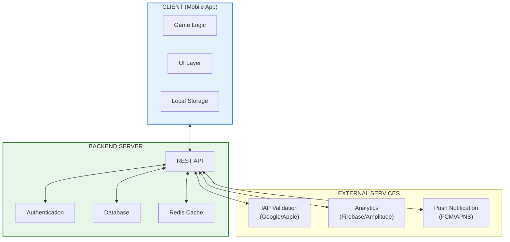
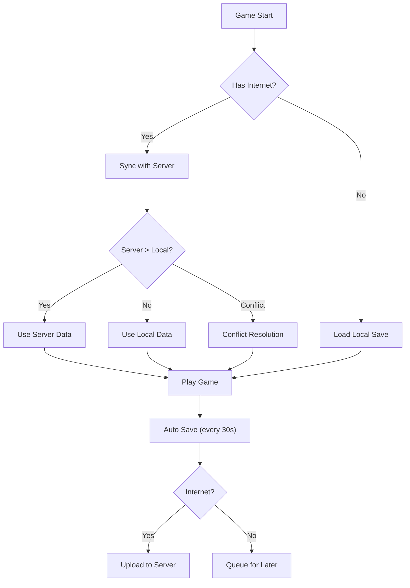
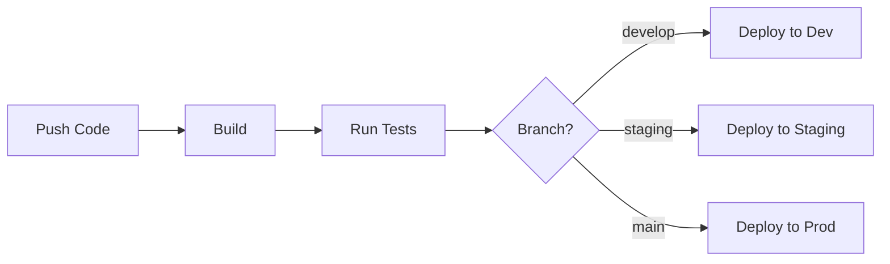

# Kiến trúc kỹ thuật và Server

Tài liệu này mô tả kiến trúc kỹ thuật tổng quan, bao gồm cấu trúc client, server và hệ thống lưu trữ dữ liệu.

---

## 1. Tổng quan kiến trúc

### 1.1. Mô hình hệ thống



### 1.2. Chế độ hoạt động

| Chế độ      | Mô tả                                           | Use case                |
| :---------- | :---------------------------------------------- | :---------------------- |
| **Offline** | Chơi được không cần internet                    | Core gameplay, AFK      |
| **Online**  | Cần internet để sync và validate                | IAP, PvP, Guild, Event  |
| **Hybrid**  | Chơi offline, sync khi có mạng                  | Default mode            |

---

## 2. Client Architecture

### 2.1. Tech Stack đề xuất

| Component       | Lựa chọn 1 (Unity)     | Lựa chọn 2 (Godot)     |
| :-------------- | :--------------------- | :--------------------- |
| **Engine**      | Unity 2022 LTS         | Godot 4.x              |
| **Language**    | C#                     | GDScript / C#          |
| **UI**          | Unity UI Toolkit       | Godot Control nodes    |
| **Networking**  | UnityWebRequest        | HTTPClient             |
| **Storage**     | PlayerPrefs + JSON     | FileAccess + JSON      |
| **Analytics**   | Firebase SDK           | Custom HTTP            |

### 2.2. Cấu trúc Project

```
/Assets (Unity) hoặc /src (Godot)
├── /Scripts
│   ├── /Core
│   │   ├── GameManager.cs
│   │   ├── SaveManager.cs
│   │   └── EventBus.cs
│   ├── /Combat
│   │   ├── CombatManager.cs
│   │   ├── DamageCalculator.cs
│   │   └── EnemySpawner.cs
│   ├── /Systems
│   │   ├── EquipmentSystem.cs
│   │   ├── SkillSystem.cs
│   │   ├── TeammateSystem.cs
│   │   ├── GachaSystem.cs
│   │   └── PrestigeSystem.cs
│   ├── /UI
│   │   ├── /Screens
│   │   ├── /Popups
│   │   └── /Components
│   ├── /Data
│   │   ├── /ScriptableObjects
│   │   └── /Models
│   └── /Network
│       ├── APIClient.cs
│       └── SyncManager.cs
├── /Resources
│   ├── /Prefabs
│   ├── /Sprites
│   ├── /Audio
│   └── /Configs
└── /Plugins
```

### 2.3. Design Patterns sử dụng

| Pattern           | Áp dụng cho                    |
| :---------------- | :----------------------------- |
| **Singleton**     | GameManager, SaveManager       |
| **Observer**      | Event system, UI updates       |
| **Factory**       | Enemy spawning, Item creation  |
| **Object Pool**   | Bullets, Damage text, Enemies  |
| **State Machine** | Combat states, UI navigation   |
| **MVC/MVP**       | UI architecture                |

---

## 3. Server Architecture

### 3.1. Tech Stack

| Component       | Technology              | Lý do                        |
| :-------------- | :---------------------- | :--------------------------- |
| **API**         | Node.js + Express       | Nhanh, phổ biến, dễ scale    |
| **Database**    | PostgreSQL              | Reliable, ACID compliance    |
| **Cache**       | Redis                   | Session, Leaderboard         |
| **Auth**        | JWT + OAuth2            | Secure, standard             |
| **File Storage** | AWS S3 / Cloudflare R2 | Assets, User uploads         |

### 3.2. API Endpoints

#### Authentication

| Method | Endpoint              | Mô tả                    |
| :----- | :-------------------- | :----------------------- |
| POST   | `/auth/login`         | Login with device ID     |
| POST   | `/auth/link`          | Link social account      |
| POST   | `/auth/restore`       | Restore account          |
| GET    | `/auth/verify`        | Verify token             |

#### Player Data

| Method | Endpoint              | Mô tả                    |
| :----- | :-------------------- | :----------------------- |
| GET    | `/player/profile`     | Get player data          |
| POST   | `/player/sync`        | Sync offline progress    |
| PUT    | `/player/settings`    | Update settings          |

#### Gacha & IAP

| Method | Endpoint              | Mô tả                    |
| :----- | :-------------------- | :----------------------- |
| POST   | `/gacha/pull`         | Execute gacha pull       |
| GET    | `/gacha/pity`         | Get pity counter         |
| POST   | `/iap/verify`         | Verify purchase          |
| POST   | `/iap/consume`        | Consume purchase         |

#### Social Features

| Method | Endpoint              | Mô tả                    |
| :----- | :-------------------- | :----------------------- |
| GET    | `/arena/opponents`    | Get matchmaking list     |
| POST   | `/arena/battle`       | Submit battle result     |
| GET    | `/guild/{id}`         | Get guild info           |
| POST   | `/guild/boss/attack`  | Attack guild boss        |

### 3.3. Database Schema

```sql
-- Players table
CREATE TABLE players (
    id UUID PRIMARY KEY,
    device_id VARCHAR(255) UNIQUE,
    display_name VARCHAR(50),
    level INT DEFAULT 1,
    vip_points INT DEFAULT 0,
    created_at TIMESTAMP DEFAULT NOW(),
    last_online TIMESTAMP DEFAULT NOW()
);

-- Player Progress (JSON blob cho flexibility)
CREATE TABLE player_progress (
    player_id UUID PRIMARY KEY REFERENCES players(id),
    game_data JSONB NOT NULL,
    updated_at TIMESTAMP DEFAULT NOW()
);

-- Purchases
CREATE TABLE purchases (
    id UUID PRIMARY KEY,
    player_id UUID REFERENCES players(id),
    product_id VARCHAR(100),
    receipt TEXT,
    amount INT,
    currency VARCHAR(3),
    purchased_at TIMESTAMP DEFAULT NOW()
);

-- Guilds
CREATE TABLE guilds (
    id UUID PRIMARY KEY,
    name VARCHAR(50) UNIQUE,
    leader_id UUID REFERENCES players(id),
    level INT DEFAULT 1,
    exp INT DEFAULT 0,
    created_at TIMESTAMP DEFAULT NOW()
);

-- Guild Members
CREATE TABLE guild_members (
    guild_id UUID REFERENCES guilds(id),
    player_id UUID REFERENCES players(id),
    role VARCHAR(20) DEFAULT 'member',
    joined_at TIMESTAMP DEFAULT NOW(),
    PRIMARY KEY (guild_id, player_id)
);
```

---

## 4. Save/Load System

### 4.1. Cấu trúc Save File

```json
{
  "version": "1.0.0",
  "timestamp": 1706500000000,
  "player": {
    "id": "uuid-here",
    "name": "Nguoi Choi",
    "level": 50,
    "exp": 12500,
    "vipPoints": 500
  },
  "currencies": {
    "gold": 1500000,
    "diamond": 2350,
    "arenaCoins": 500,
    "guildCoins": 200
  },
  "stats": {
    "atk": { "level": 150, "value": 1500 },
    "hp": { "level": 120, "value": 6000 },
    "def": { "level": 80, "value": 800 },
    "aspd": { "level": 50, "value": 2.5 }
  },
  "progress": {
    "currentStage": 45,
    "highestStage": 45,
    "chapter": 4,
    "bossDefeated": [1, 2, 3, 4]
  },
  "equipment": {
    "equipped": {
      "weapon": "eq_123",
      "armor": "eq_456",
      "boots": "eq_789",
      "accessory": null
    },
    "inventory": [
      {
        "id": "eq_123",
        "type": "weapon",
        "rarity": "legendary",
        "level": 50,
        "baseStats": { "atk": 5000 },
        "subStats": [
          { "type": "crit_rate", "value": 10 }
        ]
      }
    ]
  },
  "teammates": {
    "formation": ["tm_001", "tm_002", "tm_003", null],
    "owned": [
      {
        "id": "tm_001",
        "templateId": "chu_ba_xe_om",
        "level": 30,
        "stars": 3
      }
    ]
  },
  "skills": {
    "equipped": ["skill_01", "skill_05", "skill_12"],
    "owned": [
      { "id": "skill_01", "level": 10, "fragments": 45 }
    ]
  },
  "gacha": {
    "equipmentPity": 35,
    "teammatePity": 42,
    "skillPity": 10
  },
  "prestige": {
    "count": 3,
    "points": 24,
    "upgrades": {
      "atk_boost": 5,
      "gold_boost": 3
    }
  },
  "afk": {
    "lastCollect": 1706400000000,
    "accumulatedGold": 500000,
    "accumulatedExp": 10000
  },
  "quests": {
    "daily": {
      "lastReset": 1706400000000,
      "completed": [1, 2, 3],
      "claimed": [1, 2]
    },
    "weekly": {
      "lastReset": 1706000000000,
      "progress": { "kill_monsters": 1500 }
    }
  },
  "settings": {
    "music": 0.8,
    "sfx": 1.0,
    "notifications": true,
    "language": "vi"
  }
}
```

### 4.2. Encryption

```
// Simple XOR encryption for local save
function encrypt(data: string, key: string): string {
    let result = '';
    for (let i = 0; i < data.length; i++) {
        result += String.fromCharCode(
            data.charCodeAt(i) ^ key.charCodeAt(i % key.length)
        );
    }
    return btoa(result); // Base64 encode
}

// Key nên được obfuscate trong code
const SAVE_KEY = "bao_ve_khu_pho_2024";
```

### 4.3. Sync Strategy



---

## 5. Anti-Cheat Measures

### 5.1. Client-side

| Measure                  | Implementation                        |
| :----------------------- | :------------------------------------ |
| **Memory encryption**    | Encrypt sensitive values in RAM       |
| **Time validation**      | Check device time vs server time      |
| **Hash validation**      | Hash save file, verify on load        |
| **Root/Jailbreak check** | Detect modified devices               |

### 5.2. Server-side

| Measure                  | Implementation                        |
| :----------------------- | :------------------------------------ |
| **Rate limiting**        | Max 100 requests/minute               |
| **Progress validation**  | Check if progression is possible      |
| **IAP verification**     | Verify with Google/Apple servers      |
| **Battle validation**    | Replay/validate Arena battles         |
| **Anomaly detection**    | Flag suspicious stat increases        |

---

## 6. Performance Targets

### 6.1. Client Performance

| Metric           | Target        | Minimum       |
| :--------------- | :------------ | :------------ |
| **FPS**          | 60 FPS        | 30 FPS        |
| **Load time**    | < 3s          | < 5s          |
| **Memory**       | < 500 MB      | < 800 MB      |
| **APK size**     | < 100 MB      | < 150 MB      |
| **Battery**      | 4h gameplay   | 2h gameplay   |

### 6.2. Server Performance

| Metric           | Target        |
| :--------------- | :------------ |
| **API latency**  | < 100ms (p95) |
| **Uptime**       | 99.9%         |
| **CCU support**  | 10,000        |
| **DB queries**   | < 10ms avg    |

---

## 7. Deployment

### 7.1. Environments

| Environment | Purpose              | URL                     |
| :---------- | :------------------- | :---------------------- |
| **Dev**     | Development testing  | dev.api.game.com        |
| **Staging** | Pre-release testing  | staging.api.game.com    |
| **Prod**    | Live production      | api.game.com            |

### 7.2. CI/CD Pipeline


