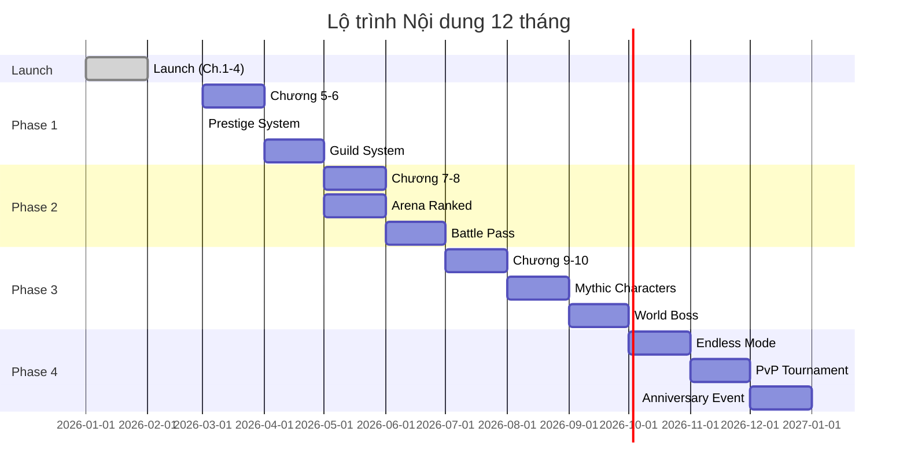

# Nội dung mở rộng (Content Roadmap)

Tài liệu này mô tả kế hoạch mở rộng nội dung game sau launch, bao gồm các chương mới, đồng đội mới và tính năng bổ sung.

---

## 1. Lộ trình nội dung

### 1.1. Tổng quan các giai đoạn

---

## 2. Chi tiết các chương mới

### 2.1. Chương 5: Khu công nghiệp

| Thuộc tính     | Mô tả                                        |
| :------------- | :------------------------------------------- |
| **Theme**      | Nhà máy, công xưởng, công nhân               |
| **Bối cảnh**   | Khu công nghiệp cũ kỹ, khói bụi, máy móc rỉ sét |
| **Số ải**      | 10 ải                                        |
| **Mở khóa**    | Vượt qua Chương 4                            |

**Danh sách quái:**

| Tên quái               | Mô tả                                      |
| :--------------------- | :----------------------------------------- |
| Công nhân mệt mỏi      | Cầm búa, đánh chậm nhưng đau               |
| Bảo vệ nhà máy         | Mặc đồng phục, cầm dùi cui                 |
| Thợ hàn                | Phun lửa gây cháy                          |
| Lái xe nâng            | Đâm bằng xe nâng, knockback                |
| Quản đốc hách dịch     | Hét loa, buff quái xung quanh              |
| Kế toán nhà máy        | Ném giấy tờ, làm confused                  |
| Thợ điện công nghiệp   | Giật điện diện rộng                        |
| Cửu vạn bốc vác        | HP cao, tấn công chậm                      |
| Tài xế container       | Lái xe tông, gây damage lớn                |
| Kỹ sư IT               | Hack làm giảm stats                        |
| HR toxic               | Debuff morale, giảm damage team            |
| Giám đốc sản xuất      | Elite - Triệu hồi thêm công nhân           |
| **BOSS: Chủ tịch Hội đồng** | Ngồi trên ghế xoay, ném tiền và giấy tờ |

### 2.2. Chương 6: Bệnh viện

| Thuộc tính     | Mô tả                                        |
| :------------- | :------------------------------------------- |
| **Theme**      | Y tế, bệnh viện, phòng khám                  |
| **Bối cảnh**   | Hành lang bệnh viện, phòng bệnh, phòng mổ   |
| **Số ải**      | 10 ải                                        |

**Danh sách quái:**

| Tên quái               | Mô tả                                      |
| :--------------------- | :----------------------------------------- |
| Bệnh nhân nổi loạn     | Mặc áo bệnh viện, ném dép                  |
| Y tá quá tải           | Ném kim tiêm gây độc                       |
| Bác sĩ mệt mỏi         | Đánh bằng ống nghe, heal bản thân          |
| Bảo vệ bệnh viện       | Cản đường, taunt                           |
| Cò khám bệnh           | Lôi kéo làm giảm tốc độ                    |
| Dược sĩ                | Ném thuốc gây các hiệu ứng ngẫu nhiên      |
| Bệnh nhân VIP          | Ném tiền, gọi bảo vệ                       |
| Nhân viên tang lễ      | Creepy, gây fear                           |
| Kỹ thuật viên X-quang  | Chiếu tia gây damage theo thời gian        |
| Bác sĩ thẩm mỹ         | Biến đổi stats ngẫu nhiên                  |
| Trưởng khoa            | Elite - Buff toàn bộ quái y tế             |
| **BOSS: Giám đốc BV**  | Ngồi xe lăn điện, triệu hồi bệnh nhân zombie |

### 2.3. Chương 7-10 (Outline)

| Chương | Theme            | Boss                    | Đặc điểm                    |
| :----- | :--------------- | :---------------------- | :-------------------------- |
| 7      | Trường học       | Hiệu trưởng             | Học sinh, giáo viên, bảo mẫu |
| 8      | Sân bay/Bến xe   | Trùm buôn lậu           | Khách du lịch, nhân viên    |
| 9      | Khu giải trí     | Đại ca sòng bạc         | Casino, karaoke, club       |
| 10     | Tòa nhà chính quyền | Quan tham nhũng      | Công chức, thanh tra        |

---

## 3. Đồng đội mới

### 3.1. Nhóm Mythic (Đỏ) - 4 nhân vật

*Mở khóa từ Chương 7, rate cực hiếm*

| Tên              | Class   | Kỹ năng Active                                    | Kỹ năng Passive                         |
| :--------------- | :------ | :------------------------------------------------ | :-------------------------------------- |
| **Ông Đồ**       | Support | Viết câu đối buff 50% ATK toàn team 15s           | Mỗi 30s, random 1 ally được 1 buff mạnh |
| **Nghệ sĩ hài**  | Mage    | Kể chuyện cười gây damage + confuse toàn map      | Mỗi kill tăng 5% crit dmg (max 50%)     |
| **VĐV quốc gia** | Warrior | Sprint xuyên qua tất cả địch gây 500% dmg         | Tốc đánh tăng 2% mỗi giây chiến đấu     |
| **Đại gia thật** | Tanker  | Ném tiền thật tạo shield + heal toàn team         | Team nhận +30% gold drop                |

### 3.2. Đồng đội theo Chương mới

**Chương 5:**

| Tên              | Rarity    | Class   | Mô tả                          |
| :--------------- | :-------- | :------ | :----------------------------- |
| Anh công nhân    | Rare      | Warrior | Đập búa gây stun               |
| Chị kế toán nhà máy | Epic   | Mage    | Ném giấy tờ damage diện rộng   |

**Chương 6:**

| Tên              | Rarity    | Class   | Mô tả                          |
| :--------------- | :-------- | :------ | :----------------------------- |
| Bác sĩ tốt bụng  | Epic      | Support | Heal mạnh, cleanse debuff      |
| Y tá trưởng      | Legendary | Support | Ultimate heal + revive         |

---

## 4. Tính năng mới

### 4.1. Endless Mode (Chế độ vô tận)

| Thuộc tính     | Mô tả                                        |
| :------------- | :------------------------------------------- |
| **Mở khóa**    | Vượt qua Chương 10                           |
| **Cơ chế**     | Đánh liên tục, quái mạnh dần, không giới hạn |
| **Mục tiêu**   | Đạt wave cao nhất có thể                     |
| **Reset**      | Mỗi ngày hoặc khi chết                       |
| **Leaderboard** | Xếp hạng theo wave cao nhất                 |

**Phần thưởng theo wave:**

| Wave     | Phần thưởng                    |
| :------- | :----------------------------- |
| 50       | 50 KC                          |
| 100      | Trang bị Tím ngẫu nhiên        |
| 200      | 200 KC + Mảnh Legendary        |
| 500      | Trang bị Cam (chọn)            |
| 1000     | Danh hiệu + Skin Endless       |

### 4.2. Tower Defense Mode

| Thuộc tính     | Mô tả                                        |
| :------------- | :------------------------------------------- |
| **Mở khóa**    | Level 50                                     |
| **Cơ chế**     | Đặt đồng đội tại các vị trí, chống wave quái |
| **Map**        | 5 map khác nhau, độ khó tăng dần             |
| **Stars**      | 1-3 sao dựa trên performance                 |

### 4.3. Co-op Boss Raid

| Thuộc tính     | Mô tả                                        |
| :------------- | :------------------------------------------- |
| **Mở khóa**    | Gia nhập Guild, Level 30                     |
| **Cơ chế**     | 4 người chơi cùng đánh 1 boss khổng lồ       |
| **Thời gian**  | 5 phút/trận                                  |
| **Phần thưởng** | Chia theo contribution                      |

---

## 5. Kế hoạch Event năm đầu

### 5.1. Lịch Event chi tiết

| Tháng  | Event chính              | Event phụ               | Banner đặc biệt        |
| :----- | :----------------------- | :---------------------- | :--------------------- |
| T1     | Launch Celebration       | 7-day Login             | -                      |
| T2     | Tết Nguyên Đán           | Valentine               | Ông Đồ (Mythic)        |
| T3     | 8/3 - Phụ nữ             | St. Patrick             | -                      |
| T4     | Easter                   | 30/4 - 1/5              | Chương 5 Launch        |
| T5     | Mùa hè bắt đầu           | -                       | Summer Skin            |
| T6     | Quốc tế thiếu nhi        | Chương 6 Launch         | Y tá trưởng (Legendary) |
| T7     | Summer Festival          | -                       | Summer Banner          |
| T8     | Vu Lan                   | Back to School          | -                      |
| T9     | Trung Thu                | Chương 7 Launch         | -                      |
| T10    | Halloween                | -                       | Halloween Skin         |
| T11    | Nhà giáo VN              | Black Friday            | -                      |
| T12    | Christmas + Anniversary  | New Year Countdown      | Anniversary Banner     |

---

## 6. Roadmap kỹ thuật

### 6.1. Các tính năng theo version

| Version | Tính năng                                    | Timeline    |
| :------ | :------------------------------------------- | :---------- |
| 1.0     | Core game, Ch.1-4, Gacha, AFK                | Launch      |
| 1.1     | Prestige, Bug fixes                          | +2 tuần     |
| 1.2     | Guild cơ bản, Guild Boss                     | +1 tháng    |
| 1.3     | Arena, Leaderboard                           | +1.5 tháng  |
| 2.0     | Ch.5-6, Battle Pass, New characters          | +3 tháng    |
| 2.1     | Guild War, Ranked Arena                      | +4 tháng    |
| 2.2     | Ch.7-8, Mythic characters                    | +6 tháng    |
| 3.0     | Ch.9-10, Endless Mode, Co-op                 | +9 tháng    |
| 3.1     | Tower Defense, QoL improvements              | +10 tháng   |
| 4.0     | New story arc, Major expansion               | +12 tháng   |

### 6.2. QoL Updates dự kiến

| Update           | Mô tả                                  | Priority |
| :--------------- | :------------------------------------- | :------- |
| Auto-upgrade All | Nâng cấp tất cả stats bằng 1 click     | High     |
| Quick Raid       | Skip animation phó bản đã 3 sao        | High     |
| Favorites        | Đánh dấu trang bị/đồng đội yêu thích   | Medium   |
| Compare          | So sánh trang bị trước khi thay        | Medium   |
| Wishlist         | Tăng rate gacha cho items mong muốn    | Low      |
| Transmog         | Đổi skin trang bị                      | Low      |

---

## 7. Metrics mục tiêu sau 1 năm

### 7.1. User Metrics

| Metric          | Target       |
| :-------------- | :----------- |
| Total Downloads | 1,000,000    |
| DAU             | 50,000       |
| MAU             | 200,000      |
| D30 Retention   | 8%           |

### 7.2. Revenue Metrics

| Metric          | Target           |
| :-------------- | :--------------- |
| Total Revenue   | $500,000         |
| ARPU            | $0.50            |
| Conversion Rate | 5%               |
| ARPPU           | $15              |

### 7.3. Content Metrics

| Metric              | Target    |
| :------------------ | :-------- |
| Chapters Released   | 10        |
| Characters (total)  | 50+       |
| Events Run          | 24+       |
| Major Updates       | 4         |
