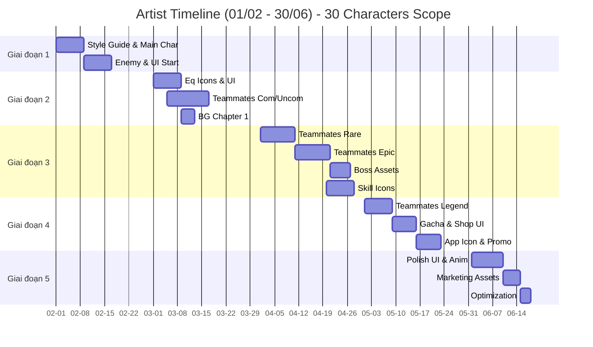

# Công việc 2D Artist

Chi tiết phân chia công việc (breakdown) cho đội ngũ 2D Artist (2 nhân sự).

---

## Giai đoạn 1: Nền tảng (Tháng 2)

| Mã Task | Tên công việc (Task Name)                        | Sản phẩm bàn giao | Thời gian | Độ ưu tiên     |
| :------ | :----------------------------------------------- | :---------------- | :-------- | :------------- |
| ART-001 | Style guide và bảng tham khảo (Reference board)  | 1 tài liệu        | 2 ngày    | Tối quan trọng |
| ART-002 | Concept nhân vật chính (3 phương án)             | 3 thiết kế        | 3 ngày    | Tối quan trọng |
| ART-003 | Sprite sheet nhân vật chính (Idle, Walk, Attack) | 1 sprite sheet    | 5 ngày    | Tối quan trọng |
| ART-004 | Concept quái (4 loại mob)                        | 4 thiết kế        | 3 ngày    | Tối quan trọng |
| ART-005 | Sprite sheet quái (animation đơn giản)           | 4 sprite sheets   | 6 ngày    | Cao            |
| ART-006 | UI mockup (bố cục màn hình chính)                | 1 mockup          | 2 ngày    | Cao            |
| ART-007 | UI elements tạm thời (Placeholder)               | Bộ cơ bản         | 2 ngày    | Trung bình     |

**Tổng cộng:** ~23 ngày

---

## Giai đoạn 2: Hệ thống lõi & Đồng đội cơ bản (Tháng 3)

| Mã Task | Tên công việc (Task Name)                      | Sản phẩm bàn giao | Thời gian         | Độ ưu tiên     |
| :------ | :--------------------------------------------- | :---------------- | :---------------- | :------------- |
| ART-008 | Icon trang bị (40 món, Tier 1-10)              | 40 icons          | 6 ngày            | Tối quan trọng |
| ART-009 | Khung viền phẩm chất trang bị (6 loại)         | 6 khung           | 2 ngày            | Tối quan trọng |
| ART-010 | **Đồng đội Com/Uncom (11 nhân vật)** - Concept | 11 phác thảo      | 5 ngày            | Cao            |
| ART-011 | **Đồng đội Com/Uncom** - Sprite/Spine          | 11 bộ assets      | 10 ngày (2 người) | Cao            |
| ART-012 | Icon tiền tệ & Tài nguyên nút bấm              | Bộ assets         | 3 ngày            | Cao            |
| ART-013 | UI tab Chỉ số & Trang bị                       | 2 màn hình        | 3 ngày            | Cao            |
| ART-014 | Background Chương 1                            | 1 bộ BG           | 4 ngày            | Cao            |

**Tổng cộng:** ~33 ngày công (chia cho 2 người làm song song trong 1 tháng)

---

## Giai đoạn 3: Nội dung & Đồng đội mở rộng (Tháng 4)

| Mã Task | Tên công việc (Task Name)                        | Sản phẩm bàn giao | Thời gian | Độ ưu tiên     |
| :------ | :----------------------------------------------- | :---------------- | :-------- | :------------- |
| ART-015 | **Đồng đội Rare (8 nhân vật)** - Concept & Asset | 8 bộ assets       | 10 ngày   | Tối quan trọng |
| ART-016 | **Đồng đội Epic (7 nhân vật)** - Concept & Asset | 7 bộ assets       | 10 ngày   | Tối quan trọng |
| ART-017 | Concept & Sprite Boss (4 boss)                   | 4 bộ assets       | 6 ngày    | Tối quan trọng |
| ART-018 | Icon kỹ năng (80+ kỹ năng: 20 Player + 60 Team)  | 80 icons          | 8 ngày    | Cao            |
| ART-019 | Chân dung đồng đội (26 nhân vật đã vẽ)           | 26 hình           | 4 ngày    | Cao            |
| ART-020 | Background Chương 2                              | 1 bộ BG           | 3 ngày    | Trung bình     |

**Tổng cộng:** ~37 ngày công (Cần 2 người full-time)

---

## Giai đoạn 4: Đỉnh cao & Kiếm tiền (Tháng 5)

| Mã Task | Tên công việc (Task Name)                          | Sản phẩm bàn giao | Thời gian | Độ ưu tiên     |
| :------ | :------------------------------------------------- | :---------------- | :-------- | :------------- |
| ART-021 | **Đồng đội Legendary (4 nhân vật)** - High Quality | 4 bộ assets       | 8 ngày    | Tối quan trọng |
| ART-022 | Chân dung Legend & Hiệu ứng đặc biệt               | 4 hình + VFX      | 2 ngày    | Cao            |
| ART-023 | Tài nguyên thùng Gacha & Banner (3 loại)           | 1 bộ              | 4 ngày    | Tối quan trọng |
| ART-024 | Thiết kế UI Cửa hàng (Shop) & IAP Icons            | 1 bộ              | 3 ngày    | Cao            |
| ART-025 | UI Nhiệm vụ/Thành tựu                              | 1 màn hình        | 2 ngày    | Trung bình     |
| ART-026 | Ảnh quảng bá (Marketing Art)                       | 2 artwork lớn     | 5 ngày    | Trung bình     |
| ART-027 | Thiết kế Icon ứng dụng (App icon)                  | 1 icon            | 2 ngày    | Tối quan trọng |
| ART-028 | Background Chương 3-4                              | 2 bộ BG           | 4 ngày    | Trung bình     |

**Tổng cộng:** ~30 ngày công

---

## Giai đoạn 5: Hoàn thiện (Tháng 6)

| Mã Task | Tên công việc (Task Name)             | Sản phẩm bàn giao | Thời gian | Độ ưu tiên |
| :------ | :------------------------------------ | :---------------- | :-------- | :--------- |
| ART-029 | Tinh chỉnh UI (Polish pass)           | Cải tiến          | 4 ngày    | Cao        |
| ART-030 | Tinh chỉnh Animation Đồng đội         | Cải tiến          | 5 ngày    | Cao        |
| ART-031 | Thiết kế màn hình Loading             | 1 màn hình        | 2 ngày    | Trung bình |
| ART-032 | UI elements cho hướng dẫn (Tutorial)  | Bộ icon           | 2 ngày    | Trung bình |
| ART-033 | Tài nguyên Marketing (Store Assets)   | Bộ hình           | 5 ngày    | Cao        |
| ART-034 | Tối ưu hóa dung lượng (Atlas packing) | -                 | 3 ngày    | Cao        |

**Tổng cộng:** ~21 ngày công

---

## Biểu đồ Gantt (Artist)

