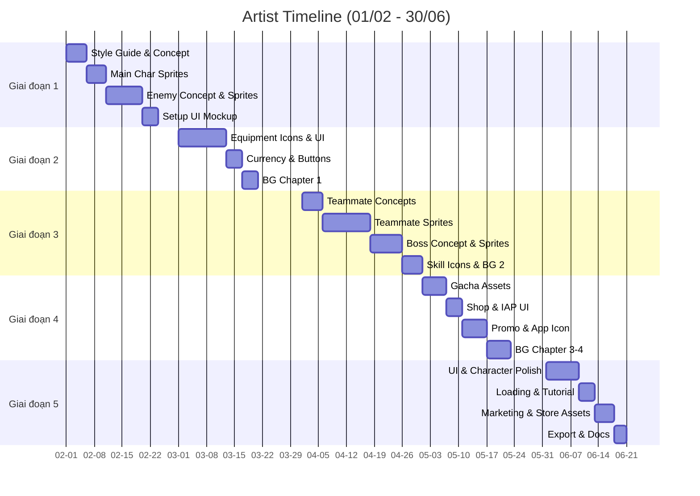

# Công việc 2D Artist

Chi tiết phân chia công việc (breakdown) cho đội ngũ 2D Artist (2 người).

## Giai đoạn 1: Nền tảng (Tháng 2)

| Mã Task | Tên công việc (Task Name) | Sản phẩm bàn giao | Thời gian | Độ ưu tiên |
| :--- | :--- | :--- | :--- | :--- |
| ART-001 | Style guide và bảng tham khảo (Reference board) | 1 tài liệu | 2 ngày | Tối quan trọng |
| ART-002 | Concept nhân vật chính (3 phương án) | 3 thiết kế | 3 ngày | Tối quan trọng |
| ART-003 | Sprite sheet nhân vật chính (Idle, Walk, Attack) | 1 sprite sheet | 5 ngày | Tối quan trọng |
| ART-004 | Concept quái (4 loại mob) | 4 thiết kế | 3 ngày | Tối quan trọng |
| ART-005 | Sprite sheet quái (animation đơn giản) | 4 sprite sheets | 6 ngày | Cao |
| ART-006 | UI mockup (bố cục màn hình chính) | 1 mockup | 2 ngày | Cao |
| ART-007 | UI elements tạm thời (Placeholder) | Bộ cơ bản | 2 ngày | Trung bình |

**Tổng cộng:** ~23 ngày

## Giai đoạn 2: Hệ thống lõi (Tháng 3)

| Mã Task | Tên công việc (Task Name) | Sản phẩm bàn giao | Thời gian | Độ ưu tiên |
| :--- | :--- | :--- | :--- | :--- |
| ART-008 | Icon trang bị (40 món, Tier 1-10) | 40 icons | 8 ngày | Tối quan trọng |
| ART-009 | Khung viền phẩm chất trang bị (6 loại) | 6 khung | 2 ngày | Tối quan trọng |
| ART-010 | Thiết kế UI tab Chỉ số | 1 màn hình | 2 ngày | Cao |
| ART-011 | Thiết kế UI tab Trang bị | 1 màn hình | 2 ngày | Cao |
| ART-012 | Icon tiền tệ (Vàng, Kim cương, v.v.) | 10 icons | 2 ngày | Tối quan trọng |
| ART-013 | Tài nguyên nút bấm (Button assets - 5 trạng thái) | Bộ nút | 2 ngày | Cao |
| ART-014 | Mẫu khung Popup (Frame templates) | 3 mẫu | 3 ngày | Cao |
| ART-015 | Background Chương 1 (3 lớp layer) | 1 bộ BG | 4 ngày | Cao |

**Tổng cộng:** ~25 ngày

## Giai đoạn 3: Nội dung & Chiều sâu (Tháng 4)

| Mã Task | Tên công việc (Task Name) | Sản phẩm bàn giao | Thời gian | Độ ưu tiên |
| :--- | :--- | :--- | :--- | :--- |
| ART-016 | Concept đồng đội (5 nhân vật) | 5 thiết kế | 5 ngày | Tối quan trọng |
| ART-017 | Sprite sheet đồng đội (Mỗi người: Idle, Walk, Attack, Skill) | 5 sprite sheets | 12 ngày | Tối quan trọng |
| ART-018 | Chân dung đồng đội (Portraits 256x256) | 5 hình | 2 ngày | Cao |
| ART-019 | Concept Boss (4 boss) | 4 thiết kế | 4 ngày | Tối quan trọng |
| ART-020 | Sprite sheet Boss | 4 sprite sheets | 8 ngày | Tối quan trọng |
| ART-021 | Icon kỹ năng (20+ kỹ năng) | 25 icons | 4 ngày | Cao |
| ART-022 | Background Chương 2 | 1 bộ BG | 3 ngày | Trung bình |

**Tổng cộng:** ~38 ngày (cần 2 artists làm song song)

## Giai đoạn 4: Kinh tế & Kiếm tiền (Tháng 5)

| Mã Task | Tên công việc (Task Name) | Sản phẩm bàn giao | Thời gian | Độ ưu tiên |
| :--- | :--- | :--- | :--- | :--- |
| ART-023 | Tài nguyên thùng Gacha (3 trạng thái) | 1 bộ thùng | 3 ngày | Tối quan trọng |
| ART-024 | Hình ảnh Banner Gacha | 3 banners | 3 ngày | Cao |
| ART-025 | Thiết kế UI Cửa hàng (Shop) | 1 màn hình | 2 ngày | Cao |
| ART-026 | Icon gói IAP | 4 icons | 2 ngày | Cao |
| ART-027 | UI Nhiệm vụ/Thành tựu | 1 màn hình | 2 ngày | Trung bình |
| ART-028 | Ảnh quảng bá (Promotional art - Marketing) | 2 tác phẩm | 4 ngày | Trung bình |
| ART-029 | Thiết kế Icon ứng dụng (App icon) | 1 icon + variants | 2 ngày | Tối quan trọng |
| ART-030 | Background Chương 3-4 | 2 bộ BG | 6 ngày | Trung bình |

**Tổng cộng:** ~24 ngày

## Giai đoạn 5: Hoàn thiện & Chuẩn bị ra mắt (Tháng 6)

| Mã Task | Tên công việc (Task Name) | Sản phẩm bàn giao | Thời gian | Độ ưu tiên |
| :--- | :--- | :--- | :--- | :--- |
| ART-031 | Tinh chỉnh UI (Polish pass) | Cải tiến | 4 ngày | Cao |
| ART-032 | Tinh chỉnh Nhân vật (Touch-up) | Cải tiến | 4 ngày | Cao |
| ART-033 | Thiết kế màn hình Loading | 1 màn hình | 2 ngày | Trung bình |
| ART-034 | UI elements cho hướng dẫn (Tutorial) | Bộ icon | 2 ngày | Trung bình |
| ART-035 | Tài nguyên Marketing (Screenshots store) | 5 hình | 2 ngày | Cao |
| ART-036 | Đồ họa trang Store (Store listing graphics) | Bộ assets | 3 ngày | Tối quan trọng |
| ART-037 | Tối ưu hóa xuất file cuối cùng | - | 2 ngày | Cao |
| ART-038 | Cập nhật tài liệu Art | 1 tài liệu | 1 ngày | Thấp |

**Tổng cộng:** ~20 ngày

---

## Biểu đồ Gantt (Artist)

