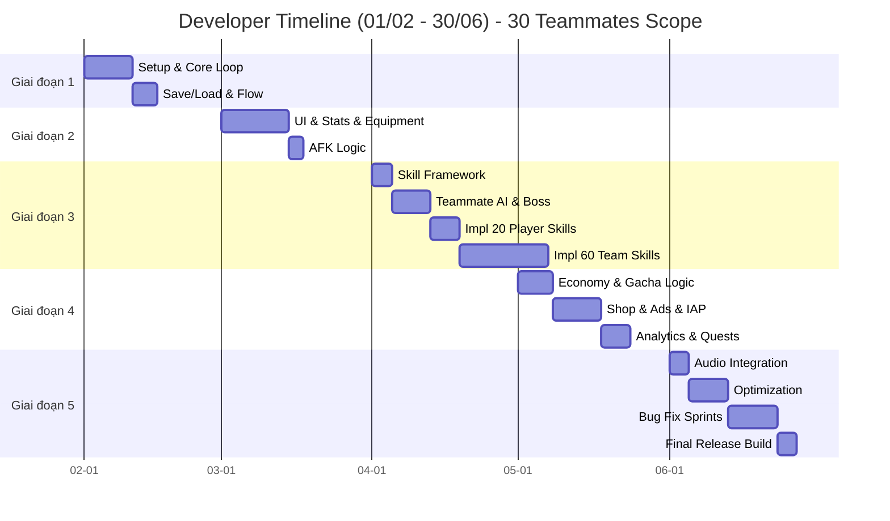

# Công việc Developer (Lập trình)

Chi tiết phân chia công việc (breakdown) cho đội ngũ Developer (2-3 người).

---

## Giai đoạn 1: Nền tảng (Tháng 2)

| Mã Task | Tên công việc (Task Name)                                     | Thời gian | Phụ thuộc | Độ ưu tiên     |
| :------ | :------------------------------------------------------------ | :-------- | :-------- | :------------- |
| DEV-001 | Thiết lập dự án Unity/Godot, quản lý version (Git)            | 2 ngày    | -         | Tối quan trọng |
| DEV-002 | Xây dựng hệ thống quản lý dữ liệu (ScriptableObject/Resource) | 3 ngày    | DEV-001   | Tối quan trọng |
| DEV-003 | Vòng lặp chiến đấu cốt lõi (tấn công, máu, chết)              | 4 ngày    | DEV-002   | Tối quan trọng |
| DEV-004 | Hệ thống sinh quái (Spawning) và quản lý wave                 | 3 ngày    | DEV-003   | Tối quan trọng |
| DEV-005 | Hệ thống Lưu/Tải game (Save/Load - PlayerPrefs/JSON)          | 3 ngày    | DEV-002   | Cao            |
| DEV-006 | Quản lý Scene và luồng game (Game Flow)                       | 2 ngày    | DEV-003   | Cao            |
| DEV-007 | Script tự động hóa build (Build automation)                   | 1 ngày    | DEV-001   | Trung bình     |

**Tổng cộng:** ~18 ngày (4 tuần bao gồm thời gian đệm)

---

## Giai đoạn 2: Hệ thống lõi (Tháng 3)

| Mã Task | Tên công việc (Task Name)                  | Thời gian | Phụ thuộc        | Độ ưu tiên     |
| :------ | :----------------------------------------- | :-------- | :--------------- | :------------- |
| DEV-008 | Thiết lập khung UI (Canvas, View Managers) | 3 ngày    | DEV-001          | Tối quan trọng |
| DEV-009 | Hệ thống chỉ số (ATK, HP, CRIT, ASPD)      | 4 ngày    | DEV-002          | Tối quan trọng |
| DEV-010 | UI nâng cấp chỉ số kèm animation           | 3 ngày    | DEV-008, DEV-009 | Cao            |
| DEV-011 | Hệ thống trang bị (slot, mặc/tháo)         | 4 ngày    | DEV-002          | Tối quan trọng |
| DEV-012 | Hệ thống gộp trang bị (item merge)         | 3 ngày    | DEV-011          | Cao            |
| DEV-013 | Quản lý túi đồ (Inventory)                 | 2 ngày    | DEV-011          | Cao            |
| DEV-014 | Hệ thống tính toán AFK                     | 3 ngày    | DEV-003          | Tối quan trọng |
| DEV-015 | Hệ thống Popup (tái sử dụng chung)         | 2 ngày    | DEV-008          | Trung bình     |

**Tổng cộng:** ~24 ngày

---

## Giai đoạn 3: Nội dung & Chiều sâu (Tháng 4)

| Mã Task | Tên công việc (Task Name)                      | Thời gian | Phụ thuộc        | Độ ưu tiên     |
| :------ | :--------------------------------------------- | :-------- | :--------------- | :------------- |
| DEV-016 | Khung hệ thống kỹ năng (Skill framework)       | 4 ngày    | DEV-003          | Tối quan trọng |
| DEV-017 | **Triển khai kỹ năng Player** (20 kỹ năng)     | 6 ngày    | DEV-016          | Tối quan trọng |
| DEV-018 | **Hệ thống đồng đội** (AI 5 class, slot logic) | 5 ngày    | DEV-003          | Tối quan trọng |
| DEV-019 | **Kỹ năng đồng đội** (30 Active + 30 Passive)  | 18 ngày   | DEV-016, DEV-018 | Tối quan trọng |
| DEV-020 | UI xây dựng đội hình & quản lý đồng đội        | 4 ngày    | DEV-018, DEV-008 | Cao            |
| DEV-021 | Hệ thống Duyên phận (Bond logic)               | 3 ngày    | DEV-018          | Trung bình     |
| DEV-022 | Hệ thống tiến độ ải (Stage progression) & Boss | 4 ngày    | DEV-003          | Cao            |

**Tổng cộng:** ~44 ngày công (Bắt buộc 2 dev làm song song để đảm bảo timeline tháng 4)

---

## Giai đoạn 4: Kinh tế & Kiếm tiền (Tháng 5)

| Mã Task | Tên công việc (Task Name)                   | Thời gian | Phụ thuộc        | Độ ưu tiên     |
| :------ | :------------------------------------------ | :-------- | :--------------- | :------------- |
| DEV-023 | Hệ thống tiền tệ (Vàng, Kim cương)          | 2 ngày    | DEV-002          | Tối quan trọng |
| DEV-024 | Hệ thống Gacha (Waitgh random, Pity system) | 5 ngày    | DEV-002          | Tối quan trọng |
| DEV-025 | UI Gacha và animation (Skip, Show result)   | 4 ngày    | DEV-024, DEV-008 | Cao            |
| DEV-026 | Triển khai hệ thống Cửa hàng (Shop)         | 3 ngày    | DEV-023          | Tối quan trọng |
| DEV-027 | Tích hợp IAP (Google Play/App Store)        | 4 ngày    | DEV-023          | Tối quan trọng |
| DEV-028 | Tích hợp Quảng cáo (Rewaded video)          | 3 ngày    | DEV-023          | Cao            |
| DEV-029 | Hệ thống Nhiệm vụ/Thành tựu                 | 4 ngày    | DEV-002          | Trung bình     |
| DEV-030 | Tích hợp Analytics (Firebase)               | 2 ngày    | DEV-001          | Trung bình     |

**Tổng cộng:** ~27 ngày

---

## Giai đoạn 5: Hoàn thiện & Chuẩn bị ra mắt (Tháng 6)

| Mã Task | Tên công việc (Task Name)                      | Thời gian | Phụ thuộc       | Độ ưu tiên     |
| :------ | :--------------------------------------------- | :-------- | :-------------- | :------------- |
| DEV-031 | Tích hợp Âm thanh (Sound Manager & 30 char VO) | 4 ngày    | DEV-001         | Cao            |
| DEV-032 | Tối ưu hóa hiệu năng (Pooling, Draw calls)     | 5 ngày    | Tất cả trước đó | Tối quan trọng |
| DEV-033 | Tối ưu hóa bộ nhớ & Load time                  | 3 ngày    | DEV-032         | Tối quan trọng |
| DEV-034 | Sửa lỗi (Bug fixing) - Sprint 1                | 5 ngày    | Tất cả trước đó | Tối quan trọng |
| DEV-035 | Sửa lỗi (Bug fixing) - Sprint 2                | 5 ngày    | DEV-034         | Tối quan trọng |
| DEV-036 | Build bản TestFlight/Internal Testing          | 2 ngày    | DEV-035         | Tối quan trọng |
| DEV-037 | Sửa lỗi QA cuối cùng (Final fixes)             | 4 ngày    | DEV-036         | Tối quan trọng |

**Tổng cộng:** ~28 ngày

---

## Biểu đồ Gantt (Developer)

