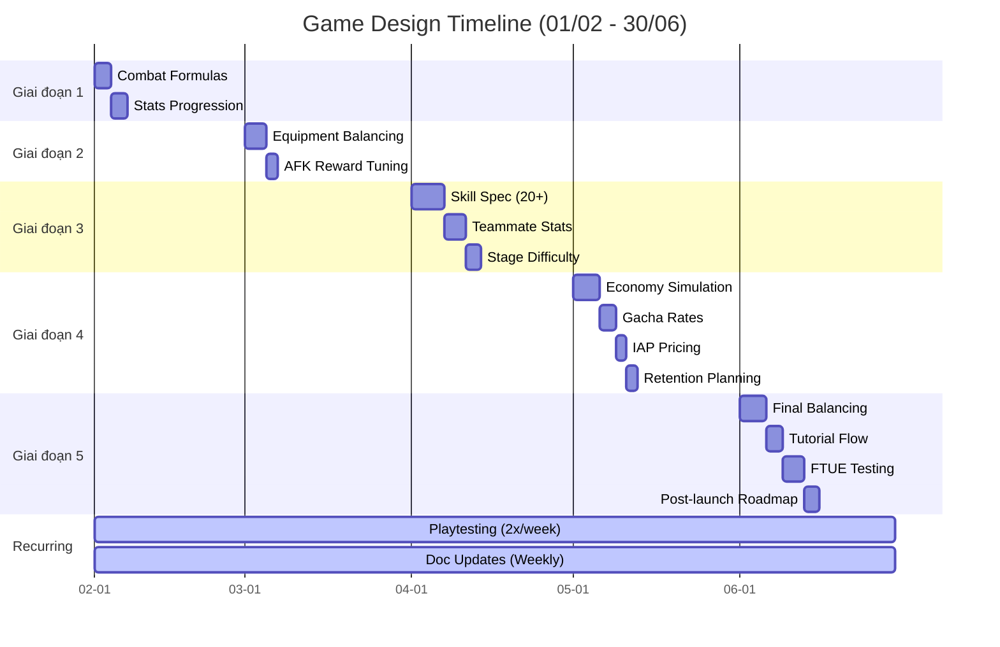

# Công việc Game Designer

Chi tiết phân chia công việc (breakdown) cho đội ngũ Game Designer (1 người).

## Công việc liên tục xuyên suốt các giai đoạn

| Mã Task | Tên công việc (Task Name) | Tần suất | Độ ưu tiên |
| :--- | :--- | :--- | :--- |
| GD-001 | Cập nhật tài liệu (Documentation) | Hàng tuần | Cao |
| GD-002 | Các buổi chơi thử (Playtesting sessions) | 2 lần/tuần | Tối quan trọng |
| GD-003 | Điều chỉnh cân bằng game (Balancing) | Khi cần thiết | Tối quan trọng |
| GD-004 | Viết đặc tả tính năng (Feature Spec) | Theo tính năng | Cao |
| GD-005 | Họp giao tiếp với team | Hàng ngày (Standup) | Trung bình |

## Công việc cụ thể theo Giai đoạn

### Giai đoạn 1 (Tháng 2)
- GD-006: Chốt công thức chiến đấu (3 ngày)
- GD-007: Thiết kế đường cong tăng trưởng chỉ số (3 ngày)

### Giai đoạn 2 (Tháng 3)
- GD-008: Bảng cân bằng trang bị (Spreadsheet) (4 ngày)
- GD-009: Tinh chỉnh công thức thưởng AFK (2 ngày)

### Giai đoạn 3 (Tháng 4)
- GD-010: Tài liệu thiết kế Kỹ năng (20+ skills) (6 ngày)
- GD-011: Cân bằng chỉ số Đồng đội (4 ngày)
- GD-012: Đường cong độ khó ải (Stage difficulty curve) (3 ngày)

### Giai đoạn 4 (Tháng 5)
- GD-013: Mô phỏng mô hình kinh tế (Economy simulation) (5 ngày)
- GD-014: Cân bằng tỉ lệ rớt đồ Gacha (Drop rates) (3 ngày)
- GD-015: Chiến lược giá cho IAP (2 ngày)
- GD-016: Lên kế hoạch chỉ số giữ chân người chơi (Retention metrics) (2 ngày)

### Giai đoạn 5 (Tháng 6)
- GD-017: Rà soát cân bằng lần cuối (5 ngày)
- GD-018: Thiết kế luồng hướng dẫn tân thủ (Tutorial flow) (3 ngày)
- GD-019: Kiểm thử trải nghiệm người dùng đầu tiên (FTUE testing) (4 ngày)
- GD-020: Lộ trình nội dung sau ra mắt (Post-launch roadmap) (3 ngày)

---

## Biểu đồ Gantt (Game Design)

