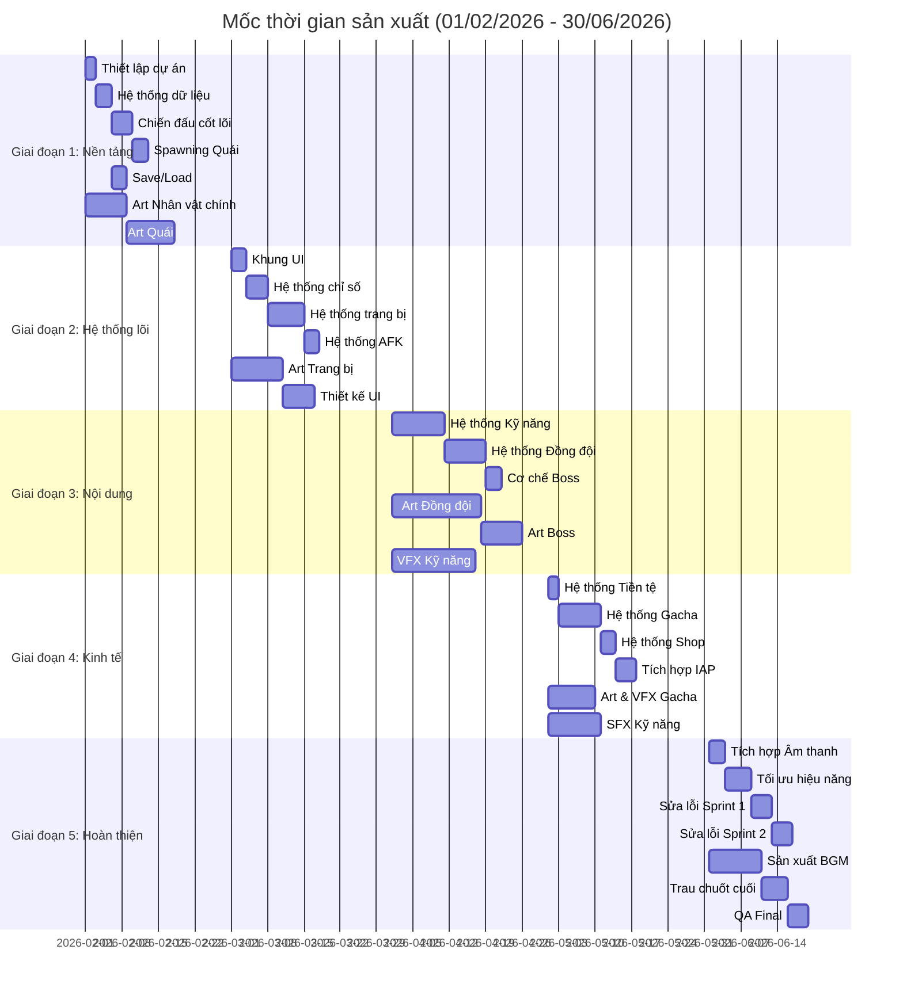
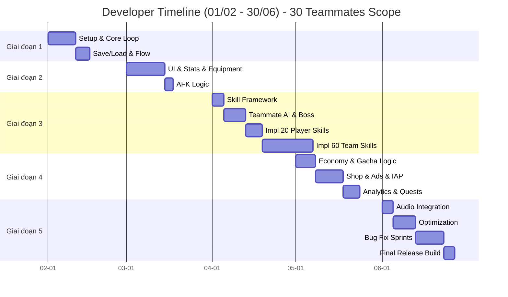
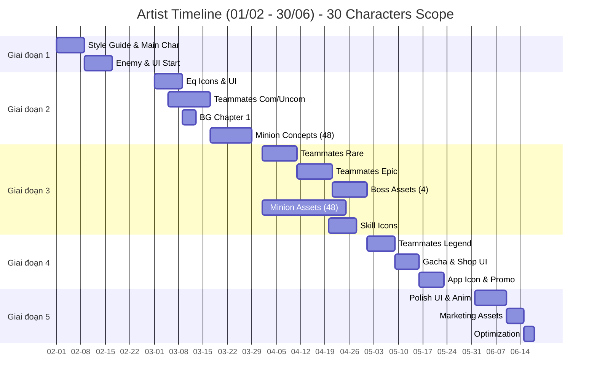
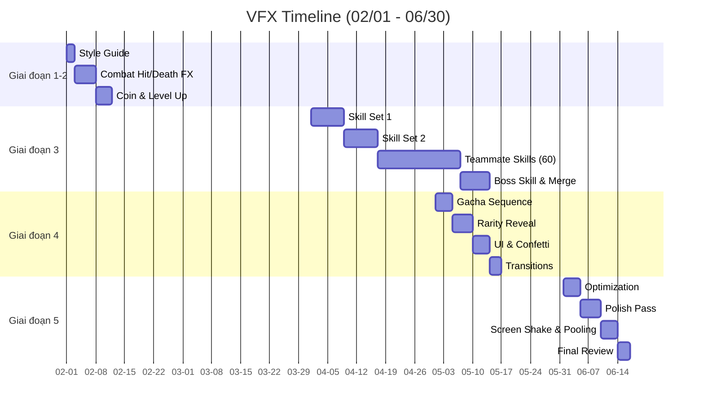
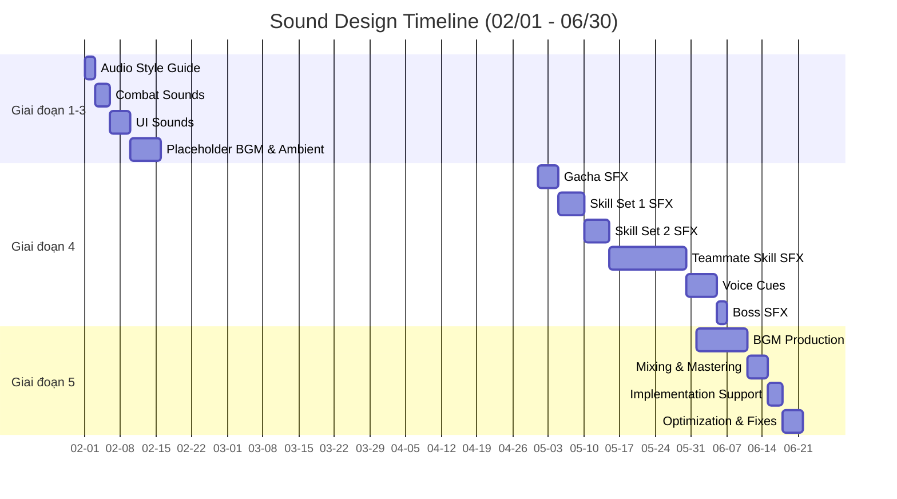
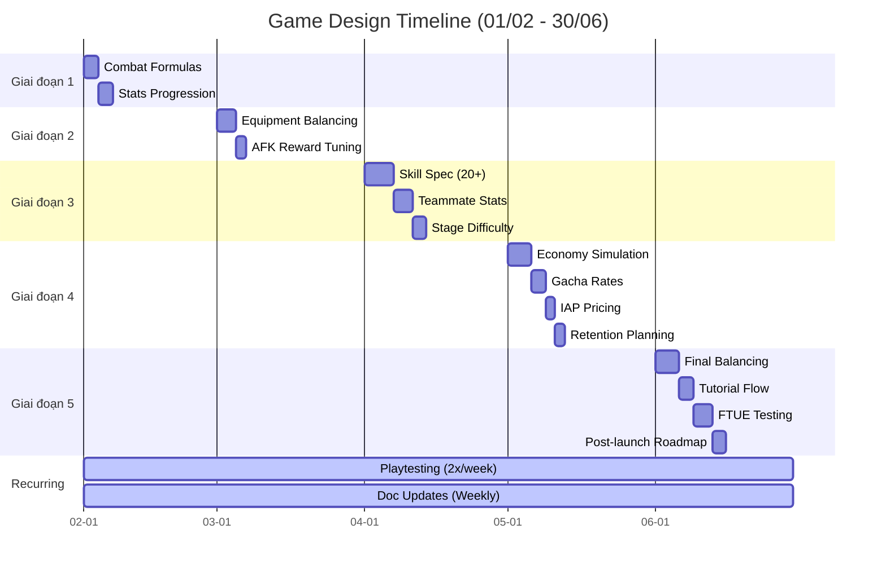

# Kế hoạch sản xuất chi tiết

Tài liệu này tổng hợp kế hoạch sản xuất game "Bảo vệ khu phố" từ **01/02/2026 đến 30/06/2026** (5 tháng), bao gồm công việc chi tiết cho tất cả các bộ phận.

---

## 1. Tổng quan Timeline

| Thông tin                 | Chi tiết             |
| :------------------------ | :------------------- |
| **Ngày bắt đầu**          | 01/02/2026           |
| **Ngày kết thúc**         | 30/06/2026           |
| **Tổng thời gian**        | 21 tuần (150 ngày)   |
| **Mốc chính**             | 5 giai đoạn (Phases) |
| **Quy mô team (dự kiến)** | 8-10 người           |

### 1.1. Cấu trúc Team

| Vai trò             | Số lượng      | Trách nhiệm chính                                            |
| :------------------ | :------------ | :----------------------------------------------------------- |
| **Game Designer**   | 1             | Thiết kế game, cân bằng số liệu, tài liệu hóa                |
| **Developer**       | 2-3           | Gameplay cốt lõi, hệ thống, triển khai UI                    |
| **2D Artist**       | 2             | Vẽ nhân vật, môi trường, UI                                  |
| **VFX Artist**      | 1             | Hiệu ứng hạt, hiệu ứng chiến đấu, chuyển động UI             |
| **Sound Designer**  | 1             | Âm thanh hiệu ứng (SFX), nhạc nền (BGM), triển khai âm thanh |
| **QA Tester**       | 1             | Kiểm thử, báo lỗi                                            |
| **Project Manager** | 1 (part-time) | Điều phối, theo dõi tiến độ                                  |

---

## 2. Chi tiết Giai đoạn (5 Phases)

### Giai đoạn 1: Nền tảng - Foundation (Tháng 2 - Tuần 1-4)

**Thời gian:** 01/02 - 28/02 (4 tuần)

**Mục tiêu:** Thiết lập dự án, chiến đấu cốt lõi, cấu trúc dữ liệu

**Kết quả bàn giao (Deliverables):**

- Thiết lập dự án hoàn chỉnh (Unity/Godot)
- Hệ thống chiến đấu cốt lõi hoạt động được
- Hệ thống quản lý dữ liệu
- Bản chơi thử đầu tiên (First playable)

### Giai đoạn 2: Hệ thống lõi - Core Systems (Tháng 3 - Tuần 5-8)

**Thời gian:** 01/03 - 31/03 (4.5 tuần)

**Mục tiêu:** Khung UI, chỉ số, trang bị, AFK

**Kết quả bàn giao (Deliverables):**

- Khung UI (UI Framework) hoàn chỉnh
- Hệ thống chỉ số và tăng trưởng
- Hệ thống trang bị và cơ chế gộp (merge)
- Tính toán AFK hoạt động chuẩn

### Giai đoạn 3: Nội dung & Chiều sâu - Content & Depth (Tháng 4 - Tuần 9-13)

**Thời gian:** 01/04 - 30/04 (4 tuần)

**Mục tiêu:** Kỹ năng, đồng đội, hoàn thiện asset đồ họa

**Kết quả bàn giao (Deliverables):**

- Hệ thống kỹ năng với 20+ skills
- Hệ thống đồng đội với 5 nhân vật
- Assets đồ họa cho Chương 1-2
- VFX cho chiến đấu

### Giai đoạn 4: Kinh tế & Kiếm tiền - Economy & Monetization (Tháng 5 - Tuần 14-17)

**Thời gian:** 01/05 - 31/05 (4 tuần)

**Mục tiêu:** Gacha, cửa hàng, cân bằng kinh tế

**Kết quả bàn giao (Deliverables):**

- Hệ thống Gacha hoàn chỉnh
- Triển khai Cửa hàng (Shop)
- Tích hợp thanh toán (IAP)
- Cân bằng nền kinh tế trong game

### Giai đoạn 5: Hoàn thiện & Chuẩn bị ra mắt - Polish & Launch Prep (Tháng 6 - Tuần 18-21)

**Thời gian:** 01/06 - 30/06 (4 tuần)

**Mục tiêu:** Âm thanh, trau chuốt VFX, kiểm thử, tối ưu hóa

**Kết quả bàn giao (Deliverables):**

- Âm thanh đầy đủ (BGM + SFX)
- Toàn bộ VFX được trau chuốt
- Hiệu năng được tối ưu
- Bản Beta sẵn sàng

---

## 3. Biểu đồ Gantt Timeline

---

## 4. Bản đồ phụ thuộc (Dependencies Map)

### Tiến trình quan trọng (Critical Path)

```mermaid
flowchart LR
    A[Thiết lập dự án] --> B[Hệ thống dữ liệu]
    B --> C[Chiến đấu cốt lõi]
    C --> D[Khung UI]
    D --> E[Hệ thống chỉ số]
    E --> F[Hệ thống trang bị]
    F --> G[Hệ thống kỹ năng]
    G --> H[Hệ thống Gacha]
    H --> I[Trau chuốt cuối]
    I --> J[Sẵn sàng ra mắt]

    style A fill:#ffcdd2,stroke:#c62828
    style J fill:#c8e6c9,stroke:#2e7d32
```

### Phụ thuộc chéo giữa các team

| Task Dev              | Phụ thuộc Art         | Phụ thuộc VFX       | Phụ thuộc Sound |
| :-------------------- | :-------------------- | :------------------ | :-------------- |
| **Chiến đấu cốt lõi** | Sprite nhân vật chính | Hiệu ứng đánh trúng | SFX chiến đấu   |
| **Hệ thống trang bị** | Icon trang bị         | Hiệu ứng nâng cấp   | SFX nâng cấp    |
| **Hệ thống kỹ năng**  | Icon kỹ năng          | VFX kỹ năng         | SFX kỹ năng     |
| **Hệ thống Gacha**    | Ảnh thùng/hộp gacha   | Hiệu ứng mở quà     | SFX quay gacha  |
| **Build cuối cùng**   | Tất cả assets         | Tất cả VFX          | Tất cả audio    |

---

## 5. Công việc Game Developer

Chi tiết phân chia công việc (breakdown) cho đội ngũ Developer (2-3 người).

### 5.1. Giai đoạn 1: Nền tảng (Tháng 2)

| Mã Task | Tên công việc (Task Name)                                     | Thời gian | Phụ thuộc | Độ ưu tiên     |
| :------ | :------------------------------------------------------------ | :-------- | :-------- | :------------- |
| DEV-001 | Thiết lập dự án Unity/Godot, quản lý version (Git)            | 2 ngày    | -         | Tối quan trọng |
| DEV-002 | Xây dựng hệ thống quản lý dữ liệu (ScriptableObject/Resource) | 3 ngày    | DEV-001   | Tối quan trọng |
| DEV-003 | Vòng lặp chiến đấu cốt lõi (tấn công, máu, chết)              | 4 ngày    | DEV-002   | Tối quan trọng |
| DEV-004 | Hệ thống sinh quái (Spawning) và quản lý wave                 | 3 ngày    | DEV-003   | Tối quan trọng |
| DEV-005 | Hệ thống Lưu/Tải game (Save/Load - PlayerPrefs/JSON)          | 3 ngày    | DEV-002   | Cao            |
| DEV-006 | Quản lý Scene và luồng game (Game Flow)                       | 2 ngày    | DEV-003   | Cao            |
| DEV-007 | Script tự động hóa build (Build automation)                   | 1 ngày    | DEV-001   | Trung bình     |

**Tổng cộng:** ~18 ngày (4 tuần bao gồm thời gian đệm)

### 5.2. Giai đoạn 2: Hệ thống lõi (Tháng 3)

| Mã Task | Tên công việc (Task Name)                  | Thời gian | Phụ thuộc        | Độ ưu tiên     |
| :------ | :----------------------------------------- | :-------- | :--------------- | :------------- |
| DEV-008 | Thiết lập khung UI (Canvas, View Managers) | 3 ngày    | DEV-001          | Tối quan trọng |
| DEV-009 | Hệ thống chỉ số (ATK, HP, CRIT, ASPD)      | 4 ngày    | DEV-002          | Tối quan trọng |
| DEV-010 | UI nâng cấp chỉ số kèm animation           | 3 ngày    | DEV-008, DEV-009 | Cao            |
| DEV-011 | Hệ thống trang bị (slot, mặc/tháo)         | 4 ngày    | DEV-002          | Tối quan trọng |
| DEV-012 | Hệ thống gộp trang bị (item merge)         | 3 ngày    | DEV-011          | Cao            |
| DEV-013 | Quản lý túi đồ (Inventory)                 | 2 ngày    | DEV-011          | Cao            |
| DEV-014 | Hệ thống tính toán AFK                     | 3 ngày    | DEV-003          | Tối quan trọng |
| DEV-015 | Hệ thống Popup (tái sử dụng chung)         | 2 ngày    | DEV-008          | Trung bình     |

**Tổng cộng:** ~24 ngày

### 5.3. Giai đoạn 3: Nội dung & Chiều sâu (Tháng 4)

| Mã Task | Tên công việc (Task Name)                      | Thời gian | Phụ thuộc        | Độ ưu tiên     |
| :------ | :--------------------------------------------- | :-------- | :--------------- | :------------- |
| DEV-016 | Khung hệ thống kỹ năng (Skill framework)       | 4 ngày    | DEV-003          | Tối quan trọng |
| DEV-017 | **Triển khai kỹ năng Player** (20 kỹ năng)     | 6 ngày    | DEV-016          | Tối quan trọng |
| DEV-018 | **Hệ thống đồng đội** (AI 5 class, slot logic) | 5 ngày    | DEV-003          | Tối quan trọng |
| DEV-019 | **Kỹ năng đồng đội** (30 Active + 30 Passive)  | 18 ngày   | DEV-016, DEV-018 | Tối quan trọng |
| DEV-020 | UI xây dựng đội hình & quản lý đồng đội        | 4 ngày    | DEV-018, DEV-008 | Cao            |
| DEV-021 | Hệ thống Duyên phận (Bond logic)               | 3 ngày    | DEV-018          | Trung bình     |
| DEV-022 | Hệ thống tiến độ ải (Stage progression) & Boss | 4 ngày    | DEV-003          | Cao            |

**Tổng cộng:** ~44 ngày công (Bắt buộc 2 dev làm song song để đảm bảo timeline tháng 4)

### 5.4. Giai đoạn 4: Kinh tế & Kiếm tiền (Tháng 5)

| Mã Task | Tên công việc (Task Name)                   | Thời gian | Phụ thuộc        | Độ ưu tiên     |
| :------ | :------------------------------------------ | :-------- | :--------------- | :------------- |
| DEV-023 | Hệ thống tiền tệ (Vàng, Kim cương)          | 2 ngày    | DEV-002          | Tối quan trọng |
| DEV-024 | Hệ thống Gacha (Waitgh random, Pity system) | 5 ngày    | DEV-002          | Tối quan trọng |
| DEV-025 | UI Gacha và animation (Skip, Show result)   | 4 ngày    | DEV-024, DEV-008 | Cao            |
| DEV-026 | Triển khai hệ thống Cửa hàng (Shop)         | 3 ngày    | DEV-023          | Tối quan trọng |
| DEV-027 | Tích hợp IAP (Google Play/App Store)        | 4 ngày    | DEV-023          | Tối quan trọng |
| DEV-028 | Tích hợp Quảng cáo (Rewaded video)          | 3 ngày    | DEV-023          | Cao            |
| DEV-029 | Hệ thống Nhiệm vụ/Thành tựu                 | 4 ngày    | DEV-002          | Trung bình     |
| DEV-030 | Tích hợp Analytics (Firebase)               | 2 ngày    | DEV-001          | Trung bình     |

**Tổng cộng:** ~27 ngày

### 5.5. Giai đoạn 5: Hoàn thiện & Chuẩn bị ra mắt (Tháng 6)

| Mã Task | Tên công việc (Task Name)                      | Thời gian | Phụ thuộc       | Độ ưu tiên     |
| :------ | :--------------------------------------------- | :-------- | :-------------- | :------------- |
| DEV-031 | Tích hợp Âm thanh (Sound Manager & 30 char VO) | 4 ngày    | DEV-001         | Cao            |
| DEV-032 | Tối ưu hóa hiệu năng (Pooling, Draw calls)     | 5 ngày    | Tất cả trước đó | Tối quan trọng |
| DEV-033 | Tối ưu hóa bộ nhớ & Load time                  | 3 ngày    | DEV-032         | Tối quan trọng |
| DEV-034 | Sửa lỗi (Bug fixing) - Sprint 1                | 5 ngày    | Tất cả trước đó | Tối quan trọng |
| DEV-035 | Sửa lỗi (Bug fixing) - Sprint 2                | 5 ngày    | DEV-034         | Tối quan trọng |
| DEV-036 | Build bản TestFlight/Internal Testing          | 2 ngày    | DEV-035         | Tối quan trọng |
| DEV-037 | Sửa lỗi QA cuối cùng (Final fixes)             | 4 ngày    | DEV-036         | Tối quan trọng |

**Tổng cộng:** ~28 ngày

### 5.6. Biểu đồ Gantt (Developer)

---

## 6. Công việc 2D Artist

Chi tiết phân chia công việc (breakdown) cho đội ngũ 2D Artist (2 nhân sự).

### 6.1. Giai đoạn 1: Nền tảng (Tháng 2)

| Mã Task | Tên công việc (Task Name)                        | Sản phẩm bàn giao | Thời gian | Độ ưu tiên     |
| :------ | :----------------------------------------------- | :---------------- | :-------- | :------------- |
| ART-001 | Style guide và bảng tham khảo (Reference board)  | 1 tài liệu        | 2 ngày    | Tối quan trọng |
| ART-002 | Concept nhân vật chính (3 phương án)             | 3 thiết kế        | 3 ngày    | Tối quan trọng |
| ART-003 | Sprite sheet nhân vật chính (Idle, Walk, Attack) | 1 sprite sheet    | 5 ngày    | Tối quan trọng |
| ART-004 | Concept quái (4 loại mob)                        | 4 thiết kế        | 3 ngày    | Tối quan trọng |
| ART-005 | Sprite sheet quái (animation đơn giản)           | 4 sprite sheets   | 6 ngày    | Cao            |
| ART-006 | UI mockup (bố cục màn hình chính)                | 1 mockup          | 2 ngày    | Cao            |
| ART-007 | UI elements tạm thời (Placeholder)               | Bộ cơ bản         | 2 ngày    | Trung bình     |

**Tổng cộng:** ~23 ngày

### 6.2. Giai đoạn 2: Hệ thống lõi & Đồng đội cơ bản (Tháng 3)

| Mã Task | Tên công việc (Task Name)                      | Sản phẩm bàn giao | Thời gian          | Độ ưu tiên     |
| :------ | :--------------------------------------------- | :---------------- | :----------------- | :------------- |
| ART-008 | Icon trang bị (40 món, Tier 1-10)              | 40 icons          | 6 ngày             | Tối quan trọng |
| ART-009 | Khung viền phẩm chất trang bị (6 loại)         | 6 khung           | 2 ngày             | Tối quan trọng |
| ART-010 | **Đồng đội Com/Uncom (11 nhân vật)** - Concept | 11 phác thảo      | 5 ngày             | Cao            |
| ART-011 | **Đồng đội Com/Uncom** - Sprite/Spine          | 11 bộ assets      | 10 ngày (2 người)  | Cao            |
| ART-012 | Icon tiền tệ & Tài nguyên nút bấm              | Bộ assets         | 3 ngày             | Cao            |
| ART-013 | UI tab Chỉ số & Trang bị                       | 2 màn hình        | 3 ngày             | Cao            |
| ART-014 | Background Chương 1                            | 1 bộ BG           | 4 ngày             | Cao            |
| ART-035 | **Quái thường (48 loại - 12x4 chương)**        | 48 phác thảo      | 12 ngày (chia nhỏ) | Tối quan trọng |

**Tổng cộng:** ~45 ngày công (Cần phân bổ thêm nhân sự hoặc outsource phần quái thường)

### 6.3. Giai đoạn 3: Nội dung & Đồng đội mở rộng (Tháng 4)

| Mã Task | Tên công việc (Task Name)                        | Sản phẩm bàn giao | Thời gian | Độ ưu tiên     |
| :------ | :----------------------------------------------- | :---------------- | :-------- | :------------- |
| ART-015 | **Đồng đội Rare (8 nhân vật)** - Concept & Asset | 8 bộ assets       | 10 ngày   | Tối quan trọng |
| ART-016 | **Đồng đội Epic (7 nhân vật)** - Concept & Asset | 7 bộ assets       | 10 ngày   | Tối quan trọng |
| ART-017 | **Sprite sheet & Anim Boss (4 Boss)**            | 4 bộ assets       | 10 ngày   | Tối quan trọng |
| ART-036 | **Sprite sheet Quái thường (48 loại)**           | 48 bộ assets      | 24 ngày   | Cao            |
| ART-018 | Icon kỹ năng (80+ kỹ năng: 20 Player + 60 Team)  | 80 icons          | 8 ngày    | Cao            |
| ART-019 | Chân dung đồng đội (26 nhân vật đã vẽ)           | 26 hình           | 4 ngày    | Cao            |
| ART-020 | Background Chương 2                              | 1 bộ BG           | 3 ngày    | Trung bình     |

**Tổng cộng:** ~69 ngày công (Khối lượng RẤT LỚN - Cần Outsourcing gấp)

### 6.4. Giai đoạn 4: Đỉnh cao & Kiếm tiền (Tháng 5)

| Mã Task | Tên công việc (Task Name)                          | Sản phẩm bàn giao | Thời gian | Độ ưu tiên     |
| :------ | :------------------------------------------------- | :---------------- | :-------- | :------------- |
| ART-021 | **Đồng đội Legendary (4 nhân vật)** - High Quality | 4 bộ assets       | 8 ngày    | Tối quan trọng |
| ART-022 | Chân dung Legend & Hiệu ứng đặc biệt               | 4 hình + VFX      | 2 ngày    | Cao            |
| ART-023 | Tài nguyên thùng Gacha & Banner (3 loại)           | 1 bộ              | 4 ngày    | Tối quan trọng |
| ART-024 | Thiết kế UI Cửa hàng (Shop) & IAP Icons            | 1 bộ              | 3 ngày    | Cao            |
| ART-025 | UI Nhiệm vụ/Thành tựu                              | 1 màn hình        | 2 ngày    | Trung bình     |
| ART-026 | Ảnh quảng bá (Marketing Art)                       | 2 artwork lớn     | 5 ngày    | Trung bình     |
| ART-027 | Thiết kế Icon ứng dụng (App icon)                  | 1 icon            | 2 ngày    | Tối quan trọng |
| ART-028 | Background Chương 3-4                              | 2 bộ BG           | 4 ngày    | Trung bình     |

**Tổng cộng:** ~30 ngày công

### 6.5. Giai đoạn 5: Hoàn thiện (Tháng 6)

| Mã Task | Tên công việc (Task Name)             | Sản phẩm bàn giao | Thời gian | Độ ưu tiên |
| :------ | :------------------------------------ | :---------------- | :-------- | :--------- |
| ART-029 | Tinh chỉnh UI (Polish pass)           | Cải tiến          | 4 ngày    | Cao        |
| ART-030 | Tinh chỉnh Animation Đồng đội         | Cải tiến          | 5 ngày    | Cao        |
| ART-031 | Thiết kế màn hình Loading             | 1 màn hình        | 2 ngày    | Trung bình |
| ART-032 | UI elements cho hướng dẫn (Tutorial)  | Bộ icon           | 2 ngày    | Trung bình |
| ART-033 | Tài nguyên Marketing (Store Assets)   | Bộ hình           | 5 ngày    | Cao        |
| ART-034 | Tối ưu hóa dung lượng (Atlas packing) | -                 | 3 ngày    | Cao        |

**Tổng cộng:** ~21 ngày công

### 6.6. Biểu đồ Gantt (Artist)

---

## 7. Công việc VFX Artist

Chi tiết phân chia công việc (breakdown) cho đội ngũ VFX Artist (1 người).

### 7.1. Giai đoạn 1-2: Nền tảng & Hệ thống lõi (Tháng 2-3)

| Mã Task | Tên công việc (Task Name)                        | Sản phẩm bàn giao | Thời gian | Độ ưu tiên     |
| :------ | :----------------------------------------------- | :---------------- | :-------- | :------------- |
| VFX-001 | Tài liệu định hướng phong cách VFX (Style guide) | 1 tài liệu        | 2 ngày    | Tối quan trọng |
| VFX-002 | Hiệu ứng đánh trúng cơ bản (thường, chí mạng)    | 2 hiệu ứng        | 3 ngày    | Tối quan trọng |
| VFX-003 | Hiệu ứng chết (quái biến mất)                    | 2 biến thể        | 2 ngày    | Cao            |
| VFX-004 | Animation rớt tiền vàng                          | 1 hiệu ứng        | 2 ngày    | Cao            |
| VFX-005 | Hiệu ứng lên cấp (Level up)                      | 1 hiệu ứng        | 2 ngày    | Trung bình     |

**Tổng Giai đoạn 1-2:** ~11 ngày

### 7.2. Giai đoạn 3: Nội dung & Chiều sâu (Tháng 4)

| Mã Task | Tên công việc (Task Name)             | Sản phẩm bàn giao | Thời gian | Độ ưu tiên     |
| :------ | :------------------------------------ | :---------------- | :-------- | :------------- |
| VFX-006 | Bộ hiệu ứng kỹ năng 1 (10 skills)     | 10 hiệu ứng       | 8 ngày    | Tối quan trọng |
| VFX-007 | Bộ hiệu ứng kỹ năng 2 (10 skills)     | 10 hiệu ứng       | 8 ngày    | Tối quan trọng |
| VFX-008 | Hiệu ứng kỹ năng đồng đội (60 skills) | 60 hiệu ứng       | 20 ngày   | Tối quan trọng |
| VFX-009 | Hiệu ứng kỹ năng Boss                 | 4 hiệu ứng        | 4 ngày    | Cao            |
| VFX-010 | Hiệu ứng nâng cấp trang bị            | 1 hiệu ứng        | 1 ngày    | Trung bình     |
| VFX-011 | Animation gộp đồ (Merge)              | 1 hiệu ứng        | 2 ngày    | Trung bình     |

**Tổng Giai đoạn 3:** ~43 ngày (Cần cân nhắc thêm nhân sự hoặc ưu tiên kỹ năng cao cấp)

### 7.3. Giai đoạn 4: Kinh tế & Kiếm tiền (Tháng 5)

| Mã Task | Tên công việc (Task Name)                         | Sản phẩm bàn giao | Thời gian | Độ ưu tiên     |
| :------ | :------------------------------------------------ | :---------------- | :-------- | :------------- |
| VFX-012 | Chuỗi hiệu ứng mở Gacha                           | 1 chuỗi           | 4 ngày    | Tối quan trọng |
| VFX-013 | Hiệu ứng xuất hiện theo phẩm chất (6 loại rarity) | 6 hiệu ứng        | 5 ngày    | Tối quan trọng |
| VFX-014 | Hiệu ứng pháo giấy/chúc mừng                      | 2 hiệu ứng        | 2 ngày    | Cao            |
| VFX-015 | Hiệu ứng UI (hover/press button)                  | Bộ hiệu ứng       | 2 ngày    | Trung bình     |
| VFX-016 | Hiệu ứng chuyển cảnh (Transition)                 | 3 hiệu ứng        | 3 ngày    | Trung bình     |

**Tổng Giai đoạn 4:** ~16 ngày

### 7.4. Giai đoạn 5: Hoàn thiện & Chuẩn bị ra mắt (Tháng 6)

| Mã Task | Tên công việc (Task Name)               | Sản phẩm bàn giao | Thời gian | Độ ưu tiên     |
| :------ | :-------------------------------------- | :---------------- | :-------- | :------------- |
| VFX-017 | Tối ưu hóa VFX (Optimization pass)      | Cải tiến          | 4 ngày    | Tối quan trọng |
| VFX-018 | Tinh chỉnh VFX (timing, màu sắc)        | Cải tiến          | 5 ngày    | Cao            |
| VFX-019 | Triển khai rung màn hình (Screen shake) | Hệ thống          | 2 ngày    | Trung bình     |
| VFX-020 | Tối ưu hóa Particle Pooling             | Hệ thống          | 2 ngày    | Cao            |
| VFX-021 | Rà soát và sửa lỗi VFX cuối cùng        | -                 | 3 ngày    | Cao            |

**Tổng Giai đoạn 5:** ~16 ngày

### 7.5. Biểu đồ Gantt (VFX)

---

## 8. Công việc Sound Designer

Chi tiết phân chia công việc (breakdown) cho đội ngũ Sound Designer (1 người).

### 8.1. Giai đoạn 1-3: Nền tảng đến Nội dung (Tháng 2-4)

| Mã Task | Tên công việc (Task Name)                        | Sản phẩm bàn giao | Thời gian | Độ ưu tiên     |
| :------ | :----------------------------------------------- | :---------------- | :-------- | :------------- |
| SND-001 | Tài liệu định hướng âm thanh (Audio style guide) | 1 tài liệu        | 2 ngày    | Tối quan trọng |
| SND-002 | Âm thanh chiến đấu (đánh, chí mạng, chết)        | 10 sounds         | 3 ngày    | Tối quan trọng |
| SND-003 | Âm thanh UI (nút bấm, popup, nâng cấp)           | 15 sounds         | 4 ngày    | Cao            |
| SND-004 | Nhạc nền tạm thời (Placeholder BGM - 1 loop)     | 1 bài             | 3 ngày    | Trung bình     |
| SND-005 | Âm thanh môi trường (Ambient - Chương 1-2)       | 2 loops           | 3 ngày    | Trung bình     |

**Tổng Giai đoạn 1-3:** ~15 ngày (có thể làm song song với dev)

### 8.2. Giai đoạn 4: Kinh tế & Kiếm tiền (Tháng 5)

| Mã Task | Tên công việc (Task Name)                 | Sản phẩm bàn giao | Thời gian | Độ ưu tiên     |
| :------ | :---------------------------------------- | :---------------- | :-------- | :------------- |
| SND-006 | Âm thanh Gacha (quay, mở, trúng thưởng)   | 8 sounds          | 4 ngày    | Tối quan trọng |
| SND-007 | Âm thanh Kỹ năng bộ 1 (10 skills)         | 10 sounds         | 5 ngày    | Tối quan trọng |
| SND-008 | Âm thanh Kỹ năng bộ 2 (10 skills)         | 10 sounds         | 5 ngày    | Tối quan trọng |
| SND-009 | **Âm thanh kỹ năng đồng đội** (60 skills) | 60 sounds         | 15 ngày   | Cao            |
| SND-010 | Giọng lồng tiếng đồng đội (Voice cues)    | 30 clips          | 6 ngày    | Trung bình     |
| SND-011 | Âm thanh Boss (Boss SFX)                  | 5 sounds          | 2 ngày    | Cao            |

**Tổng Giai đoạn 4:** ~38 ngày

### 8.3. Giai đoạn 5: Hoàn thiện & Chuẩn bị ra mắt (Tháng 6)

| Mã Task | Tên công việc (Task Name)                               | Sản phẩm bàn giao | Thời gian | Độ ưu tiên     |
| :------ | :------------------------------------------------------ | :---------------- | :-------- | :------------- |
| SND-012 | Sản xuất nhạc nền BGM (3-4 bài)                         | 4 bài             | 10 ngày   | Tối quan trọng |
| SND-013 | Mixing và Mastering âm thanh                            | -                 | 4 ngày    | Tối quan trọng |
| SND-014 | Hỗ trợ lập trình viên tích hợp (Implementation support) | -                 | 3 ngày    | Cao            |
| SND-015 | Tối ưu hóa âm thanh (dung lượng file)                   | -                 | 2 ngày    | Cao            |
| SND-016 | Sửa lỗi âm thanh cuối cùng                              | -                 | 2 ngày    | Cao            |

**Tổng Giai đoạn 5:** ~21 ngày

### 8.4. Biểu đồ Gantt (Sound)

---

## 9. Công việc Game Designer

Chi tiết phân chia công việc (breakdown) cho đội ngũ Game Designer (1 người).

### 9.1. Công việc liên tục xuyên suốt các giai đoạn

| Mã Task | Tên công việc (Task Name)                | Tần suất            | Độ ưu tiên     |
| :------ | :--------------------------------------- | :------------------ | :------------- |
| GD-001  | Cập nhật tài liệu (Documentation)        | Hàng tuần           | Cao            |
| GD-002  | Các buổi chơi thử (Playtesting sessions) | 2 lần/tuần          | Tối quan trọng |
| GD-003  | Điều chỉnh cân bằng game (Balancing)     | Khi cần thiết       | Tối quan trọng |
| GD-004  | Viết đặc tả tính năng (Feature Spec)     | Theo tính năng      | Cao            |
| GD-005  | Họp giao tiếp với team                   | Hàng ngày (Standup) | Trung bình     |

### 9.2. Công việc cụ thể theo Giai đoạn

**Giai đoạn 1 (Tháng 2)**

- GD-006: Chốt công thức chiến đấu (3 ngày)
- GD-007: Thiết kế đường cong tăng trưởng chỉ số (3 ngày)

**Giai đoạn 2 (Tháng 3)**

- GD-008: Bảng cân bằng trang bị (Spreadsheet) (4 ngày)
- GD-009: Tinh chỉnh công thức thưởng AFK (2 ngày)

**Giai đoạn 3 (Tháng 4)**

- GD-010: Tài liệu thiết kế Kỹ năng (20+ skills) (6 ngày)
- GD-011: Cân bằng chỉ số Đồng đội (4 ngày)
- GD-012: Đường cong độ khó ải (Stage difficulty curve) (3 ngày)

**Giai đoạn 4 (Tháng 5)**

- GD-013: Mô phỏng mô hình kinh tế (Economy simulation) (5 ngày)
- GD-014: Cân bằng tỉ lệ rớt đồ Gacha (Drop rates) (3 ngày)
- GD-015: Chiến lược giá cho IAP (2 ngày)
- GD-016: Lên kế hoạch chỉ số giữ chân người chơi (Retention metrics) (2 ngày)

**Giai đoạn 5 (Tháng 6)**

- GD-017: Rà soát cân bằng lần cuối (5 ngày)
- GD-018: Thiết kế luồng hướng dẫn tân thủ (Tutorial flow) (3 ngày)
- GD-019: Kiểm thử trải nghiệm người dùng đầu tiên (FTUE testing) (4 ngày)
- GD-020: Lộ trình nội dung sau ra mắt (Post-launch roadmap) (3 ngày)

### 9.3. Biểu đồ Gantt (Game Design)

