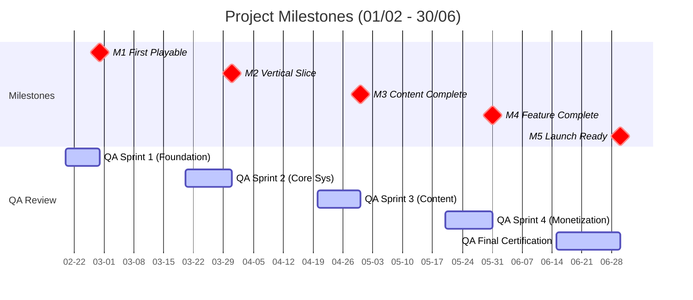

# Quản lý & Vận hành dự án

Thông tin về quy trình quản lý, các mốc quan trọng (milestones) và vận hành dự án.

## 1. Mốc quan trọng & Kiểm soát chất lượng (Milestones & Quality Gates)

### Mốc 1: Bản chơi thử đầu tiên - First Playable (28/02/2026)
**Tiêu chí:**
- [ ] Vòng lặp chiến đấu hoạt động
- [ ] Có thể tiêu diệt quái và tiến bộ
- [ ] Tính năng Save/Load hoạt động
- [ ] Nhân vật chính hiển thị rõ ràng

**Checklist QA:**
- Chiến đấu phản hồi tốt (responsive)
- Không có lỗi nghiêm trọng (critical bugs)
- Build chạy được trên thiết bị mục tiêu

### Mốc 2: Bản cắt dọc - Vertical Slice (31/03/2026)
**Tiêu chí:**
- [ ] UI đầy đủ được triển khai
- [ ] Nâng cấp chỉ số hoạt động
- [ ] Trang bị có thể mặc vào/tháo ra
- [ ] Phần thưởng AFK hoạt động

**Checklist QA:**
- Vòng lặp cốt lõi (Core loop) thấy vui
- Cảm giác tiến bộ (progression) rõ ràng
- Không có lỗi phá game (game-breaking bugs)

### Mốc 3: Hoàn thiện nội dung - Content Complete (30/04/2026)
**Tiêu chí:**
- [ ] 20+ kỹ năng được triển khai
- [ ] 5 đồng đội chơi được
- [ ] 4 Boss hoạt động tốt
- [ ] Đồ họa Chương 1-2 hoàn tất

**Checklist QA:**
- Tất cả hệ thống đã được tích hợp
- Nội dung đủ đa dạng
- Hiệu năng chấp nhận được

### Mốc 4: Hoàn thiện tính năng - Feature Complete (31/05/2026)
**Tiêu chí:**
- [ ] Gacha hoạt động
- [ ] Shop hoạt động
- [ ] Tích hợp IAP xong
- [ ] Kinh tế cân bằng

**Checklist QA:**
- Đã test kiếm tiền (Monetization)
- Không có lỗi IAP
- Kinh tế cảm thấy công bằng

### Mốc 5: Sẵn sàng ra mắt - Launch Ready (30/06/2026)
**Tiêu chí:**
- [ ] Toàn bộ âm thanh đã tích hợp
- [ ] Toàn bộ VFX đã trau chuốt
- [ ] Hiệu năng đã tối ưu hóa
- [ ] Không còn lỗi nghiêm trọng (Zero critical bugs)

**Checklist QA:**
- Build ổn định (Stable)
- Đã qua kiểm duyệt (Certification)
- Sẵn sàng cho Soft Launch

---

## 2. Biểu đồ Mốc quan trọng (Milestone Timeline)

---

## 3. Quản lý rủi ro (Risk Management)

### Các hạng mục rủi ro cao

| Rủi ro (Risk) | Tác động (Impact) | Xác suất | Chiến lược giảm thiểu (Mitigation Strategy) |
| :--- | :--- | :--- | :--- |
| Phình to phạm vi (Scope creep) | Cao | Cao | "Đóng băng" tính năng nghiêm ngặt sau Giai đoạn 3 |
| Tắc nghẽn quy trình Art | Cao | Trung bình | Có 2 artists, ưu tiên các asset quan trọng |
| Vấn đề hiệu năng Mobile | Cao | Trung bình | Test hiệu năng hàng tuần từ Giai đoạn 2 |
| Phức tạp khi tích hợp IAP | Trung bình | Trung bình | Dành thời gian đệm (buffer), test sớm |
| Thành viên team vắng mặt | Cao | Thấp | Đào tạo chéo (Cross-training), tài liệu hóa đầy đủ |

### Hành động giảm thiểu

1. **Review Sprint hàng tuần:** Mỗi thứ 6, review tiến độ và điều chỉnh timeline
2. **Thời gian đệm (Buffer Time):** Mỗi giai đoạn có ~10% buffer cho các vấn đề phát sinh
3. **Quy trình song song:** Art và Dev làm song song khi có thể
4. **Test sớm:** QA tham gia ngay từ Giai đoạn 2
5. **Prototype trước:** Test các tính năng rủi ro cao sớm (Gacha, IAP)

---

## 4. Giao tiếp & Họp hành (Communication & Meetings)

### Hàng ngày
- **Daily Standup:** 15 phút, 9:00 Sáng
  - Hôm qua đã làm gì?
  - Hôm nay sẽ làm gì?
  - Có gặp khó khăn gì không (blockers)?

### Hàng tuần
- **Review Sprint:** Thứ 6, 10:00 Sáng, 1 tiếng
  - Demo sản phẩm làm được
  - Review tiến độ mốc quan trọng (milestone)

- **Lập kế hoạch Sprint (Planning):** Thứ 2, 10:00 Sáng, 1 tiếng
  - Lên kế hoạch task cho tuần
  - Phân chia trách nhiệm

### Hai tuần một lần
- **Buổi chơi thử (Playtest Session):** Thứ 4, 2:00 Chiều, 2 tiếng
  - Team cùng chơi bản build
  - Thu thập phản hồi
  - Ưu tiên các cải tiến

### Hàng tháng
- **Review Milestone:** Cuối mỗi tháng, 3 tiếng
  - Đánh giá hoàn thành giai đoạn
  - Điều chỉnh roadmap nếu cần
  - Ăn mừng thành quả

---

## 5. Công cụ & Hạ tầng (Tools & Infrastructure)

### Công cụ phát triển
- **Engine:** Unity 2022 LTS hoặc Godot 4.2
- **Quản lý mã nguồn:** Git + GitHub/GitLab
- **Quản lý dự án:** Jira, Trello, hoặc Notion
- **Giao tiếp:** Slack/Discord
- **Tài liệu thiết kế:** Google Docs, Figma

### Công cụ Art
- **2D Art:** Adobe Photoshop, Clip Studio Paint
- **Animation:** Spine hoặc Unity Animator
- **Thiết kế UI:** Figma

### Công cụ Audio
- **DAW:** FL Studio, Ableton Live
- **SFX:** Audacity, Adobe Audition
- **Middleware:** FMOD hoặc Wwise (tùy chọn)

### Công cụ QA
- **Theo dõi lỗi (Bug Tracking):** Jira
- **Thiết bị Test:** Tối thiểu 5 thiết bị (iOS + Android)
- **Analytics:** Firebase, Unity Analytics

---

## 6. Chỉ số thành công (Success Metrics)

### KPIs Phát triển

| Chỉ số | Mục tiêu | Cách đo lường |
| :--- | :--- | :--- |
| **Tốc độ Sprint** | 80% task hoàn thành | Review sprint hàng tuần |
| **Số lượng Bug** | < 20 lỗi nghiêm trọng ở M4 | Trình theo dõi bug |
| **Độ ổn định Build** | 0 crash trên 100 sessions | Analytics |
| **Hiệu năng** | 60 FPS trên thiết bị tầm trung | Profiler |
| **Bàn giao Asset** | 90% đúng hạn | Project tracker |

### KPIs Chất lượng

| Chỉ số | Mục tiêu | Cách đo lường |
| :--- | :--- | :--- |
| **Độ phủ Code (Code Coverage)** | > 60% | Unit tests |
| **Độ nhất quán Art** | 100% tuân thủ style guide | Art review |
| **Chất lượng Audio** | Không bị vỡ (clipping), mix cân bằng | Audio review |
| **Trải nghiệm UX** | Tỉ lệ hoàn thành Tutorial > 80% | Playtest |

---

## 7. Kế hoạch sau ra mắt (Preview)

Sau 30/06/2026, team sẽ chuyển sang:

1. **Soft Launch** (Tháng 7): Test ở 1-2 thị trường nhỏ
2. **Vận hành - Live Ops** (Tháng 8+): Sự kiện, cập nhật, cân bằng
3. **Cập nhật nội dung:** Chương mới, nhân vật mới, kỹ năng mới

**Nhịp độ:**
- Hàng tuần: Sửa lỗi, cân bằng
- Hai tuần/lần: Cập nhật nội dung nhỏ
- Hàng tháng: Cập nhật nội dung lớn

---

## 8. Phụ lục: Mẫu phân công Task

### Phân công Task Hàng tuần (Ví dụ)

**Tuần của:** [Ngày] - [Ngày]
**Chủ đề Sprint:** [Vd: "Trau chuốt chiến đấu"]

| Thành viên | Task tuần này | Ước lượng giờ | Trạng thái |
| :--- | :--- | :--- | :--- |
| Developer A | DEV-003, DEV-004 | 32h | Đang làm |
| Developer B | DEV-005, DEV-006 | 28h | Chưa bắt đầu |
| Artist A | ART-003, ART-004 | 30h | Đang làm |
| Artist B | ART-005, ART-006 | 35h | Chưa bắt đầu |
| VFX Artist | VFX-002, VFX-003 | 20h | Đang làm |
| Sound Designer | SND-001, SND-002 | 24h | Chưa bắt đầu |
| Game Designer | GD-001, GD-006 | 16h + playtesting | Đang làm |
