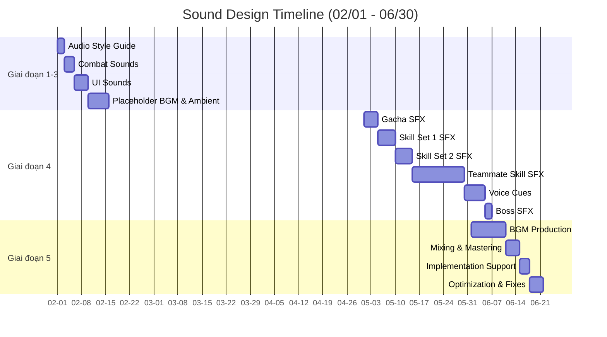

# Công việc Sound Designer

Chi tiết phân chia công việc (breakdown) cho đội ngũ Sound Designer (1 người).

## Giai đoạn 1-3: Nền tảng đến Nội dung (Tháng 2-4)

| Mã Task | Tên công việc (Task Name)                        | Sản phẩm bàn giao | Thời gian | Độ ưu tiên     |
| :------ | :----------------------------------------------- | :---------------- | :-------- | :------------- |
| SND-001 | Tài liệu định hướng âm thanh (Audio style guide) | 1 tài liệu        | 2 ngày    | Tối quan trọng |
| SND-002 | Âm thanh chiến đấu (đánh, chí mạng, chết)        | 10 sounds         | 3 ngày    | Tối quan trọng |
| SND-003 | Âm thanh UI (nút bấm, popup, nâng cấp)           | 15 sounds         | 4 ngày    | Cao            |
| SND-004 | Nhạc nền tạm thời (Placeholder BGM - 1 loop)     | 1 bài             | 3 ngày    | Trung bình     |
| SND-005 | Âm thanh môi trường (Ambient - Chương 1-2)       | 2 loops           | 3 ngày    | Trung bình     |

**Tổng Giai đoạn 1-3:** ~15 ngày (có thể làm song song với dev)

## Giai đoạn 4: Kinh tế & Kiếm tiền (Tháng 5)

| Mã Task | Tên công việc (Task Name)                 | Sản phẩm bàn giao | Thời gian | Độ ưu tiên     |
| :------ | :---------------------------------------- | :---------------- | :-------- | :------------- |
| SND-006 | Âm thanh Gacha (quay, mở, trúng thưởng)   | 8 sounds          | 4 ngày    | Tối quan trọng |
| SND-007 | Âm thanh Kỹ năng bộ 1 (10 skills)         | 10 sounds         | 5 ngày    | Tối quan trọng |
| SND-008 | Âm thanh Kỹ năng bộ 2 (10 skills)         | 10 sounds         | 5 ngày    | Tối quan trọng |
| SND-009 | **Âm thanh kỹ năng đồng đội** (60 skills) | 60 sounds         | 15 ngày   | Cao            |
| SND-010 | Giọng lồng tiếng đồng đội (Voice cues)    | 30 clips          | 6 ngày    | Trung bình     |
| SND-011 | Âm thanh Boss (Boss SFX)                  | 5 sounds          | 2 ngày    | Cao            |

**Tổng Giai đoạn 4:** ~38 ngày

## Giai đoạn 5: Hoàn thiện & Chuẩn bị ra mắt (Tháng 6)

| Mã Task | Tên công việc (Task Name)                               | Sản phẩm bàn giao | Thời gian | Độ ưu tiên     |
| :------ | :------------------------------------------------------ | :---------------- | :-------- | :------------- |
| SND-012 | Sản xuất nhạc nền BGM (3-4 bài)                         | 4 bài             | 10 ngày   | Tối quan trọng |
| SND-013 | Mixing và Mastering âm thanh                            | -                 | 4 ngày    | Tối quan trọng |
| SND-014 | Hỗ trợ lập trình viên tích hợp (Implementation support) | -                 | 3 ngày    | Cao            |
| SND-015 | Tối ưu hóa âm thanh (dung lượng file)                   | -                 | 2 ngày    | Cao            |
| SND-016 | Sửa lỗi âm thanh cuối cùng                              | -                 | 2 ngày    | Cao            |

**Tổng Giai đoạn 5:** ~21 ngày

---

## Biểu đồ Gantt (Sound)

