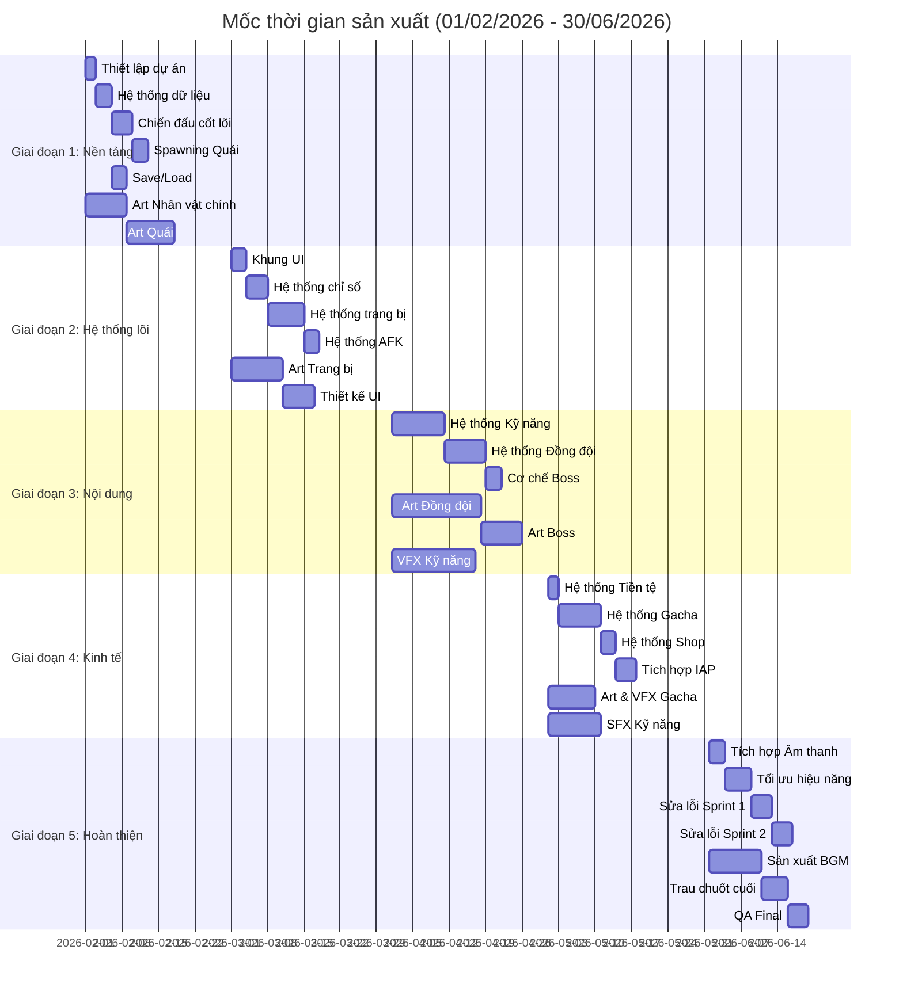

# Tổng quan Kế hoạch sản xuất

Tài liệu này mô tả chi tiết kế hoạch sản xuất game "Bảo vệ khu phố" từ **01/02/2026 đến 30/06/2026** (5 tháng).

## 1. Tổng quan Timeline

| Thông tin | Chi tiết |
| :--- | :--- |
| **Ngày bắt đầu** | 01/02/2026 |
| **Ngày kết thúc** | 30/06/2026 |
| **Tổng thời gian** | 21 tuần (150 ngày) |
| **Mốc chính** | 5 giai đoạn (Phases) |
| **Quy mô team (dự kiến)** | 8-10 người |

### 1.1. Cấu trúc Team

| Vai trò | Số lượng | Trách nhiệm chính |
| :--- | :--- | :--- |
| **Game Designer** | 1 | Thiết kế game, cân bằng số liệu, tài liệu hóa |
| **Developer** | 2-3 | Gameplay cốt lõi, hệ thống, triển khai UI |
| **2D Artist** | 2 | Vẽ nhân vật, môi trường, UI |
| **VFX Artist** | 1 | Hiệu ứng hạt, hiệu ứng chiến đấu, chuyển động UI |
| **Sound Designer** | 1 | Âm thanh hiệu ứng (SFX), nhạc nền (BGM), triển khai âm thanh |
| **QA Tester** | 1 | Kiểm thử, báo lỗi |
| **Project Manager** | 1 (part-time) | Điều phối, theo dõi tiến độ |

---

## 2. Chi tiết Giai đoạn (5 Phases)

### Giai đoạn 1: Nền tảng - Foundation (Tháng 2 - Tuần 1-4)
**Thời gian:** 01/02 - 28/02 (4 tuần)

**Mục tiêu:** Thiết lập dự án, chiến đấu cốt lõi, cấu trúc dữ liệu

**Kết quả bàn giao (Deliverables):**
- Thiết lập dự án hoàn chỉnh (Unity/Godot)
- Hệ thống chiến đấu cốt lõi hoạt động được
- Hệ thống quản lý dữ liệu
- Bản chơi thử đầu tiên (First playable)

### Giai đoạn 2: Hệ thống lõi - Core Systems (Tháng 3 - Tuần 5-8)
**Thời gian:** 01/03 - 31/03 (4.5 tuần)

**Mục tiêu:** Khung UI, chỉ số, trang bị, AFK

**Kết quả bàn giao (Deliverables):**
- Khung UI (UI Framework) hoàn chỉnh
- Hệ thống chỉ số và tăng trưởng
- Hệ thống trang bị và cơ chế gộp (merge)
- Tính toán AFK hoạt động chuẩn

### Giai đoạn 3: Nội dung & Chiều sâu - Content & Depth (Tháng 4 - Tuần 9-13)
**Thời gian:** 01/04 - 30/04 (4 tuần)

**Mục tiêu:** Kỹ năng, đồng đội, hoàn thiện asset đồ họa

**Kết quả bàn giao (Deliverables):**
- Hệ thống kỹ năng với 20+ skills
- Hệ thống đồng đội với 5 nhân vật
- Assets đồ họa cho Chương 1-2
- VFX cho chiến đấu

### Giai đoạn 4: Kinh tế & Kiếm tiền - Economy & Monetization (Tháng 5 - Tuần 14-17)
**Thời gian:** 01/05 - 31/05 (4 tuần)

**Mục tiêu:** Gacha, cửa hàng, cân bằng kinh tế

**Kết quả bàn giao (Deliverables):**
- Hệ thống Gacha hoàn chỉnh
- Triển khai Cửa hàng (Shop)
- Tích hợp thanh toán (IAP)
- Cân bằng nền kinh tế trong game

### Giai đoạn 5: Hoàn thiện & Chuẩn bị ra mắt - Polish & Launch Prep (Tháng 6 - Tuần 18-21)
**Thời gian:** 01/06 - 30/06 (4 tuần)

**Mục tiêu:** Âm thanh, trau chuốt VFX, kiểm thử, tối ưu hóa

**Kết quả bàn giao (Deliverables):**
- Âm thanh đầy đủ (BGM + SFX)
- Toàn bộ VFX được trau chuốt
- Hiệu năng được tối ưu
- Bản Beta sẵn sàng

---

## 3. Biểu đồ Gantt Timeline

---

## 4. Bản đồ phụ thuộc (Dependencies Map)

### Tiến trình quan trọng (Critical Path)

```mermaid
flowchart LR
    A[Thiết lập dự án] --> B[Hệ thống dữ liệu]
    B --> C[Chiến đấu cốt lõi]
    C --> D[Khung UI]
    D --> E[Hệ thống chỉ số]
    E --> F[Hệ thống trang bị]
    F --> G[Hệ thống kỹ năng]
    G --> H[Hệ thống Gacha]
    H --> I[Trau chuốt cuối]
    I --> J[Sẵn sàng ra mắt]

    style A fill:#ffcdd2,stroke:#c62828
    style J fill:#c8e6c9,stroke:#2e7d32
```

### Phụ thuộc chéo giữa các team

| Task Dev | Phụ thuộc Art | Phụ thuộc VFX | Phụ thuộc Sound |
| :--- | :--- | :--- | :--- |
| **Chiến đấu cốt lõi** | Sprite nhân vật chính | Hiệu ứng đánh trúng | SFX chiến đấu |
| **Hệ thống trang bị** | Icon trang bị | Hiệu ứng nâng cấp | SFX nâng cấp |
| **Hệ thống kỹ năng** | Icon kỹ năng | VFX kỹ năng | SFX kỹ năng |
| **Hệ thống Gacha** | Ảnh thùng/hộp gacha | Hiệu ứng mở quà | SFX quay gacha |
| **Build cuối cùng** | Tất cả assets | Tất cả VFX | Tất cả audio |
