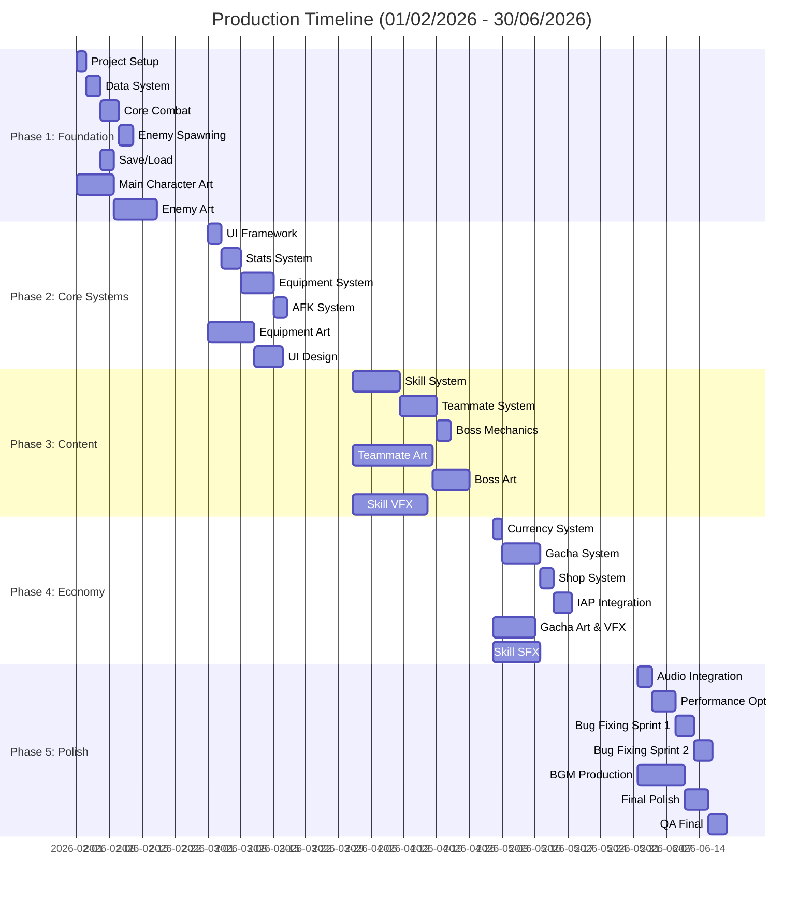

# Tổng quan Kế hoạch sản xuất

Tài liệu này mô tả chi tiết kế hoạch sản xuất game "Bảo vệ khu phố" từ **01/02/2026 đến 30/06/2026** (5 tháng).

## 1. Tổng quan Timeline

| Thông tin | Chi tiết |
| :--- | :--- |
| **Ngày bắt đầu** | 01/02/2026 |
| **Ngày kết thúc** | 30/06/2026 |
| **Tổng thời gian** | 21 tuần (150 ngày) |
| **Milestone chính** | 5 phases |
| **Team size (dự kiến)** | 8-10 người |

### 1.1. Team Structure

| Role | Số lượng | Trách nhiệm chính |
| :--- | :--- | :--- |
| **Game Designer** | 1 | Game design, balancing, documentation |
| **Developer** | 2-3 | Core gameplay, systems, UI implementation |
| **2D Artist** | 2 | Character, environment, UI art |
| **VFX Artist** | 1 | Particle effects, combat effects, UI animations |
| **Sound Designer** | 1 | SFX, BGM, audio implementation |
| **QA Tester** | 1 | Testing, bug reporting |
| **Project Manager** | 1 (part-time) | Coordination, timeline tracking |

---

## 2. Phase Breakdown (5 Phases)

### Phase 1: Foundation (Tháng 2 - Tuần 1-4)
**Timeline:** 01/02 - 28/02 (4 tuần)

**Mục tiêu:** Setup dự án, core combat, data structure

**Deliverables:**
- Project setup hoàn chỉnh (Unity/Godot)
- Core combat system working
- Data management system
- First playable build

### Phase 2: Core Systems (Tháng 3 - Tuần 5-8)
**Timeline:** 01/03 - 31/03 (4.5 tuần)

**Mục tiêu:** UI framework, stats, equipment, AFK

**Deliverables:**
- UI framework hoàn chỉnh
- Stats và progression system
- Equipment system với merge
- AFK calculation working

### Phase 3: Content & Depth (Tháng 4 - Tuần 9-13)
**Timeline:** 01/04 - 30/04 (4 tuần)

**Mục tiêu:** Skills, teammates, complete art assets

**Deliverables:**
- Skill system với 20+ skills
- Teammate system với 5 characters
- Art assets cho Chapter 1-2
- VFX cho combat

### Phase 4: Economy & Monetization (Tháng 5 - Tuần 14-17)
**Timeline:** 01/05 - 31/05 (4 tuần)

**Mục tiêu:** Gacha, shop, economy balancing

**Deliverables:**
- Gacha system hoàn chỉnh
- Shop implementation
- IAP integration
- Economy balanced

### Phase 5: Polish & Launch Prep (Tháng 6 - Tuần 18-21)
**Timeline:** 01/06 - 30/06 (4 tuần)

**Mục tiêu:** Audio, VFX polish, testing, optimization

**Deliverables:**
- Full audio (BGM + SFX)
- All VFX polished
- Performance optimized
- Beta build ready

---

## 3. Gantt Chart Timeline

---

## 4. Dependencies Map

### Critical Path

### Cross-Team Dependencies

| Dev Task | Depends On (Art) | Depends On (VFX) | Depends On (Sound) |
| :--- | :--- | :--- | :--- |
| Core Combat | Main character sprite | Hit effects | Combat SFX |
| Equipment System | Equipment icons | Upgrade effects | Upgrade SFX |
| Skill System | Skill icons | Skill VFX | Skill SFX |
| Gacha System | Gacha box art | Reveal effects | Gacha SFX |
| Final Build | All art assets | All VFX | All audio |
