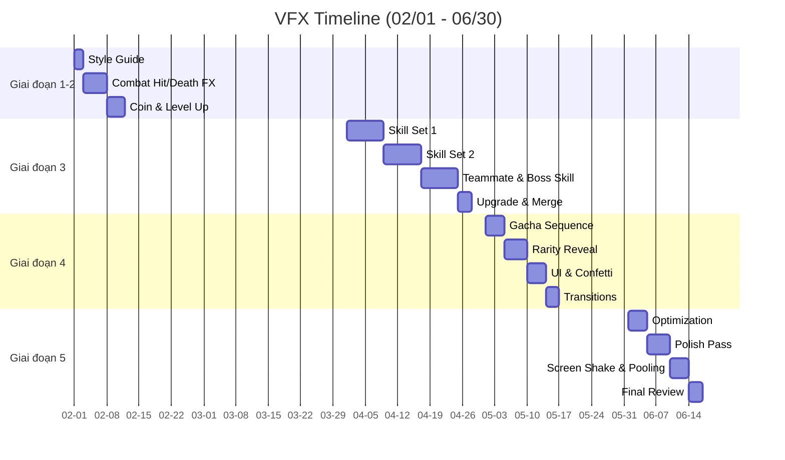

# Công việc VFX Artist

Chi tiết phân chia công việc (breakdown) cho đội ngũ VFX Artist (1 người).

## Giai đoạn 1-2: Nền tảng & Hệ thống lõi (Tháng 2-3)

| Mã Task | Tên công việc (Task Name) | Sản phẩm bàn giao | Thời gian | Độ ưu tiên |
| :--- | :--- | :--- | :--- | :--- |
| VFX-001 | Tài liệu định hướng phong cách VFX (Style guide) | 1 tài liệu | 2 ngày | Tối quan trọng |
| VFX-002 | Hiệu ứng đánh trúng cơ bản (thường, chí mạng) | 2 hiệu ứng | 3 ngày | Tối quan trọng |
| VFX-003 | Hiệu ứng chết (quái biến mất) | 2 biến thể | 2 ngày | Cao |
| VFX-004 | Animation rớt tiền vàng | 1 hiệu ứng | 2 ngày | Cao |
| VFX-005 | Hiệu ứng lên cấp (Level up) | 1 hiệu ứng | 2 ngày | Trung bình |

**Tổng Giai đoạn 1-2:** ~11 ngày

## Giai đoạn 3: Nội dung & Chiều sâu (Tháng 4)

| Mã Task | Tên công việc (Task Name) | Sản phẩm bàn giao | Thời gian | Độ ưu tiên |
| :--- | :--- | :--- | :--- | :--- |
| VFX-006 | Bộ hiệu ứng kỹ năng 1 (10 skills) | 10 hiệu ứng | 8 ngày | Tối quan trọng |
| VFX-007 | Bộ hiệu ứng kỹ năng 2 (10 skills) | 10 hiệu ứng | 8 ngày | Tối quan trọng |
| VFX-008 | Hiệu ứng kỹ năng đồng đội (5 skills) | 5 hiệu ứng | 4 ngày | Tối quan trọng |
| VFX-009 | Hiệu ứng kỹ năng Boss | 4 hiệu ứng | 4 ngày | Cao |
| VFX-010 | Hiệu ứng nâng cấp trang bị | 1 hiệu ứng | 1 ngày | Trung bình |
| VFX-011 | Animation gộp đồ (Merge) | 1 hiệu ứng | 2 ngày | Trung bình |

**Tổng Giai đoạn 3:** ~27 ngày

## Giai đoạn 4: Kinh tế & Kiếm tiền (Tháng 5)

| Mã Task | Tên công việc (Task Name) | Sản phẩm bàn giao | Thời gian | Độ ưu tiên |
| :--- | :--- | :--- | :--- | :--- |
| VFX-012 | Chuỗi hiệu ứng mở Gacha | 1 chuỗi | 4 ngày | Tối quan trọng |
| VFX-013 | Hiệu ứng xuất hiện theo phẩm chất (6 loại rarity) | 6 hiệu ứng | 5 ngày | Tối quan trọng |
| VFX-014 | Hiệu ứng pháo giấy/chúc mừng | 2 hiệu ứng | 2 ngày | Cao |
| VFX-015 | Hiệu ứng UI (hover/press button) | Bộ hiệu ứng | 2 ngày | Trung bình |
| VFX-016 | Hiệu ứng chuyển cảnh (Transition) | 3 hiệu ứng | 3 ngày | Trung bình |

**Tổng Giai đoạn 4:** ~16 ngày

## Giai đoạn 5: Hoàn thiện & Chuẩn bị ra mắt (Tháng 6)

| Mã Task | Tên công việc (Task Name) | Sản phẩm bàn giao | Thời gian | Độ ưu tiên |
| :--- | :--- | :--- | :--- | :--- |
| VFX-017 | Tối ưu hóa VFX (Optimization pass) | Cải tiến | 4 ngày | Tối quan trọng |
| VFX-018 | Tinh chỉnh VFX (timing, màu sắc) | Cải tiến | 5 ngày | Cao |
| VFX-019 | Triển khai rung màn hình (Screen shake) | Hệ thống | 2 ngày | Trung bình |
| VFX-020 | Tối ưu hóa Particle Pooling | Hệ thống | 2 ngày | Cao |
| VFX-021 | Rà soát và sửa lỗi VFX cuối cùng | - | 3 ngày | Cao |

**Tổng Giai đoạn 5:** ~16 ngày

---

## Biểu đồ Gantt (VFX)

