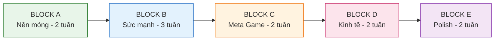
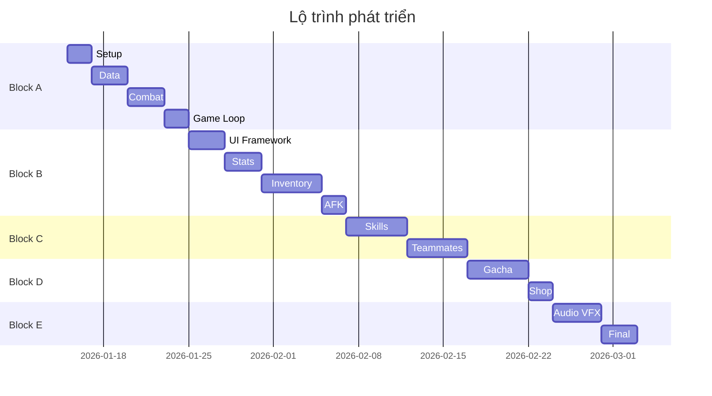

# Kế hoạch chi tiết thực hiện

Tài liệu này vạch ra lộ trình thực thi dự án game "Bảo vệ khu phố". Phát triển theo mô hình các khối chức năng (work blocks).

---

## 1. Nguyên tắc thực thi

| Hạng mục           | Mô tả                                                     |
| :----------------- | :-------------------------------------------------------- |
| **Tên chiến dịch** | "Một phát ăn ngay" (One-shot release)                     |
| **Mục tiêu**       | Hoàn thiện toàn bộ tính năng trong một quy trình liên tục |
| **Phương pháp**    | Agile development với sprint 2 tuần                       |
| **Kiểm thử**       | Test liên tục ngay sau khi hoàn thành từng tính năng      |

---

## 2. Tổng quan các khối công việc

---

## 3. Block A: Nền móng và core gameplay

**Mục tiêu:** Nhân vật tự đánh, quái chết, rớt vàng.

| Công việc     | Thời gian | Deliverable                        |
| :------------ | :-------- | :--------------------------------- |
| Project setup | 2 ngày    | Github repo, Unity project         |
| Data layer    | 3 ngày    | ScriptableObjects, Save/Load       |
| Combat loop   | 3 ngày    | Player, Enemy, Damage system       |
| Game loop     | 2 ngày    | Stage system, Boss, Victory/Defeat |

---

## 4. Block B: Hệ thống sức mạnh

**Mục tiêu:** Người chơi có chỗ tiêu vàng và mạnh lên.

| Công việc     | Thời gian | Deliverable          |
| :------------ | :-------- | :------------------- |
| UI Framework  | 3 ngày    | 5 Tab, Popup system  |
| Upgrade Stats | 3 ngày    | Logic nâng chỉ số    |
| Inventory     | 5 ngày    | Equip/Merge system   |
| AFK System    | 2 ngày    | Offline reward       |
| Currency      | 2 ngày    | Gold/Diamond manager |

---

## 5. Block C: Meta game

**Mục tiêu:** Skill và đồng đội.

| Công việc       | Thời gian | Deliverable             |
| :-------------- | :-------- | :---------------------- |
| Skill System    | 5 ngày    | Skill manager, 5 skills |
| Teammate System | 5 ngày    | AI, Formation, Upgrade  |

---

## 6. Block D: Kinh tế và gacha

**Mục tiêu:** Hệ thống monetization.

| Công việc | Thời gian | Deliverable            |
| :-------- | :-------- | :--------------------- |
| Balancing | 3 ngày    | Drop tables, Formulas  |
| Gacha     | 5 ngày    | 3 banners, Pity system |
| Shop      | 2 ngày    | Item shop              |

---

## 7. Block E: Polish

**Mục tiêu:** Hoàn thiện audio, VFX, tutorial.

| Công việc    | Thời gian | Deliverable        |
| :----------- | :-------- | :----------------- |
| Audio        | 3 ngày    | SFX, BGM           |
| VFX          | 3 ngày    | Particles, Effects |
| Tutorial     | 2 ngày    | Hand pointing      |
| Optimization | 2 ngày    | Performance        |

---

## 8. Biểu đồ Gantt

---

## 9. QA Checklist

| Hạng mục  | Yêu cầu                   |
| :-------- | :------------------------ |
| Stability | Không crash 30 phút       |
| Save      | Không mất data            |
| AFK       | Tính đúng                 |
| Gacha     | Đúng tỉ lệ                |
| UI        | Hiển thị tốt mọi màn hình |
