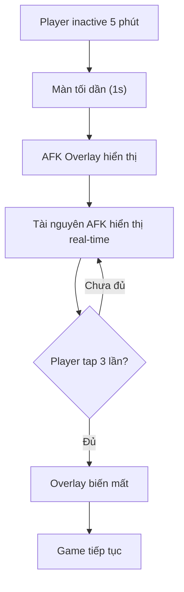
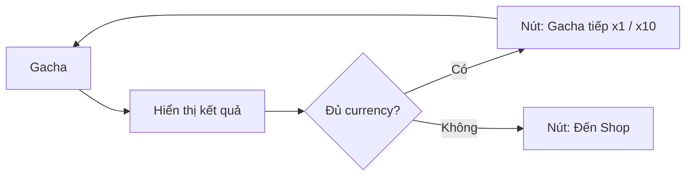
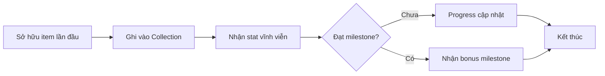

# Feature Boosters Implementation Plan

> **For agentic workers:** REQUIRED SUB-SKILL: Use superpowers:subagent-driven-development (recommended) or superpowers:executing-plans to implement this plan task-by-task. Steps use checkbox (`- [ ]`) syntax for tracking.

**Goal:** Add 10 feature design docs across 3 groups (UI/UX, Effects, New Systems) to the existing GDD.

**Architecture:** Each feature gets its own Markdown doc under `docs/`, registered in `sidebars.ts`. Existing docs are modified only to add cross-references. New category "Tính năng bổ sung" added to sidebar.

**Tech Stack:** Docusaurus 3, Markdown, Mermaid diagrams, KaTeX math

---

## File Structure

### New files to create:
```
docs/
  ui-boosters/
    mobile-ui-redesign.md       — Mobile-first UI spec
    afk-lock-screen.md           — AFK lock screen spec
    continue-gacha.md            — Continue gacha spec
    upgradable-point.md          — Upgradable point indicator spec
  effects/
    stage-clear-effect.md        — Stage clear VFX spec
    boss-entrance-effect.md      — Boss entrance VFX spec
    point-click-effect.md        — Point click VFX spec
  systems/
    collection-system.md         — Full collection system spec
    hub-tab.md                   — Hub tab design
    skill-tree-standalone.md     — Skill tree tách từ prestige
```

### Existing files to modify:
```
sidebars.ts                     — Add new category + items
docs/intro.md                   — Add links to new docs table
docs/he-thong-prestige.md       — Add cross-reference to skill-tree-standalone
docs/he-thong-thanh-vat.md      — Add cross-reference to hub-tab
docs/chi-tiet-man-hinh-dieu-khien.md  — Add Hub tab to 5-tab layout
```

---

### Task 1: Create Effects Feature Docs

**Files:**
- Create: `docs/effects/stage-clear-effect.md`
- Create: `docs/effects/boss-entrance-effect.md`
- Create: `docs/effects/point-click-effect.md`

- [ ] **Step 1: Write Stage Clear Effect doc**

```markdown
# Hiệu ứng Stage Clear

> Mô tả hiệu ứng khi người chơi vượt qua màn.

## Tổng quan

Khi tiêu diệt hết wave quái trong màn, phát animation stage clear.

## Chi tiết hiệu ứng

| Thành phần | Mô tả |
|-----------|-------|
| **Text "Clear!"** | Chữ lớn phóng to từ giữa màn hình, màu vàng gold, có glow |
| **Particle burst** | Hiệu ứng sao/tia sáng bắn ra từ center |
| **Rewards popup** | Danh sách phần thưởng trượt từ dưới lên (vàng, exp, item drop) |
| **Duration** | 1.5s — tự động chuyển màn tiếp |
| **Skip** | Tap anywhere để bỏ qua |

## Yêu cầu kỹ thuật

- Animation: Scale từ 0 → 1.2 → 1.0 (easeOutBack)
- Particle: 20-30 tia sáng, thời gian sống 1s
- Rewards: Dạng list, mỗi dòng slide-up cách nhau 0.1s
- Skip: Ngay lập tức tắt animation + chuyển màn
```

- [ ] **Step 2: Write Boss Entrance Effect doc**

```markdown
# Hiệu ứng Boss xuất hiện

> Mô tả hiệu ứng khi boss xuất hiện ở đầu wave cuối.

## Tổng quan

Khi wave boss bắt đầu, phát hiệu ứng entrance.

## Chi tiết hiệu ứng

| Thành phần | Mô tả |
|-----------|-------|
| **Screen shake** | Rung nhẹ 0.3s |
| **Dark overlay** | Overlay đen + spotlight vào vị trí boss |
| **Boss intro** | Animation boss xuất hiện (hạ cánh/trồi lên) |
| **Boss name + HP bar** | Text tên + thanh máu ở top |
| **Duration** | 1.0s — không skip được |

## Yêu cầu kỹ thuật

- Screen shake: Random offset ±5px trên trục XY, giảm dần
- Dark overlay: Alpha từ 0 → 0.6 trong 0.3s
- Boss intro: Phụ thuộc vào animation của từng boss
- HP bar: Xuất hiện sau intro 0.3s
```

- [ ] **Step 3: Write Point Click Effect doc**

```markdown
# Hiệu ứng Point Click

> Mô tả hiệu ứng khi người chơi tap vào tài nguyên.

## Tổng quan

Khi tap vào resources, phát hiệu ứng phản hồi.

## Chi tiết hiệu ứng

| Thành phần | Mô tả |
|-----------|-------|
| **Ripple** | Sóng tròn lan từ vị trí tap |
| **Number popup** | "+X vàng" bay lên và fade out |
| **Particle** | Tia sáng màu tương ứng tài nguyên |
| **Haptic** | Rung nhẹ (nếu hỗ trợ) |

## Loại tài nguyên & Màu sắc

| Tài nguyên | Màu particle | Text color |
|-----------|-------------|------------|
| Vàng | Vàng (#FFD700) | Vàng đậm |
| EXP | Xanh dương (#2196F3) | Xanh dương |
| Kim cương | Tím (#9C27B0) | Tím |
| Item | Trắng (#FFFFFF) | Trắng |
```

- [ ] **Step 4: Verify docs render**

Run build to confirm no errors:
```
npm run build
```

Expected: Build successful, no broken links.

- [ ] **Step 5: Commit**

```
git add docs/effects/
git commit -m "feat(effects): add stage clear, boss entrance, point click VFX design docs"
```

---

### Task 2: Create UI/UX Feature Docs

**Files:**
- Create: `docs/ui-boosters/mobile-ui-redesign.md`
- Create: `docs/ui-boosters/afk-lock-screen.md`
- Create: `docs/ui-boosters/continue-gacha.md`
- Create: `docs/ui-boosters/upgradable-point.md`

- [ ] **Step 1: Write Mobile-first UI Redesign doc**

```markdown
# Mobile-first UI Redesign

> Chiến lược redesign giao diện tối ưu cho thiết bị di động.

## Nguyên tắc thiết kế

| Nguyên tắc | Chi tiết |
|-----------|---------|
| **Touch targets** | Nút tối thiểu 48x48px, khuyến nghị 56x56px |
| **Spacing** | Padding 16px tối thiểu từ viền |
| **1-hand zone** | Thao tác chính ở nửa dưới màn hình |
| **Font size** | Tối thiểu 14px content, 18px label |
| **Bottom nav** | Thanh điều khiển dưới cùng |
| **Gestures** | Swipe chuyển tab, long-press xem chi tiết |

## Danh sách màn hình cần chỉnh sửa

1. **Màn hình chính** — Gom thông tin, nút lớn hơn
2. **Màn hình chiến đấu** — HUD thu gọn, thanh máu dễ đọc
3. **Popup** — Bottom sheet thay vì center popup (dễ thao tác 1 tay)
4. **Inventory** — Grid view với item size lớn hơn
5. **Bottom nav** — 5 tab tối đa, icon + label

## Spec cho UI Developer

- Breakpoint: 360px (nhỏ nhất support)
- Safe area: Respect notch/cutout
- Touch debounce: 300ms
- Scroll: Momentum scrolling
```

- [ ] **Step 2: Write AFK Lock Screen doc**

```markdown
# AFK Lock Screen

> Màn hình khóa tự động khi người chơi AFK lâu.

## Tổng quan

Khi người chơi không tương tác ≥ 5 phút, màn hình tự động khóa.

## Luồng hoạt động



## Chi tiết

| Thành phần | Giá trị |
|-----------|---------|
| **Timeout** | 5 phút |
| **Overlay** | Animation tối dần + nhân vật ngủ gật |
| **Hiển thị** | Thời gian AFK, tài nguyên đã farm |
| **Mở khóa** | Swipe hoặc tap 3 lần |
| **Tắt** | Có thể tắt trong Settings |

## Yêu cầu kỹ thuật

- Timer: Reset khi có touch/click event
- Resource calculation: Tính toán dựa trên idle earning rate
- Animation: Character idle sleep animation (looping)
- Transition: 1s fade in / 0.5s fade out
```

- [ ] **Step 3: Write Continue Gacha doc**

```markdown
# Continue Gacha

> Cho phép gacha liên tiếp sau khi nhận item.

## Tổng quan

Trong popup kết quả gacha, thêm nút "Gacha tiếp" để gacha ngay lập tức.

## Chi tiết

| Tính năng | Mô tả |
|-----------|-------|
| **Nút "Gacha x1"** | Gacha tiếp 1 lần |
| **Nút "Gacha x10"** | Gacha tiếp 10 lần |
| **Auto-check** | Nếu không đủ currency → chuyển sang shop |
| **Skip animation** | Nút skip ở góc popup |
| **Batch** | Gacha nhiều lần → animation rút gọn dần |

## Luồng



## UI Layout

```
+----------------------------+
|     KẾT QUẢ GACHA          |
|   [Item 1] [Item 2] ...    |
|                            |
|  [Gacha x1] [Gacha x10]    |
|  [×] Skip Animation        |
+----------------------------+
```
```

- [ ] **Step 4: Write Upgradable Point Indicator doc**

```markdown
# Upgradable Point Indicator

> Hiển thị trực quan khi tính năng có thể nâng cấp.

## Các loại indicator

| Loại | Mô tả | Vị trí |
|------|-------|--------|
| **Red dot** | Chấm đỏ nhỏ | Góc trên icon tab/item |
| **Glow** | Viền sáng | Quanh nút/item upgradeable |
| **Badge số** | Số lượng khả dụng | VD: tab Hero hiện "3" |
| **"Up!" text** | Chữ trên item | Item đạt điều kiện |

## Quy tắc hiển thị

- Chỉ hiển thị cho lần nâng cấp **đầu tiên có thể**
- Sau khi người chơi đã thấy → chuyển về red dot
- Priority: Badge > Red dot > Glow > Text

## Danh sách áp dụng

| Màn hình | Indicator | Điều kiện |
|---------|-----------|-----------|
| Bottom nav tab "Hero" | Badge | Có chỉ số có thể nâng cấp |
| Bottom nav tab "Equipment" | Badge | Có trang bị chưa mặc/cường hóa |
| Bottom nav tab "Gacha" | Red dot | Có vé gacha miễn phí |
| Skill tree | Red dot | Có skill point chưa dùng |
| Collection | Red dot | Có item mới unlock |
```
```

- [ ] **Step 5: Verify docs render**

```
npm run build
```

Expected: Build successful.

- [ ] **Step 6: Commit**

```
git add docs/ui-boosters/
git commit -m "feat(ui): add mobile UI redesign, AFK lock, continue gacha, upgradable point docs"
```

---

### Task 3: Create Hub Tab + Skill Tree Docs

**Files:**
- Create: `docs/systems/hub-tab.md`
- Create: `docs/systems/skill-tree-standalone.md`
- Modify: `docs/chi-tiet-man-hinh-dieu-khien.md` (add Hub tab to 5-tab layout)

- [ ] **Step 1: Write Hub Tab doc**

```markdown
# Hub Tab — Trung tâm

> Tab riêng trong bottom nav, nơi tập trung Skill Tree và Tàn tích.

## Layout

```
+--------------------------------------+
|            TRUNG TÂM                 |
+--------------------------------------+
|                                       |
|  ╔══════════════╗ ╔══════════════╗  |
|  ║  Skill Tree  ║ ║   Tàn tích   ║  |
|  ║  Cây kỹ năng ║ ║  Đập bình   ║  |
|  ╚══════════════╝ ╚══════════════╝  |
|                                       |
|  [Nút: Main Hero →]                  |
+--------------------------------------+
```

## Chi tiết

- **Vị trí**: Tab thứ 3 trong bottom nav (hiện tại 5 tab → thêm tab thứ 6)
- **Nội dung**: 2 card lớn dạng button dẫn đến màn hình con
- **Card Skill Tree**: Icon + tên + preview số skill point khả dụng
- **Card Tàn tích**: Icon + tên + preview số búa hiện có
- **Nút phụ**: Chuyển nhanh đến Main Hero

## Navigation sau khi chọn

| Tap vào | Đi đến |
|---------|--------|
| Card Skill Tree | Màn hình Skill Tree (docs/systems/skill-tree-standalone) |
| Card Tàn tích | Màn hình Tàn tích (đã có trong he-thong-thanh-vat) |
| Nút Main Hero | Màn hình Main Hero |
```

- [ ] **Step 2: Write Skill Tree standalone doc**

```markdown
# Skill Tree — Cây kỹ năng độc lập

> Tách Skill Tree từ Prestige system thành màn hình riêng trong Hub Tab.

## Tổng quan

Skill Tree hiện tại nằm trong Hệ thống Prestige (he-thong-prestige.md). Tách ra màn riêng để dễ dàng mở rộng và truy cập.

## 4 nhánh kỹ năng (kế thừa từ Prestige)

| Nhánh | Tập trung | Skill mẫu |
|-------|-----------|-----------|
| **Tấn công** | ATK, CRIT, ASPD | +10% ATK, +5% Crit Rate |
| **Sinh tồn** | HP, DEF, HP Regen | +15% HP, +5% DEF |
| **Kinh tế** | Vàng, EXP, Drop rate | +20% Gold, +10% EXP |
| **Tiện ích** | AFK time, Inventory | +2h AFK, +10 Inventory |

## UI Layout

```
+--------------------------------------+
|          SKILL TREE                  |
|   [Tấn công] [Sinh tồn] [Kinh tế]   |  ← tab nhánh
+--------------------------------------+
|                                       |
|  [Skill 1] ████████░░░░ Lv 8/10     |
|  +10% ATK                            |
|  [Up] — Cost: 5 Prestige Point      |
|                                       |
|  [Skill 2] ██████░░░░░░ Lv 6/10     |
|  +5% Crit Rate                       |
|  [Locked] Yêu cầu Lv 5 Tấn công     |
|                                       |
+--------------------------------------+
|  Prestige Points: 25                |
+--------------------------------------+
```

> **Lưu ý:** Data skill tree chi tiết xem tại `he-thong-prestige.md`.

- [ ] **Step 3: Modify control panel doc**

Read `docs/chi-tiet-man-hinh-dieu-khien.md` and add Hub Tab at the appropriate location (as tab #6 or replacing one). Append to the file:

```markdown
## Tab 6: Hub Tab (Trung tâm)

*Tab mới được thêm vào sau các tab chính. Xem chi tiết tại [Hub Tab](./systems/hub-tab.md).*

| Thành phần | Mô tả |
|-----------|-------|
| **Vị trí** | Tab cuối trong bottom nav |
| **Phím tắt** | Icon: hình ngôi sao/ngôi nhà |
| **Nội dung** | 2 card: Skill Tree và Tàn tích |
```

- [ ] **Step 4: Verify docs render**

```
npm run build
```

Expected: Build successful.

- [ ] **Step 5: Commit**

```
git add docs/systems/hub-tab.md docs/systems/skill-tree-standalone.md docs/chi-tiet-man-hinh-dieu-khien.md
git commit -m "feat(systems): add Hub Tab and standalone Skill Tree docs"
```

---

### Task 4: Create Collection System Doc

**Files:**
- Create: `docs/systems/collection-system.md`
- Modify: `docs/he-thong-dong-doi.md` (add cross-reference to Collection)

- [ ] **Step 1: Write Collection System doc**

```markdown
# Hệ thống Bộ sưu tập (Collection)

> Hệ thống sưu tầm toàn bộ item trong game để nhận chỉ số vĩnh viễn.

## Tổng quan

Collection là hệ thống mới hoàn toàn. Khi lần đầu sở hữu một item, nó được ghi vào bộ sưu tập và tặng chỉ số vĩnh viễn toàn cục.

**Khác biệt với Duyên phận (Bond):** Bond chỉ áp dụng cho đồng đội và yêu cầu sở hữu nhiều nhân vật trong bộ. Collection áp dụng cho **mọi loại item** và chỉ yêu cầu **sở hữu 1 lần**.

## Các bộ sưu tập

| Bộ sưu tập | Đối tượng | Số lượng | Phần thưởng chính |
|-----------|-----------|----------|-------------------|
| **Nhân vật** | Đồng đội (all rarities) | 30+ | ATK%, HP% |
| **Trang bị** | Weapon, Armor, Boots, Accessory | Theo số lượng item | DEF%, Crit% |
| **Thánh vật** | 7 slot × 6 phẩm chất | 42 | All Stats% |
| **Quái vật** | Tất cả quái trong game | Theo số loại | DMG to monsters |
| **Kỹ năng** | Skill nhân vật chính | 20 | Skill DMG% |

## Cơ chế



## Milestone

### Nhân vật

| Mốc | Yêu cầu | Phần thưởng |
|-----|---------|-------------|
| 1 | 5 | +2% ATK |
| 2 | 10 | +5% ATK |
| 3 | 15 | +7% ATK, +3% HP |
| 4 | 20 | +10% ATK, +5% HP |
| Full | 30+ | +15% ATK, +10% HP, +5% ASPD |

### Trang bị

| Mốc | Yêu cầu | Phần thưởng |
|-----|---------|-------------|
| 1 | 10 | +3% DEF |
| 2 | 25 | +5% DEF, +2% Crit |
| 3 | 50 | +8% DEF, +5% Crit |
| Full | All | +12% DEF, +8% Crit, +3% Lifesteal |

### Thánh vật

| Mốc | Yêu cầu | Phần thưởng |
|-----|---------|-------------|
| 1 | 7 (1 tier) | +2% All Stats |
| 2 | 14 (2 tier) | +4% All Stats |
| 3 | 28 (4 tier) | +8% All Stats |
| Full | 42 (all) | +15% All Stats, +5% HP Regen |

### Quái vật

| Mốc | Yêu cầu | Phần thưởng |
|-----|---------|-------------|
| 1 | 5 | +3% DMG to monsters |
| 2 | 10 | +5% DMG to monsters |
| Full | All | +10% DMG to monsters, +5% DEF |

### Kỹ năng

| Mốc | Yêu cầu | Phần thưởng |
|-----|---------|-------------|
| 1 | 5 | +3% Skill DMG |
| 2 | 10 | +5% Skill DMG |
| Full | 20 | +10% Skill DMG, -5% Cooldown |

## UI Layout

```
+--------------------------------------+
|      BỘ SƯU TẬP (Collection)        |
+--------------------------------------+
| [Nhân vật] [Trang bị] [Thánh vật]... |  ← tab
+--------------------------------------+
|                                       |
|  Nhân vật: 12/30 ▼  (+5% ATK)        |
|  [icon][icon][icon][???][???]         |
|  [icon][icon][???] [???]  [???]       |
|                                       |
|  Progress: ████░░░░ 40%               |
|  Milestone tiếp: 15 → +7% ATK       |
|                                       |
+--------------------------------------+
```

## Vị trí trong game

- **Mở từ**: Hub Tab hoặc Main Hero screen
- **Yêu cầu mở khóa**: Đạt level 10

## Yêu cầu kỹ thuật

- Track items sử dụng `collection_flags` trong player save
- Stat bonus tính real-time khi render stat sheet
- Không yêu cầu giữ item — chỉ cần đã từng sở hữu
- Sync với các hệ thống khác: khi nhận item → check collection trigger
```

- [ ] **Step 2: Add cross-reference in teammate doc**

Read `docs/he-thong-dong-doi.md` and append a line at the end:

```markdown

---
> **Xem thêm:** [Hệ thống Bộ sưu tập](./systems/collection-system.md) — Thu thập toàn bộ nhân vật để nhận chỉ số vĩnh viễn.
```

- [ ] **Step 3: Verify docs render**

```
npm run build
```

Expected: Build successful.

- [ ] **Step 4: Commit**

```
git add docs/systems/collection-system.md docs/he-thong-dong-doi.md
git commit -m "feat(systems): add Collection System design doc"
```

---

### Task 5: Update Sidebar + Homepage Links

**Files:**
- Modify: `sidebars.ts`
- Modify: `docs/intro.md`

- [ ] **Step 1: Update sidebar**

Modify `sidebars.ts` — add new category "Tính năng bổ sung" before "Cân bằng và Công thức":

```typescript
const sidebars: SidebarsConfig = {
  tutorialSidebar: [
    // ... existing categories ...
    {
      type: "category",
      label: "Tính năng bổ sung",
      items: [
        "systems/collection-system",
        "systems/hub-tab",
        "systems/skill-tree-standalone",
        "ui-boosters/mobile-ui-redesign",
        "ui-boosters/afk-lock-screen",
        "ui-boosters/continue-gacha",
        "ui-boosters/upgradable-point",
        "effects/stage-clear-effect",
        "effects/boss-entrance-effect",
        "effects/point-click-effect",
      ],
    },
    {
      type: "category",
      label: "Cân bằng và Công thức",
      // ... rest ...
    },
```

- [ ] **Step 2: Update intro.md**

Read `docs/intro.md`, find the table section and add a new row for "Tính năng bổ sung":

```markdown
### Tài liệu tính năng bổ sung

| Tài liệu | Nội dung chính |
| :------- | :------------- |
| [Bộ sưu tập](./systems/collection-system.md) | Hệ thống sưu tầm item nhận chỉ số vĩnh viễn |
| [Hub Tab](./systems/hub-tab.md) | Tab trung tâm cho Skill Tree và Tàn tích |
| [Mobile UI Redesign](./ui-boosters/mobile-ui-redesign.md) | Tối ưu giao diện cho thiết bị di động |
| [Các hiệu ứng mới](./effects/stage-clear-effect.md) | Stage Clear, Boss Entrance, Point Click VFX |
```

- [ ] **Step 3: Build and verify**

```
npm run build
```

Expected: Build successful, no broken links.

- [ ] **Step 4: Commit**

```
git add sidebars.ts docs/intro.md
git commit -m "chore(nav): add new feature docs to sidebar and homepage"
```
