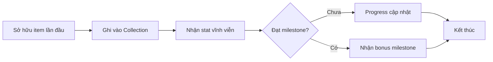

# Hệ thống Bộ sưu tập (Collection)

> Hệ thống sưu tầm toàn bộ item trong game để nhận chỉ số vĩnh viễn.

## Tổng quan

Collection là hệ thống mới hoàn toàn. Khi lần đầu sở hữu một item, nó được ghi vào bộ sưu tập và tặng chỉ số vĩnh viễn toàn cục.

**Khác biệt với Duyên phận (Bond):** Bond chỉ áp dụng cho đồng đội và yêu cầu sở hữu nhiều nhân vật trong bộ. Collection áp dụng cho **mọi loại item** và chỉ yêu cầu **sở hữu 1 lần**.

## Các bộ sưu tập

| Bộ sưu tập | Đối tượng | Số lượng | Phần thưởng chính |
|-----------|-----------|----------|-------------------|
| **Nhân vật** | Đồng đội (all rarities) | 30+ | ATK%, HP% |
| **Trang bị** | Weapon, Armor, Boots, Accessory | Theo số lượng item | DEF%, Crit% |
| **Thánh vật** | 7 slot × 6 phẩm chất | 42 | All Stats% |
| **Quái vật** | Tất cả quái trong game | Theo số loại | DMG to monsters |
| **Kỹ năng** | Skill nhân vật chính | 20 | Skill DMG% |

## Cơ chế



## Milestone

### Nhân vật

| Mốc | Yêu cầu | Phần thưởng |
|-----|---------|-------------|
| 1 | 5 | +2% ATK |
| 2 | 10 | +5% ATK |
| 3 | 15 | +7% ATK, +3% HP |
| 4 | 20 | +10% ATK, +5% HP |
| Full | 30+ | +15% ATK, +10% HP, +5% ASPD |

### Trang bị

| Mốc | Yêu cầu | Phần thưởng |
|-----|---------|-------------|
| 1 | 10 | +3% DEF |
| 2 | 25 | +5% DEF, +2% Crit |
| 3 | 50 | +8% DEF, +5% Crit |
| Full | All | +12% DEF, +8% Crit, +3% Lifesteal |

### Thánh vật

| Mốc | Yêu cầu | Phần thưởng |
|-----|---------|-------------|
| 1 | 7 (1 tier) | +2% All Stats |
| 2 | 14 (2 tier) | +4% All Stats |
| 3 | 28 (4 tier) | +8% All Stats |
| Full | 42 (all) | +15% All Stats, +5% HP Regen |

### Quái vật

| Mốc | Yêu cầu | Phần thưởng |
|-----|---------|-------------|
| 1 | 5 | +3% DMG to monsters |
| 2 | 10 | +5% DMG to monsters |
| Full | All | +10% DMG to monsters, +5% DEF |

### Kỹ năng

| Mốc | Yêu cầu | Phần thưởng |
|-----|---------|-------------|
| 1 | 5 | +3% Skill DMG |
| 2 | 10 | +5% Skill DMG |
| Full | 20 | +10% Skill DMG, -5% Cooldown |

## UI Layout

```
+--------------------------------------+
|      BỘ SƯU TẬP (Collection)        |
+--------------------------------------+
| [Nhân vật] [Trang bị] [Thánh vật]... |  ← tab
+--------------------------------------+
|                                       |
|  Nhân vật: 12/30 ▼  (+5% ATK)        |
|  [icon][icon][icon][???][???]         |
|  [icon][icon][???] [???]  [???]       |
|                                       |
|  Progress: ████░░░░ 40%               |
|  Milestone tiếp: 15 → +7% ATK       |
|                                       |
+--------------------------------------+
```

## Vị trí trong game

- **Mở từ**: Hub Tab hoặc Main Hero screen
- **Yêu cầu mở khóa**: Đạt level 10

## Yêu cầu kỹ thuật

- Track items sử dụng `collection_flags` trong player save
- Stat bonus tính real-time khi render stat sheet
- Không yêu cầu giữ item — chỉ cần đã từng sở hữu
- Sync với các hệ thống khác: khi nhận item → check collection trigger
