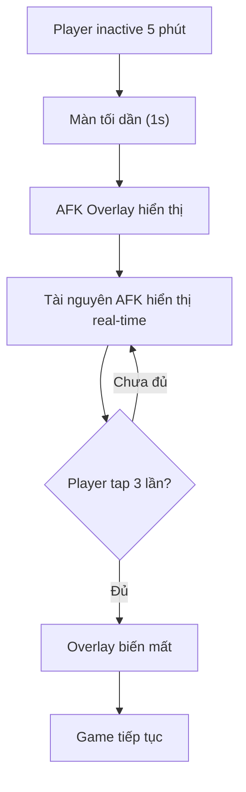

# AFK Lock Screen

> Màn hình khóa tự động khi người chơi AFK lâu.

## Tổng quan

Khi người chơi không tương tác ≥ 5 phút, màn hình tự động khóa.

## Luồng hoạt động

## Chi tiết

| Thành phần | Giá trị |
|-----------|---------|
| **Timeout** | 5 phút |
| **Overlay** | Animation tối dần + nhân vật ngủ gật |
| **Hiển thị** | Thời gian AFK, tài nguyên đã farm |
| **Mở khóa** | Swipe hoặc tap 3 lần |
| **Tắt** | Có thể tắt trong Settings |

## Yêu cầu kỹ thuật

- Timer: Reset khi có touch/click event
- Resource calculation: Tính toán dựa trên idle earning rate
- Animation: Character idle sleep animation (looping)
- Transition: 1s fade in / 0.5s fade out
