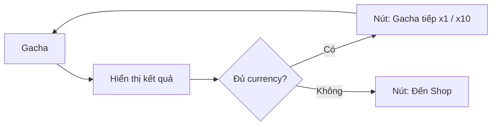

# Continue Gacha

> Cho phép gacha liên tiếp sau khi nhận item.

## Tổng quan

Trong popup kết quả gacha, thêm nút "Gacha tiếp" để gacha ngay lập tức.

## Chi tiết

| Tính năng | Mô tả |
|-----------|-------|
| **Nút "Gacha x1"** | Gacha tiếp 1 lần |
| **Nút "Gacha x10"** | Gacha tiếp 10 lần |
| **Auto-check** | Nếu không đủ currency → chuyển sang shop |
| **Skip animation** | Nút skip ở góc popup |
| **Batch** | Gacha nhiều lần → animation rút gọn dần |

## Luồng



## UI Layout

```
+----------------------------+
|     KẾT QUẢ GACHA          |
|   [Item 1] [Item 2] ...    |
|                            |
|  [Gacha x1] [Gacha x10]    |
|  [×] Skip Animation        |
+----------------------------+
```
